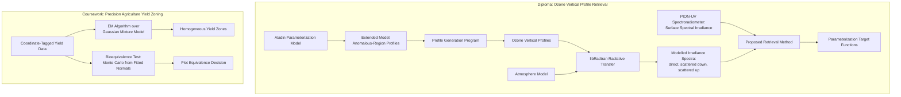

# Radiophysics Degree and University Research | September 2007 - June 2012

> Purpose: a finished interview reference and a source for CV/resume bullets. Contains only facts and conclusions accepted for external use.

Quick routes through this document:

- **Recruiter / first answer:** sections 01, 10 and 12.
- **Technical interview:** sections 03, 07, 08 and 09.
- **Academic and source context:** sections 02 and 13.

## 01 Project Snapshot

| Field | Details |
|---|---|
| Product / system | Three pieces of research work produced during a radiophysics degree: an atmospheric-electricity review, a precision-agriculture clustering study with a MATLAB implementation, and a diploma thesis on retrieving ozone vertical profiles from spectral irradiance measurements |
| Domain | Radiophysics, atmospheric physics, remote sensing, satellite information systems, statistical data analysis |
| Period | 1 September 2007 - 30 June 2012 |
| Institution | Belarusian State University, Faculty of Radiophysics and Computer Technologies, Department of Physics and Aerospace Technologies |
| Qualification | Higher education diploma, speciality 1-31 04 02 "Radiophysics", specialization "Satellite Information Systems and Technologies", qualification awarded: Radiophysicist. Five-year programme; average grade 6.61 / 10; diploma thesis defended with 9 / 10, state examination 6 / 10. Diploma A No. 0858889, registration No. 2086-ch, Minsk, 30 June 2012; apostilled 15 April 2025 (diploma) and 13 May 2025 (transcript supplement) |
| Supervisors | E. V. Verkhoturova (senior lecturer, Department of Physics and Aerospace Technologies) across all three works; A. G. Svetashev (PhD, head of laboratory, National Research Center for Ozonosphere Monitoring, BSU) co-supervising the diploma |
| Target roles | R&D and algorithm positions, scientific and data-analysis work, remote sensing, roles where a physics and statistics foundation matters |
| Main stack | MATLAB, libRadtran radiative-transfer modelling, the Aladin ozone parameterization model, LaTeX; LabVIEW through supplementary courses |
| Primary work | Statistical clustering algorithms (EM over a Gaussian mixture) implemented in MATLAB; extension of an ozone vertical-profile parameterization model and a program built on it; radiative-transfer modelling and analysis |
| Context | The diploma was carried out within the Belarusian state programme "Monitoring of the polar regions of the Earth and support of Arctic and Antarctic expeditions, 2011-2015" |
| Confidentiality | All of this is academic work; the documents are in my own repository and nothing here is restricted |

### 30-Second Summary

I studied radiophysics at Belarusian State University from 2007 to 2012, specializing in satellite information systems and technologies. Three research works came out of it. A third-year review covered transient luminous events in the upper atmosphere - sprites, jets and related discharges. A fourth-year study on precision agriculture implemented two algorithms in MATLAB: a statistical bioequivalence test for comparing field plots, and clustering of a field into homogeneous yield zones using the EM algorithm over a Gaussian mixture model. My diploma developed a method for retrieving vertical ozone profiles from surface spectral irradiance measurements, extending an existing parameterization model and modelling the result with libRadtran. It was carried out within a national polar-monitoring programme.

### Two-Minute Overview

The degree was a radiophysics programme with a satellite and aerospace specialization, at a department that worked on atmospheric monitoring and remote sensing. That combination - physics, signal and data analysis, and space applications - is the direct foundation for everything I did afterwards at PELENG.

The third-year coursework, in 2010, was a review of transient luminous events: the class of upper-atmospheric electrical discharges above thunderstorms discovered only in the late twentieth century. It covered atmospheric structure, the atmospheric electric field, ion formation, the phenomenology of the discharges themselves and the observational campaigns that had studied them. It was a literature and physics review rather than an implementation, and its value was learning to assemble a coherent technical picture from scattered primary sources.

The fourth-year coursework, in 2011, was different in character: a data-analysis problem with real algorithms. Precision agriculture produces yield data tied to coordinates across a field, and the question is how to divide that field into genuinely homogeneous zones. I worked through two algorithms. The first assesses whether two plots are biologically equivalent in yield, treating average yields as normally distributed random variables and using Monte Carlo simulation from fitted normal distributions to compare similarity probability functions against thresholds. The second clusters the field into homogeneous zones using the EM algorithm over a Gaussian mixture model, with the yield of a plot within a zone treated as normally distributed on a central-limit argument. I implemented it in MATLAB - the expectation-maximization iteration, the distance computation and a test harness generating synthetic clusters to validate the result.

The diploma, in 2012, was the largest piece: 49 pages, 38 figures, 56 sources. The goal was to establish whether ozone vertical profiles could be retrieved from spectral irradiance density measured at the surface by the "PION-UV" spectroradiometer - a cheaper and more accessible approach than the established retrieval methods. I extended the standard Aladin parameterization model so it could represent profiles characteristic of anomalous regions, built a working program that generated vertical ozone profiles from the improved model, analyzed how the model's parameters affected those profiles, and modelled surface irradiance spectra for direct and scattered solar radiation under different parameterizations. The conclusion was that the approach was viable, and I identified the parameterization target functions it would need. The work sat inside the national programme for monitoring the polar regions.

## 02 Context, Goals & Constraints

### Institutional Context

The Faculty of Radiophysics and Computer Technologies at Belarusian State University trains engineers and physicists for work spanning signal processing, electronics, atmospheric physics and space systems. The Department of Physics and Aerospace Technologies, where all three of my works were done, connected the programme to real monitoring activity - the diploma was supervised jointly with the head of a laboratory at the National Research Center for Ozonosphere Monitoring, and formed part of a funded state programme.

The specialization, "satellite information systems and technologies", is the reason my first professional role was in satellite instrument development: the degree was oriented toward exactly that.

### Subject and Purpose

Each work had a different purpose:

1. **Transient luminous events (3rd year, 2010)** - build a complete picture of a physical phenomenon from primary literature. A review, aimed at understanding rather than producing.
2. **Precision agriculture yield zoning (4th year, 2011)** - take a practical applied problem and solve it with statistical algorithms, implemented and tested.
3. **Ozone vertical profiles (diploma, 2012)** - establish the feasibility of a new retrieval method within an active monitoring programme, with modelling and a working program to support the conclusion.

The progression - review, then implementation, then a research contribution embedded in a funded programme - is the shape of an engineering education working as intended.

### Academic Record

The diploma supplement lists 70 assessed items across 5,874 academic hours: 41 carry a numerical mark and 29 are pass/fail credits. Belarus uses a ten-point scale where 10 is the highest and 4 is the lowest pass, so the marks below are not percentages and do not map onto a four-point GPA.

**Average: 6.61 / 10**, the mean of all 41 marked items. Weighted by academic hours it is 6.79.

The distribution is more informative than the average. The highest marks sit in the applied, space-specific and research items - the ones that turned into the career - while the lower ones are in general theory taken by the whole faculty.

| Marked item | Hours | Mark |
|---|---|---|
| Information processing in the computational experiment | 74 | **10** |
| Ballistics and small-spacecraft control | 76 | **9** |
| Term project, year 3 | - | **9** |
| Term project, year 4 | - | **9** |
| Pre-diploma industrial placement | 540 | **9** |
| Diploma thesis defence | - | **9** |
| Methods of computational experiment | 94 | 8 |
| Electrodynamics | 126 | 8 |
| Thermodynamics and statistical physics | 108 | 8 |
| General physics - electricity | 102 | 7 |
| General physics - optics | 102 | 7 |
| General physics - atomic and nuclear physics | 82 | 7 |
| Probability theory and mathematical statistics | 64 | 7 |
| Methods of mathematical physics | 116 | 7 |
| Programming | 146 | 7 |
| Integrated electronics | 58 | 7 |
| Statistical radiophysics | 86 | 7 |
| Laser remote-sensing methods | 56 | 7 |
| Ultra-wideband information transmission based on dynamic chaos | 94 | 7 |
| Foreign language | 272 | 7 |
| General physics - mechanics | 96 | 6 |
| Analytic geometry and linear algebra | 110 | 6 |
| Mathematical analysis | 330 | 6 |
| Differential equations | 68 | 6 |
| Information theory | 54 | 6 |
| Theory of wave processes | 66 | 6 |
| Quantum radiophysics | 86 | 6 |
| Digital signal processing | 58 | 6 |
| History of Belarus | 68 | 6 |
| Economics | 68 | 6 |
| State examination in radiophysics | - | 6 |
| General physics - molecular physics | 96 | 5 |
| Numerical methods | 68 | 5 |
| Theoretical mechanics | 68 | 5 |
| Quantum mechanics | 104 | 5 |
| Fundamentals of radioelectronics | 80 | 5 |
| Theory of oscillations | 56 | 5 |
| Physics of semiconductors and semiconductor devices | 94 | 5 |
| Microwave electrodynamics | 66 | 5 |
| Philosophy | 100 | 5 |
| Radio-electronic systems | 54 | 4 |

Every research item was marked 9: both term projects, the 540-hour pre-diploma placement and the diploma defence. The single 10 is information processing in the computational experiment, which is the closest course on the list to what the next eight years of work actually were.

**Pass/fail credits** covered the physics laboratory practicum (266 h), mathematical modelling, optoelectronics, the computational and educational placements, and the space specialization block: small spacecraft, fundamentals of satellite navigation, GIS technologies, satellite communication systems, optical methods of atmospheric research, statistical theory of radio navigation systems, CCD astrometry and photometry of space objects, digital signal processing on the ELVIS platform, and an elective on optical technologies for microelectronics. The remainder were the faculty-wide humanities, law, safety and physical-education requirements.

### Scope and Criticality

- The diploma was the substantial piece: 49 pages, 38 figures, 3 tables, 56 sources, done against a real instrument and a real monitoring need.
- Ozone monitoring is not an abstract subject: the ozone layer governs surface UV exposure, and the vertical distribution matters as much as the total column for climate and radiative-balance purposes.
- The precision-agriculture work had a working MATLAB implementation, which made it verifiable rather than merely argued.
- All three were defended, and the diploma was formally reviewed by a faculty member outside the supervising department.

### Problem and Goals

- **Transient luminous events:** understand what these discharges are, where in the atmosphere they occur, what produces them, and how they have been observed.
- **Precision agriculture:** determine whether two field plots can be considered equivalent in yield, and divide a field into homogeneous yield zones from coordinate-tagged measurement data.
- **Ozone profiles:** establish whether vertical ozone profiles can be retrieved from surface spectral irradiance data; extend an existing parameterization model to cover anomalous regions; build a program producing profiles from it; model the resulting irradiance spectra; identify suitable parameterization target functions.

### Constraints

- **Instrument and data availability.** The ozone work was built around one specific spectroradiometer, "PION-UV", and its measurement characteristics.
- **Model inheritance.** The Aladin parameterization was an existing standard model; the contribution was extending it, not replacing it.
- **Computation of the era.** Radiative-transfer modelling with libRadtran across many parameterizations was not cheap on 2011-2012 hardware, which limited how broadly the parameter space could be swept.
- **Statistical assumptions.** The precision-agriculture algorithms rest on normality assumptions that hold only under specific conditions, and much of the work was in justifying when those conditions apply.
- **Academic format.** Fixed deadlines, defence, formal review and prescribed documentation structure.
- **Sources.** The transient-events review depended on a scattered and relatively young literature.

### Cross-Cutting Requirements

- **Physical justification:** a statistical or modelling result had to be defensible in physical terms, not just numerically obtained.
- **Explicit assumptions:** particularly in the statistical work, where the validity of the normality assumption had to be argued from the structure of the problem rather than asserted.
- **Reproducibility:** the implemented algorithms had to run and produce demonstrable results.
- **Defensibility:** each work was presented and defended, which means every choice had to be explainable to people who had not made it.

### Success Criteria

- The transient-events review assembles a coherent account of the phenomenon, its physical basis and its observational record.
- The precision-agriculture algorithms are implemented, run on data and produce sensible zoning, with their assumptions explicitly justified.
- The ozone work demonstrates that retrieval from surface irradiance spectra is realistically possible, produces a working profile-generation program, and identifies the parameterizations required.
- All three are accepted and defended.

## 03 System Architecture & Integration Boundaries

### Main Components and Method

The ozone work is a closed loop, and that is the whole idea of it. Established retrieval methods measure the atmosphere directly; this approach instead models what the surface irradiance spectrum would look like for a given ozone profile, and asks whether that mapping can be inverted. So the chain runs: parameterize a profile, generate it, feed it through radiative transfer to get a predicted spectrum, and compare against what the instrument actually measures. Extending the parameterization model was necessary because the standard one could not represent the profiles found in anomalous regions - which, in a programme aimed at polar monitoring, is precisely the case of interest.

The precision-agriculture work is a more conventional data-analysis pipeline with two independent methods over the same data: a hypothesis-test-like comparison of two specific plots, and an unsupervised clustering of the whole field.

| Component | Responsibility | My involvement |
|---|---|---|
| PION-UV spectroradiometer | Measure surface spectral irradiance density | Data source; the method was designed around its output |
| Aladin parameterization model | Standard model for parameterizing ozone vertical profiles | Extended it to represent anomalous-region profiles |
| Profile generation program | Produce vertical ozone profiles from the extended model | Developed |
| Atmosphere model | Supply the atmospheric state for radiative transfer | Constructed for the modelling |
| libRadtran | Radiative-transfer computation of irradiance spectra | Applied |
| Spectra analysis | Compare modelled spectra across parameterizations; assess parameter influence | Performed |
| Bioequivalence algorithm | Decide whether two plots are equivalent in yield | Studied, formulated and described |
| EM / Gaussian mixture clustering | Partition a field into homogeneous yield zones | Implemented in MATLAB with a synthetic-data test harness |

### Method Boundaries

- **Model versus measurement.** The retrieval approach depends on the atmosphere model being adequate; a modelled spectrum that does not match reality invalidates the inversion regardless of how well the mathematics works.
- **Parameterization expressiveness.** A parameterization that cannot represent the real profile shape cannot be fitted to it, which is exactly why the standard Aladin model had to be extended for anomalous regions.
- **Normality assumptions.** The clustering and equivalence algorithms assume normal distributions, justified through the central limit theorem for averages over many small plots - valid only when the plots are numerous and sufficiently independent. Neighbouring plots are not independent, which is why the method samples spatially separated plots rather than using the full measurement array.
- **EM limitations.** The algorithm may converge slowly from a poor initialization and can settle in a local optimum, producing a quasi-optimal clustering. This was stated explicitly rather than glossed over.

## 04 Tools and Methods

| Area | Technologies / methods | Use | My depth |
|---|---|---|---|
| Numerical work and implementation | MATLAB | EM clustering implementation, ozone profile generation program, analysis | Primary |
| Radiative transfer | libRadtran | Modelling surface irradiance spectra under different atmospheric and ozone parameterizations | Applied |
| Atmospheric modelling | Aladin ozone profile parameterization model | Base model, extended for anomalous regions | Extended and applied |
| Statistics | Gaussian mixture models, expectation-maximization, Monte Carlo simulation, central limit theorem, normal-distribution parameter estimation | Yield zoning and plot bioequivalence | Primary |
| Instrumentation | PION-UV spectroradiometer | Source of the spectral irradiance data the method targets | Consumer |
| Documentation | LaTeX (formal course, 2016), standard academic formats | Thesis and coursework preparation | Applied |
| Supplementary | LabVIEW (Basics I, 2010; Data Acquisition, 2011, BSUIR) | Measurement and data-acquisition foundations | Course level |

### Notable Methodological Choices

| Context / decision | Alternative | Chosen approach | Rationale |
|---|---|---|---|
| Ozone retrieval source data | Established direct methods (Umkehr-type inversion, lidar, satellite backscatter) | Retrieval from surface spectral irradiance measured by a ground spectroradiometer | More accessible and cheaper instrumentation; the research question was precisely whether it is sufficient |
| Profile parameterization | Use the standard Aladin model as published | Extend it to generate profiles characteristic of anomalous regions | The standard model could not represent the cases the polar-monitoring programme cares about |
| Clustering method | k-means or a threshold-based partition | EM over a Gaussian mixture model | Handles noise and gaps, scales linearly with data volume, gives probabilistic membership rather than a hard assignment, and has a defensible statistical basis |
| Sampling for zoning | Use every measured plot | Use spatially separated plots covering the field | Neighbouring plots are not statistically independent; separation makes the normality argument valid |
| Equivalence assessment | A direct statistical test on the two samples | Monte Carlo simulation from fitted normal distributions, comparing similarity probability functions against thresholds | The comparison involves a statistical estimate rather than a known probability, and simulation handles that honestly |
| Validation of the implementation | Run on the real yield data alone | Also generate synthetic clusters with known parameters and verify recovery | Ground truth is known for synthetic data, so the implementation can be checked independently of the domain problem |

## 05 Supervision and Collaboration

All three works were supervised by E. V. Verkhoturova, senior lecturer at the Department of Physics and Aerospace Technologies. The diploma was co-supervised by A. G. Svetashev, PhD, head of laboratory at the National Research Center for Ozonosphere Monitoring at BSU, which is what connected the thesis to the actual monitoring programme and to the instrument. It was formally reviewed by D. A. Strikelev, PhD, associate professor in the Department of Telecommunications and Information Technologies - a reviewer from outside the supervising department, which meant the work had to be defensible to someone with a different background.

Alongside the degree I travelled several times to Moscow for one- to two-week placements at the Skobeltsyn Institute of Nuclear Physics of Moscow State University (SINP MSU), matched to my specialization. SINP is where Moscow State University's space physics sits - cosmic rays, the radiation belts, space weather and the university's own small satellites - so the placements put the coursework next to an operating space-research programme rather than a lecture hall. Two are dated: a short research placement in December 2009 and a youth conference with elements of a scientific school in March - April 2011.

The other supplementary schools were a Youth Scientific School in Kostroma in October 2009 and the International Summer Space School at Samara State Aerospace University, now Samara University, in August 2011 - "Advanced technologies for nanosatellite's experiments in space", 3.5 ECTS.

The second page of the 2011 certificate contains the formal syllabus. The lectures covered piggyback nanosatellite launch from carrier-rocket orbital stages; microsatellite design technologies using Altium Designer; solar and near-Earth space physics; onboard electronic and microprocessor control and communication systems; orientation and attitude stabilization; space navigation and motion determination; tether-system dynamics; low-orbit motion and de-orbiting; and recoverable-capsule motion in the atmosphere. The laboratory programme covered PCB development in Altium Designer, space navigation, solar and Earth physics, tether technologies, low-orbit motion and de-orbiting, and onboard electronics. A seminar addressed practical approaches to micro/nanosatellite orientation and stabilization.

The Samara school is worth describing rather than merely listing. Samara has run it since 2003 with support from the International Astronautical Federation and the Volga branch of the Tsiolkovsky Russian Academy of Cosmonautics. Lectures were given **in English**, with international lecturers and participants. For me it was the first sustained technical study in English and the first time studying alongside engineers from other countries, about ten years before English became my working language at EPAM. I returned for a second session in August 2013, by then working at PELENG; that session had a different syllabus and is recorded in `2012-2020. Satellite and UAV Optical Imaging Software.md`.

Taken together these are the part of the education that was chosen rather than assigned: three institutions outside my own university, all on space systems, across the four years when the specialization was being decided.

### University Admissions Committee

For three consecutive summers - between the first and second years, the second and third, and the third and fourth - I worked on the public admissions committee of Belarusian State University, the student-staffed body that supports the official admissions process.

The duties were invigilation during Centralized Testing, Belarus's national standardized university entrance examination, and attendance at admission interviews. Both are high-stakes and rule-bound: the procedure is fixed, the results decide where applicants spend the next five years, and every deviation is contestable. The work was also public-facing, with applicants and their families present and anxious.

Two things make it worth recording. It is the earliest example of being trusted with a process where following the stated procedure exactly mattered more than personal judgement - the same discipline that later governed flight-test procedure at PELENG and release process on long-lived products. And it repeated three years running, which is the university asking for the same person back.

### National Census Enumerator (October 2009)

During the third year I worked as an enumerator on the **2009 Belarusian population census**, part-time for the National Statistical Committee (Belstat), Minsk. The census itself ran from 14 to 24 October 2009 and reached 97% of the country's residents; my engagement, with briefing and follow-up, covered about two weeks.

My assignment was two entrances of one nine-storey apartment block - nine floors, four flats to a landing, so on the order of seventy dwellings. The work was door-to-door: call at each flat, find a time when someone was home, administer the census form for every resident, and return to the ones that did not answer until the block was closed out. Forms were completed on paper, checked for internal consistency and handed in against the assignment list.

It is worth recording for two reasons, and only two. It is fieldwork under a fixed protocol with a hard deadline and no substitute for persistence - the flats that never answer are the whole difficulty, and they are exactly the ones that decide whether the assignment is complete. And it is the first time I was responsible for data that other people would treat as authoritative without being able to check it, which is the same obligation that later attached to flight-test measurements and to a track on an operator's map.

The figures above are the assignment as it actually was. Completeness rates, resident counts and demographic breakdowns were the census organization's statistics, not mine to measure or to claim.

## 06 Research Process and Validation

### Process

Each work followed the same arc under a fixed academic deadline: establish what is already known from primary sources, define what the work would add, do the modelling or implementation, analyze the result, write it up formally and defend it. The diploma had the additional discipline of belonging to a funded programme, which meant the question was set by a real monitoring need rather than chosen for convenience.

### Validation

- **Synthetic ground truth:** the EM clustering implementation was tested on generated data with known cluster parameters, so that correct recovery could be verified independently of any domain interpretation.
- **Sensitivity analysis:** the influence of Aladin model parameters on the generated ozone profiles was analyzed explicitly rather than assumed.
- **Comparative modelling:** irradiance spectra were modelled for direct, downward-scattered and upward-scattered solar radiation under different parameterizations, so that the effect of each parameterization could be seen rather than argued.
- **Literature grounding:** 56 sources in the diploma; existing retrieval methods were surveyed and their error sources analyzed before a new approach was proposed.
- **Explicit assumption statement:** the normality assumptions, the independence requirement and the EM algorithm's known weaknesses were all stated as limitations rather than omitted.
- **Defence and external review:** each work was defended; the diploma was reviewed by a faculty member from another department.

## 07 Contributions

### The Three Works at a Glance

| Work | When | Size | Method | Result | Mark |
|---|---|---|---|---|---|
| Transient luminous events in the upper atmosphere | Term project, 3rd year, 2010 | 26 pages | Synthesis from primary literature | A coherent physical picture of sprites, jets and related discharges, and of the observational campaigns behind them | **9 / 10** |
| Homogeneous yield zone delineation in precision agriculture | Term project, 4th year, 2011 | 39 pages | Statistical bioequivalence test; EM over a Gaussian mixture model, implemented in MATLAB | Two algorithms justified, a working clustering implementation verified against synthetic clusters with known parameters, limitations stated | **9 / 10** |
| Ozone vertical profile retrieval from surface irradiance spectra | Diploma thesis, 2012 | 49 pages, 38 figures, 3 tables, 56 sources | Forward modelling of an inverse problem; the standard Aladin parameterization extended for anomalous regions; atmosphere modelling with libRadtran | The approach shown to be feasible, with an extended model, a profile-generation program, a parameter-influence analysis and the required target functions identified | **9 / 10** |

The progression is review, then implementation, then a research contribution inside a funded state programme - and all three were marked 9, as was the 540-hour pre-diploma placement. Those four are the only 9s in the record apart from ballistics and small-spacecraft control; everything assessed by producing work rather than sitting an examination landed at the same level.

### Transient Luminous Events in the Upper Atmosphere (3rd year, 2010)

- **Starting point:** a physical phenomenon - electrical discharges and flashes above thunderstorms, discovered relatively recently - documented across a scattered literature.
- **My contribution:** a 26-page review assembling the physical picture: the discovery of these events, atmospheric structure, the atmospheric electric field and ion formation, the phenomenology of upper-atmospheric discharges and electromagnetic flashes, and the observational and experimental campaigns that had investigated them.
- **Technical detail:** the work's substance was reconstructing a coherent physical mechanism from sources that individually address only parts of it, and connecting the phenomenon to the atmospheric-electricity fundamentals that explain it.
- **Result:** a complete review of the phenomenon and its observational record.
- **Status:** coursework, defended.

### Homogeneous Yield Zone Delineation in Precision Agriculture (4th year, 2011)

- **Starting point:** precision agriculture produces yield data tied to the coordinates of small plots across a field; the practical question is how to partition the field into genuinely homogeneous zones for differentiated treatment.
- **My contribution:** a 39-page study covering the precision-agriculture concept and its subsystems - navigation, data acquisition and processing, field implementation - and then working through two algorithms in detail, with a MATLAB implementation of the second.
- **Technical detail (bioequivalence):** the first algorithm decides whether two plots A and B are equivalent in average yield. Average yields are treated as normally distributed random variables, justified by the central limit theorem since each plot's average sums many small sub-plot yields. Similarity is expressed as the probability that the two averages differ by less than a threshold, and that probability is compared against the corresponding self-similarity probability for a single plot. Since the first is a statistical estimate rather than a known quantity, the algorithm estimates the distribution parameters from multi-year observations and then uses Monte Carlo simulation from fitted normal distributions, comparing the resulting functions by difference and by ratio against thresholds.
- **Technical detail (zoning):** the second algorithm clusters the field using the EM algorithm over a Gaussian mixture model - the data is modelled as a linear combination of multivariate normal distributions, and the parameters maximizing the log-likelihood are estimated iteratively through expectation and maximization steps. Each observation belongs to every cluster with a probability and is assigned to the highest. I implemented the EM iteration, the distance computation and a test harness in MATLAB, generating synthetic clusters with known parameters to verify that the implementation recovered them. A key methodological point: neighbouring plots are not statistically independent, so the method samples spatially separated plots across the field rather than using the full measurement array, which is what makes the normality argument legitimate.
- **Result:** both algorithms described and justified, with a working MATLAB implementation of the clustering and its limitations stated explicitly.
- **Status:** coursework, defended.

### Ozone Vertical Profile Retrieval from Surface Irradiance Spectra (Diploma, 2012)

- **Starting point:** vertical ozone distribution matters for climate and UV exposure, and the established retrieval methods require specific instrumentation. The question was whether profiles could be retrieved instead from spectral irradiance density measured at the surface by the "PION-UV" spectroradiometer.
- **My contribution:** a 49-page thesis - 38 figures, 3 tables, 56 sources - investigating that possibility. I surveyed the existing retrieval approaches and the factors driving their errors, extended the standard Aladin ozone profile parameterization model so it could generate profiles characteristic of anomalous regions, developed a working program producing vertical ozone profiles from the extended model, analyzed the influence of the model's parameters on those profiles, constructed an atmosphere model and computed surface irradiance spectra for direct and for downward- and upward-scattered solar radiation under different parameterizations, and searched for the parameterizations required to model the vertical ozone concentration distributions - identifying the corresponding target functions.
- **Technical detail:** the method is an inversion problem approached through forward modelling. Rather than measuring the profile, it asks what surface irradiance spectrum a given profile would produce, and whether that mapping carries enough information to run backwards. That makes two things decisive: whether the parameterization can express the real profile shapes at all - hence the extension for anomalous regions, which is exactly the polar case the programme targeted - and whether the modelled spectra are sensitive enough to profile differences for the inversion to be well-posed.
- **Result:** demonstrated a realistic possibility of building a retrieval method for ozone vertical profiles from surface irradiance spectra, with an extended parameterization model, a working profile-generation program, an analysis of parameter influence, modelled spectra across parameterizations, and identified target functions.
- **Status:** diploma thesis, defended; carried out within the state programme "Monitoring of the polar regions of the Earth and support of Arctic and Antarctic expeditions, 2011-2015".

## 08 Key Engineering Challenges

### 1. A Model That Could Not Express the Case of Interest

The Aladin parameterization was the standard, and it could not generate the profiles found in anomalous regions - which in a polar-monitoring programme is not an edge case but the point. Recognizing that the limitation was in the model's expressiveness rather than in the fitting, and extending it accordingly, was the central contribution of the diploma. The general lesson is that a fitting problem that will not converge is sometimes a representation problem in disguise.

### 2. Making a Statistical Assumption Legitimate Rather Than Convenient

Both precision-agriculture algorithms rest on normality, and normality is easy to assume and hard to justify. The justification came through the central limit theorem applied to averages over many small plots - but that argument requires the summed terms to be reasonably independent, and neighbouring plots in a field are not. The methodological answer was to sample spatially separated plots covering the field rather than to use every measurement. This is the difference between a statistical method that is applicable and one that merely runs.

### 3. Validating an Implementation Without Domain Ground Truth

There is no independent answer to "what are the true homogeneous zones in this field". Generating synthetic clusters with known parameters and checking that the EM implementation recovered them separated the question "is my code correct" from the question "is this the right model for this field" - two questions that are easy to conflate and impossible to answer simultaneously.

### 4. Forward Modelling as a Route to an Inverse Problem

Retrieving a profile from a spectrum is an inversion, and inversions are typically ill-posed. The approach was to build the forward model carefully - profile to atmosphere to radiative transfer to spectrum - and then ask whether it carried enough information to run backwards. That reframing, from "how do I invert this" to "what does the forward map actually preserve", is a habit that transfers well beyond atmospheric physics.

### 5. Assembling a Mechanism from an Incomplete Literature

The transient luminous events review dealt with a phenomenon whose literature was young and fragmented. The work was to build one coherent account from sources that each addressed a piece, and to be explicit about where the picture was still open.

### 6. Stating Limitations in Work Being Defended

Every one of these works names its own weaknesses: the EM algorithm's sensitivity to initialization and its risk of a local optimum, the normality assumption's conditional validity, the error sources in existing retrieval methods. There is a temptation in defended work to present results as stronger than they are, and resisting it is a professional habit worth forming early.

## 09 Representative Interview Stories

### Extending a Standard Model Instead of Fitting Harder

- **Situation:** the diploma needed ozone vertical profiles characteristic of anomalous regions - the polar cases the funding programme targeted - and the standard Aladin parameterization could not generate them.
- **Task:** produce profiles representative of those regions so that the retrieval method could be evaluated where it mattered.
- **Actions:** identified that the limitation was in what the parameterization could represent, not in how it was being applied, and extended the model itself. Then built a working program generating profiles from the extended model, and analyzed how the model's parameters influenced the resulting profiles so that the extension's behavior was understood rather than assumed.
- **Result:** profiles covering anomalous regions, a working generation program, and a characterized parameter sensitivity - the basis for the feasibility conclusion.
- **Tradeoff / lesson:** when a model will not fit the cases you care about, the problem may be its expressiveness rather than the fit. Extending an inherited model is a legitimate contribution, and understanding the extension's parameter behavior is part of delivering it.

### Testing a Clustering Implementation Against Known Truth

- **Situation:** I implemented EM clustering over a Gaussian mixture in MATLAB to divide a field into homogeneous yield zones, with no independent answer for what the true zones were.
- **Task:** establish that the implementation was correct, separately from whether the model suited the agricultural data.
- **Actions:** built a test harness generating synthetic two-cluster data with known means, variances and separation, ran the implementation on it and checked that it recovered the planted structure. Only then interpreted results on the domain problem.
- **Result:** a verified implementation, and a clean separation between implementation correctness and model suitability.
- **Tradeoff / lesson:** when ground truth does not exist for the real problem, construct it synthetically. Conflating "my code works" with "my model is right" is one of the easiest ways to be confidently wrong, in research and in engineering alike.

### Making the Normality Assumption Earn Its Place

- **Situation:** the yield-zoning method assumes yields within a homogeneous zone are normally distributed, justified by the central limit theorem - but the theorem requires independence, and adjacent plots in a field clearly influence each other.
- **Task:** either justify the assumption properly or abandon the approach.
- **Actions:** rather than asserting normality, worked through what the theorem actually requires and restructured the sampling: use plots separated spatially across the field, close enough to cover it but far enough apart to be treated as independent. Also argued the distribution's unimodality and symmetry within a homogeneous zone on physical grounds, since the variability there comes from spatial soil heterogeneity.
- **Result:** a statistically defensible method rather than a convenient one, with the conditions for its validity stated explicitly.
- **Tradeoff / lesson:** the assumptions underneath a statistical method are where it actually succeeds or fails. An assumption you cannot justify is a defect, even when the code runs and the output looks reasonable.

## 10 Outcomes and Impact

| Outcome | Engineering / research value | Source |
|---|---|---|
| Five-year specialist degree in Radiophysics, specialization Satellite Information Systems and Technologies, qualification Radiophysicist | The domain foundation that led directly into satellite instrument R&D | Diploma A No. 0858889 and its transcript supplement, both apostilled |
| Diploma thesis on ozone vertical profile retrieval | Demonstrated feasibility of a new retrieval approach; extended parameterization model, working program, modelled spectra, identified target functions | `Articles/2007-2012. Radiophysics Degree and University Research/2012 Vertical Ozone Concentration Profiles in the Atmosphere (diploma thesis, RU).pdf` |
| Contribution within a national polar-monitoring programme | Research embedded in a funded state programme rather than purely academic | Thesis abstract |
| EM / Gaussian mixture clustering implemented and validated in MATLAB | Practical unsupervised-clustering implementation with synthetic-data validation, in 2011 | `Articles/2007-2012. Radiophysics Degree and University Research/2011 Homogeneous Yield Zone Delineation in Precision Agriculture (coursework, RU).pdf` |
| Statistical bioequivalence method for field plots | Monte Carlo based comparison with explicitly justified assumptions | Same |
| Review of transient luminous events in the upper atmosphere | Coherent physical account assembled from a fragmented literature | `Articles/2007-2012. Radiophysics Degree and University Research/2010 Transient Luminous Events in the Upper Atmosphere (coursework, RU).pdf` |
| Summer Space School, Samara State Aerospace University, August 2011 | 3.5 ECTS of applied space-systems study outside the curriculum: onboard systems, navigation, attitude control, tether dynamics, de-orbiting and Altium PCB work | `Certificates/2007-2012. Radiophysics Degree and University Research/2011 Advanced technologies for nanosatellite's experiments in space - 2011.pdf` |

### Resume-Ready Bullets

- Completed a five-year specialist degree in Radiophysics, specialization Satellite Information Systems and Technologies, qualification Radiophysicist, at Belarusian State University, Faculty of Radiophysics and Computer Technologies.
- Developed a method for retrieving atmospheric ozone vertical profiles from surface spectral irradiance measurements as a diploma thesis, extending the standard Aladin parameterization model for anomalous regions, implementing a profile-generation program and modelling irradiance spectra with libRadtran - carried out within a national polar-monitoring state programme.
- Implemented and validated EM-based Gaussian mixture clustering in MATLAB to partition agricultural fields into homogeneous yield zones, including a synthetic-data test harness verifying recovery of known cluster parameters.
- Formulated a statistical bioequivalence method for comparing agricultural plots using Monte Carlo simulation from fitted normal distributions, with the underlying independence and normality assumptions explicitly justified.
- Attended the English-language International Summer Space School at Samara State Aerospace University (August 2011, 3.5 ECTS), studying onboard electronics, microprocessor control and communications, orientation and stabilization, space navigation, tether dynamics, de-orbiting and Altium PCB development.

## 11 Lessons and Retrospective

### What This Period Gave Me

- A physics foundation that made instrument work at PELENG comprehensible rather than procedural - understanding what a measurement physically is, and why it is imperfect.
- Practical statistics: mixture models, expectation-maximization, Monte Carlo methods, and the discipline of justifying distributional assumptions.
- MATLAB as a working tool, which became my primary environment for the following seven years at PELENG.
- Experience with forward modelling as a route into an inverse problem.
- The habit of validating an implementation against constructed ground truth.
- Practice at presenting and defending technical work to people who did not do it.
- A specialization - satellite information systems - that directly determined my first professional role.

### What I Would Do Differently

- Keep the code under version control with the analysis that produced it; the MATLAB implementations exist only as appendix listings.
- Sweep the parameter space of the ozone model more systematically rather than at selected points, which the computing available at the time discouraged.
- Compare the EM clustering against simpler baselines on the same data, so its advantage would be demonstrated rather than argued from its general properties.
- Validate the retrieval approach against an independent measurement of the same profiles, which would have moved the diploma from a feasibility argument toward a demonstrated method.
- Structure the analysis code so it could be rerun end to end, instead of as scripts run in a particular order.

### How It Connects to Later Work

The line from here to PELENG is direct: a satellite-systems specialization, an atmospheric and remote-sensing department, and MATLAB as the working environment. The image-processing algorithm work that followed - compression, quality assessment, stitching - rests on the same foundation of signal reasoning and statistical judgement. The habit of validating against constructed ground truth carried into algorithm verification on reference imagery, and later into unit and integration testing in C++. And the forward-modelling approach to an inverse problem is the same instinct I apply to debugging: rather than asking directly what caused an observation, ask what each candidate cause would have produced, and compare.

## 12 Interview Answer Kit

### Role-Specific Emphasis

- **R&D and algorithm roles:** the ozone retrieval work as a complete research contribution - problem, model extension, implementation, modelling, conclusion.
- **Data analysis and machine-learning-adjacent roles:** EM over Gaussian mixtures implemented and validated, with genuine attention to the distributional assumptions.
- **Remote sensing and aerospace:** the specialization itself, plus atmospheric physics and radiative transfer.
- **General engineering:** the validation habits - synthetic ground truth, sensitivity analysis, explicit limitations.
- **Explaining technical work:** three defended works, one reviewed by an examiner from a different department.

### Strongest Technical Deep Dives

- Ozone profile retrieval as an inverse problem approached through forward modelling, and why the parameterization had to be extended.
- The EM algorithm over a Gaussian mixture: how it works, why it was chosen, and its known weaknesses.
- Why the normality assumption required spatially separated sampling to be legitimate.
- Validating an unsupervised algorithm with synthetic data of known structure.
- Radiative transfer modelling of direct and scattered surface irradiance.

### Likely Follow-Up Questions

- **What did you study?** Radiophysics at Belarusian State University, specializing in satellite information systems and technologies, at the Department of Physics and Aerospace Technologies.
- **What was your diploma about?** Retrieving vertical ozone profiles from spectral irradiance measured at the surface. I extended an existing parameterization model to cover anomalous regions, built a program generating profiles from it, and modelled the resulting irradiance spectra with libRadtran to show the approach was viable.
- **Was that real research?** It was done within a national state programme on polar-region monitoring, supervised jointly with the head of a laboratory at the ozonosphere monitoring centre, and reviewed externally.
- **Did you write code at university?** Yes - MATLAB. The EM clustering implementation for the precision-agriculture work, with its own test harness, and the ozone profile generation program.
- **Do you have machine learning experience?** I implemented and validated EM clustering over a Gaussian mixture model in 2011, with explicit attention to the distributional assumptions. That is unsupervised learning fundamentals rather than modern ML practice, and I would describe it as such.
- **How does a physics degree help in C++ work?** It taught me to reason about what is physically happening beneath an abstraction, which matters whenever software meets hardware - and it is why the instrument and embedded work I have done since made sense to me rather than being a set of procedures.
- **Why is 2007-2012 still worth discussing?** Because it explains the shape of my career: the specialization led to satellite instrument R&D, which led to algorithm work, which led to C++. It is also where the verification habits I still rely on were formed.

### Confidentiality Boundaries

- Nothing here is restricted. All three works are academic, and the documents are in my own repository.
- The diploma names the state programme it belonged to, its supervisors and its reviewer - all stated on the document itself.

### Glossary

- **Ozone vertical profile:** the concentration of ozone as a function of altitude, distinct from the total column amount.
- **Total ozone column:** the integrated ozone amount over the full atmospheric path.
- **Spectral irradiance density:** the spectral distribution of radiant energy arriving at a surface - what the spectroradiometer measures.
- **Spectroradiometer:** an instrument measuring radiation intensity as a function of wavelength; here, "PION-UV".
- **libRadtran:** a library for radiative-transfer calculations in the atmosphere.
- **Aladin model:** the standard parameterization model for ozone vertical profiles used as the basis of this work.
- **Parameterization:** representing a physical distribution by a small number of parameters, so it can be generated and fitted.
- **Inverse problem:** determining a cause from an observation - here, a profile from a spectrum - typically harder and less well-posed than the forward direction.
- **Transient luminous events:** short-lived electrical discharges and optical emissions in the upper atmosphere above thunderstorms.
- **EM algorithm (expectation-maximization):** an iterative maximum-likelihood method, here used to fit a Gaussian mixture for clustering.
- **Gaussian mixture model:** modelling data as a weighted combination of normal distributions, one per cluster.
- **Bioequivalence:** in this context, the judgement that two field plots have sufficiently similar yield distributions to be treated as equivalent.
- **Precision agriculture:** managing a field at the level of its zones rather than uniformly, using coordinate-tagged measurement data.
- **Central limit theorem:** the result justifying a normal distribution for averages of many independent contributions - the basis of the normality assumptions here.

## 13 Sources and Reference Material

### Repository Sources

Each of the three early evidence-bearing periods represented in `Articles/` and `Certificates/` has a folder named after its owning document. The three papers from the degree are below. The three archived sorbent and metal-ion texts that used to sit beside them are school-age work and now live in `Articles/1996-2007. School Years and Pre-University Research/`; a 2005 conference abstract and a three-page conference paper are also documented in `1996-2007. School Years and Pre-University Research.md`.

**Papers, in `Articles/2007-2012. Radiophysics Degree and University Research/`**

- `2012 Vertical Ozone Concentration Profiles in the Atmosphere (diploma thesis, RU).pdf` - "Experimental and Theoretical Determination of Vertical Ozone Concentration Profiles in the Atmosphere" (RU), diploma thesis, 5th year, BSU Faculty of Radiophysics and Computer Technologies, Department of Physics and Aerospace Technologies, Minsk 2012. 49 pages, 38 figures, 3 tables, 56 sources. Title page: supervisors Ekaterina Valeryevna Verkhoturova, senior lecturer of the department, and Aliaksandr Georgievich Svetashev, candidate of physical and mathematical sciences, head of laboratory at the National Research Centre for Ozonosphere Monitoring of BSU; reviewer Dzmitry Aliaksandravich Strikelev, docent of the Department of Telecommunications and Information Technologies, candidate of technical sciences; admitted to defence by the head of department, Professor V. A. Saechnikov. Abstract states the objective, the Aladin model extension, the profile-generation program, the parameter influence analysis, the modelled irradiance spectra and the identified parameterization target functions, and names the state programme "Monitoring of the Polar Regions of the Earth and Support of Arctic and Antarctic Expeditions, 2011-2015" (RU).
- `2011 Homogeneous Yield Zone Delineation in Precision Agriculture (coursework, RU).pdf` - "Algorithms for Delineating Homogeneous Yield Zones in Precision Agriculture" (RU), 4th year coursework, Minsk 2011, 39 pages. Supervisor E. V. Verkhoturova. Contains the precision-agriculture subsystem overview, the bioequivalence algorithm (section 3.1.1), the EM/Gaussian mixture zoning algorithm (3.1.2) and an appendix with the MATLAB implementation (`ExpMin.m`, `DistMatrix.m`, `main.m`).
- `2010 Transient Luminous Events in the Upper Atmosphere (coursework, RU).pdf` - "Transient Luminous Events in the Upper Atmosphere" (RU), 3rd year coursework, BSU Faculty of Radiophysics and Electronics, Department of Physics, Minsk 2010, 26 pages, four chapters from the discovery of the phenomena through atmospheric structure and the electric field to observation experiments. Supervisor E. V. Verkhoturova.

The faculty and department names differ between the 2010 paper and the two later ones, and that is not an inconsistency in the record: the faculty was the Faculty of Radiophysics and Electronics with a Department of Physics when the third-year work was written, and the Faculty of Radiophysics and Computer Technologies with a Department of Physics and Aerospace Technologies by 2011. The title pages simply record the names in force at the time.

**Other repository material**

- `Certificates/2007-2012. Radiophysics Degree and University Research/2011 Advanced technologies for nanosatellite's experiments in space - 2011.pdf` - the 2011 Summer Space School, Samara State Aerospace University; page 2 contains the complete lecture, laboratory and seminar syllabus. The second session, August 2013, belongs to the PELENG period and is covered there.
- `Certificates/2007-2012. Radiophysics Degree and University Research/2010 LabVIEW Basics I.pdf` (LabVIEW Basics I) and `2011 LabVIEW Data Acquisition Systems.pdf` (LabVIEW Data Acquisition Systems) - measurement and data-acquisition courses at BSUIR.
- **Diploma A No. 0858889 and its transcript supplement, Belarusian State University, 30 June 2012** - the primary record: speciality 1-31 04 02 "Radiophysics", specialization "Satellite Information Systems and Technologies", qualification Radiophysicist, 1 September 2007 to 30 June 2012. The supplement lists every course with hours and marks, the two term projects (9 / 10 each), the pre-diploma placement (540 hours, 9 / 10), the state examination in radiophysics (6 / 10) and the diploma thesis defence (9 / 10). Apostilles: No. 2532 of 15 April 2025 on the diploma, No. 3109 of 13 May 2025 on the supplement.

### Public Sources

- Skobeltsyn Institute of Nuclear Physics, Moscow State University (SINP MSU): [http://www.sinp.msu.ru/](http://www.sinp.msu.ru/)
- Samara University International Summer Space School: [https://ssau.ru/news/25860-v-samare-otkrylas-xx-mezhdunarodnaya-letnyaya-kosmicheskaya-shkola-perspektivnye-kosmicheskie-tekhnologii-i-eksperimenty-v-kosmose](https://ssau.ru/news/25860-v-samare-otkrylas-xx-mezhdunarodnaya-letnyaya-kosmicheskaya-shkola-perspektivnye-kosmicheskie-tekhnologii-i-eksperimenty-v-kosmose)
- MSU Faculty of Physics, Department of Cosmic Rays and Space Physics: [https://phys.msu.ru/rus/about/structure/div/div-nuclear/chair-cosmic-rays/](https://phys.msu.ru/rus/about/structure/div/div-nuclear/chair-cosmic-rays/)

- libRadtran radiative transfer library: [http://www.libradtran.org/](http://www.libradtran.org/)
- Belarusian State University, Faculty of Radiophysics and Computer Technologies: [https://www.bsu.by/en/](https://www.bsu.by/en/)
- National Statistical Committee of the Republic of Belarus (Belstat), 2009 census results: [https://www.belstat.gov.by/ofitsialnaya-statistika/bazy-dannyh/baza-dannyh-po-statistike-naseleniya/perepis-naseleniya-2009-goda/](https://www.belstat.gov.by/ofitsialnaya-statistika/bazy-dannyh/baza-dannyh-po-statistike-naseleniya/perepis-naseleniya-2009-goda/)

| Claim | Source | Disclosure |
|---|---|---|
| Five-year specialist degree in Radiophysics, specialization Satellite Information Systems and Technologies, qualification Radiophysicist, BSU, 2007-2012, average grade 6.61/10 | Diploma A No. 0858889 and transcript supplement, both apostilled | Public |
| Diploma title, scope (49 pp, 38 figures, 3 tables, 56 sources), objective, Aladin model extension, profile-generation program, parameter analysis, modelled spectra, target functions | `Articles/2007-2012. Radiophysics Degree and University Research/2012 Vertical Ozone Concentration Profiles in the Atmosphere (diploma thesis, RU).pdf`, abstract | Public |
| Diploma carried out within the 2011-2015 polar monitoring state programme | Same, abstract | Public |
| Supervisors E. V. Verkhoturova and A. G. Svetashev; reviewer D. A. Strikelev | Same, title page | Public |
| PION-UV spectroradiometer as the data source; libRadtran and Aladin as tools | Same, abstract and section 3 | Public |
| Bioequivalence algorithm using Monte Carlo simulation from fitted normal distributions | `Articles/2007-2012. Radiophysics Degree and University Research/2011 Homogeneous Yield Zone Delineation in Precision Agriculture (coursework, RU).pdf`, section 3.1.1 | Public |
| EM / Gaussian mixture clustering for yield zoning, with MATLAB implementation | Same, section 3.1.2 and appendix | Public |
| Spatially separated sampling to justify independence and normality | Same, section 3.1.2 | Public |
| Transient luminous events review, 3rd year, 2010, 26 pages | `Articles/2007-2012. Radiophysics Degree and University Research/2010 Transient Luminous Events in the Upper Atmosphere (coursework, RU).pdf` | Public |
| Enumerator, 2009 Belarusian population census, Belstat, October 2009; two entrances of one nine-storey block, about seventy dwellings | First-hand record | Public |
| The 2009 Belarusian census ran 14-24 October 2009 and reached 97% of residents | [2009 Belarusian census](https://en.wikipedia.org/wiki/2009_Belarusian_census) | Public |
| Summer Space School, Samara, August 2011, 3.5 ECTS | `Certificates/2007-2012. Radiophysics Degree and University Research/2011 Advanced technologies for nanosatellite's experiments in space - 2011.pdf` | Public |
