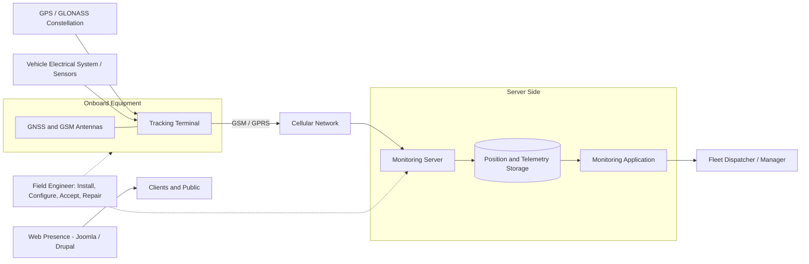

# Vehicle Satellite Monitoring Systems | June 2010 - December 2012

> Purpose: a finished interview reference and a source for CV/resume bullets. Contains only facts and conclusions accepted for external use.

## 01 Project Snapshot

| Field | Details |
|---|---|
| Product / system | GPS/GLONASS satellite monitoring systems for road and rail vehicles: onboard terminals, cellular telemetry, a server-side monitoring platform and the web presence around it |
| Domain | Satellite navigation, fleet telematics, geoinformatics, field deployment and hardware-software integration |
| Period | June 2010 - May 2012 (Land Cadastre Information Centre, full-time); October 2012 - December 2012 (Kamerton Special Design Bureau, part-time) |
| Delivery company / customer | The Information Centre for Land Cadastre Data and Land Monitoring, a unitary enterprise operating the Land Information System of Belarus; then SKB Kamerton, an open joint-stock company manufacturing satellite transport-monitoring equipment |
| Role | Engineer, Navigation and Information Technologies unit (Land Cadastre Information Centre); Software Engineer in the Information Technology Bureau, part-time (SKB Kamerton). |
| Target roles | Embedded and device-adjacent engineering, telematics and GNSS systems, hardware-software integration, support and field engineering, C#/database maintenance |
| Team | Department of Navigation and Information Technologies inside a geoinformatics organization; small maintenance group at the equipment manufacturer |
| Users / deployment | Fleet operators and transport organizations across Belarus; approximately 200 terminals installed in more than ten cities, one per vehicle, across roughly 200 road and rail vehicles |
| Main stack | GPS/GLONASS tracking terminals, GSM/GPRS telemetry, server-side monitoring software, CMS Joomla and Drupal; at Kamerton C#, C/C++, MySQL, PostgreSQL, Visual Studio |
| Primary responsibility | Installing, configuring and maintaining monitoring systems on vehicles; configuring the server side; equipment acceptance and repair; client support and training; later, maintaining the C# tracking software and its databases |
| Product status | Operational systems in commercial use by transport organizations |
| Confidentiality | Organizations, roles, technology categories and engineering practice are safe to discuss; client identities, contract terms, vehicle and route data, server addresses and credentials remain private |

### 30-Second Summary

Before moving into aerospace R&D, I spent two years as an engineer in the Department of Navigation and Information Technologies of the Belarusian state land-cadastre organization, deploying GPS/GLONASS vehicle monitoring systems. I installed and configured around 200 tracking terminals across more than ten cities, one per vehicle, on road and rail units alike, configured the server side of the monitoring platform, handled equipment acceptance and repair, coordinated procurement with manufacturers, and trained clients to use the system. I also built the organization's web presence on Joomla and Drupal. Afterwards I spent a short part-time period at the equipment manufacturer SKB Kamerton, maintaining the C# tracking software and debugging issues in its MySQL and PostgreSQL databases.

### Two-Minute Overview

A vehicle monitoring system looks simple from the outside - a box in the vehicle reports where it is - and is in practice a chain where every link can fail independently: a GNSS receiver that needs sky visibility, a terminal wired into a vehicle's electrical system, a cellular link with patchy coverage, a server that has to accept and interpret the stream, and an operator who has to trust what the map shows.

At the Land Cadastre Information Centre I worked on that whole chain from the field end. The organization is the state operator of the Land Information System of Belarus, and its Department of Navigation and Information Technologies delivered satellite transport monitoring to fleet operators. My work was installing terminals on vehicles - light vehicles, trucks and rail units - across more than ten cities, configuring them, configuring the server side of the monitoring system, and then keeping the result working: routine maintenance, fault diagnosis, equipment acceptance and repair. I also coordinated procurement with the equipment manufacturers, and supported and trained clients, which meant explaining to an operator why the map showed what it showed. Alongside this I developed the organization's websites using Joomla and Drupal.

Two years of that teaches a specific thing: that a system's real behavior is not what its documentation says, and that the difference shows up in the field rather than on a bench. A terminal that works perfectly in the office fails in a metal-bodied vehicle, or in a city block with poor cellular coverage, or because the installer routed a cable next to something noisy. Diagnosing those meant reasoning across hardware, radio conditions, vehicle electrics, network and server behavior at the same time, usually with the vehicle in front of me and a client waiting.

Late in 2012, after joining PELENG, I worked part-time for three months at SKB Kamerton, one of the manufacturers of this class of equipment. There I was on the software side of the same domain: maintaining and supporting the C#-based vehicle tracking software and debugging issues that ran into its MySQL and PostgreSQL storage. It was a short engagement, and it was my first sustained commercial software maintenance work - approaching the same systems I had been installing from the code end rather than from the vehicle end.

## 02 Context, Goals & Constraints

### Customer / Business Context

The Information Centre for Land Cadastre Data and Land Monitoring is the organization responsible for the Land Information System of Belarus: the national digital cadastral map and the automation of land-management activity, operated as a three-level structure across district, regional and national levels. Satellite navigation and transport monitoring sat naturally alongside that mandate, and were delivered by the Department of Navigation and Information Technologies, where I worked.

Fleet monitoring was a commercial service to transport organizations. Its value proposition was ordinary and concrete: knowing where vehicles are, how they are used, and whether reported activity matches actual activity. That made the work as much about the operator's trust in the data as about the technology producing it.

SKB Kamerton is a manufacturer of satellite transport-monitoring equipment - the class of onboard GPS/GLONASS terminals used in exactly these systems. Founded in 1990 as a scientific-production unitary enterprise, it became an open joint-stock company in 2012, the year I worked there, and employs over a hundred specialists in satellite navigation, microelectronics and IT; its terminals are listed in the Wialon hardware catalogue. My part-time engagement there was on the software that consumed their output.

### Product and Users

The deployed system worked as a chain:

1. An onboard terminal receives GNSS signals and determines the vehicle's position.
2. The terminal collects position, time and vehicle-related telemetry.
3. Data is transmitted over cellular (GSM/GPRS) to the monitoring server.
4. The server receives, stores and interprets the stream.
5. Operators view current positions, history and reports through the monitoring application.

The users were dispatchers and managers at transport organizations - people whose job is to run a fleet, not to operate software. That set the standard for both the system and for me: it had to work without them understanding it, and when it did not, someone had to explain the discrepancy in terms of their operation rather than in terms of GNSS.

### Scope and Criticality

- The scope was physical and distributed: terminals on vehicles in more than ten cities, not software in one place.
- Approximately 200 terminals were installed and connected, one per vehicle, so the deployed base covered roughly 200 vehicles - both road and rail units.
- A monitoring system is used to make operational and sometimes commercial decisions, so incorrect or missing data has consequences beyond inconvenience.
- Installation is destructive and semi-permanent: a terminal is wired into a working vehicle, and a bad installation takes the vehicle out of service to correct.
- Vehicle downtime for installation, acceptance and repair was a cost borne by the client, which made the efficiency of those processes a real business concern.
- Field work has no rollback: whatever is wrong has to be diagnosed where the vehicle is.

### Problem and Goals

- Deploy reliable vehicle monitoring across a geographically distributed fleet base.
- Configure the server side so new vehicles and clients could be brought into the system consistently.
- Keep the deployed base working through maintenance and fault diagnosis.
- Make equipment acceptance and repair efficient enough to limit vehicle downtime.
- Ensure clients could actually use the system and interpret what it told them.
- At SKB Kamerton: keep the tracking software and its data layer working correctly.

### Ownership Boundaries

- My responsibility was deployment, configuration, maintenance and client-facing support at the Land Cadastre Information Centre, and software maintenance at Kamerton.
- Terminal firmware and hardware design belonged to the equipment manufacturers.
- The monitoring platform's core software was a supplied product; I configured and operated it rather than developing it.
- Cellular network availability and GNSS constellation performance were external conditions to work within, not to control.
- Client operational decisions based on the data were theirs.
- At SKB Kamerton, the C# tracking software was an existing product I maintained rather than authored.

### Constraints

- **Physical environment.** Metal vehicle bodies, antenna placement, cable routing, vibration, temperature and vehicle electrical noise all affect whether a terminal works, and none of them appear in a specification.
- **Radio conditions.** GNSS needs sky visibility; cellular coverage is uneven and was more so in 2010-2012. Both degrade gracefully into wrong or missing data rather than into clear errors.
- **Geographic distribution.** Terminals were in more than ten cities, so a return visit was expensive and getting it right the first time mattered.
- **Client operations.** Installation and repair had to fit around vehicles being in service.
- **Supplied equipment and platform.** The terminals and the monitoring software were products from manufacturers; their behavior and limitations were inputs.
- **Non-technical users.** Everything had to be explainable to an operator.
- **Legacy code at SKB Kamerton.** An existing C# product with existing databases, maintained under a short part-time engagement.

### Cross-Cutting Requirements

- **Data correctness:** a reported position had to correspond to where the vehicle actually was; a plausible-looking wrong track is worse than an obvious gap.
- **Reliability:** terminals had to keep working unattended in vehicles in daily service.
- **Serviceability:** faults had to be diagnosable and repairable without excessive vehicle downtime.
- **Consistency:** new vehicles and clients had to be configured the same way, or the deployed base becomes a collection of special cases.
- **Comprehensibility:** clients had to be able to use and interpret the system.

### Success Criteria

- Installed terminals report reliably from vehicles in normal service.
- Newly added vehicles and clients appear correctly in the monitoring system without ad-hoc adjustment.
- Faults are identified and resolved with minimal vehicle downtime.
- Clients operate the system themselves after training and trust what it shows.
- At SKB Kamerton: reported software defects are reproduced, diagnosed and corrected, including those originating in the data layer.

### Public Sources for Organizational Context

- Land Information System of Belarus, operated by the Information Center for Land Cadastral Data and Land Monitoring: [https://arcreview.esri-cis.ru/2013/05/15/land-information-system-of-belarus/](https://arcreview.esri-cis.ru/2013/05/15/land-information-system-of-belarus/)
- SKB Kamerton as a manufacturer of GPS/GLONASS tracking hardware: [https://wialon.com/ru/hw-manufacturers/skb-kamerton](https://wialon.com/ru/hw-manufacturers/skb-kamerton)

## 03 System Architecture & Integration Boundaries

### Main Components and Data Flow

The chain is short but crosses four independent failure domains - satellite signal, vehicle installation, cellular network and server - and a symptom in the operator's map gives almost no information about which one is responsible. That asymmetry is the defining characteristic of the work: the observation is always at the far end, and the cause is usually not.

| Component | Responsibility / state | Interface | My involvement |
|---|---|---|---|
| GNSS constellation | Provide positioning signal | Radio; sky visibility required | External condition |
| Tracking terminal | Determine position, collect telemetry, buffer and transmit | Manufacturer firmware and configuration | Installed, configured, accepted, diagnosed and repaired |
| Antennas and wiring | Carry signal into and out of the terminal in a hostile physical environment | Physical installation | Installed; placement and routing were a core part of getting it right |
| Vehicle electrical system | Power the terminal; source of some telemetry | Vehicle wiring | Integrated with, on light vehicles, trucks and rail units |
| Cellular network | Transport data from terminal to server | GSM/GPRS | External condition; coverage shaped expectations |
| Monitoring server | Receive, store and interpret the stream; hold client and vehicle configuration | Supplied platform | Configured; added vehicles and clients; diagnosed server-side symptoms |
| Monitoring application | Present positions, history and reports | Operator-facing | Supported and trained clients on it |
| Web presence | Public and client-facing site | Joomla, Drupal | Developed |
| Tracking software (SKB Kamerton) | Vehicle tracking application logic | C# | Maintained and supported |
| MySQL / PostgreSQL (SKB Kamerton) | Persistence for tracking data | SQL | Debugged and optimized data storage and retrieval issues |

### External Integrations

- **GNSS (GPS and GLONASS)** - the positioning source, and an uncontrollable one.
- **Cellular operators** - the data path, with coverage that varied by region and by moment.
- **Equipment manufacturers** - terminals and their firmware; I coordinated procurement and dealt with acceptance, warranty and repair.
- **Monitoring platform vendor** - the server-side product that was configured rather than built.
- **Client fleets** - the physical systems the equipment was installed into, each with its own vehicles and practices.

### State, Failure & Trust Boundaries

- **The map is not the territory, and the gap is the job.** The operator sees a track; the track is the end of a chain that can distort it at any point.
- **Missing data and wrong data are different failures.** A gap usually means the link or the terminal; a smooth but incorrect track usually means positioning conditions or configuration. Confusing the two sends diagnosis in the wrong direction.
- **Terminals buffer.** Data that arrives late is not the same as data that arrives wrong, and a system that looks broken may simply be catching up after a coverage gap.
- **Installation quality is invisible state.** A marginal antenna position or a cable routed badly produces intermittent faults weeks later, with nothing in the system pointing at the installation.
- **Configuration exists in two places** - in the terminal and on the server - and they have to agree.
- **The client's trust is a system property.** Once an operator has seen the map be wrong once, every subsequent oddity is attributed to the system, whether or not it belongs there.

### Technical Ownership

**Direct implementation:**

- Terminal installation and configuration on road and rail vehicles.
- Server-side monitoring system configuration for new vehicles and clients.
- Equipment acceptance, fault diagnosis and repair.
- Website development on Joomla and Drupal.
- C# tracking software maintenance and database debugging (SKB Kamerton).

**Integration work:**

- Terminal-to-vehicle electrical and physical integration.
- Terminal-to-server configuration consistency.
- Procurement coordination with equipment manufacturers.
- Client support and training.

**Adjacent platform areas:**

- Terminal firmware and hardware design.
- Monitoring platform core software.
- Cellular network and GNSS infrastructure.
- Client fleet operations.

## 04 Tech Stack & Technical Decisions

| Area | Technologies | Project use / constraint | My depth |
|---|---|---|---|
| Positioning | GPS, GLONASS | Vehicle position determination | Applied user; understood the failure modes |
| Onboard equipment | Manufacturer tracking terminals | Position and telemetry collection and transmission | Installation, configuration, acceptance, repair |
| Data transport | GSM / GPRS | Terminal-to-server link | Applied; coverage behavior was a working constraint |
| Server side | Supplied monitoring platform | Reception, storage, presentation of tracking data | Configuration and operation |
| Web | CMS Joomla, CMS Drupal | Organization web presence | Development |
| Application maintenance | C#, Visual Studio | Vehicle tracking software (SKB Kamerton) | Maintenance and support |
| Data layer | MySQL, PostgreSQL | Tracking data persistence (SKB Kamerton) | Debugging and optimization of storage and retrieval |
| Adjacent | C / C++ | Present in the SKB Kamerton environment, not work I did there | None claimed; my own C++ practice starts in 2020 |

### Important Decisions and Tradeoffs

| Context / decision | Alternative | Chosen approach | Tradeoff | My role |
|---|---|---|---|---|
| Installation quality | Install quickly and return if there are problems | Get antenna placement, mounting and cable routing right on the first visit | Slower per vehicle, far cheaper than a return trip to another city and less client downtime | Applied in the field |
| Server configuration | Configure each client ad hoc as they arrive | Configure new vehicles and clients consistently through the same process | Less flexibility per client, a deployed base that stays diagnosable | Applied |
| Equipment acceptance and repair | Handle each case as it comes | Streamline acceptance and repair as a defined process | Process overhead, reduced vehicle downtime and faster turnaround | Contributed |
| Client relationship | Fix problems as reported | Train clients to use and interpret the system | Time spent on training, fewer misattributed faults and better-quality reports | Applied |
| Procurement | Order reactively | Coordinate with manufacturers for timely and cost-effective supply | Planning effort, fewer deployment delays | Applied |

Equipment models, the monitoring platform and the CMS choices were organizational decisions rather than mine.

## 05 Team, Role & Ownership

### Team and Collaboration

At the Land Cadastre Information Centre I worked in the Department of Navigation and Information Technologies, inside a geoinformatics organization whose principal business was land cadastre and monitoring. The department delivered navigation and transport-monitoring services, and the role was deliberately broad: the same person sold the idea, installed the equipment, configured the server, fixed it when it broke and taught the client to use it. Collaboration was with equipment manufacturers on supply and warranty, and with clients continuously.

At SKB Kamerton the engagement was part-time, short and software-focused - maintaining an existing C# product in the Information Technology Bureau alongside my main job at PELENG.

### Responsibilities

- Install and configure satellite monitoring terminals on road and rail vehicles.
- Carry out on-site installations, including for light vehicles and trucks.
- Configure the server side of the monitoring system.
- Maintain the deployed base and troubleshoot faults.
- Handle equipment acceptance and repair.
- Coordinate procurement with manufacturers.
- Provide client support and training.
- Develop the organization's websites on Joomla and Drupal.
- Maintain and support the C#-based tracking software and debug its database issues (SKB Kamerton).

### Role Boundaries

- **Primary:** field deployment, configuration, maintenance and support of vehicle monitoring systems.
- **Secondary:** web development; later, C# application and database maintenance.
- **Integrated with:** equipment manufacturers, the monitoring platform, cellular operators and client fleets.
- **Outside my responsibility:** terminal firmware and hardware design, monitoring platform development, network infrastructure, client fleet operations.

## 06 Delivery, Testing & Quality

### Development Process

Work was driven by client engagements rather than by a development cycle: a client is signed, vehicles are scheduled, equipment is procured, installations are performed, the server side is configured, the client is trained, and from then on the system is maintained. Faults arrived as client reports and were handled as field or server investigations.

At SKB Kamerton the process was conventional maintenance: a reported defect, reproduction, diagnosis across application and database, correction and verification.

### Build and Deployment

Deployment here was literal - equipment installed into vehicles in more than ten cities. "Release" meant a vehicle accepted into the monitoring system with its terminal working and its configuration correct on the server. Acceptance was a defined step, and its efficiency mattered because vehicles were out of service while it happened.

### Test Strategy

- **Post-installation verification:** each installed terminal was checked reporting correctly before the vehicle was released.
- **Acceptance testing of equipment:** incoming and repaired equipment was tested before it went into a vehicle.
- **Field observation:** terminals were checked under real operating conditions, since bench behavior and in-vehicle behavior diverge.
- **Server-side confirmation:** the vehicle had to appear correctly in the monitoring system with correct configuration, not merely transmit.
- **Client confirmation:** the person who would use the system daily had to see it working and understand it.
- **Defect reproduction (SKB Kamerton):** a reported software issue had to be reproduced before it was diagnosed, including when the root cause sat in the database.

### Compatibility Matrix

| Producer / artifact | Consumer | Required behavior | Validation |
|---|---|---|---|
| GNSS signal | Terminal | Position fix achievable under real installation conditions | In-vehicle check after installation |
| Terminal configuration | Server configuration | Both sides agree on identity and parameters | Vehicle appears correctly in the monitoring system |
| Terminal output | Monitoring server | Data accepted, stored and interpreted correctly | End-to-end confirmation before acceptance |
| Buffered data after a coverage gap | Monitoring application | Late data integrated into the track rather than lost or duplicated | Observation after known coverage gaps |
| Tracking application (C#) | MySQL / PostgreSQL | Correct storage and retrieval under the application's access patterns | Defect reproduction and verification |

### Observability and Debugging

The diagnostic method was elimination across independent domains, worked backwards from the symptom. Nothing at all from a vehicle points at power, the terminal or the antenna; nothing recently from several vehicles in one area points at coverage or at the server; a track that exists but wanders points at positioning conditions or installation; a vehicle missing from the map while transmitting points at configuration. Deciding which domain to open first, before driving to another city, was the skill that mattered.

### Reliability, Security & Performance Validation

- Terminals had to survive continuous unattended operation in vehicles in daily service, including vibration, temperature range and power behavior.
- Repair and acceptance processes were organized to limit the time a client's vehicle was unavailable.
- Vehicle and route data is commercially sensitive to a transport operator and stayed within the organization's and client's access boundaries.
- At SKB Kamerton, database work targeted storage and retrieval behavior under the application's real access patterns.

## 07 Contributions

### Field Deployment of Vehicle Monitoring Systems

- **Starting point:** clients with fleets and no monitoring; equipment that works on a bench and has to work in a vehicle.
- **My contribution:** installed and connected approximately 200 satellite monitoring terminals across more than ten cities - one per vehicle, so roughly 200 road and rail vehicles - carrying out the on-site installations myself, sometimes alone and sometimes as the senior of a pair.
- **Technical detail:** the substance of a good installation is antenna placement with adequate sky visibility given the vehicle body, mounting that survives vibration, cable routing away from electrical noise, and a power connection that behaves correctly when the vehicle is off. None of this is in a manual, and all of it determines whether the system works six months later.
- **Result:** an operating deployed base across a geographically distributed client set.
- **Status:** delivered and in commercial operation.

### Server-Side Monitoring Configuration

- **Starting point:** a supplied monitoring platform that had to be configured for each new client and vehicle.
- **My contribution:** configured the server side of the monitoring system, bringing new vehicles and clients into it.
- **Technical detail:** the configuration exists in two places - on the terminal and on the server - and they must agree. A vehicle can transmit perfectly and still be invisible or misattributed because the two sides disagree, which is a failure mode that looks identical to a transmission fault from the operator's side.
- **Result:** consistent onboarding of vehicles and clients into the monitoring system.
- **Status:** delivered.

### Maintenance, Fault Diagnosis and Repair

- **Starting point:** a deployed base in daily commercial use, with faults arriving as client reports rather than as diagnostics.
- **My contribution:** performed routine maintenance and troubleshooting of the monitoring system, and handled equipment acceptance and repair.
- **Technical detail:** diagnosis was elimination across four independent domains - satellite, installation, network, server - from a symptom observed only at the far end. The practical discipline was to narrow the domain from what could be observed remotely before committing to a trip.
- **Result:** a maintained deployed base and repair turnaround organized to limit client vehicle downtime.
- **Status:** delivered.

### Procurement, Client Support and Training

- **Starting point:** equipment sourced from manufacturers; clients who needed to operate a system they had not chosen the technology for.
- **My contribution:** coordinated with manufacturers for timely and cost-effective procurement, and provided client support and training.
- **Technical detail:** training was more technical than it sounds. An operator who understands that a gap in a track can mean cellular coverage rather than a stopped vehicle reports usefully; one who does not reports "the system is broken". The quality of incoming fault reports depended directly on how well the client had been taught.
- **Result:** clients operating the system independently, and better-quality fault reports coming back.
- **Status:** delivered.

### Web Development

- **Starting point:** the organization needed a web presence.
- **My contribution:** developed websites using CMS Joomla and CMS Drupal.
- **Technical detail:** CMS-based development - content structure, templates, configuration and extension - rather than application programming, and my first practical work on the software side of the job.
- **Result:** delivered organizational web presence.
- **Status:** delivered.

### C# Tracking Software Maintenance (SKB Kamerton)

- **Starting point:** an existing C#-based vehicle tracking product at the equipment manufacturer, with reported defects, on a part-time three-month engagement.
- **My contribution:** maintained and supported the software, and debugged and resolved issues involving its MySQL and PostgreSQL storage.
- **Technical detail:** tracking data is high-volume, time-ordered and queried by time and vehicle, so a functional issue in the application and a storage or retrieval issue in the database present very similarly to the user. Deciding which layer owned a defect was the recurring question - the same cross-layer diagnosis I would rely on years later in C++ work.
- **Result:** maintained application behavior and corrected data-layer issues.
- **Status:** delivered; short part-time engagement alongside my main role.

## 08 Key Engineering Challenges

### 1. Symptoms at the Far End of a Multi-Domain Chain

The operator observes a map. The cause of what they observe may be a satellite signal condition, an antenna position, a cable, a cellular cell, a terminal configuration or a server record. There is no stack trace. Learning to narrow this systematically - and to do so before driving to another city - was the core skill of the role, and the habit transferred directly into later cross-layer software debugging.

### 2. The Physical Environment as an Unwritten Specification

Equipment behaves differently in a vehicle than on a desk. Metal bodies attenuate signal, engines generate electrical noise, vibration loosens what was tight, temperature swings, and power behaves unexpectedly when the ignition is off. None of this is in the documentation, and all of it determines reliability. This was my first real lesson that a specification describes an intention and only measurement describes a device.

### 3. Failures That Appear Weeks After Their Cause

A marginal installation does not fail immediately - it fails intermittently, later, with nothing connecting the symptom to the decision that caused it. That asymmetry is what justifies spending extra time on an installation that appears to be working: the cost of getting it wrong is paid later, by someone who cannot see why.

### 4. Distinguishing Missing Data from Wrong Data

These look similar to an operator and mean entirely different things. Missing data usually indicates the link or the terminal and is self-announcing. Wrong data - a plausible but incorrect track - is far more dangerous, because the system continues to look like it is working while the operator makes decisions on it. Treating "looks fine" as unverified rather than as correct is a habit this work established.

### 5. Geographic Distribution Without Remote Access

With terminals in more than ten cities and no ability to fix most things remotely, every diagnosis had a travel cost attached. This forced a discipline of extracting the maximum from remotely observable evidence before committing to a visit, and of never making a trip to fix only one thing.

### 6. Non-Technical Users as Part of the System

The client is the sensor for most faults. How well they understood the system determined the quality of every fault report the organization received, which made training a genuinely technical investment rather than a courtesy.

## 09 Representative Interview Stories

### Narrowing a Fault Before Driving to It

- **Situation:** a client reported that vehicles were missing from the monitoring system, with the fleet several hours away.
- **Task:** determine what was actually wrong before committing to a trip, since a wasted visit costs a day.
- **Actions:** worked backwards from what could be observed remotely. Checked whether the problem affected one vehicle or several, whether affected vehicles were geographically clustered, whether data had stopped entirely or was arriving late, and whether the server-side configuration for those vehicles was intact. The pattern - which vehicles, which area, gap versus silence - distinguishes a terminal fault from a coverage issue from a configuration problem.
- **Result:** the fault domain was identified from remote evidence, and the visit, when it happened, was made with the right equipment and the right expectation.
- **Tradeoff / lesson:** when investigation is expensive, the value is in the evidence you can gather cheaply first. This is the same reasoning I use now with logs and captures before attaching a debugger.

### An Installation That Worked and Then Did Not

- **Situation:** a terminal verified as working at installation began reporting intermittently weeks later.
- **Task:** find a cause that had left no trace in the system and was not present when the vehicle was accepted.
- **Actions:** treated the installation itself as the suspect rather than the equipment, since the failure was intermittent rather than absolute and had developed over time. Examined antenna position relative to how the vehicle was actually used, cable routing relative to sources of electrical noise, and mounting for vibration effects - the physical conditions that change between a stationary acceptance check and months of daily service.
- **Result:** the fault was traced to the physical installation rather than the equipment, and corrected.
- **Tradeoff / lesson:** an acceptance check confirms a state, not a condition. Equipment that passes at handover is not the same as equipment that will survive its operating environment, and the difference falls on whoever installed it.

### Teaching a Client to Report Usefully

- **Situation:** fault reports arrived as "the system is not working", covering everything from a genuine terminal failure to a vehicle that had legitimately been parked underground.
- **Task:** reduce both the misattributed reports and the time spent diagnosing non-faults.
- **Actions:** during training, explained what the system physically depends on - that a gap can mean lost cellular coverage or a vehicle without sky visibility, that late data appears as a gap that later fills in - so that operators could distinguish an anomaly from a normal behavior of the technology.
- **Result:** more accurate and more specific incoming fault reports, and less time spent investigating expected behavior.
- **Tradeoff / lesson:** time spent making users understand a system's failure modes comes back as diagnostic quality. The user is the first observer, and an uncalibrated observer produces unusable observations.

### Application or Database (SKB Kamerton)

- **Situation:** reported defects in a C# vehicle tracking application where the symptom involved data that was wrong, slow or missing.
- **Task:** determine whether the fault belonged to the application logic or to the data layer, on a short part-time engagement with an unfamiliar codebase.
- **Actions:** reproduced the reported behavior, then followed the affected data from the application's request through to what MySQL or PostgreSQL actually held and returned, rather than assuming the layer that reported the symptom was the layer that owned it.
- **Result:** defects corrected in the layer that actually owned them, including storage and retrieval issues in the database.
- **Tradeoff / lesson:** the layer that displays a problem is rarely the layer that causes it. This is the same method I applied years later tracing values from C++ through persistence into user-facing behavior.

## 10 Outcomes and Impact

| Outcome | Engineering / user value | Source |
|---|---|---|
| ~200 monitoring terminals installed and connected across 10+ cities | An operating deployed base enabling real-time fleet tracking for client organizations | First-hand record |
| Roughly 200 vehicles covered, road and rail alike | Monitoring extended across different vehicle types with different installation demands | First-hand record |
| Server-side monitoring configuration for new vehicles and clients | Consistent onboarding rather than a base of special cases | First-hand record |
| Maintenance, acceptance and repair processes | Deployed base kept working with limited client vehicle downtime | First-hand record |
| Procurement coordination with manufacturers | Timely and cost-effective equipment supply | First-hand record |
| Client support and training | Clients operating the system independently and reporting faults usefully | First-hand record |
| Websites delivered on Joomla and Drupal | Organizational web presence | First-hand record |
| C# tracking software maintained and database issues resolved | Continued correct operation of the manufacturer's tracking product | First-hand record |
| First commercial software maintenance experience | The start of the transition from field engineering toward software development | Career record |

### Resume-Ready Bullets

- Deployed and maintained GPS/GLONASS vehicle monitoring systems as an engineer in the navigation and information technologies department of the Belarusian state land-cadastre organization, installing and connecting approximately 200 terminals across more than 10 cities on roughly 200 road and rail vehicles.
- Configured the server side of the monitoring platform for new vehicles and clients, and diagnosed faults spanning onboard equipment, vehicle installation, cellular connectivity and server-side configuration.
- Ran equipment acceptance and repair, and coordinated procurement with manufacturers to keep deployment schedules and limit client vehicle downtime.
- Delivered client support and training that improved operators' ability to use the system independently and to report faults accurately.
- Developed the organization's web presence using CMS Joomla and CMS Drupal.
- Maintained and supported a C#-based vehicle tracking application at an equipment manufacturer, debugging and resolving defects across application logic and MySQL/PostgreSQL storage.

## 11 Tradeoffs, Lessons & Retrospective

### Tradeoffs

- Doing installations thoroughly cost time per vehicle and avoided far more expensive return visits to other cities.
- Consistent server-side configuration reduced per-client flexibility and kept the deployed base diagnosable.
- Formalizing acceptance and repair added process overhead and reduced client vehicle downtime.
- Investing time in client training took time away from deployment and returned better fault reports.
- Taking the part-time SKB Kamerton engagement alongside PELENG limited how deep I could go there, and gave me my first commercial software maintenance experience.

### What I Learned

- How to diagnose a fault across independent domains from a symptom observed only at the end of the chain.
- That physical and environmental conditions constitute an unwritten specification, and that only measurement describes a device.
- That intermittent failures usually trace back to decisions made much earlier, which is why quality at installation time is worth paying for.
- The difference between missing data and wrong data, and why the second is more dangerous.
- How to explain a technical system to someone who has to rely on it without understanding it.
- How much of engineering is logistics: procurement, scheduling, downtime and travel are real constraints, not distractions from the work.
- First practical experience with C#, relational databases and a CMS - the beginning of the move toward software.

### Mistakes and Course Corrections

- Early on I trusted a successful post-installation check as evidence that an installation was sound. Intermittent failures appearing weeks later corrected that: the check confirms a state at one moment, and the physical installation has to be judged against months of service, not against the minute it was verified.
- I initially treated client fault reports as data rather than as observations from an uncalibrated observer. Once I started training clients on what the system physically depends on, the reports became usable, and the time spent investigating normal behavior dropped.

### What I Would Improve Today

- Track installation details per vehicle - antenna position, routing, power connection, acceptance conditions - so that a later intermittent fault can be correlated with how it was installed.
- Build a remote triage checklist that classifies a reported fault into a likely domain from observable evidence before any trip is authorized.
- Monitor the deployed base proactively for degradation patterns rather than waiting for client reports.
- Treat the terminal and server configurations as one versioned pair rather than two independently edited states.
- Give clients a short written guide to expected behavior, not only verbal training.

## 12 Interview Answer Kit

### Role-Specific Emphasis

- **Embedded and device-adjacent roles:** hands-on work with real hardware in a hostile physical environment, and diagnosis that spans device, link and server - close in character to the embedded product work at Innowise.
- **Telematics, GNSS and IoT:** end-to-end understanding of a positioning and telemetry chain and its failure modes.
- **Support, field and integration engineering:** deployment at scale across a distributed client base, with acceptance, repair and training.
- **General debugging ability:** narrowing a fault across independent domains with expensive investigation steps - the origin of a method I still use.
- **Database and application maintenance:** the SKB Kamerton engagement as first commercial software maintenance, including cross-layer defect attribution.

### Strongest Technical Deep Dives

- The four failure domains of a vehicle monitoring chain and how to tell them apart from a single symptom.
- Why installation quality determines long-term reliability and how it fails.
- Missing data versus wrong data and why the second is worse.
- Terminal and server configuration as one state held in two places.
- Attributing a defect to application logic or to the data layer.

### Likely Follow-Up Questions

- **What was the Land Cadastre Information Centre?** The Belarusian state organization operating the national Land Information System - the digital cadastral map and land-management automation. I worked in its navigation and information technologies department, on satellite transport monitoring.
- **What did you actually do day to day?** Installed and configured tracking terminals on vehicles, configured the server side, maintained the deployed base, handled equipment acceptance and repair, coordinated procurement, and supported and trained clients.
- **How large was the deployment?** Around 200 terminals across more than ten cities, one per vehicle, so roughly 200 road and rail vehicles.
- **Was this a software role?** Not primarily. It was field and integration engineering, with web development on Joomla and Drupal alongside. The software side started at SKB Kamerton.
- **What was SKB Kamerton?** A manufacturer of satellite transport-monitoring equipment. I worked there part-time for three months in late 2012, maintaining their C# tracking software and debugging MySQL and PostgreSQL issues, alongside my main role at PELENG.
- **Why is this relevant to a C++ role today?** Two reasons. It is where I learned to diagnose faults across independent layers from a symptom at the far end, which is exactly what I do now across C++ code, protocols, configuration and hardware. And it is hands-on hardware experience, which matters for embedded work.
- **Why did you move on?** I wanted engineering and algorithm work rather than deployment and support, which is what took me to PELENG in 2012.

### Confidentiality Boundaries

- Safe to discuss: the organizations, my role, the technology categories, the scale of deployment and the engineering approach.
- Keep private: client identities, contract and commercial terms, vehicle and route data, server addresses, credentials and internal configuration details.
- Deployment counts are approximate figures from my own records of the work.

### Glossary

- **GNSS:** global navigation satellite system - the general term covering GPS, GLONASS and others.
- **GLONASS:** the Russian satellite navigation system, widely used alongside GPS in this region.
- **Tracking terminal:** the onboard device that determines position and transmits it with telemetry.
- **Telematics:** the combination of telecommunications and vehicle information systems - fleet monitoring is its most common form.
- **GPRS:** the packet data service over GSM cellular networks used to carry tracking data in this period.
- **Land Information System (LIS):** the Belarusian national system for cadastral mapping and land-management automation, operated by the Land Cadastre Information Centre.
- **Acceptance:** the defined step at which installed or repaired equipment is verified and the vehicle returned to service.

## 13 Sources and Reference Material

### Repository / Project Sources

- First-hand record of the period: the deployed base, installation and maintenance work, server-side configuration, procurement, client support and the SKB Kamerton part-time engagement.

### Public Sources

- Land Information System of Belarus and the role of the Information Center for Land Cadastral Data and Land Monitoring: [https://arcreview.esri-cis.ru/2013/05/15/land-information-system-of-belarus/](https://arcreview.esri-cis.ru/2013/05/15/land-information-system-of-belarus/)
- SKB Kamerton as a GPS/GLONASS tracking equipment manufacturer: [https://wialon.com/ru/hw-manufacturers/skb-kamerton](https://wialon.com/ru/hw-manufacturers/skb-kamerton)
- Company register entry for the Land Cadastre Information Centre (unitary enterprise, Minsk): [https://www.belarusinfo.by/ru/poisk/45581/filials.html](https://www.belarusinfo.by/ru/poisk/45581/filials.html)

| Claim | Source | Disclosure |
|---|---|---|
| Engineer in the Department of Navigation and Information Technologies at the Land Cadastre Information Centre, June 2010 - May 2012 | First-hand record | Public |
| The Land Cadastre Information Centre operates the Belarusian Land Information System | [ArcReview](https://arcreview.esri-cis.ru/2013/05/15/land-information-system-of-belarus/) | Public |
| ~200 terminals installed across 10+ cities | First-hand record | Public |
| Roughly 200 vehicles covered, road and rail, one terminal each | First-hand record | Public |
| Server-side monitoring configuration; equipment acceptance and repair; procurement; client support and training; on-site installations | First-hand record | Public |
| Website development on CMS Joomla and CMS Drupal | First-hand record | Public |
| SKB Kamerton, part-time software engineer in the Information Technology Bureau, Oct - Dec 2012; C#, MySQL, PostgreSQL | First-hand record | Public |
| SKB Kamerton manufactures satellite transport-monitoring equipment | First-hand record; [Wialon hardware catalogue](https://wialon.com/ru/hw-manufacturers/skb-kamerton) | Public |
| SKB Kamerton founded 1990, became an open joint-stock company in 2012, over 100 specialists | [Wialon hardware catalogue](https://wialon.com/ru/hw-manufacturers/skb-kamerton) | Public |
| The Land Cadastre Information Centre is a unitary enterprise based in Minsk | [Belarusian company register](https://www.belarusinfo.by/ru/poisk/45581/filials.html) | Public |
| Client identities, contract terms, vehicle and route data, server addresses, credentials | - | Confidential |
