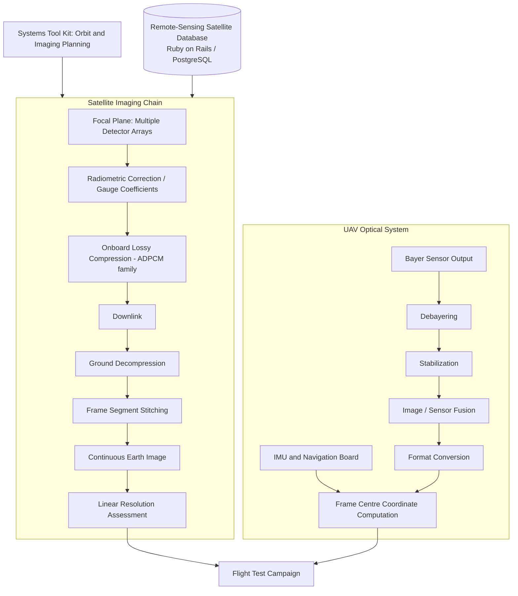

# Satellite and UAV Optical Imaging Software | August 2012 - January 2020

> Purpose: a finished interview reference and a source for CV/resume bullets. Contains only facts and conclusions accepted for external use.

Quick routes through this document:

- **Recruiter / first answer:** sections 01, 10 and 12.
- **Technical interview:** sections 03, 07, 08 and 09.
- **Product and source context:** sections 02 and 13.

## 01 Project Snapshot

| Field | Details |
|---|---|
| Product / system | Image-processing algorithms and supporting software for the optoelectronic imaging payloads of Earth remote-sensing satellites and of an airborne optical system for UAVs |
| Domain | Aerospace, Earth remote sensing, optoelectronic instrument development, digital image processing |
| Period | August 2012 - January 2020 (7 years 5 months) |
| Delivery company / customer | PELENG, an open joint-stock company in Minsk - product and design organization; payloads delivered to satellite prime contractors and national space programs |
| Role | Design engineer and research engineer in the research department of the Space Research and Design Division; the entire period in one unit |
| Target roles | Algorithm development, image processing and computer vision, aerospace and industrial R&D, data-processing engineering |
| Team | Design-bureau structure: optics, electronics, mechanics, software and test engineers working on one instrument; algorithm work done individually or in pairs inside the research department |
| Users / deployment | Instrument designers, test engineers and image-quality specialists inside the organization; algorithms delivered into onboard payload software and into ground image-processing workflows |
| Main stack | MATLAB (primary), Systems Tool Kit (STK), Ruby on Rails, PostgreSQL, MS Access, internal proprietary tooling, Git |
| Primary responsibility | Designing and implementing image-processing algorithms - frame stitching, onboard compression, quantization quality, resolution assessment, debayering, stabilization, image fusion - plus geometric calibration, a satellite reference database, and participation in flight tests |
| Product status | Production instruments flown on operational satellites and on a UAV optical system |
| Confidentiality | Satellite programs and the organization's product categories are public and documented in open sources; instrument specifications, internal algorithm parameters, design documentation, customer requirements and the defense-related side of the organization remain private |

### 30-Second Summary

For more than seven years I worked as a design and research engineer in the research department of the Space Research and Design Division at PELENG in Minsk, a company that develops and manufactures the optoelectronic imaging payloads carried by Earth remote-sensing satellites. I designed and implemented image-processing algorithms in MATLAB across the instrument lifecycle: stitching the segments of a satellite frame into one continuous image, lossy onboard compression at a 3-4x ratio, image-type prediction to improve quantization quality, automated resolution assessment from flight-test imagery, and debayering, stabilization and image fusion for a UAV optical system. I also built a remote-sensing satellite database, calibrated IMU-to-camera geometry, and took part in flight tests as a payload operator.

### Two-Minute Overview

PELENG builds the cameras that fly on Earth remote-sensing satellites - the optoelectronic imaging equipment, star sensors and astro-orientation systems. Public sources credit the company with the imaging payloads of the Kanopus-V series and the Belarusian spacecraft BKA, and with EgyptSat-2. Over my period the organization's instruments were involved in BKA, the Kanopus-V series, EgyptSat-2 and EgyptSat-A, alongside programs such as Obzor-O, Monitoring-SG and Meteor-MP, and an optical system for unmanned aerial vehicles.

I spent the whole period in the same unit: the research department of the Space Research and Design Division. My work was algorithm development for those instruments, almost entirely in MATLAB. A satellite imager does not produce a finished picture: its focal plane is assembled from several detector arrays, so a frame arrives as segments that must be joined geometrically and matched radiometrically. My first project was the stitching algorithm for that. The next two concerned the downlink: an onboard lossy compression algorithm of the ADPCM family reaching a 3-4x ratio, and then a follow-up that improved the quality achieved at a given ratio by predicting the image type and adapting quantization to it. Both had to fit a very tight onboard computation budget, which is the constraint that shapes every decision in that kind of work.

I then built software to determine the linear ground resolution actually achieved in an image, which replaced a manual, expert-driven flight-test analysis with a repeatable automated one. In parallel I designed a database of remote-sensing satellites and their parameters on Ruby on Rails and PostgreSQL, so that mission and instrument reference data lived in one queryable place instead of in spreadsheets.

Later the work extended to a UAV optical system: debayering, image format conversion, stabilization and frame fusion modules, calibration of the inertial measurement unit against the camera so that the coordinates computed for the frame centre were correct, and participation in more than thirty test flights as payload operator. Across the period I also worked on radiometric correction coefficients for the photodetector arrays, alignment of image sensors in a common plane, imaging planning for flight tests using Systems Tool Kit, and design documentation.

This was the foundation of my engineering career: more than seven years of algorithm work on real instruments under real hardware constraints, before I moved fully into commercial C++ development.

## 02 Context, Goals & Constraints

### Customer / Business Context

PELENG, JSC is a Minsk-based developer and manufacturer of optical and optoelectronic systems. Its public space product line includes optoelectronic imaging equipment with 2 m resolution, star sensors, astro-orientation systems and control and synchronisation units. The organization's output is instruments, not software products: the software I wrote existed to make those instruments produce usable imagery, either by running onboard or by supporting their design, calibration and testing.

Its customers were national space programs and satellite prime contractors. The programs my organization's equipment was associated with during and around my period are documented publicly: BKA, the Belarusian spacecraft launched with Kanopus-V 1 in July 2012, the Kanopus-V series, EgyptSat-2 launched in April 2014, and EgyptSat-A launched in February 2019, along with programs including Obzor-O, Monitoring-SG and Meteor-MP. An optical system for unmanned aerial vehicles was a separate line of work using closely related imaging technology.

I worked the entire period in one unit: the research department of the Space Research and Design Division.

That second level matters. A design division at an enterprise like this covers the full path from research to serial design documentation and production support; the research department is the end of it where feasibility, algorithms and methods are worked out, before anything becomes a released design. It is the structural reason my years there were algorithm and R&D work rather than drawing-office work, and it is worth saying in an interview when someone hears "design engineer" and pictures only serial design or drafting.

### Product and Users

The instruments produced Earth imagery, and everything I wrote supported one of four points in that chain:

1. **Instrument design and calibration** - correcting detector array response, aligning image sensors in a common plane, and determining what image quality the design would actually deliver.
2. **Onboard processing** - compressing image data so that a satellite's limited downlink could carry it, within the computation the onboard hardware could perform.
3. **Ground processing** - stitching frame segments into a continuous image, debayering, format conversion, stabilization and fusion.
4. **Test and verification** - imaging planning, resolution assessment from flight-test imagery, and operating the payload during test flights.

The users were the organization's own engineers: instrument designers, image-quality specialists and test engineers. The end consumers of the imagery were the mission operators and data users on the customer side, which set the standard for what "good enough" meant but placed them outside my direct interaction.

### Scope and Criticality

- The work spanned algorithm design, onboard-constrained implementation, ground processing, geometric and radiometric calibration, reference data management and flight testing.
- Onboard algorithms are effectively unchangeable after launch. A compression defect that degrades imagery is not a patch away; it is the mission's image quality for the instrument's operating life.
- Image quality is the product. An algorithm that quietly loses radiometric or geometric fidelity destroys the value of hardware that took years and considerable expense to build and launch.
- Flight tests are scarce and expensive events. Analysis tooling that is slow or non-repeatable turns a limited test campaign into a bottleneck.
- The organization worked to a stage-gate, documentation-heavy engineering process typical of instrument design bureaus, with formal design projects at each stage.

### Problem and Goals

- Turn raw detector output into geometrically and radiometrically correct imagery.
- Fit image data through a constrained downlink without destroying its interpretability.
- Improve the quality achievable at a given compression ratio rather than just the ratio.
- Make image quality measurable and repeatable rather than a matter of expert judgement.
- Give UAV imagery the same processing foundation as satellite imagery, under real-time-adjacent constraints.
- Make instrument and mission reference data queryable rather than scattered.
- Support flight-test campaigns with planning, operation and analysis.

### Ownership Boundaries

- My responsibility was algorithm design and implementation, plus the software and calibration work around it.
- Optics, detector selection, mechanical design, onboard electronics and the flight software platform belonged to their respective engineering groups.
- Instrument-level requirements and the image-quality targets came from the system design and the customer, not from me.
- The onboard implementation of an algorithm designed in MATLAB was a joint boundary: I owned the algorithm and its verification; the flight-software group owned what ran on the hardware.
- Mission operations, ground-segment infrastructure and data distribution were on the customer side.
- During UAV flight tests I operated the optical payload; flight operations and airframe belonged to the flight crew.

### Constraints

- **Onboard compute budget.** The single hardest constraint. Compression and any onboard processing had to run within a fixed, small computational envelope on radiation-tolerant hardware that is generations behind ground equipment by design.
- **Downlink bandwidth.** The reason compression existed at all; the ratio target was set by the link budget, not by preference.
- **Irreversibility.** Lossy compression discards information permanently, and the onboard side cannot be revised after launch.
- **Physical instrument.** The focal plane geometry, detector characteristics and their defects were given. Algorithms corrected reality; they did not get to assume a better instrument.
- **MATLAB as the working environment.** Excellent for algorithm design and analysis, and a deliberate constraint when an algorithm had to be handed over for onboard implementation.
- **Limited test opportunities.** Satellite in-orbit tests and UAV test flights happen on a schedule you do not control and cannot repeat casually.
- **Stage-gate process and formal documentation.** Design projects and staged approvals, not iterative release cycles.

### Cross-Cutting Requirements

- **Radiometric fidelity:** pixel values had to keep their physical meaning through correction, compression and reconstruction; brightness discontinuities between frame segments were unacceptable.
- **Geometric fidelity:** stitched imagery had to be continuous and correctly registered, and computed frame coordinates had to correspond to the actual ground position.
- **Computational economy:** every onboard algorithm was judged on cost as much as on quality.
- **Repeatability:** quality assessment had to give the same answer for the same image regardless of who ran it.
- **Verifiability:** an algorithm had to be demonstrable on reference imagery before it went anywhere near an instrument.
- **Documentation:** the process required each design stage to be written up formally.

### Success Criteria

- Stitched frames show no visible seam, geometric discontinuity or brightness step between detector segments.
- Compression achieves the required ratio while preserving the image properties the mission depends on, within the onboard computation budget.
- Quantization improvements are demonstrable on reference imagery at matched compression ratios.
- Resolution assessment produces consistent, repeatable numbers from flight-test imagery, faster than manual analysis.
- UAV imagery is correctly debayered, stabilized and fused, and computed frame-centre coordinates match ground truth.
- Reference satellite data is queryable through the database rather than reassembled by hand.

### Public Sources for Company and Program Context

- PELENG space product line: [https://peleng.by/products/space](https://peleng.by/products/space)
- PELENG company site: [https://peleng.by/](https://peleng.by/)
- Kanopus-V and BKA, imaging payload attributed to PELENG: [https://space.skyrocket.de/doc_sdat/kanopus-v.htm](https://space.skyrocket.de/doc_sdat/kanopus-v.htm)
- EgyptSat-2, imaging payload attributed to PELENG and NIRUP Geoinformation Systems: [https://space.skyrocket.de/doc_sdat/egyptsat-2.htm](https://space.skyrocket.de/doc_sdat/egyptsat-2.htm)
- EgyptSat-2 mission overview: [https://www.eoportal.org/satellite-missions/egyptsat-2](https://www.eoportal.org/satellite-missions/egyptsat-2)
- EgyptSat-A: [https://en.wikipedia.org/wiki/EgyptSat-A](https://en.wikipedia.org/wiki/EgyptSat-A)

## 03 System Architecture & Integration Boundaries

### Main Components and Data Flow

Two chains, sharing a foundation. On the satellite side, light falls on a focal plane assembled from several detector arrays; the output is corrected for each detector's individual response, compressed onboard to fit the downlink, transmitted, decompressed on the ground, and reassembled into a continuous image whose achieved resolution is then measured. The constraint gradient runs from severe to relaxed along that path: what happens onboard is expensive, irreversible and must be cheap to compute; what happens on the ground can be as sophisticated as the analysis warrants.

On the UAV side the chain is shorter and closer to real time: a Bayer-pattern sensor output is reconstructed into colour, stabilized against platform motion, fused with other imagery or sensor data, converted to the required format, and tied to geographic position through the navigation board. Systems Tool Kit supported orbital and imaging planning around both, and the satellite database held the reference parameters the planning and analysis depended on.

| Component | Responsibility / state | Interface | My involvement |
|---|---|---|---|
| Focal plane and detector arrays | Produce raw image segments; own the instrument's optical and detector characteristics | Instrument design | Consumer; I worked on correcting and combining their output |
| Radiometric correction | Compensate per-detector response so segments are radiometrically comparable | Calibration coefficients | Implemented correction of gauge coefficients to remove defects in target apparatus operation |
| Onboard compression | Reduce data volume within the compute budget; irreversible | Onboard software boundary | Designed and implemented the algorithm (ADPCM family) |
| Quantization / image-type prediction | Choose quantization appropriate to image content | Part of the compression chain | Designed and implemented |
| Frame stitching | Join detector segments into one continuous, seamless image | Ground processing | Designed and implemented |
| Resolution assessment | Measure achieved linear ground resolution from imagery | Flight-test analysis | Designed and implemented the software |
| Satellite reference database | Store remote-sensing satellite and mission parameters | Ruby on Rails / PostgreSQL web interface | Designed and implemented |
| Imaging planning | Plan imaging during flight tests | Systems Tool Kit | Used as a tool |
| UAV processing modules | Debayering, stabilization, fusion, format conversion | Payload software | Designed and implemented |
| IMU / navigation board | Provide platform attitude and position | Hardware boundary | Calibrated against the camera; implemented frame-centre coordinate computation |
| Sensor alignment | Bring image sensors into a common plane | Instrument assembly | Participated |
| Flight tests | Validate instrument behavior in real conditions | Test campaign | Payload operator on 30+ UAV flights; participated in satellite in-orbit testing |

### External Integrations

- **Onboard payload software** - the destination of algorithms designed in MATLAB; the handover point where an algorithm became flight code.
- **Systems Tool Kit** - orbit and access modelling used to plan imaging during test campaigns.
- **PostgreSQL / Ruby on Rails** - the satellite reference database and its web interface.
- **MS Access** - earlier and smaller internal data management.
- **Instrument test benches and calibration setups** - the source of the measurements that correction coefficients were derived from.
- **Flight-test campaigns** - both satellite in-orbit testing and UAV flights, where the payload was operated and its output assessed.

### State, Failure & Trust Boundaries

- **The irreversible boundary is compression.** Everything before it can be redone; everything after it works with what survived. This is the single most consequential boundary in the whole chain.
- **The handover boundary is MATLAB to flight software.** An algorithm proven in MATLAB and an algorithm running correctly onboard are not the same artifact; assumptions about precision, memory and arithmetic do not always survive the crossing.
- **Detector-to-detector differences are a trust boundary.** Two segments of the same frame come from different physical devices with different response, so any assumption that a pixel value means the same thing in both is false until correction makes it true.
- **Geometric state is held twice** - in the instrument's physical geometry and in the software's model of it. When they disagree, the imagery is wrong in ways that look like algorithm bugs.
- **IMU-to-camera alignment** is a small physical misalignment that becomes a large ground-coordinate error, and it lives entirely in the gap between two subsystems that each work correctly on their own.
- **A visible artifact has many possible owners**: optics, detector, calibration, compression, stitching or the processing chain. Attributing it correctly is most of the diagnostic work.

### Technical Ownership

**Direct implementation:**

- Frame stitching algorithm for satellite imagery.
- Onboard lossy compression algorithm (ADPCM family).
- Image-type prediction and adaptive quantization for compression quality.
- Linear resolution assessment software.
- Remote-sensing satellite database and web interface.
- UAV processing modules: debayering, stabilization, image fusion, format conversion.
- Frame-centre coordinate computation and IMU calibration.
- Radiometric correction coefficient work for detector arrays.

**Integration work:**

- Handover of algorithms to onboard implementation.
- Imaging planning with Systems Tool Kit.
- Image sensor alignment in a common plane.
- Design documentation for the organization's staged process.

**Adjacent platform areas:**

- Optical and mechanical instrument design.
- Onboard electronics and flight software platform.
- Satellite bus, mission operations and ground segment.
- Customer-side requirements and data distribution.

## 04 Tech Stack & Technical Decisions

| Area | Technologies | Project use / constraint | My depth |
|---|---|---|---|
| Algorithm development | MATLAB | The primary working environment for every image-processing algorithm: stitching, compression, quantization, resolution assessment, debayering, stabilization, fusion, IMU calibration | Primary, across the whole period |
| Mission and orbit modelling | Systems Tool Kit (STK) | Orbit modelling and imaging planning for flight tests | Working use |
| Database and web | Ruby, Ruby on Rails, PostgreSQL | Remote-sensing satellite reference database and its interface | Primary for that project |
| Data management | MS Access | Earlier internal databases | Working use |
| Version control | Git, GitHub | Source management | Working use |
| Internal tooling | Proprietary organization software | Instrument-specific data handling and analysis | Working use |
| Process | Stage-gate design process with formal design projects | Instrument development lifecycle | Participant |

### Important Decisions and Tradeoffs

| Context / decision | Alternative | Chosen approach | Tradeoff | My role |
|---|---|---|---|---|
| Onboard compression family | A more sophisticated transform-based codec with better rate-distortion behavior | Differential predictive coding with adaptive quantization (ADPCM family) | Accepted a lower theoretical efficiency in exchange for fitting the onboard computation budget - the binding constraint | Designed and implemented |
| Improving compression | Push the ratio higher | Improve the quality delivered at the existing ratio by predicting image type and adapting quantization | More analysis for the same bandwidth, rather than more bandwidth for worse imagery | Designed and implemented |
| Resolution assessment | Continue expert manual analysis of test imagery | Automated MATLAB-based assessment | Required agreeing on a defensible, encodable criterion, and returned repeatability and speed across a test campaign | Designed and implemented |
| Frame stitching | Simple geometric butting of segments at nominal positions | Feature-based alignment with radiometric matching across the seam | More computation on the ground, where computation is affordable, in exchange for seamless imagery | Designed and implemented |
| Reference data | Spreadsheets and documents per engineer | A relational database with a web interface | Setup effort and an unfamiliar stack in exchange for shared, queryable, consistent reference data | Designed and implemented |
| Geo-referencing accuracy | Accept nominal IMU-to-camera alignment | Calibrate the actual misalignment and correct it in the coordinate computation | Additional calibration work in exchange for frame coordinates that match the ground | Implemented |
| Working environment | Develop algorithms directly in the onboard language | Design and verify in MATLAB, then hand over for onboard implementation | Faster algorithm iteration and analysis, at the cost of a handover boundary that had to be managed explicitly | Worked within the organization's practice |

MATLAB, the stage-gate process, the instrument designs and the onboard hardware envelope were organizational and physical constraints rather than personal choices.

## 05 Team, Role & Ownership

### Team and Collaboration

PELENG is a design bureau and manufacturer, so the organizing unit is the instrument, not the software project. An imaging payload brought together optical designers, mechanical and electronics engineers, software engineers and test specialists, and the research department of the Space Research and Design Division, where I spent the whole period, was where the instrument-facing research and algorithm work sat.

Algorithm work was largely individual: a project such as the stitching algorithm or the compression algorithm was designed, implemented and verified by one engineer working against requirements set at instrument level, with review through the organization's staged design process rather than through code review in the software sense. Collaboration was strongest at the boundaries - with the people who characterized the detectors, with the flight-software group receiving an algorithm for onboard implementation, and with test engineers during campaigns.

Flight tests were the most collaborative part of the work, and the most instructive: during UAV campaigns I operated the optical payload alongside the flight crew and test engineers, which meant seeing the instrument's real behavior directly rather than through a dataset.

### Responsibilities

- Design image-processing algorithms against instrument-level requirements.
- Implement and verify them in MATLAB on reference and real imagery.
- Hand algorithms over for onboard implementation and support that transition.
- Derive and apply radiometric correction coefficients for detector arrays.
- Calibrate IMU-to-camera geometry and compute frame-centre coordinates.
- Build and maintain reference data infrastructure.
- Plan imaging for flight-test campaigns using Systems Tool Kit.
- Operate the optical payload during UAV test flights and participate in satellite in-orbit testing.
- Participate in image sensor alignment.
- Produce design documentation for each project stage.

### Training During the Period

The one item worth naming is the **International Summer Space School at Samara State Aerospace University, August 2013** - "Advanced technologies for nanosatellite's experiments in space", 3.5 ECTS. Samara has run it since 2003 with support from the International Astronautical Federation and the Volga branch of the Tsiolkovsky Russian Academy of Cosmonautics; lectures are in English, the lecturers and the intake are international, and the programme covers nanosatellite design, CubeSat-class platforms and space experiments, with practical work assembling and launching an atmospheric probe. It was my second session - the first was in August 2011, during the degree - and this one was attended a year into the job, on the same subject I was now working on daily. It carries ECTS credit, which makes it the only academic credit earned during this period.

The rest of the training in these years was applied rather than academic, and each piece has a project behind it: Java at IT-Academy (October 2012 - December 2013), Ruby on Rails (February - June 2015) immediately before building the satellite reference database on Rails and PostgreSQL, LaTeX (2016) for design documentation, English at Streamline from A1 to B2 (2015-2017), and the 108-academic-hour classroom C++ course at the High-Tech Park educational centre in 2018 - the last of them, taken while still at PELENG and eighteen months before the move into commercial C++. Full detail in `Certificates and Continuing Education.md`.

### Role Boundaries

- **Primary:** image-processing algorithm design and implementation in MATLAB.
- **Secondary:** database and web development (Ruby on Rails, PostgreSQL), mission planning with STK, calibration work, flight-test participation.
- **Integrated with:** detector characterization, onboard software implementation, instrument assembly and test campaigns.
- **Outside my responsibility:** optical and mechanical design, onboard electronics, flight software platform ownership, satellite bus, mission operations, customer requirements and data distribution.

## 06 Delivery, Testing & Quality

### Development Process

Work arrived as instrument-level engineering tasks with defined stages and formal design documentation, on the timescale of the instrument program rather than of a software release. A typical project ran for six to eighteen months: understand the requirement and the physical constraint, survey the approaches, prototype in MATLAB, verify on reference and real imagery, document the design, and hand over for implementation or integration. Reviews were staged approvals of the design, not pull requests.

### Build and Deployment

There was no deployment in the software-product sense. An algorithm's destination was either onboard payload software - where the flight-software group implemented it against my design and verification - or a ground processing and analysis workflow used inside the organization. The satellite database was the one project with a conventional deployment: a Ruby on Rails application over PostgreSQL serving the department.

### Test Strategy

- **Reference imagery:** algorithms were verified against imagery with known properties, where the correct answer could be established independently.
- **Synthetic cases:** constructed inputs isolated a specific behavior - a known geometric offset, a known brightness step, a known resolution target.
- **Comparative evaluation:** compression and quantization changes were compared at matched ratios against the previous approach, since an improvement claim is meaningless without a fixed comparison point.
- **Physical ground truth:** resolution assessment and geo-referencing were checked against known targets and known coordinates, not against expectations.
- **Flight tests:** satellite in-orbit testing and UAV test flights were the final verification, and the only one that included the real instrument, the real platform and real conditions.
- **Expert review:** image-quality specialists assessed output where the criterion was perceptual rather than numeric, particularly for compression artifacts.

### Compatibility Matrix

| Producer / artifact | Consumer | Required behavior | Validation |
|---|---|---|---|
| Detector array output | Radiometric correction | Per-detector response differences compensated so segments are comparable | Uniform-illumination reference data |
| Corrected segments | Stitching | Join without visible seam, geometric discontinuity or brightness step | Visual and numeric inspection across the seam |
| Source imagery | Compression | Achieve the required ratio within the onboard compute budget, preserving mission-relevant properties | Rate-distortion comparison and expert assessment on reference imagery |
| Compressed stream | Ground decompression | Reconstruct without introducing further error | Round-trip verification |
| MATLAB algorithm design | Onboard implementation | Same behavior under the hardware's arithmetic and memory constraints | Comparison of implementation output against the reference design |
| Flight-test imagery | Resolution assessment | Same image yields the same measured resolution regardless of operator | Repeated runs; comparison against known targets |
| IMU and navigation data | Frame coordinate computation | Computed frame centre matches actual ground position | Comparison against known ground coordinates |
| Bayer sensor output | Debayering | Reconstruct colour without introducing false detail at edges | Reference targets and visual inspection |

### Observability and Debugging

Image-processing debugging is visual first and numeric second, because artifacts carry a signature that identifies their origin: a periodic column pattern points at detector response, a step in brightness across a known boundary points at calibration or stitching, blocky structure points at quantization, ringing at edges points at compression, and smearing along the flight direction points at stabilization or platform motion. MATLAB's strength here was the ability to visualize every intermediate stage immediately and to compute difference images against a reference, which is the fastest way to turn "this looks wrong" into "this stage is responsible".

### Reliability, Security & Performance Validation

- Computational cost was a first-class acceptance criterion for anything destined for onboard execution, evaluated alongside quality rather than after it.
- Compression was assessed for worst-case behavior, not only typical behavior, since the mission has to survive the difficult scenes as well as the easy ones.
- Calibration was validated against physical references rather than against internal consistency.
- Work took place inside the organization's established information-security regime; instrument specifications, design documentation and customer requirements did not leave it.

## 07 Contributions

### Satellite Frame Stitching

- **Starting point:** the instrument's focal plane is assembled from several detector arrays, so a frame arrives as separate segments that are neither geometrically continuous nor radiometrically identical.
- **My contribution:** designed and implemented the algorithm that joins segments into one continuous image, aligning them geometrically and matching them radiometrically, and removing defects at the joins.
- **Technical detail:** the geometric part used feature-based alignment with keypoint matching in the overlap region rather than relying on nominal positions, because the real offset differs from the design value and drifts with thermal and mechanical conditions. The radiometric part was equally important and less obvious: two physically different detectors respond differently to the same radiance, so a geometrically perfect join still shows a visible brightness step unless the response difference is compensated across the seam.
- **Result:** continuous satellite imagery without visible seams, geometric discontinuities or brightness steps between detector segments.
- **Status:** delivered into the organization's image-processing workflow.

### Onboard Lossy Compression (ADPCM Family)

- **Starting point:** image data volume far exceeded what the downlink could carry, and the onboard computation available for compression was very limited.
- **My contribution:** designed and implemented a lossy compression algorithm of the adaptive differential pulse-code modulation family, achieving a 3-4x compression ratio.
- **Technical detail:** the approach encodes the difference between a predicted and an actual sample with adaptive quantization, which is computationally cheap - a prediction, a subtraction and a quantization step per sample, with no transform and no large buffers. That cheapness is precisely why it was the right choice: transform-based codecs achieve better rate-distortion behavior, and could not fit the onboard budget. The design work was in the predictor and in the quantization adaptation, where the goal was to spend bits where the image content justified them.
- **Result:** image data reduced 3-4x for downlink while preserving image integrity, within the onboard hardware's computational capability.
- **Status:** delivered for onboard implementation.

### Image-Type Prediction for Adaptive Quantization

- **Starting point:** a single quantization strategy is a compromise across scene types, and remote-sensing imagery varies enormously - open water, uniform agriculture, forest, urban texture, cloud.
- **My contribution:** designed and implemented software that predicts the image type and adapts quantization accordingly, improving the quality delivered at a given compression ratio.
- **Technical detail:** the aim was to stop treating quality as fixed once the ratio was fixed. A scene dominated by smooth low-contrast regions and a scene dense with high-frequency texture have very different distributions of where error is perceptually and analytically costly, so classifying the content and adapting the quantization gets more useful image out of the same bits.
- **Result:** improved image quality at matched compression ratios, verified by comparison against the previous approach on reference imagery.
- **Status:** delivered.

### Linear Resolution Assessment from Imagery

- **Starting point:** determining the ground resolution an instrument actually achieved was a manual, expert-driven analysis performed on flight-test imagery - slow, and dependent on who performed it.
- **My contribution:** designed and implemented MATLAB software that determines linear resolution from an image automatically.
- **Technical detail:** the hard part was not the computation but agreeing on a criterion precise enough to encode. "How well can you resolve detail in this image" is an expert judgement until it is turned into a defined measurement on defined targets; once that was settled, the software made the measurement repeatable and fast. This matters because resolution is one of the headline specifications an instrument is accepted against, so the number has to be defensible.
- **Result:** repeatable, automated resolution assessment that removed a manual bottleneck from flight-test analysis and gave consistent numbers independent of the operator.
- **Status:** delivered and used in flight-test campaigns.

### Radiometric Correction of Detector Arrays

- **Starting point:** photodetector arrays have per-element response variation and defective elements, which appear in imagery as fixed-pattern noise, stripes and bad pixels.
- **My contribution:** worked on correcting the gauge coefficients used to compensate detector response and remove these defects in the target apparatus output.
- **Technical detail:** this is the layer beneath every other algorithm. A stitching or compression algorithm operating on uncorrected data is compensating for the wrong thing, so getting the per-element correction right is what makes downstream image processing meaningful.
- **Result:** imagery with detector-induced defects suppressed, providing a sound basis for all subsequent processing.
- **Status:** delivered.

### Remote-Sensing Satellite Database

- **Starting point:** reference data on remote-sensing satellites and their parameters was scattered across documents and individual engineers' files.
- **My contribution:** designed and implemented a database of remote-sensing satellites with a web interface, using Ruby on Rails and PostgreSQL.
- **Technical detail:** the engineering interest was in the schema - mission, platform, instrument, spectral band and orbital parameters have a natural relational structure that spreadsheets flatten and lose. Building it also took me outside MATLAB into relational modelling and web development, which was my first substantial exposure to both.
- **Result:** shared, queryable reference data for planning and analysis, replacing manual reassembly of the same information.
- **Status:** delivered and used within the department.

### UAV Optical System Processing Modules

- **Starting point:** an optical system for unmanned aerial vehicles needed the image-processing chain that turns raw sensor output into usable imagery.
- **My contribution:** designed and implemented the processing modules in MATLAB - debayering, image format conversion, stabilization and frame fusion.
- **Technical detail:** debayering reconstructs full colour from a Bayer colour-filter array, where the difficulty is at edges, since naive interpolation invents colour fringes exactly where the image carries the most information. Stabilization compensates platform motion, which on a UAV is far more aggressive than on a satellite. Fusion combines frames or sensor outputs to produce imagery more informative than either source alone, supporting target recognition. The common constraint was that this chain sits much closer to real time than satellite ground processing does.
- **Result:** a working image-processing chain for the UAV optical payload.
- **Status:** delivered.

### IMU Calibration and Frame Coordinate Computation

- **Starting point:** the coordinates computed for the centre of a UAV frame depend on the navigation board's attitude and position and on the camera's alignment relative to it; nominal alignment values were not accurate enough.
- **My contribution:** developed the software module that computes frame-centre coordinates and calibrated the IMU sensors against the camera.
- **Technical detail:** this is a small-angle problem with large consequences. A fraction of a degree of unmodelled boresight misalignment becomes a substantial ground displacement at operating altitude, and it is invisible in any single subsystem's own test because both the camera and the IMU are working correctly - the error lives only in the relationship between them.
- **Result:** frame-centre coordinates that corresponded to actual ground positions, making the imagery reliably geo-referenced.
- **Status:** delivered.

### Published Analytical Work

- **Starting point:** the organization's instruments produce remote-sensing data, and the question of how that data combines with positioning systems into an operational monitoring capability sits above any single instrument.
- **My contribution:** wrote and published an analytical article, "Integrated Space Monitoring Systems as an Evolution of Geographic Information Systems", signed in my professional capacity as **Aliaksei Ivanou, Design Engineer, Space Research and Design Division, PELENG JSC** (English translation).
- **Technical detail:** the piece argues that integrated space monitoring - the continuous, repeated acquisition of geographically referenced data about natural and man-made objects - is the natural evolution of GIS, and that it depends on combining Earth remote-sensing instruments with GLONASS/GPS positioning. It then treats the enabling technical shift: small-satellite constellations rather than single large spacecraft. Constellations give redundancy, since losing one spacecraft does not end the mission; they let new technology enter incrementally as older satellites reach end of life, which for small spacecraft is three to seven years; and they transform revisit time. Four to five satellites in sun-synchronous orbits give daily observation of any point on Earth; the same number in inclined orbits gives a chosen region every 1.5 to 3 hours; more satellites approach continuous coverage.
- **Result:** a written argument connecting the instruments I worked on to the operational monitoring systems they serve - the system-level view above the algorithm work.
- **Status:** published; the document is in this repository.

This is worth raising in an interview for two reasons. It shows I understood the product context rather than only the algorithms inside it, and it is independent written evidence of my role and unit - the article is signed with both.

### Flight Testing and Instrument Support

- **Starting point:** algorithms and instruments have to be validated in real conditions, and test campaigns need people who understand the payload operating it.
- **My contribution:** operated the optical payload during more than thirty UAV test flights; participated in flight tests and operation control for satellite programs including BKA, EgyptSat-2, EgyptSat-A and the Kanopus-V series; planned imaging during flight tests using Systems Tool Kit; participated in aligning image sensors in a common plane; and produced design documentation.
- **Technical detail:** operating the payload during a campaign is the fastest correction to an algorithm designer's assumptions. Datasets are curated; flight tests are not, and the conditions that break an algorithm tend to appear there first.
- **Result:** validated instrument and algorithm behavior in real operating conditions, and direct feedback into algorithm design.
- **Status:** delivered across multiple campaigns.

## 08 Key Engineering Challenges

### 1. Designing Under an Onboard Computation Budget

The compression work is the clearest example of a problem where the best algorithm is not the best answer. Transform-based compression achieves better quality per bit than differential predictive coding, and could not run within the onboard envelope. The engineering was in extracting the most from a computationally cheap family - through the predictor and the quantization adaptation - rather than in reaching for a better family that the hardware could not afford. This is a constraint that most software engineering never encounters, and it reshapes how you evaluate an approach.

### 2. Irreversibility

Lossy compression onboard a satellite is permanent twice over: the discarded information never comes back, and the algorithm cannot be revised after launch. There is no staged rollout, no A/B comparison in production, no hotfix. Everything therefore has to be settled before launch, on reference data and analysis, which puts an unusual weight on verification and on thinking through worst cases rather than typical cases.

### 3. Making an Expert Judgement Measurable

The resolution assessment project looked like a programming task and was really a definition task. Experts could look at flight-test imagery and say what resolution had been achieved; turning that into software required making the criterion explicit and defensible, because the resulting number is part of how an instrument is accepted. The lesson generalizes: automating expert judgement is mostly the work of discovering what the judgement actually is.

### 4. Errors That Live Between Correct Subsystems

The IMU-to-camera calibration is the cleanest instance. The camera worked. The navigation board worked. The coordinates were wrong, because the error was in the relationship between them and belonged to neither. The same pattern appeared in stitching, where two correctly functioning detectors produce a visible seam. Recognizing that a class of defect lives at interfaces rather than inside components is one of the most transferable things I took from this period.

### 5. Physical Reality as a Non-Negotiable Input

Detector response variation, defective elements, thermal drift in focal-plane geometry, platform motion, atmospheric conditions - none of these are negotiable, and none can be assumed away. Software in this domain exists to compensate for a physical instrument as it actually is. It taught me to start from measurement rather than from specification, because the specification describes the design and the measurement describes the device.

### 6. The MATLAB-to-Flight-Software Handover

An algorithm verified in MATLAB is a design, not an implementation. Precision, arithmetic behavior, memory and timing all change when it moves onto onboard hardware, and assumptions that were invisible in MATLAB become significant there. Managing that boundary - specifying the algorithm precisely enough that the onboard implementation would behave identically, and verifying that it did - was a recurring part of the work.

### 7. Scarce Validation Opportunities

Flight tests happen on a schedule you do not control and cannot repeat casually. That forced a discipline of extracting the maximum from each campaign: planning imaging carefully in advance, having analysis tooling ready before the data arrived, and treating recorded flight data as a resource to be reused rather than a one-time check.

## 09 Representative Interview Stories

### Choosing a Weaker Compression Algorithm on Purpose

- **Situation:** satellite image data had to be compressed roughly 3-4x for downlink, and the onboard computational budget was very small.
- **Task:** design an algorithm that achieved the ratio with acceptable quality and actually fit the hardware.
- **Actions:** evaluated the available families against both quality and computational cost, and selected differential predictive coding with adaptive quantization despite its weaker theoretical rate-distortion behavior, because transform-based approaches did not fit. Concentrated the design effort on the predictor and the quantization adaptation, verified on reference imagery, and had the output assessed by image-quality specialists for artifact behavior as well as by numeric measures.
- **Result:** a 3-4x compression ratio within the onboard computation budget, preserving image integrity for the mission's purposes.
- **Tradeoff / lesson:** the best algorithm on paper is worthless if it cannot run where it has to run. Constraint-driven selection is a legitimate engineering decision, not a compromise to apologize for - and this is the same reasoning I later applied to embedded and performance-constrained C++ work.

### Improving Quality Without Asking for More Bandwidth

- **Situation:** the compression ratio was fixed by the link budget, and image quality at that ratio was the limiting factor.
- **Task:** improve delivered quality without changing the ratio and without exceeding the computation budget.
- **Actions:** rather than treating quantization as fixed once the ratio was set, analyzed how different scene types distribute the cost of quantization error, built image-type prediction to classify content, and adapted the quantization to it. Verified by comparing against the previous approach at matched ratios on reference imagery, so the improvement was measured against a fixed baseline rather than asserted.
- **Result:** better image quality at the same compression ratio and the same computational cost.
- **Tradeoff / lesson:** when a constraint is genuinely immovable, the productive question is what else in the problem is still free. Also: any claim of improvement needs a matched comparison point, or it is just a different result.

### A Seam That Was Not a Geometry Problem

- **Situation:** the satellite focal plane is built from several detector arrays, and joining their segments into one frame produced visible artifacts at the boundaries.
- **Task:** produce continuous imagery with no visible seam.
- **Actions:** treated the seam as two separate problems rather than one. Geometric alignment used feature matching in the overlap region instead of nominal positions, because the actual offset differs from the design value. But alignment alone left a visible brightness step, because the two segments come from physically different detectors with different response - so radiometric matching across the seam was necessary alongside the geometric work.
- **Result:** seamless stitched imagery, continuous both geometrically and radiometrically.
- **Tradeoff / lesson:** a visible artifact often has more than one cause, and fixing the obvious one makes the remaining one more visible rather than making the problem go away. Decomposing a symptom into independent causes is the actual work.

### Coordinates That Were Wrong While Everything Worked

- **Situation:** on the UAV optical system, computed frame-centre coordinates did not match actual ground positions, although the camera and the navigation board each tested correctly.
- **Task:** make the imagery reliably geo-referenced.
- **Actions:** recognized that the error had to lie in the relationship between the camera and the IMU rather than inside either, since both subsystems behaved correctly in isolation. Calibrated the actual IMU-to-camera alignment rather than trusting nominal values, and built that correction into the frame-coordinate computation module. Validated against known ground coordinates rather than against internal consistency.
- **Result:** frame-centre coordinates matching actual ground positions, making the UAV imagery usable for geo-referenced work.
- **Tradeoff / lesson:** a small angular error at the interface between two subsystems becomes a large error on the ground, and it is invisible to any test that exercises the subsystems separately. Integration correctness is a separate property from component correctness.

### Turning a Flight-Test Bottleneck into Software

- **Situation:** assessing the linear resolution achieved in flight-test imagery was manual expert analysis - slow, and variable between analysts, during campaigns where test opportunities were scarce.
- **Task:** make resolution assessment fast and repeatable without making it less defensible.
- **Actions:** the substantive work was agreeing on a criterion precise enough to implement, since resolution is a headline specification and the number has to hold up. Once defined, implemented the assessment in MATLAB, validated it against known targets and against the manual analysis it replaced, and put it into use during test campaigns.
- **Result:** repeatable automated resolution assessment producing the same answer regardless of operator, removing a bottleneck from flight-test analysis.
- **Tradeoff / lesson:** automating an expert task is mostly the work of making the expertise explicit. The code is the easy part; agreeing what is being measured is not.

## 10 Outcomes and Impact

| Outcome | Engineering / user value | Source |
|---|---|---|
| Frame stitching algorithm for satellite imagery | Continuous, seamless imagery from a multi-detector focal plane | First-hand project record |
| Onboard lossy compression at 3-4x ratio | Made the mission's image volume fit the downlink within the onboard computation budget | First-hand project record |
| Image-type prediction and adaptive quantization | Better image quality at the same compression ratio and computational cost | First-hand project record |
| Automated linear resolution assessment | Repeatable, operator-independent measurement replacing a manual flight-test bottleneck | First-hand project record |
| Radiometric correction of detector arrays | Suppressed detector-induced defects, providing a sound basis for all downstream processing | First-hand project record |
| Remote-sensing satellite database | Shared, queryable reference data replacing scattered documents | First-hand project record |
| UAV processing modules: debayering, stabilization, fusion, format conversion | A working image-processing chain for the UAV optical payload | First-hand project record |
| IMU calibration and frame-coordinate computation | Reliably geo-referenced UAV imagery | First-hand project record |
| Payload operation across 30+ UAV test flights and satellite in-orbit testing | Validated instrument and algorithm behavior in real conditions | First-hand project record |
| More than seven years of algorithm R&D on flown instruments | The engineering foundation for my later commercial C++ career | Career record |
| International Summer Space School, Samara, August 2013, 3.5 ECTS | Space-systems training in English alongside an international intake, a year into the role | `Certificates/2012-2020. Satellite and UAV Optical Imaging Software/2013 Advanced technologies for nanosatellite's experiments in space - 2013.pdf` |

### Resume-Ready Bullets

- Designed and implemented image-processing algorithms in MATLAB for the optoelectronic imaging payloads of Earth remote-sensing satellites and a UAV optical system across more than seven years in the research department of the Kosmos research and design directorate at an optoelectronic instrument manufacturer.
- Developed a custom lossy onboard compression algorithm (ADPCM family) achieving a 3-4x compression ratio within a severely constrained onboard computation budget, and a follow-on image-type prediction and adaptive quantization scheme that improved image quality at the same ratio.
- Built the satellite frame-stitching algorithm that joins the segments of a multi-detector focal plane into continuous imagery, combining feature-based geometric alignment with radiometric matching to eliminate visible seams.
- Automated linear resolution assessment of flight-test imagery in MATLAB, replacing manual expert analysis with a repeatable, operator-independent measurement.
- Developed UAV image-processing modules - debayering, stabilization, image fusion and format conversion - and calibrated IMU-to-camera alignment to deliver accurate frame-centre geo-referencing.
- Designed and implemented a remote-sensing satellite reference database with a web interface using Ruby on Rails and PostgreSQL.
- Operated the optical payload across 30+ UAV test flights and participated in satellite flight tests and in-orbit operation control for programs including BKA, EgyptSat-2, EgyptSat-A and the Kanopus-V series.
- Authored a published analytical article on integrated space monitoring as an evolution of geographic information systems, covering Earth remote sensing combined with GLONASS/GPS positioning and the operational implications of small-satellite constellations.

## 11 Tradeoffs, Lessons & Retrospective

### Tradeoffs

- Choosing a computationally cheap compression family accepted lower theoretical efficiency in exchange for fitting the onboard hardware - the only constraint that could not be negotiated.
- Improving quality at a fixed ratio required more analysis and classification work than simply raising the ratio would have, and it respected a bandwidth budget that was not mine to spend.
- Feature-based stitching with radiometric matching cost more ground computation than nominal butting, in a place where computation was affordable.
- Automating resolution assessment required fixing a criterion that had previously been flexible, trading some expert latitude for repeatability and speed.
- Designing algorithms in MATLAB gave fast iteration and analysis at the cost of a handover boundary to onboard implementation that had to be managed explicitly.
- Building the satellite database in an unfamiliar stack cost learning time and produced shared infrastructure that outlasted any individual project.

### What I Learned

- How to design under a hard computational budget, and that constraint-driven selection of a weaker algorithm is a legitimate engineering decision.
- That irreversible decisions demand a different standard of verification than revisable ones.
- How detector physics, optics and platform motion show up as specific, recognizable signatures in imagery - and how to read an artifact back to its cause.
- That a whole class of defects lives at interfaces between subsystems that are each individually correct.
- How to make an expert judgement explicit enough to encode, and why that is usually harder than the implementation.
- Practical relational modelling and web development, outside my main algorithmic work.
- What it means to work on something that cannot be patched after it ships - a discipline that carried directly into embedded and performance-critical C++ work later.
- That operating hardware during tests changes an algorithm designer's assumptions faster than any amount of dataset analysis.

### Mistakes and Course Corrections

- On stitching, I initially approached the seam as a purely geometric alignment problem. Correcting the geometry made the remaining brightness step more conspicuous, not less, and the correction was to treat the radiometric difference between physically distinct detectors as a first-class part of the problem rather than as residual error.
- Early on I evaluated compression approaches primarily on rate-distortion behavior and treated computational cost as a secondary filter. The onboard budget made that ordering wrong; cost had to be a primary criterion applied at the point of selecting an algorithm family, not a check applied afterwards.
- With the frame coordinates, the instinct was to look for a fault inside the camera path or inside the navigation data. The correction was to accept that both were correct and that the error was in the relationship between them.

### What I Would Improve Today

- Establish a standing benchmark corpus of reference imagery with agreed quality metrics, so every compression or quantization change is evaluated against a fixed, shared baseline automatically.
- Build automated regression on the algorithms themselves, so that a change in one stage of the chain cannot silently alter another.
- Specify the MATLAB-to-onboard handover as a testable contract with reference inputs and expected outputs, rather than relying on documentation plus review.
- Keep systematic version control and provenance for algorithm variants and the datasets they were validated on, which was not the norm in a documentation-driven process.
- Instrument the processing chain so that intermediate stages can be dumped and compared routinely, rather than reconstructed when something goes wrong.
- Treat calibration data as a managed, versioned asset with a clear lineage from measurement to applied coefficient.

## 12 Interview Answer Kit

### Role-Specific Emphasis

- **Algorithm and image-processing roles:** compression design under a computation budget, quantization adaptation, stitching and debayering; the "weaker algorithm on purpose" and "seam that was not a geometry problem" stories.
- **Computer vision:** feature-based alignment, debayering, stabilization, image fusion and quality assessment on real sensor data rather than curated datasets.
- **Embedded and performance-constrained C++:** designing within a fixed computational envelope for hardware that cannot be updated afterwards - the same reasoning I later applied on an embedded platform.
- **Aerospace and industrial R&D:** the full instrument lifecycle from detector characterization through onboard processing to flight test.
- **Sensor fusion and robotics-adjacent work:** IMU-to-camera calibration, geo-referencing and errors living between correct subsystems.
- **General engineering maturity:** more than seven years of R&D where decisions were irreversible and verification mattered more than iteration speed.

### Strongest Technical Deep Dives

- Why a computationally cheap compression family was the right choice and where the design effort went within it.
- How a multi-detector focal plane produces a seam, and why it is simultaneously a geometric and a radiometric problem.
- Turning subjective image-quality assessment into a repeatable automated measurement.
- Small-angle IMU-to-camera misalignment and its effect on ground coordinates.
- Reading image artifacts back to their physical cause - detector, optics, compression, stabilization or platform motion.
- What changes when software cannot be patched after it ships.

### Likely Follow-Up Questions

- **What did PELENG do?** It develops and manufactures optical and optoelectronic systems, including the imaging payloads, star sensors and astro-orientation systems carried by Earth remote-sensing satellites.
- **Which missions?** Public sources credit the company's imaging payloads on BKA and the Kanopus-V series, and on EgyptSat-2. Over my period the organization's work also touched EgyptSat-A and programs such as Obzor-O, Monitoring-SG and Meteor-MP, plus an optical system for UAVs.
- **What was your role exactly?** Design engineer and research engineer in the research department of the Space Research and Design Division - the same unit throughout. The research department is where feasibility, algorithms and methods are worked out rather than serial design documentation, which is why the role was in practice algorithm development and R&D.
- **Why MATLAB?** It was the organization's environment for algorithm design and analysis in this domain - fast to iterate, strong for numeric and image work. Algorithms destined for onboard execution were then implemented for the flight hardware.
- **What was the hardest constraint?** The onboard computation budget, combined with the fact that onboard algorithms cannot be changed after launch.
- **What compression did you use and why?** A differential predictive scheme with adaptive quantization, of the ADPCM family, reaching 3-4x. It was chosen because it fits a very small computational envelope; transform-based codecs achieve better quality per bit and did not fit.
- **How did you know an algorithm was good enough?** Verification on reference imagery with known properties, comparison against the previous approach at matched conditions, expert assessment where the criterion was perceptual, and ultimately flight tests.
- **Did you write production code?** The algorithms were production in the sense that mattered there - they ran on flown instruments or in the organization's image-processing workflow. The onboard implementation was done by the flight-software group against my design and verification.
- **How does this relate to your C++ work?** Directly. Designing within a fixed computational budget for hardware that cannot be updated is the same discipline I applied later on an embedded platform, and the algorithmic and image-processing background carried into the 3D reconstruction work at RIFTEK.
- **Why did you leave?** After more than seven years the growth in the role had flattened, and I wanted to move into commercial software development - which I did, starting with C++.

### Confidentiality Boundaries

- **Describable:** the organization's public product categories, the satellite programs named in open sources, the classes of algorithm I worked on, the engineering constraints and reasoning, and my personal contributions at the level set out in this document.
- **Confidential:** instrument specifications and performance figures beyond what is published, algorithm parameters and coefficients, calibration data, design documentation, customer requirements and internal project naming.
- **The work itself** was civil Earth remote sensing and the imaging side of an optoelectronic instrument organization. The defense-related side of the enterprise is outside what I discuss, and outside what this role was: the imaging and algorithm work stands on its own.
- The UAV work is described here in general terms - optical payload processing, calibration, flight tests - without program specifics.

### Glossary

- **ERS / Earth remote sensing:** observing the Earth's surface from orbit, typically with optical imaging instruments.
- **Optoelectronic imaging payload:** the camera system carried by an imaging satellite - optics, detectors and associated electronics.
- **Focal plane:** where the optics form the image and the detector arrays sit; on high-resolution instruments it is assembled from several arrays rather than one.
- **Panchromatic / multispectral:** a single broad spectral band at higher spatial resolution, versus several narrower bands at lower resolution.
- **Frame stitching:** joining the image segments produced by separate detector arrays into one continuous image.
- **ADPCM (adaptive differential pulse-code modulation):** a compression method that encodes the difference between predicted and actual samples with adaptive quantization - computationally very cheap.
- **Quantization:** representing a continuous or fine-grained value with a coarser set of levels; where lossy compression actually loses information.
- **Debayering / demosaicing:** reconstructing full-colour images from a sensor with a Bayer colour-filter array.
- **Image stabilization:** compensating for platform motion so that imagery is not smeared or displaced.
- **Image fusion:** combining multiple images or sensor outputs into one more informative result.
- **Linear resolution:** the smallest ground detail an image actually resolves - a headline instrument specification.
- **Gauge coefficients:** per-detector calibration coefficients that compensate individual element response and suppress fixed-pattern defects.
- **IMU (inertial measurement unit):** the sensor package providing platform attitude and motion, used with position data for geo-referencing.
- **Boresight alignment:** the angular relationship between a camera's optical axis and the platform's reference frame; small errors produce large ground-position errors.
- **Systems Tool Kit (STK):** software for modelling orbits, access windows and mission geometry.
- **In-orbit testing:** the post-launch campaign that verifies an instrument performs as designed in space.

## 13 Sources and Reference Material

### Repository / Project Sources

- `Interview/SelfIntro.md`: PELENG as the first long-term role, the period as a design and research engineer, MATLAB and internal data-processing tools, and the algorithm set framed as the foundation before commercial C/C++ development.
- `Certificates/2012-2020. Satellite and UAV Optical Imaging Software/2013 Advanced technologies for nanosatellite's experiments in space - 2013.pdf`: International Summer Space School at Samara State Aerospace University, August 2013, 3.5 ECTS, attended a year into the role. The first session, August 2011, belongs to the degree period and its certificate sits in `Certificates/2007-2012. Radiophysics Degree and University Research/`.
- `Articles/2012-2020. Satellite and UAV Optical Imaging Software/2012-2020 Integrated Space Monitoring Systems as an Evolution of GIS (conference talk, RU).pdf`: **my own article**, written during this period and signed "Aliaksei Ivanou, Design Engineer, Space Research and Design Division, PELENG JSC" (English translation). The PDF metadata also identifies me as the author. This is the one source in the repository that confirms the job title and the unit independently of any CV.
- Current project account: the entire period spent in one unit - the research department of the Space Research and Design Division.

### Public Sources

- PELENG space product line (optoelectronic imaging equipment with 2 m resolution, star sensors, astro-orientation systems, control and synchronisation units): [https://peleng.by/products/space](https://peleng.by/products/space)
- PELENG company site: [https://peleng.by/](https://peleng.by/)
- Kanopus-V / BKA, imager built by PELENG; PSS 2.5 m panchromatic and MSS 12 m multispectral over a 20 km swath; BKA launched with Kanopus-V 1 on 22 July 2012: [https://space.skyrocket.de/doc_sdat/kanopus-v.htm](https://space.skyrocket.de/doc_sdat/kanopus-v.htm)
- EgyptSat-2, imaging payload by PELENG and NIRUP Geoinformation Systems; 1 m panchromatic / 4 m multispectral; launched 16 April 2014: [https://space.skyrocket.de/doc_sdat/egyptsat-2.htm](https://space.skyrocket.de/doc_sdat/egyptsat-2.htm)
- EgyptSat-2 mission overview: [https://www.eoportal.org/satellite-missions/egyptsat-2](https://www.eoportal.org/satellite-missions/egyptsat-2)
- EgyptSat-A, launched February 2019: [https://en.wikipedia.org/wiki/EgyptSat-A](https://en.wikipedia.org/wiki/EgyptSat-A)
- Samara University International Summer Space School: [https://ssau.ru/news/25860-v-samare-otkrylas-xx-mezhdunarodnaya-letnyaya-kosmicheskaya-shkola-perspektivnye-kosmicheskie-tekhnologii-i-eksperimenty-v-kosmose](https://ssau.ru/news/25860-v-samare-otkrylas-xx-mezhdunarodnaya-letnyaya-kosmicheskaya-shkola-perspektivnye-kosmicheskie-tekhnologii-i-eksperimenty-v-kosmose)

| Claim | Source | Disclosure |
|---|---|---|
| Employment August 2012 - January 2020 at PELENG, JSC | First-hand record | Public |
| Position: design engineer and research engineer, research department of the Space Research and Design Division | First-hand record, **and the signature on my own article** | Public |
| Entire period worked in the research department of the Space Research and Design Division | First-hand project account; **the article signature names the unit explicitly** | Public |
| Authored "Integrated Space Monitoring Systems as an Evolution of Geographic Information Systems" | `Articles/2012-2020. Satellite and UAV Optical Imaging Software/2012-2020 Integrated Space Monitoring Systems as an Evolution of GIS (conference talk, RU).pdf`, signed and with matching PDF author metadata | Public |
| PELENG develops optoelectronic imaging equipment, star sensors and astro-orientation systems for space | [peleng.by/products/space](https://peleng.by/products/space) | Public |
| PELENG built the imaging payload for Kanopus-V / BKA and EgyptSat-2 | [Gunter's Space Page](https://space.skyrocket.de/doc_sdat/kanopus-v.htm), [EgyptSat-2](https://space.skyrocket.de/doc_sdat/egyptsat-2.htm) | Public |
| Participation in development, flight tests and operation control for BKA, EgyptSat-2, EgyptSat-A, Kanopus-V series, Obzor-O, Monitoring-SG, Meteor-MP and a UAV optical system | First-hand record | Public at program-name level |
| Frame stitching algorithm, 08/2012 - 08/2013, MATLAB, designer and developer | First-hand record | Public |
| ADPCM compression algorithm, 08/2013 - 02/2014, MATLAB; 3-4x ratio | First-hand record | Public |
| Compression quality improvement / image-type prediction for quantization, 02/2014 - 08/2014, MATLAB | First-hand record | Public |
| Linear resolution determination software, 08/2014 - 03/2016, MATLAB | First-hand record | Public |
| Remote-sensing satellite database, 02/2015 - 02/2016, Ruby, Ruby on Rails, PostgreSQL | First-hand record | Public |
| UAV optical system modules (debayering, format conversion, stabilization, frame fusion), 08/2018, MATLAB | First-hand record | Public |
| 30+ UAV test flights as payload operator; IMU calibration and frame-centre coordinate computation | First-hand record | Public |
| Gauge coefficient correction for photodetector arrays; image sensor alignment in one plane; imaging planning with Systems Tool Kit; design documentation | First-hand record | Public |
| Instrument specifications beyond published figures, algorithm parameters, calibration data, design documentation, customer requirements, internal naming | - | Confidential |
| Defense-related activity of the enterprise | - | Out of scope; not discussed |
