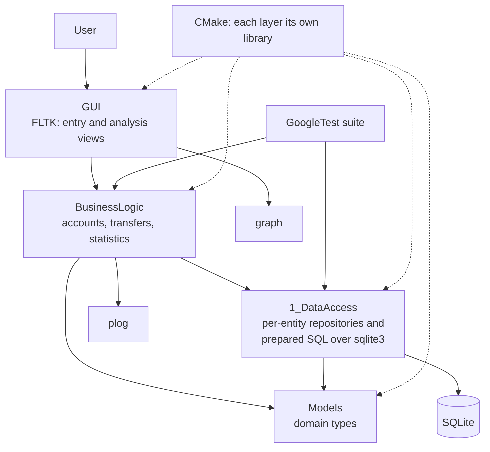

# Independent C++ Engineering Projects | May 2020 - September 2021

> Purpose: a finished interview reference and a source for CV/resume bullets. Contains only facts and conclusions accepted for external use.

## 01 Project Snapshot

| Field | Details |
|---|---|
| Product / system | A desktop personal-finance application in C++20, built from scratch in four layers; plus a systematic working-through of Stroustrup's *Programming: Principles and Practice Using C++*, Second Edition |
| Domain | Desktop application development, personal finance, C++ language and tooling practice |
| Period | May 2020 - September 2021; the application started 20 July 2020 |
| Context | The transition from MATLAB algorithm R&D into commercial C++ development, alongside EPAM's C++ mentoring programme and C++ laboratory |
| Role | Sole designer and developer |
| Target roles | C++ application development, roles where clean-slate design, testing discipline and build tooling matter |
| Team | Individual work, with an assigned EPAM mentor, Alexander Stepaniuk |
| Users / deployment | Windows desktop; published as public repositories |
| Main stack | C++20, FLTK, SQLite through the C API, magic_enum, GoogleTest 1.10, plog, CMake, CTest, Git, Visual Studio |
| Primary responsibility | Everything: architecture, storage, interface, tests, logging and build |
| Product status | Working application, published at `github.com/aliaksei-ivanou-by/Home_Accounting` (305 commits); exercises at `github.com/aliaksei-ivanou-by/Stroustrup_Programming` (141 commits) |
| Confidentiality | Entirely my own work; both repositories are public |

### 30-Second Summary

Between RIFTEK and joining EPAM I spent sixteen months, without formal employment, moving from more than seven years of MATLAB algorithm R&D into commercial C++. The structured part was EPAM's C++ mentoring programme from May 2020 to September 2021 and their C++ laboratory from March to September 2021. The practical part was my own work: a desktop personal-finance application in C++20 with an FLTK interface, SQLite storage, GoogleTest coverage, logging through plog and a CMake build, plus working through Stroustrup's exercises. EPAM hired me in September 2021 at the end of the programme.

### Two-Minute Overview

Moving from research code to production code is not a matter of learning syntax. In MATLAB I could assume the data fitted in memory, that I was the only person who would run the program, and that a failure meant a message in the console. None of that survives contact with an application someone else installs and uses. The point of this period was to close that distance deliberately rather than discover it on a client project.

The main piece of work was a personal-finance application. The domain was chosen for being familiar rather than impressive - accounts, transactions, categories, tags and spending analysis - because the interest was in building a complete application with every part I had previously not had to think about: a storage layer, a user interface, a test suite, structured logging, and a build that works on a machine that is not mine. It grew past the trivial: multiple accounts each in their own currency with one base currency behind them, every transaction converted to that base for balances and reporting, transfers between accounts with the rate adjustment applied, statistics by day type and by month with averages, and transactions carrying date, time, location, quantity, discount and notes alongside the amount.

The design decisions are the substance. SQLite as an embedded storage engine, so the application carries its data without requiring anything installed, driven through the sqlite3 C API with prepared statements inside a data-access layer that nothing above it sees through. FLTK for the interface, which is small and unopinionated and leaves the architecture to me. magic_enum for the enumerations, so category and currency values convert to and from text without a hand-maintained lookup table drifting out of step with the enum. GoogleTest from the start rather than retrofitted, which forced the logic to be separable from the interface - the single most useful constraint in the project. plog for logging, because an application a user runs has to be diagnosable when they report a problem and you cannot attach a debugger. CMake so the build is reproducible, with the runtime libraries pinned as git submodules and GoogleTest fetched by the build itself. One submodule, sqlite_orm, is the exception: it was added for a planned move off the hand-written SQL that I never carried out.

Alongside that I worked systematically through *Programming: Principles and Practice Using C++*, Second Edition, which covers the fundamentals, object orientation, templates and the standard library in a deliberately slow order. The solutions are published as their own repository, 141 commits of drills and exercises with the graphical ones built on FLTK. Doing that properly rather than skimming was worth it: coming from MATLAB, my instincts about memory, object lifetime and value semantics needed rebuilding rather than extending.

The structured part ran in parallel. EPAM's C++ mentoring programme lasted from May 2020 to September 2021 with an assigned mentor, and their C++ laboratory ran from March to September 2021. That combination - a programme setting direction, and my own project giving somewhere to apply it - is why the period ended in a job offer rather than in a certificate.

## 02 Context, Goals & Constraints

### Why This Period Exists

The RIFTEK contract ended in May 2020 after three months. That project had been my first commercial C++ work and had confirmed the direction, but three months is not a foundation. Rather than take the first available role, I spent the following sixteen months building the foundation properly.

### Goals

- Become fluent in modern C++ as a working language rather than as a second language after MATLAB.
- Build one complete application end to end, including the parts algorithm work never requires.
- Learn the surrounding practice: unit testing, structured logging, build systems, version control on my own work.
- Produce something public that demonstrates the above.
- Convert the EPAM mentoring programme into a commercial role.

### Constraints

- No team, no reviewer and no requirements from anyone else: every decision was mine, including the bad ones.
- No production pressure, which removes the most effective teacher of what matters. Discipline had to be self-imposed.
- Windows desktop, Visual Studio, and libraries small enough for one person to understand completely.
- A domain simple enough that the engineering stayed in focus.

### Success Criteria

- The application builds from a clean checkout and runs for someone who is not me.
- The model layer is covered by tests that run independently of the interface; the core transaction and repository logic remains an explicit coverage gap.
- A user-reported problem is diagnosable from the log.
- The code is public and readable.
- The period ends in a commercial C++ role.

## 03 System Architecture

Each of `Models`, `DataAccess`, `BusinessLogic`, `GUI`, `constants` and `graph` is a separate library target in the CMake build rather than a folder convention.

### Main Components

| Component | Responsibility | Contents |
|---|---|---|
| `3_GUI` | FLTK windows | `Window_Main`, plus `Window_AddAccount` and three transaction windows - expense, income and transfer |
| `2_BusinessLogic` | The application facade | One class, `FinanceRepository`: add, remove, get, set and find across every entity, plus `SumExpenses` / `SumIncomes` for today, this month and all time |
| `1_DataAccess` | Persistence and retrieval | Per-entity `*Repository` classes over per-entity `*Database` classes, with a shared `DatabaseManager` owning the connection |
| `0_Models` | Domain types | A `Model` base plus Account, Transaction, Currency, Category, Tag, Payee, Description, Comment, Status, Type and TimeDate |
| `constants`, `graph` | Shared constants; the FLTK drawing layer | `graph` is Stroustrup's PPP graphics library - `Point`, `gui_main()` - carried over from the book exercises into the application |
| SQLite | Embedded relational storage | Eight tables; `Transactions` carries fifteen columns and foreign keys into seven of them |
| magic_enum | Enum-to-text conversion | Categories, currencies and transaction kinds round-trip without a hand-maintained table |
| plog | Logging | `PLOG_INFO` on database open and on each insert or lookup, `PLOG_ERROR` carrying the SQLite error text on failure |
| GoogleTest 1.10 | Unit coverage | A `tests` target fetched by the build, registered with CTest through `gtest_discover_tests` |
| CMake | Build definition; one library target per layer | Reproducible build from a clean checkout |

### The Boundary That Mattered

The line between interface and logic is the one decision the whole project rests on. Testing the logic requires it to be reachable without the interface, and the moment that is true, the architecture separates on its own: the interface becomes a thin layer that gathers input and displays results, and everything worth testing sits behind it. Adopting GoogleTest at the start rather than later is what forced that, and it is the habit I carried directly into commercial work.

Each layer is its own library target, and the directories are numbered `0_Models`, `1_DataAccess`, `2_BusinessLogic`, `3_GUI`, so the intended direction of dependency is visible in the layout itself. It is a convention rather than a rule the build enforces - the executable links all four targets flat, so nothing stops a view reaching past the facade. Naming the layers made the discipline easy to keep; making the link graph itself refuse the shortcut is what I would do now.

## 04 Tech Stack & Technical Decisions

| Area | Technologies | Why | My depth |
|---|---|---|---|
| Language | C++20 | The target of the whole exercise; selected with `/std:c++latest`, the only way to get C++20 in Visual Studio 2019 until `/std:c++20` arrived in version 16.11 in September 2021 | Primary |
| Interface | FLTK | Small, unopinionated, leaves architecture decisions to me | Primary |
| Storage | SQLite, sqlite3 C API | Embedded, no installation, no server; prepared statements written by hand inside the data-access layer | Primary |
| Testing | GoogleTest 1.10, CTest | Unit coverage of the model layer, discovered automatically and registered with CTest | Primary |
| Logging | plog | Structured, lightweight, diagnosable in the field | Primary |
| Build | CMake | Reproducible builds | Primary |
| Reflection | magic_enum | Enum-to-text without hand-maintained tables | Applied |
| Dependencies | Git submodules; CMake FetchContent | Runtime libraries pinned at a commit; the test framework fetched by the build | Applied |
| Tooling | Git, GitHub, Visual Studio | Version control and development environment; 305 commits and 7 pull requests on the application, 141 on the exercises | Regular use |

### Decisions and Tradeoffs

| Decision | Alternative | Chosen approach | Tradeoff |
|---|---|---|---|
| Interface library | Qt | FLTK | A much smaller framework that does less for me, which is the point - the architecture stays mine and visible, at the cost of writing more by hand |
| Storage | Files, or a client-server database | SQLite | Real relational storage with transactions and no installation; not suited to concurrent multi-user access, which this application does not need |
| Testing | Add tests once the design settles | GoogleTest from the first feature | Slower initially, and it dictated a separable architecture - which was the actual goal |
| Logging | Print statements during development | plog throughout | Extra setup, and the application is diagnosable once it leaves my machine |
| Build | Visual Studio project files | CMake | More upfront work for a build that is reproducible and not tied to one IDE |
| Database access | An ORM layer over SQLite | The sqlite3 C API with prepared statements | Full control and no template-heavy dependency, at the cost of writing and maintaining the SQL and the binding by hand for every entity. The cost was real enough that I later planned a move to sqlite_orm and added it as a submodule; the migration was never carried out, so the submodule is in the build and unused |
| Dependencies | A package manager such as vcpkg or Conan | Git submodules for runtime libraries, FetchContent for GoogleTest | Every dependency pinned and the checkout self-contained, at the cost of manual updates and two mechanisms instead of one |
| Domain | Something technically impressive | Personal finance | Chosen for being familiar rather than impressive, so the engineering stayed in focus - though multi-currency accounts turned out to carry the one genuinely tricky rule in the project |

## 05 Role and Working Method

Sole developer, with an assigned mentor through EPAM's programme. The programme provided direction, review and a standard to meet; the project provided somewhere to apply it. Working without a team means nobody catches a bad decision for you, so the compensating discipline was to make the code reviewable - separable components, tests that document intent, and a build anyone can run.

## 06 Delivery, Testing & Quality

### Testing

- **Unit tests** over the model layer - a test file each for Account, Currency, Category, Tag, Payee, Description and Comment.
- **Wiring:** a separate `tests` target linking `Models`, `DataAccess` and `BusinessLogic` but not `GUI`, which is the practical proof that the logic is reachable without the interface. GoogleTest 1.10 is pulled in by CMake's FetchContent, and `gtest_discover_tests` registers every case with CTest automatically, labelled `unit`.
- **Test-first pressure on the architecture:** anything hard to test indicated a component doing too much, which is the most useful design feedback available when working alone.
- **Where the coverage stops:** the seven model types are covered; `Transaction` and the `FinanceRepository` facade above it are not. That is the wrong way round - the transfer and base-currency arithmetic is the part of this application where a silent error is actually possible, and it is the part with no test behind it.

### Diagnostics

Logging through plog, concentrated where failures actually originate - the data-access layer. `DatabaseManager` logs the database being opened and carries the SQLite error text on failure; each `*Database` class logs the insert or lookup it performs and logs `PLOG_ERROR` with the SQL error when a statement fails. The assumption behind it is that a problem would be reported by someone who could not reproduce it on demand and whose machine I could not attach a debugger to, so the log has to say which statement failed and why. That assumption is what distinguishes application code from a script.

### Build

CMake, verified from a clean checkout so the build did not depend on state on my machine, with `enable_testing()` so the suite runs through CTest. Source under Git and published on GitHub: 305 commits and 7 pull requests on the application, 141 commits on the book exercises.

## 07 Contributions

### Personal Finance Analytics Application

- **Starting point:** nothing - a clean slate, started 20 July 2020, which is rarer in commercial work than it sounds and is exactly why it was valuable.
- **My contribution:** designed and built the complete application over 305 commits and 7 pull requests: FLTK windows for accounts and for expense, income and transfer entry, a data-access layer over SQLite, the domain model and the analysis logic, a GoogleTest suite wired into CTest, plog logging and a CMake build with dependencies pinned as submodules.
- **Technical detail:** four layers, each its own library - `0_Models`, `1_DataAccess`, `2_BusinessLogic`, `3_GUI`. The model layer holds twelve types on a common `Model` base. Data access is two tiers: a `*Database` class per entity writing prepared SQL against the sqlite3 C API, and a `*Repository` class per entity above it, over a shared `DatabaseManager` that owns the connection; the schema is eight tables, with `Transactions` carrying fifteen columns and foreign keys into seven of them. Writing the binding by hand for eight entities is repetitive enough that I planned to move the layer onto sqlite_orm and added it as a submodule; the migration was never done, and the unused submodule is still in the build. `FinanceRepository` is the single facade the interface talks to - add, remove, get, set and find across every entity, find returning a tuple of outcome, index and object, plus expense and income sums for today, this month and all time. `main.cpp` is seven lines: construct the repository, hand it to `Window_Main` as a `shared_ptr`, run the FLTK loop. The domain's one genuinely tricky rule is money: accounts each hold their own currency over a single base currency, so every amount is converted for balances and reporting and a transfer has to apply the rate adjustment and leave both balances correct.
- **Result:** a working desktop application, published at `github.com/aliaksei-ivanou-by/Home_Accounting`.
- **Status:** delivered and public.

### Systematic C++ Foundations

- **Starting point:** more than seven years of MATLAB, three months of commercial C++.
- **My contribution:** worked through *Programming: Principles and Practice Using C++*, Second Edition, by Bjarne Stroustrup - fundamentals, object orientation, templates, the standard library and the advanced material - building the graphical exercises with FLTK. The drills and exercises are published as `github.com/aliaksei-ivanou-by/Stroustrup_Programming`, 141 commits.
- **Technical detail:** the parts that needed real attention were the ones MATLAB does not have: memory and object lifetime, value versus reference semantics, RAII, templates, and the standard library's containers and algorithms as a system rather than a list of functions.
- **Result:** fluency in the language as a working tool rather than as a translation from another one.
- **Status:** completed and public.

### EPAM C++ Mentoring Programme and Laboratory

- **Starting point:** a self-directed transition needs an external standard, or it drifts.
- **My contribution:** completed EPAM's C++ mentoring programme from May 2020 to September 2021 and their C++ laboratory from March to September 2021.
- **Technical detail:** the mentoring ran one to one with an assigned EPAM engineer, Alexander Stepaniuk, and regular scheduled meetings across sixteen months - my code and my decisions reviewed by someone working to a commercial standard, at an interval short enough that a bad habit was caught rather than compounded. That is the counterweight to working alone, where nothing corrects a habit that feels fine to the person who has it. The laboratory ran alongside the final phase, from March to September 2021, and led into the hiring decision.
- **Result:** hired by EPAM as a C++ engineer in September 2021.
- **Status:** completed. No certificates were issued for either programme, so this document and the work itself are the record.

## 08 Key Engineering Challenges

### 1. Rebuilding Instincts Rather Than Adding Knowledge

Coming from MATLAB, the difficulty was not learning what a pointer is - it was that my intuitions about memory, copying, ownership and lifetime were formed in a language where none of them are visible. Those had to be rebuilt rather than extended, which is slower and less satisfying than learning new material, and it is the real work in a language transition.

### 2. Self-Imposed Discipline Without Production Pressure

Nothing forces quality on a personal project. No deadline, no reviewer, no user, and no consequence for cutting a corner. The answer was to adopt the constraints externally - tests from the first feature, logging as though someone else would run it, a build that works from a clean checkout - and treat them as non-negotiable even when nothing enforced them.

### 3. Designing the Whole Thing

In algorithm work the surrounding structure is given and the interesting part is the algorithm. Here there was no surrounding structure. Deciding where the boundaries go - what the interface knows, what the logic owns, what the storage layer hides - was unfamiliar work, and getting it wrong is invisible until the design starts resisting a change.

### 4. Testing as a Design Tool

Using GoogleTest from the start changed what got built, not just what got verified. Every component that was awkward to test was a component doing too much, and that feedback is the closest thing to a code reviewer available when working alone.

### 5. Money That Has to Add Up Across Currencies

Every account holds its own currency and there is a base currency behind all of them, so a transfer is not a subtraction and an addition of the same number - it is two amounts related by a rate, and both balances plus every total reported in the base currency have to be right afterwards. Nothing in the application announces a fault here: the figures still look like money, the totals still render, and an error shows up only as a balance that quietly disagrees with reality. This is the one place in the project where tests are not a design aid but the only possible detector - and it is the place I did not write them, having covered the model types instead. Recognising that inversion afterwards is worth more than the coverage I did write: the effort went where testing was easy rather than where being wrong was silent.

### 6. Sustaining a Sixteen-Month Transition

The longest constraint was the period itself. Sustaining structured work for sixteen months without an employer is a different problem from any technical one in this project, and the combination that made it work was an external programme setting direction and a personal project giving the work somewhere to land.

## 09 Representative Interview Stories

### Letting Tests Dictate the Architecture

- **Situation:** starting the application, with no team and no external standard for what a good structure looked like.
- **Task:** arrive at an architecture that would survive being extended, without a reviewer to say when it was going wrong.
- **Actions:** adopted GoogleTest from the first feature rather than after the design settled. Every time a piece of logic turned out to be hard to test, treated that as a design signal rather than a testing inconvenience, and moved the boundary - which consistently meant pulling logic out of the interface and hiding storage details behind an interface.
- **Result:** an architecture where the interface is thin, the logic is independently testable, and SQLite specifics do not leak upward.
- **Tradeoff / lesson:** testability is a proxy for good boundaries. Working alone, it is the most reliable substitute for review, and I have applied it since on code that had reviewers.

### Building for a User Who Is Not Me

- **Situation:** the application only ever ran on my machine, where every problem was reproducible and a debugger was always available.
- **Task:** make it something someone else could install, run and report problems about.
- **Actions:** added structured logging through plog on the assumption the next failure would be described rather than demonstrated; moved the build to CMake and verified it from a clean checkout so it did not depend on state on my machine; kept the storage self-contained in SQLite so installation required nothing else.
- **Result:** an application that builds and runs elsewhere and produces evidence when it misbehaves.
- **Tradeoff / lesson:** the distance between a script and an application is mostly the parts that only matter when you are not the one running it. That is the concrete difference between research code and production code.

### Choosing the Boring Domain

- **Situation:** choosing what to build as a portfolio project during a career transition.
- **Task:** demonstrate engineering capability rather than domain novelty.
- **Actions:** chose personal finance - transaction entry, categorisation, spending analysis - because the domain rules are simple and uncontroversial, which put all the difficulty into architecture, storage, testing and tooling.
- **Result:** a project where the interesting parts are the engineering decisions, which is what it needed to demonstrate.
- **Tradeoff / lesson:** an ambitious domain in a solo project usually hides weak engineering behind an interesting description. A simple domain has nowhere to hide.

## 10 Outcomes and Impact

| Outcome | Engineering value |
|---|---|
| Complete C++20 desktop application in four layers, published publicly | Demonstrates end-to-end capability rather than isolated exercises |
| Architecture separating interface, logic and storage | The design habit that carried into every commercial project since |
| GoogleTest coverage written alongside the code | Testing as a design tool, not a verification step |
| Structured logging and reproducible CMake build | The practical difference between a script and an application |
| Stroustrup's course worked through systematically, published as its own repository | Fluency in modern C++ as a working language, with the work visible |
| EPAM C++ mentoring programme and laboratory completed | External standard and review during a solo transition |
| Hired as a C++ engineer in September 2021 | The transition completed |

### Resume-Ready Bullets

- Designed and built a C++20 desktop personal-finance application from scratch over 305 commits - a four-layer architecture from domain models through a per-entity data-access layer over SQLite to an FLTK interface, multi-currency accounts over a base currency with exchange-adjusted transfers, a GoogleTest suite registered with CTest, plog logging and a CMake build - published at `github.com/aliaksei-ivanou-by/Home_Accounting`.
- Structured the application so business logic and storage were independently testable, using test-driven pressure on the design as the primary architectural discipline while working without a team.
- Worked systematically through *Programming: Principles and Practice Using C++* (2nd edition), covering fundamentals, OOP, templates and the standard library, with graphical exercises built in FLTK, published at `github.com/aliaksei-ivanou-by/Stroustrup_Programming`.
- Completed EPAM's C++ mentoring programme (May 2020 - September 2021), sixteen months of one-to-one mentoring with regular code and design review, and their C++ laboratory (March - September 2021), joining EPAM as a C++ engineer in September 2021.

## 11 Tradeoffs, Lessons & Retrospective

### Tradeoffs

- FLTK over Qt gave a smaller framework and more hand-written code, keeping the architecture visible and mine.
- Tests from the first feature slowed early progress and dictated a separable design.
- CMake over IDE project files cost setup time and produced a build not tied to one machine.
- A deliberately simple domain gave less to talk about and more to demonstrate.
- Sixteen months without employment delayed income and produced a foundation that three months at RIFTEK had not.

### What I Learned

- What actually separates research code from application code: memory, lifetime, failure handling, diagnosability, and building for someone else's machine.
- That testability is the most reliable indicator of good boundaries, and the best available substitute for code review when working alone.
- Practical SQLite, CMake, GoogleTest and structured logging - all of which I have used since.
- That a personal project without external structure drifts, and that a programme with review is what keeps it honest.

### What I Would Improve Today

- Test `Transaction`, the transfers and the base-currency conversion first, and the simple model types second. The coverage I wrote follows what was easy to test rather than what was dangerous to get wrong.
- Either finish the move to sqlite_orm or take the submodule back out. An unused dependency sitting in the build is a statement of intent that the code does not support, and a reader finds it before they find anything I did well.
- Make the link graph carry the layering - `GUI` linking only `BusinessLogic`, and so on down - instead of relying on numbered directories and my own discipline.
- Set up continuous integration from the start, so the clean-checkout build is verified on every change rather than occasionally.
- Cover the data-access layer against a fixture database, which needs the SQL and the binding code separated from the connection handling first.
- Record the design decisions and their reasons alongside the documentation that is in the repository, so a reader can see why a boundary sits where it does rather than only what it is.
- Choose a cross-platform build target from the outset rather than defaulting to Windows, and move from `/std:c++latest` to the named `/std:c++20` once Visual Studio offered it, so the standard is pinned rather than following the compiler.

## 12 Interview Answer Kit

### Role-Specific Emphasis

- **C++ application roles:** complete application built alone, with architecture, testing, logging and build all owned.
- **Roles that value testing discipline:** GoogleTest from the first feature, used as a design tool rather than a verification step.
- **Explaining the career transition:** this is the concrete answer to how MATLAB R&D became commercial C++.
- **Self-direction:** sixteen months of structured self-directed work that ended in a job offer.

### Likely Follow-Up Questions

- **"What did you do between RIFTEK and EPAM?"** Moved into commercial C++ deliberately - EPAM's C++ mentoring programme from May 2020 to September 2021 and their laboratory from March to September 2021, alongside building a C++20 desktop application of my own and working through Stroustrup.
- **"What did you build?"** A personal-finance application in four layers - FLTK windows over a single `FinanceRepository` facade, over per-entity repositories and hand-written prepared SQL against the sqlite3 C API, with plog logging, a GoogleTest suite wired into CTest and a CMake build, 305 commits. It is public on GitHub as `Home_Accounting`, and the Stroustrup exercises are public separately as `Stroustrup_Programming`.
- **"What was the EPAM mentoring programme?"** Sixteen months of one-to-one mentoring with an assigned EPAM engineer and regular scheduled meetings, reviewing my code and my decisions against a commercial standard, with their C++ laboratory running from March to September 2021. It ended in an offer rather than a certificate - none was issued for either.
- **"There is an ORM submodule in the build that nothing uses - why?"** I wrote the data-access layer against the SQLite C API, and after eight entities of hand-written binding I decided an ORM would remove most of it. I added sqlite_orm and did not carry the migration through. It is unfinished work left visible, and the right fix is to finish it or remove it rather than explain it.
- **"Why such a simple domain?"** Deliberately. The domain rules are uncontroversial, so the difficulty sits in architecture, testing and tooling, which is what the project needed to demonstrate.
- **"Why FLTK rather than Qt?"** It is small and does little for you, so the architecture stays visible and mine. For commercial work I use Qt - first at RIFTEK in 2020, then across the embedded SIP platform at Innowise.
- **"How do you know the design is any good without a reviewer?"** Testability. Anything awkward to test was a component doing too much. That signal replaced review, and I still use it.
- **"Was the EPAM programme a job?"** No - training. EPAM hired me in September 2021, at the end of it. No certificates were issued for the programme or the laboratory.

### Glossary

- **FLTK:** a small cross-platform C++ GUI library.
- **SQLite:** an embedded relational database held in a single file, requiring no server.
- **GoogleTest:** Google's C++ unit-testing framework.
- **Repository pattern:** a class per entity exposing collection-like operations - add, remove, find - while hiding where the data actually lives.
- **Prepared statement:** a SQL statement compiled once by the database and then executed with bound values, rather than assembled as a string each time.
- **magic_enum:** a header-only C++17 library providing static reflection for enumerations, so enum values convert to and from text without a hand-written table.
- **plog:** a lightweight C++ logging library producing structured log output.
- **CMake:** a build-system generator that defines a build independently of any one IDE or compiler.
- **RAII:** resource acquisition is initialization - the C++ idiom tying resource lifetime to object lifetime.

## 13 Sources and Reference Material

### Repository / Project Sources

- EPAM C++ Mentoring Program, May 2020 - September 2021; EPAM C++ Laboratory, March - September 2021.
- `Certificates/C++ and Programming/2020 C++ Development Fundamentals - White Belt.pdf` - C++ Development Fundamentals: White Belt, Coursera / Moscow Institute of Physics and Technology, completed 4 March 2020, during the RIFTEK months and immediately before this period.
- `Certificates/C++ and Programming/2021 C++ Essential Training (2018) (1).pdf`, `Certificates/C++ and Programming/2021 C++ Essential Training (2018) (2).pdf`, `Certificates/C++ and Programming/2021 Learning C++ Pointers (1).pdf`, `Certificates/C++ and Programming/2021 Learning C++ Pointers (2).pdf`, `Certificates/C++ and Programming/2021 Nail Your C++ Interview.pdf`, `Certificates/C++ and Programming/2021 Introducing Functional Programming in C++.pdf`: LinkedIn Learning courses completed during this period. The `(1)` and `(2)` files are two certificate layouts for the same completed course.
- `github.com/aliaksei-ivanou-by/Coursera_Yandex_c-plus-plus-modern-development`: coursework from the Coursera C++ Modern Development specialization, the same family as the White Belt course above.

### Public Sources

- Home Accounting repository (305 commits, 7 pull requests): [https://github.com/aliaksei-ivanou-by/Home_Accounting](https://github.com/aliaksei-ivanou-by/Home_Accounting)
- Stroustrup_Programming repository (141 commits): [https://github.com/aliaksei-ivanou-by/Stroustrup_Programming](https://github.com/aliaksei-ivanou-by/Stroustrup_Programming)
- magic_enum: [https://github.com/Neargye/magic_enum](https://github.com/Neargye/magic_enum)
- FLTK: [https://www.fltk.org/](https://www.fltk.org/)
- SQLite: [https://www.sqlite.org/](https://www.sqlite.org/)
- GoogleTest: [https://google.github.io/googletest/](https://google.github.io/googletest/)
- plog: [https://github.com/SergiusTheBest/plog](https://github.com/SergiusTheBest/plog)
