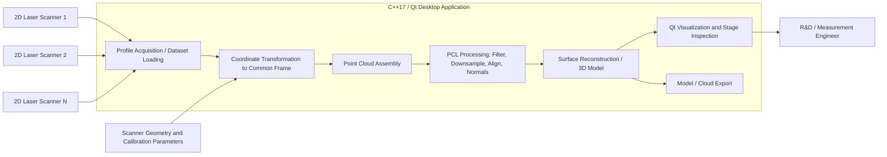

# Industrial 3D Scanning and Metrology Software | March 2020 - May 2020

> Purpose: a finished interview reference and a source for CV/resume bullets. Contains only facts and conclusions accepted for external use.

Quick routes through this document:

- **Recruiter / first answer:** sections 01, 10 and 12.
- **Technical interview:** sections 03, 07, 08 and 09.
- **Product and source context:** sections 02 and 13.

## 01 Project Snapshot

| Field | Details |
|---|---|
| Product / system | R&D software for building 3D models from the output of several standard RIFTEK 2D laser profile scanners |
| Domain | Industrial metrology, optoelectronic measurement, 3D reconstruction and point-cloud processing |
| Period | March 2020 - May 2020 |
| Delivery company / customer | RIFTEK, LLC - product company; software developed in-house for the company's own scanner products |
| Role | C++ Software Engineer, R&D-oriented application development |
| Target roles | C++ application and algorithm development, industrial software, computer vision, robotics and 3D data processing |
| Team | Small R&D group inside a product company: hardware and optics engineers, algorithm/research engineers and software developers |
| Users / deployment | Internal R&D and measurement engineers on Windows desktop workstations connected to scanner hardware |
| Main stack | C++17, Qt, Point Cloud Library (PCL), Open3D, CMake, Visual Studio, Git/GitHub |
| Primary responsibility | Desktop C++/Qt prototype that ingested multi-sensor 2D profile data, assembled it into a common 3D point cloud and produced a 3D model |
| Product status | R&D prototype and internal tooling, not a released commercial product line during my period |
| Confidentiality | Public company and product context plus non-customer-specific engineering detail; sensor calibration data, internal protocol details, customer identities and medical-application specifics remain confidential |

### 30-Second Summary

From March to May 2020 I worked at RIFTEK, a product company that develops and manufactures optoelectronic instruments for measuring geometrical quantities. This was my first commercial C++ role after seven years of MATLAB-based image-processing R&D. I built a C++17/Qt desktop prototype that took profile data from several of the company's standard 2D laser scanners, transformed the per-sensor profiles into one common coordinate frame and assembled them into a 3D point cloud and model using the Point Cloud Library. I also contributed briefly to an experimental configuration that combined two 2D scanners mounted in different planes into a 3D scanner for a medical application.

### Two-Minute Overview

RIFTEK manufactures laser triangulation sensors, 2D laser profile scanners and machine-vision systems used for dimensional measurement in industry. A single 2D scanner projects a laser line onto an object and returns the profile of that line - a cross-section, not a volume. The research question behind my work was straightforward to state and non-trivial to implement: given several such standard scanners observing the same object from different positions and orientations, produce one consistent 3D model.

My responsibility was the software side of that question. I wrote a C++17 desktop application on Qt that acquired or loaded profile data from multiple sensors, converted each sensor's profiles from its own local coordinate system into a shared frame using the scanner geometry, accumulated the result as a point cloud and applied Point Cloud Library operations - filtering, downsampling, alignment and surface reconstruction - to turn the accumulated points into a usable model. Open3D was used alongside PCL for comparison and visualization during evaluation.

The engineering difficulty was less about any single algorithm and more about the chain: a small error in the assumed sensor pose propagated into a visible doubling or smearing of surfaces in the merged cloud, so the prototype needed to make intermediate stages inspectable rather than presenting only a final mesh. Qt provided the interface for loading datasets, stepping through processing stages and viewing the cloud at each one.

A separate, smaller thread of the work looked at a two-scanner configuration for a medical application - two 2D scanners mounted in different planes so that their combined coverage produced a 3D surface of a body part, with prosthetics as the intended use. My involvement there was limited and exploratory, but it showed how the same reconstruction pipeline behaved with a minimal sensor count and an organic, non-industrial target surface.

The assignment was short. Its value was the transition it marked: from research-grade algorithm work in MATLAB to production-oriented C++ application development with a real build, real hardware data and a real user interface.

## 02 Context, Goals & Constraints

### Customer / Business Context

RIFTEK is a product company specializing in the development and manufacture of optoelectronic instruments for measuring geometrical quantities: laser triangulation displacement sensors, 2D laser profile scanners, 3D measurement systems and machine-vision solutions. Its products are used in industrial automation, quality control, welding automation, transport and railway measurement and similar domains, with distribution across many countries.

The company sells sensors, but customers increasingly want measurement results rather than raw profiles. Combining several existing 2D scanners into a 3D measurement setup was therefore a natural product direction: it reuses hardware the company already manufactures and moves the added value into software.

### Product and Users

The software supported this workflow:

1. Several standard RIFTEK 2D laser scanners, mounted in a fixed known arrangement, observed the object.
2. Each scanner produced a stream of 2D profiles in its own local coordinate system.
3. The application transformed each profile into a common 3D coordinate frame based on the scanner arrangement.
4. Accumulated points formed a point cloud representing the object surface.
5. Point-cloud processing - filtering, downsampling, alignment, normal estimation and surface reconstruction - produced a 3D model.
6. The Qt interface let an engineer load data, run and inspect stages and view the intermediate and final results.

The users were internal R&D and measurement engineers evaluating whether a multi-sensor arrangement could produce a model of sufficient quality, not end customers operating a finished product.

### Scope and Criticality

- The scope spanned sensor data ingestion, coordinate transformation, point-cloud assembly, 3D reconstruction and desktop visualization.
- Geometric correctness was the defining requirement: the product's entire value proposition is measurement accuracy, so a reconstruction that looked plausible but was geometrically wrong was worse than one that visibly failed.
- The work was R&D. Its purpose was to establish feasibility and a working C++ code path, not to ship a certified measurement product.
- The assignment lasted three months, which favored a working end-to-end prototype over a broad, polished framework.

### Problem and Goals

- Turn the output of several independent 2D profile scanners into one coherent 3D representation.
- Implement the pipeline in C++ rather than in a research environment, so it could later grow toward product code.
- Use an established point-cloud library instead of writing reconstruction primitives from scratch.
- Make each processing stage observable so that geometric errors could be attributed to a specific step.
- Provide a desktop interface usable by an engineer who was not the author of the code.

### Ownership Boundaries

- My primary responsibility was the C++/Qt application and the point-cloud processing pipeline inside it.
- Sensor hardware, optics, laser triangulation firmware and the scanners' own measurement accuracy were the company's hardware and firmware domain.
- Physical mounting, fixture design and the mechanical arrangement of the scanners were owned by hardware and mechanical engineers.
- Calibration methodology was developed jointly; I consumed the resulting geometric parameters in software.
- Medical-application requirements, clinical context and prosthetics domain knowledge came from outside my role; I contributed on the reconstruction side only.

### Constraints

- The sensors were standard production units, not instruments redesigned for this purpose. Their profile output format, sampling behavior and field of view were fixed inputs.
- Each scanner measured in its own coordinate system; the relationship between systems was an external parameter, not something the software could assume away.
- A 2D profile scanner sees only what its laser line reaches, so occlusion and incomplete coverage were inherent, not defects to be fixed in software.
- Windows desktop with Visual Studio was the development and target environment.
- Third-party library choices (PCL, Open3D, Qt) carried their own build, dependency and API constraints.
- Three months, and my first commercial C++ project - part of the period was necessarily spent building C++ and toolchain fluency alongside the deliverable.

### Cross-Cutting Requirements

- **Geometric correctness:** transformed points had to describe the true object surface; alignment errors had to be detectable rather than hidden by smoothing.
- **Observability:** intermediate stages had to be viewable, because a bad final mesh says nothing about which stage caused it.
- **Performance:** point clouds from continuous profile acquisition grow quickly, so filtering and downsampling had to keep the working set interactive on a desktop machine.
- **Maintainability:** the code was intended as a starting point for later product work, so the pipeline stages were kept separable rather than fused into one routine.
- **Reproducibility:** the same recorded dataset had to produce the same model, so that algorithm changes could be compared against a fixed input.

### Success Criteria

- Profile data from multiple scanners is combined into a single point cloud in a consistent coordinate frame.
- The resulting cloud visibly corresponds to the scanned object rather than to a superposition of misaligned surfaces.
- Reconstruction produces a 3D model that engineers can inspect and evaluate.
- Each stage of the pipeline can be run and viewed independently in the Qt application.
- The prototype runs on recorded datasets without hardware attached, enabling repeatable evaluation.

### Public Sources for Company and Product Context

- RIFTEK company site: [https://riftek.com/](https://riftek.com/)
- RIFTEK 2D laser profile scanners: [https://riftek.com/products/2D_scanners/](https://riftek.com/products/2D_scanners/)
- RIFTEK 3D laser scanning systems: [https://riftek.com/products/3D_laser_systems/](https://riftek.com/products/3D_laser_systems/)
- Point Cloud Library: [https://pointclouds.org/](https://pointclouds.org/)
- Open3D: [https://www.open3d.org/](https://www.open3d.org/)

## 03 System Architecture & Integration Boundaries

### Main Components and Data Flow

The application is a staged pipeline with an inspectable boundary between each stage. Profile data enters either from connected scanners or from recorded datasets, which keeps algorithm work independent of hardware availability. The transformation stage is where the multi-sensor arrangement is expressed: each sensor's profiles carry a pose, and the correctness of that pose determines whether the downstream cloud is a surface or a smear. Everything after that point operates on a single unified cloud, which is what makes a general-purpose library like PCL applicable at all. Visualization is not a final step but a tap on each stage, because that is how geometric faults are localized.

| Component | Responsibility / state | Interface | My involvement |
|---|---|---|---|
| Profile acquisition / dataset loading | Obtain 2D profiles from sensors or recorded files; owns raw per-sensor data | Scanner output format, files | Implemented the application-side ingestion and dataset handling |
| Coordinate transformation | Map each sensor's local profiles into the shared 3D frame; owns pose parameters | Geometric parameters from calibration | Implemented |
| Point cloud assembly | Accumulate transformed points into one cloud; owns the working cloud | PCL data structures | Implemented |
| Point-cloud processing | Filtering, downsampling, alignment, normal estimation | Point Cloud Library API | Implemented using PCL |
| Surface reconstruction | Produce a 3D model from the processed cloud | PCL / Open3D reconstruction | Implemented and evaluated alternatives |
| Qt application shell | Loading, stage control, visualization, export | Qt widgets and rendering | Implemented |
| Scanner hardware and firmware | Produce accurate profiles | Vendor interface | Consumer only; owned by hardware/firmware teams |
| Mounting geometry and calibration | Define real sensor poses | Physical setup, measured parameters | Consumed parameters; methodology shared with hardware/research engineers |

### External Integrations

- **RIFTEK 2D laser profile scanners** - standard production units; the software consumed their profile output rather than modifying their behavior.
- **Point Cloud Library** - the main processing dependency: cloud representation, filters, registration and surface reconstruction.
- **Open3D** - used alongside PCL for visualization and for comparing reconstruction results.
- **Qt** - desktop application framework and 3D viewing surface.
- **CMake / Visual Studio** - build and development environment for a dependency-heavy native project.

### State, Failure & Trust Boundaries

- The same surface point can exist as a raw profile sample, a transformed 3D point, a filtered cloud point and a mesh vertex; a defect visible in the mesh may originate at any of those stages.
- Sensor pose is the single most sensitive piece of state: it is external to the software, trusted by it, and small errors produce large, characteristic artifacts.
- Regions outside every sensor's line of sight produce holes rather than errors; the pipeline had to distinguish missing data from wrong data.
- Aggressive filtering can hide misalignment by averaging two offset surfaces into one plausible-looking surface - a failure mode where the software silently destroys the measurement value it exists to deliver.
- Reconstruction parameters affect the appearance of the model far more than its correctness, so visual quality was never accepted as evidence of geometric quality.

### Technical Ownership

**Direct implementation:**

- C++17 desktop application on Qt.
- Multi-sensor profile ingestion and dataset handling.
- Coordinate transformation and point-cloud assembly.
- PCL-based processing pipeline and surface reconstruction.
- Stage-by-stage visualization and export.

**Integration work:**

- Consumption of scanner profile output and geometric parameters.
- PCL, Open3D and Qt integration in a CMake/Visual Studio build.
- Evaluation of the pipeline on the two-scanner medical configuration.

**Adjacent platform areas:**

- Sensor optics, electronics and firmware.
- Mechanical mounting and fixture design.
- Calibration methodology ownership.
- Medical-application and prosthetics domain requirements.

## 04 Tech Stack & Technical Decisions

| Area | Technologies | Project use / constraint | My depth |
|---|---|---|---|
| Core implementation | C++17 | Application logic, pipeline stages, data handling | Primary |
| 3D data processing | Point Cloud Library (PCL) | Cloud representation, filtering, downsampling, registration, normals, surface reconstruction | Primary |
| Comparison / visualization | Open3D | Alternative processing and visualization for evaluation | Secondary |
| Desktop UI | Qt | Dataset loading, stage control, 3D viewing | Primary |
| Build / tooling | CMake, Visual Studio, Git, GitHub | Native build with heavy third-party dependencies; version control | Working use |
| Hardware input | RIFTEK 2D laser profile scanners | Fixed production sensors providing profile data | Integration consumer |

### Important Decisions and Tradeoffs

| Context / decision | Alternative | Chosen approach | Tradeoff | My role |
|---|---|---|---|---|
| 3D processing foundation | Implement filtering, registration and meshing from scratch | Build on Point Cloud Library | Gained mature, tested algorithms quickly; accepted PCL's build weight and API constraints | Proposed and implemented |
| Library evaluation | Commit to one library immediately | Use PCL as the main path and Open3D for comparison and visualization | Extra integration effort in exchange for evidence-based comparison of results | Implemented |
| Data source | Work only against live hardware | Support recorded datasets as a first-class input | Made algorithm work repeatable and hardware-independent; required dataset handling code | Proposed and implemented |
| Pipeline structure | One end-to-end reconstruction routine | Separate, individually runnable and viewable stages | More plumbing, far better fault localization and a cleaner base for later product work | Implemented |
| Alignment strategy | Rely on registration algorithms to correct arbitrary sensor placement | Use the known mounting geometry as the primary transformation, with cloud alignment as refinement | Depends on calibration quality but preserves absolute measurement meaning instead of producing a merely self-consistent cloud | Implemented |
| Interface | Command-line tool | Qt desktop application with 3D visualization | More UI work, but engineers could evaluate results without reading code | Implemented |

Qt, the sensor products and the Windows/Visual Studio environment were company constraints rather than personal architecture choices.

## 05 Team, Role & Ownership

### Team and Collaboration

RIFTEK is a product company, so the collaboration model was internal rather than client-facing: software developers worked next to the hardware, optics and research engineers who built and characterized the sensors. Questions about why a reconstruction looked wrong could be answered by walking over to the measurement setup, which is a different and much faster feedback loop than the outsourcing model I worked in afterwards. The 3D reconstruction work was a small R&D effort inside a larger product organization.

The medical two-scanner configuration involved people bringing the application requirements from outside the core industrial-metrology work; my participation there was as the reconstruction-software contributor, not as the owner of the medical use case.

### Responsibilities

- Implement and extend the C++/Qt reconstruction prototype.
- Transform multi-sensor profile data into a common coordinate frame.
- Apply and tune point-cloud processing and surface reconstruction.
- Make intermediate results inspectable for engineers evaluating feasibility.
- Compare library options and reconstruction approaches on real recorded data.
- Report back on which configurations produced usable models and where the limits were.

### Role Boundaries

- **Primary:** C++17 application, pipeline implementation and PCL-based processing.
- **Secondary:** Open3D evaluation, build and dependency management, exploratory work on the two-scanner medical configuration.
- **Integrated with:** scanner output, calibration parameters and the physical measurement setup.
- **Outside my responsibility:** sensor hardware and firmware, optics, mechanical design, calibration methodology ownership, medical and prosthetics domain requirements, product release decisions.

## 06 Delivery, Testing & Quality

### Development Process

Work was R&D-driven rather than ticket-driven: goals arrived as questions - can this arrangement produce a usable model, does this reconstruction method work better on this surface - and were answered by extending the prototype and running it on real data. Results were discussed directly with the engineers who owned the hardware side. Iteration was short: change the pipeline, run the recorded dataset, look at the cloud.

### Build and Deployment

The application was a native Windows desktop build - CMake and Visual Studio, with PCL, Open3D and Qt as third-party dependencies. There was no deployment in the product sense; the deliverable was a prototype that engineers ran on their own workstations against recorded datasets or a connected setup. Source was kept under Git.

### Test Strategy

- **Stage verification:** each pipeline stage was checked on its own output rather than only through the final model.
- **Known-geometry checks:** objects whose shape was known in advance made transformation errors visible - a flat surface that is not flat in the cloud is an unambiguous signal.
- **Recorded-dataset regression:** fixed datasets made it possible to tell whether a change improved the result or only changed it.
- **Cross-library comparison:** running comparable operations through PCL and Open3D provided an independent reading of a result.
- **Visual inspection:** for point clouds, direct viewing remains one of the most effective diagnostics, and the Qt interface existed largely to support it.
- **Hardware-in-the-loop:** live runs against the physical setup validated behavior that recorded data could not reproduce.

### Compatibility Matrix

| Producer / artifact | Consumer | Required behavior | Validation |
|---|---|---|---|
| Scanner profile output | Ingestion stage | Interpret profiles in the sensor's own coordinate system without distortion | Compare ingested profile against known object cross-section |
| Calibration / geometry parameters | Transformation stage | Place each sensor's points correctly in the shared frame | Overlap regions from different sensors must coincide, not double |
| Transformed points | Point cloud assembly | Preserve absolute geometry while accumulating | Measure known distances in the assembled cloud |
| Assembled cloud | PCL processing | Filtering and downsampling must not distort surface geometry | Compare processed and unprocessed clouds on known geometry |
| Processed cloud | Surface reconstruction | Produce a model that follows the measured surface rather than smoothing it away | Visual and dimensional inspection against the physical object |
| Recorded dataset | Later pipeline version | Same input yields comparable output | Re-run fixed datasets after changes |

### Observability and Debugging

Debugging 3D reconstruction is primarily visual, because the data is geometric and the failure modes have distinctive shapes: doubled surfaces indicate a pose error, a shifted patch indicates one sensor's transformation, holes indicate occlusion or coverage limits, and noise clouds indicate reflective or dark surfaces defeating triangulation. The application therefore exposed the cloud at each stage, point counts per stage, and the ability to include or exclude individual sensors - isolating a single sensor is the fastest way to decide whether a problem belongs to one sensor's data or to the combination.

### Reliability, Security & Performance Validation

- Point-cloud size was controlled through voxel downsampling and filtering so that the prototype stayed interactive on desktop hardware.
- Processing operated on recorded data without hardware, keeping evaluation possible independent of lab availability.
- No customer data, personal data or credentials were involved on the industrial side; the medical configuration's data handling remained within the company's internal scope.

## 07 Contributions

### Multi-Sensor Profile Ingestion and Coordinate Transformation

- **Starting point:** several standard 2D scanners, each producing profiles in its own local coordinate system, with no software that combined them.
- **My contribution:** implemented the ingestion path for multiple sensors and the transformation of each sensor's profiles into one shared 3D coordinate frame based on the known mounting geometry.
- **Technical detail:** each profile is a set of 2D points in a sensor-local plane; placing it in 3D requires the sensor pose and the scan geometry. Handling this per-sensor, with the pose as explicit data rather than embedded constants, allowed the arrangement to be changed without rewriting the pipeline.
- **Result:** profile streams from independent sensors combined into a single point cloud with consistent absolute geometry.
- **Status:** working prototype implementation.

### Point-Cloud Processing Pipeline with PCL

- **Starting point:** an accumulated raw cloud, large, noisy and unsuited to direct reconstruction.
- **My contribution:** built the processing pipeline - filtering, voxel downsampling, outlier removal, normal estimation and alignment refinement - using Point Cloud Library.
- **Technical detail:** parameter choice was the substance of the work rather than the API calls. Downsampling too aggressively erases the geometric detail the measurement exists to capture; too little leaves the cloud unmanageable and the reconstruction noisy. Separating the stages made the effect of each parameter observable in isolation.
- **Result:** a repeatable path from raw accumulated points to a cloud suitable for surface reconstruction.
- **Status:** working prototype implementation.

### 3D Model Reconstruction and Library Evaluation

- **Starting point:** no established in-house answer to which reconstruction approach or library suited this data.
- **My contribution:** implemented surface reconstruction on the processed cloud and evaluated PCL against Open3D on real recorded datasets.
- **Technical detail:** the interesting differences appeared at the edges - incomplete coverage, thin features and surfaces at oblique angles to the laser line - rather than on well-covered regions where any reasonable method works.
- **Result:** produced 3D models from multi-sensor data and provided an evidence-based comparison rather than a preference-based library choice.
- **Status:** prototype and evaluation.

### Qt Desktop Application

- **Starting point:** algorithm code usable only by its author.
- **My contribution:** built a Qt desktop application for loading datasets, running and inspecting individual pipeline stages, viewing clouds and models in 3D and exporting results.
- **Technical detail:** the interface was designed around fault localization - viewing intermediate state, toggling individual sensors, comparing stages - rather than around a single end-to-end button.
- **Result:** engineers who had not written the code could evaluate reconstruction results themselves.
- **Status:** working prototype implementation.

### Two-Scanner Medical Configuration (Limited Contribution)

- **Starting point:** an exploratory idea to build a 3D scanner from two 2D scanners mounted in different planes, aimed at a medical application, with prosthetics as the intended use.
- **My contribution:** a small, exploratory contribution - applying the existing reconstruction pipeline to this minimal two-sensor configuration and observing how it behaved.
- **Technical detail:** for this fixed multi-view scanner design, two sensors mounted in different planes were the minimum configuration selected to obtain the required 3D surface coverage without relying on scanning motion. Coverage and occlusion therefore dominated: the placement of the two planes determined what could be reconstructed at all, and an organic, curved, non-industrial surface behaved differently from a machined part under laser triangulation.
- **Result:** confirmed that the same pipeline applied to the two-scanner case and surfaced where coverage, not algorithms, was the limiting factor.
- **Status:** exploratory R&D; I was one contributor and not the owner of this configuration.

### Transition from Research Code to Commercial C++

- **Starting point:** seven years of image-processing algorithm work in MATLAB; this was my first commercial C++ role.
- **My contribution:** implemented the reconstruction work directly in C++17 with a real build system, third-party dependency management, version control and a desktop UI.
- **Technical detail:** the shift is not about syntax. Research code can assume data fits in memory, that the author runs it and that a failure is a message in the console. Application code has to manage memory explicitly, handle datasets that do not fit comfortably, present failures to a user and survive being built by someone else.
- **Result:** algorithm work became a deliverable application, and this project became the bridge to my subsequent commercial C++ career.
- **Status:** delivered.

## 08 Key Engineering Challenges

### 1. Error Propagation from Sensor Pose into Reconstruction

Every point's 3D position depends on an externally supplied sensor pose. A small angular error there is invisible in the input and unmistakable in the output, appearing as doubled or smeared surfaces in overlap regions. The insight was that overlap regions are the diagnostic: where two sensors see the same surface, they must agree, and any disagreement quantifies the pose error rather than merely indicating one. This also drove the decision to keep the known mounting geometry as the primary transformation, with cloud alignment only as refinement - letting registration silently absorb a real geometric error would have produced a self-consistent cloud that no longer meant anything in absolute terms.

### 2. Occlusion and Coverage as a Physical, Not Software, Limit

A laser line reaches what it reaches. Undercuts, steep angles and shadowed regions produce no data, and no reconstruction algorithm can invent it - it can only interpolate plausibly, which in a measurement context is the wrong answer presented convincingly. Distinguishing "not measured" from "measured as flat" was a recurring concern, and it shaped how reconstruction output was presented and interpreted.

### 3. Filtering Parameters That Trade Measurement Value for Appearance

Point-cloud filtering has a seductive failure mode: stronger smoothing and coarser downsampling almost always make the model look better while making it mean less. On a product whose value is dimensional accuracy, that tradeoff had to be made deliberately and with the geometric consequence understood, rather than tuned until the render looked clean.

### 4. A Two-Scanner Configuration for an Organic Target

The medical configuration used the minimum two-sensor arrangement chosen for that fixed multi-view scanner design with a particularly uncooperative surface type. Human anatomy is curved, soft and varied in optical properties, and two planes leave large uncovered regions. The engineering lesson - reached quickly, given my limited involvement - was that the binding constraint there was sensor placement and coverage geometry, not reconstruction algorithms.

### 5. Native Build Complexity with Heavy Dependencies

PCL, Open3D and Qt together form a substantial dependency graph on Windows. Getting a reproducible CMake/Visual Studio build was a real part of the work and my first sustained encounter with native dependency management - a skill that transferred directly to every C++ project afterwards.

### 6. Becoming Productive in Commercial C++ in Three Months

The assignment required delivering working software in a language I had not used commercially, on an unfamiliar library stack, in a short window. The approach that worked was to keep the pipeline decomposed so that each piece could be built, run and understood independently, rather than attempting a complete design before having a running program.

## 09 Representative Interview Stories

### Diagnosing a Doubled Surface in the Merged Cloud

- **Situation:** the merged point cloud showed a surface that appeared twice, slightly offset, where two sensors' coverage overlapped.
- **Task:** determine whether the fault lay in one sensor's data, in the transformation, or in the assumed geometry - and do so without simply smoothing it away.
- **Actions:** rendered each sensor's contribution separately in the application, confirmed each individual cloud was internally consistent, then compared their overlap region to characterize the offset. The signature - consistent within each sensor, offset between them - pointed at the pose parameters rather than at the sensors or the processing.
- **Result:** the discrepancy was attributed to the assumed sensor geometry and addressed at that level, preserving the absolute correctness of the cloud.
- **Tradeoff / lesson:** registration algorithms can make a wrong cloud look right. On a measurement product, diagnosing the geometric cause is not a purist preference - it is the difference between a model and a measurement.

### Choosing Filter Parameters Against the Instinct to Make It Look Good

- **Situation:** raw accumulated clouds were large and noisy; stronger filtering and downsampling produced visibly cleaner models.
- **Task:** choose parameters that kept the pipeline workable without discarding the geometric detail the sensors were built to capture.
- **Actions:** compared processed and unprocessed clouds on objects of known geometry, checked measurable features rather than overall appearance, and treated each filtering stage as a separately observable step instead of one tuned block.
- **Result:** settled on parameters that kept processing interactive while preserving the features that mattered, with the cost of each stage understood rather than assumed.
- **Tradeoff / lesson:** in metrology software, visual quality and measurement quality can point in opposite directions, and the render is the less trustworthy of the two.

### Building the Interface Around Fault Localization

- **Situation:** early on, the pipeline produced a final model and little else, so a bad result gave no information about which stage caused it.
- **Task:** make the prototype useful to engineers who needed to evaluate feasibility, not just produce output.
- **Actions:** restructured the application so each stage's output could be viewed, individual sensors could be included or excluded and recorded datasets could be replayed, then built the Qt interface around those capabilities.
- **Result:** evaluation shifted from "the model looks wrong" to "sensor 2's contribution is offset after transformation," and other engineers could reach that conclusion without me.
- **Tradeoff / lesson:** for a pipeline of geometric transformations, observability between stages is worth more than any single stage's sophistication.

### Applying the Pipeline to a Two-Scanner Medical Setup

- **Situation:** an exploratory configuration used two 2D scanners in different planes to build a 3D scanner for a medical application, with prosthetics as the intended use.
- **Task:** contribute on the reconstruction side and see how the existing pipeline behaved with a minimal sensor count and an organic target surface.
- **Actions:** ran the pipeline on the two-sensor arrangement, examined coverage and the character of the resulting cloud, and compared the failure modes against the industrial datasets.
- **Result:** established that the pipeline transferred, and that the limiting factor in this configuration was sensor placement and coverage rather than algorithm choice.
- **Tradeoff / lesson:** a reconstruction pipeline is only as good as what the sensors physically see; with a minimal arrangement, geometry of placement is the design decision that matters most. My involvement here was brief, and I present it as such.

## 10 Outcomes and Impact

| Outcome | Engineering / user value | Source |
|---|---|---|
| C++17/Qt prototype producing 3D models from multiple 2D laser scanners | Demonstrated that existing standard sensors could be combined into a 3D measurement setup in software | First-hand project record |
| Multi-sensor coordinate transformation and point-cloud assembly | Established the core geometric path from per-sensor profiles to one absolute 3D representation | First-hand project record |
| PCL-based processing pipeline with separable, inspectable stages | Made reconstruction faults localizable and gave later work a structured starting point | First-hand project record |
| PCL and Open3D evaluated on real data | Replaced a preference-based library choice with an evidence-based one | First-hand project record |
| Desktop application usable by non-authors | Let engineers evaluate feasibility independently | First-hand project record |
| Contribution to a two-scanner medical configuration | Showed the pipeline transferred to a minimal-sensor, organic-surface case intended for prosthetics | First-hand project record |
| Transition from MATLAB research to commercial C++ | Converted seven years of algorithm experience into production-oriented C++ practice | First-hand record |

### Resume-Ready Bullets

- Developed a C++17/Qt R&D prototype that generated 3D models from the profile output of multiple standard 2D laser scanners, implementing multi-sensor coordinate transformation, point-cloud assembly and surface reconstruction with the Point Cloud Library.
- Built a staged, individually inspectable point-cloud processing pipeline (filtering, downsampling, outlier removal, normal estimation, alignment) that made geometric reconstruction faults localizable to a specific stage or sensor.
- Evaluated Point Cloud Library against Open3D on recorded multi-sensor datasets, basing the library decision on measured reconstruction behavior on real industrial data.
- Implemented a Qt desktop application with 3D visualization and per-stage inspection, enabling engineers outside the codebase to evaluate reconstruction feasibility independently.
- Contributed to an exploratory medical 3D scanning configuration combining two 2D scanners in different planes, intended for prosthetics applications.
- Transitioned from MATLAB-based image-processing R&D to commercial C++ development, delivering the reconstruction work as a native application with CMake/Visual Studio builds and heavy third-party dependencies.

## 11 Tradeoffs, Lessons & Retrospective

### Tradeoffs

- Building on PCL delivered mature algorithms quickly while accepting a heavy dependency and its API constraints.
- Using the known mounting geometry as the primary transformation preserved absolute measurement meaning at the cost of depending on calibration quality.
- Separating the pipeline into individually runnable stages added plumbing but made faults attributable.
- Supporting recorded datasets cost extra code and bought repeatable, hardware-independent evaluation.
- A Qt interface consumed time that could have gone into algorithms, and made the result usable by people other than me.
- Conservative filtering kept clouds noisier and preserved the geometric detail the product exists to measure.

### What I Learned

- How a laser profile scanner's output becomes 3D geometry, and how sensitive that conversion is to the assumed sensor pose.
- That in geometric pipelines, overlap regions are the most informative diagnostic available.
- That measurement software and visualization software have different definitions of a good result, and conflating them is a real failure mode.
- Practical Point Cloud Library use: filtering, downsampling, registration, normals and surface reconstruction on real data rather than tutorial data.
- Native C++ dependency and build management on Windows.
- How much faster engineering moves inside a product company, where the hardware and the people who built it are in the same building.
- That my MATLAB algorithm background transferred well; what had to be learned was software engineering around the algorithms, not the algorithms themselves.

### Mistakes and Course Corrections

- I initially treated the reconstruction as one end-to-end operation. The first genuinely wrong-looking model produced no information about its cause, which led directly to restructuring the pipeline into separately runnable and viewable stages - the single most useful change in the project.
- I was initially inclined to judge results by how the rendered model looked. Checking against objects of known geometry corrected that: appearance and correctness are independent, and only one of them is the deliverable.

### What I Would Improve Today

- Add automated regression on fixed datasets with numeric geometric metrics, so pipeline changes are assessed by measurement rather than by eye.
- Build synthetic test data with exactly known geometry and known sensor poses, to separate algorithm errors from calibration errors conclusively.
- Cover the transformation mathematics with unit tests rather than relying on visual confirmation.
- Represent and propagate per-point confidence, so that interpolated regions are distinguishable from measured ones in the final model.
- Treat coverage analysis as a first-class step: given a sensor arrangement, predict what cannot be measured before scanning rather than discovering it afterwards.
- Set up a reproducible dependency and build configuration from day one instead of resolving it incrementally.

## 12 Interview Answer Kit

### Role-Specific Emphasis

- **C++ application development:** the C++17/Qt prototype, staged pipeline design and native build with heavy dependencies; the doubled-surface diagnosis story.
- **Computer vision / 3D data processing:** multi-sensor transformation, PCL processing and surface reconstruction; the filtering-parameter story.
- **Industrial / metrology software:** the distinction between a model that looks right and one that measures right; correctness-first decisions on alignment and filtering.
- **Robotics and sensor fusion:** combining multiple sensors with known poses into one coherent spatial representation, and reasoning about coverage and occlusion.
- **R&D engineering:** feasibility work on a short timeline, evidence-based library evaluation and making results inspectable for other engineers.

### Strongest Technical Deep Dives

- How 2D profile data from multiple laser scanners becomes a single 3D point cloud, and why sensor pose dominates the error budget.
- Why known mounting geometry was the primary transformation and cloud registration only a refinement.
- Point-cloud filtering and downsampling as a measurement tradeoff rather than a cosmetic one.
- Designing a pipeline for fault localization across stages and sensors.
- PCL versus Open3D on real industrial data, and where the differences actually appeared.
- The practical differences between research algorithm code and commercial application code.

### Likely Follow-Up Questions

- **What did the software do?** It combined the profile output of several standard RIFTEK 2D laser scanners into a single 3D point cloud and reconstructed a 3D model from it, in a C++17/Qt desktop application.
- **Were the scanners custom-built for this?** No. They were RIFTEK's standard production 2D laser profile scanners. The work was in combining their output, not in the sensors.
- **How many sensors?** The general work targeted several sensors in a known arrangement. The medical configuration I contributed to briefly used two, mounted in different planes.
- **What was the medical project?** An exploratory configuration combining two 2D scanners into a 3D scanner for a medical application, with prosthetics as the intended use. My contribution there was small and on the reconstruction side; I did not own the medical requirements.
- **What was the hardest part?** Sensor pose error. It is invisible in the input, obvious in the output, and easy to hide with registration or filtering in a way that destroys the measurement's meaning.
- **Why PCL?** Mature, widely used algorithms for exactly this data type. I used Open3D alongside it for comparison and visualization rather than assuming PCL was best.
- **Was it released as a product?** No. It was an R&D prototype and internal tooling; the deliverable was working software and a feasibility answer.
- **It was only three months - what does it demonstrate?** It was my first commercial C++ role, and it is where seven years of MATLAB algorithm work became production-oriented C++: a real build, real dependencies, a real UI and real hardware data.
- **How did you test something like this?** Objects of known geometry, fixed recorded datasets replayed after changes, per-sensor isolation, cross-library comparison and direct visual inspection of every stage.

### Confidentiality Boundaries

- The company's public product profile, the technology stack, the architecture and pipeline approach, the engineering challenges and my personal contributions are all describable.
- Calibration data and methodology detail, internal protocol and data-format specifics, source code, internal project naming, end-customer identities and the specifics of the medical application are confidential.
- The medical configuration was a limited exploratory contribution, and section 07 describes it as one.

### Glossary

- **2D laser profile scanner:** a sensor that projects a laser line onto an object and returns the profile - the cross-section - of the surface along that line.
- **Laser triangulation:** measuring distance from the position of a reflected laser spot or line on a detector at a known angle to the emitter.
- **Point cloud:** a set of 3D points representing measured surface locations.
- **Coordinate transformation:** mapping points from a sensor's own coordinate system into a shared reference frame using the sensor's known position and orientation.
- **Registration / alignment:** adjusting the relative placement of point sets so overlapping regions coincide.
- **Voxel downsampling:** reducing point count by keeping one representative point per small volume cell.
- **Surface reconstruction:** producing a continuous surface or mesh from a point cloud.
- **Occlusion:** surface regions no sensor can see, which produce missing data rather than incorrect data.
- **PCL (Point Cloud Library):** an open-source C++ library for 3D point-cloud processing.
- **Open3D:** an open-source library for 3D data processing and visualization.

## 13 Sources and Reference Material

### Repository / Project Sources

- `SelfIntro.md`: RIFTEK as the first commercial C++ role; C++17/Qt/PCL; industrial metrology and 3D reconstruction prototype processing real measurement and geometry data.
- Current project account: standard production 2D scanners as the sensor basis, and the two-scanner medical configuration intended for prosthetics.

### Public Sources

- RIFTEK company site: [https://riftek.com/](https://riftek.com/)
- RIFTEK 2D laser profile scanners: [https://riftek.com/products/2D_scanners/](https://riftek.com/products/2D_scanners/)
- RIFTEK 3D laser scanning systems: [https://riftek.com/products/3D_laser_systems/](https://riftek.com/products/3D_laser_systems/)
- Point Cloud Library: [https://pointclouds.org/](https://pointclouds.org/)
- Open3D: [https://www.open3d.org/](https://www.open3d.org/)
- Qt: [https://www.qt.io/](https://www.qt.io/)

| Claim | Source | Disclosure |
|---|---|---|
| Employment period March 2020 - May 2020 | First-hand record | Public |
| RIFTEK develops and manufactures optoelectronic instruments for measuring geometrical quantities, including laser sensors and 2D/3D scanners | First-hand record; [riftek.com](https://riftek.com/) | Public |
| RIFTEK 2D laser scanners use laser triangulation and produce surface profiles | [riftek.com/products/2D_scanners/](https://riftek.com/products/2D_scanners/) | Public |
| Software generated 3D models from several 2D laser sensors | First-hand record | Public |
| Stack: C++17, Qt, Point Cloud Library, Open3D, Visual Studio, Git | First-hand record | Public |
| R&D prototype facilitating the transition from MATLAB-based research to C++ production code | First-hand record; SelfIntro | Public |
| Sensors were standard RIFTEK production 2D scanners | First-hand project account | Safe internal |
| Two 2D scanners in different planes formed an exploratory 3D scanner for a medical application, intended for prosthetics | First-hand project account | Safe internal, at this level of generality |
| Team, workflow and internal R&D collaboration details | First-hand project account | Safe internal |
| Calibration data, internal formats, source code, customer identities, medical-application specifics | - | Confidential |
