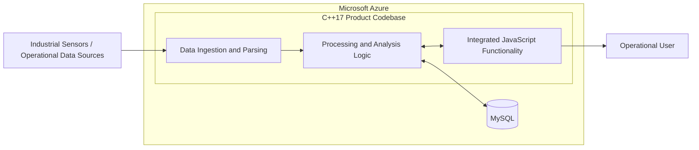

# Oil & Gas Corporate System | October 2021 - December 2021

Quick routes through this document:

- **Recruiter / first answer:** sections 01, 10 and 12.
- **Technical interview:** sections 03, 07, 08 and 09.
- **Customer and source context:** sections 02 and 13.

## 01 Project Snapshot

| Field | Details |
|---|---|
| Product / system | Corporate industrial-data system for Schlumberger |
| Domain | Oil and gas, sensor-data processing and operational analysis |
| Period | October 2021 - December 2021 |
| Delivery company / customer | EPAM delivery team for Schlumberger, now SLB |
| Role | Junior Software Engineer; primarily C++ developer with occasional JavaScript work |
| Target roles | C++ backend, industrial data processing, enterprise systems and cloud-hosted applications |
| Team | 5 EPAM C++ developers, an external QA team in India and customer representatives in the United States |
| Users / deployment | Oil-and-gas specialists working with operational and sensor-derived data; application hosted in Microsoft Azure |
| Main stack | C++17, JavaScript, MySQL and Microsoft Azure |
| Primary responsibility | C++ feature development, defect correction, refactoring and removal of obsolete code; occasional JavaScript changes |
| Product status | Established corporate system under active maintenance and development |
| Confidentiality | Describe the business purpose and engineering work without exposing source code, private data, credentials, endpoints or infrastructure identifiers |

### 30-Second Summary

From October to December 2021, I worked at EPAM on a corporate oil-and-gas system for Schlumberger. The application received industrial sensor data, processed and analyzed it in a C++17 backend, stored results in MySQL and exposed user-facing functionality through JavaScript integrated into the product codebase. I mainly implemented requested C++ changes, fixed defects, simplified legacy code and removed obsolete components. I also changed JavaScript when a task crossed the backend and user-facing layers. The system ran in Microsoft Azure and was tested by a separate QA team in India.

### Two-Minute Overview

The project was an established corporate system used to process operational data in the oil-and-gas domain. Incoming measurements from industrial sensors passed through C++ parsing and analysis logic, and the resulting data was stored in MySQL for later access through the application. JavaScript provided user-facing and integration functionality inside the C++ product codebase, while Microsoft Azure hosted the runtime environment.

My primary area was C++17. I worked on customer-requested features, defect correction and focused modernization of inherited code. The codebase already contained legacy paths and components, so changes had to preserve existing behavior while making the affected area easier to maintain. Part of that work involved simplifying complicated logic and removing obsolete code instead of expanding it with additional special cases.

I occasionally worked in JavaScript when a feature or defect crossed the boundary between backend processing and the user-facing layer. This required following data from its C++ representation through persistence and into the behavior visible to the user, rather than treating the languages as unrelated parts of the system.

The EPAM development team consisted of five C++ engineers. A separate QA organization in India handled functional and regression testing, while customer representatives were based in the United States. The short assignment required quick onboarding, focused changes and clear handoff to a distributed test and customer organization.

## 02 Context, Goals & Constraints

### Customer / Business Context

Schlumberger was the customer name during the project period. The company adopted the SLB brand in October 2022. It develops technology and digital solutions for energy operations, including systems that collect, manage and analyze large volumes of operational data.

Schlumberger had an established strategic relationship with Microsoft around Azure-based energy platforms before this assignment. The project's Azure deployment fit that broader cloud direction, while my responsibility remained in application development rather than cloud-platform administration.

### Product and Users

The product supported a data-processing workflow for oil-and-gas operations:

1. Industrial sensors or upstream acquisition systems produced operational measurements.
2. C++ code parsed and processed the incoming data.
3. Business and analysis logic derived the values required by the application.
4. MySQL stored source and processed information.
5. JavaScript-based functionality exposed the data through the product's user-facing workflows.

The users worked with operational data and analysis results rather than raw application internals. The software therefore had to preserve data correctness across ingestion, processing, persistence and presentation.

### Scope and Criticality

- The engineering scope crossed native C++, JavaScript, relational persistence and an Azure-hosted runtime.
- Processing defects could lead to incorrect or missing operational information in the application.
- Database and presentation behavior depended on the results produced by the C++ layer.
- The codebase was already established, so compatibility and regression control were central constraints.
- Development, QA and customer collaboration crossed multiple organizations and time zones.
- The assignment lasted three months and favored focused improvements over broad architectural replacement.

### Problem and Goals

- Maintain and improve an established C++17 system.
- Implement customer-requested functionality.
- Diagnose and correct defects in C++ and JavaScript.
- Simplify difficult code and remove obsolete components.
- Preserve the data flow from sensor input through analysis and MySQL persistence.
- Keep backend results and JavaScript-visible behavior consistent.
- Deliver changes in a form that the external QA team could validate.

### Ownership Boundaries

- My main responsibility was application development in C++17.
- JavaScript was a secondary contribution area used when the complete task crossed language boundaries.
- I worked with MySQL-backed behavior from the application side.
- Azure was the inherited hosting environment; cloud architecture and administration belonged outside my role.
- Sensor hardware, acquisition infrastructure and product-level architecture were customer/platform responsibilities.
- QA execution was owned by the external test team, while I reproduced defects, implemented corrections and supported validation.

### Constraints

- The main architecture and technology choices were inherited.
- Existing customer workflows had to continue working after each change.
- A C++ change could affect stored data or JavaScript behavior even when the local code compiled correctly.
- Legacy components required dependency analysis before simplification or removal.
- Distributed testing made reproducible inputs and clear expected behavior important.
- The short project duration required incremental delivery and quick understanding of unfamiliar code.

### Cross-Cutting Requirements

- **Correctness:** parsed, calculated, stored and displayed values had to describe the same operational event.
- **Reliability:** fixes had to restore behavior without introducing regressions in established workflows.
- **Maintainability:** new work should reduce unnecessary complexity rather than extend obsolete paths.
- **Compatibility:** C++, JavaScript and MySQL representations had to remain aligned.
- **Data integrity:** persistence changes had to preserve existing records and application semantics.
- **Security:** customer data and Azure configuration remained inside the project's established access controls.

### Success Criteria

- Requested behavior is implemented in the appropriate C++ and JavaScript layers.
- Processed data is stored and retrieved consistently through MySQL.
- User-facing results match the values produced by the backend.
- Existing workflows continue to operate after refactoring or code removal.
- The external QA team can reproduce the original issue and validate the corrected behavior.
- Changes remain focused enough to review and deliver during the short assignment.

### Public Sources for Customer Context

- SLB, company rename from Schlumberger in October 2022: [https://www.slb.com/newsroom/press-release/2022/pr-2022-10-24-schlumberger-becomes-slb](https://www.slb.com/newsroom/press-release/2022/pr-2022-10-24-schlumberger-becomes-slb)
- Schlumberger and Microsoft, 2021 Azure energy-data partnership: [https://www.slb.com/newsroom/press-release/2021/pr-2021-0329-slb-ms-osdu](https://www.slb.com/newsroom/press-release/2021/pr-2021-0329-slb-ms-osdu)
- EPAM, oil-and-gas digital-platform engineering case study: [https://www.epam.com/content/dam/epam/free_library/case-studies/O%26G_DPES_Case_Study.pdf](https://www.epam.com/content/dam/epam/free_library/case-studies/O%26G_DPES_Case_Study.pdf)

## 03 System Architecture & Integration Boundaries

### Main Components and Data Flow

| Component | Responsibility | My involvement |
|---|---|---|
| Data-ingestion path | Accept and parse operational measurements for further processing | Maintained and extended the surrounding C++ behavior |
| C++17 core | Processing, analysis and application business logic | Primary contribution area: features, defects, refactoring and cleanup |
| JavaScript functionality | User-facing behavior and integration inside the product codebase | Occasional changes for cross-layer tasks |
| MySQL | Relational storage for application and processed data | Worked with database-backed application workflows |
| Azure runtime | Hosted execution environment | Developed for the hosted application; platform administration remained outside my role |
| External QA | Functional and regression validation | Supplied fixes, reproduction information and builds for validation |

### Data and Failure Boundaries

- A measurement existed in several forms: incoming data, parsed C++ state, calculated values, database records and JavaScript-visible output.
- A visible defect could originate in parsing, calculation, persistence, mapping or presentation.
- Invalid or incomplete input had to be handled without corrupting stored data or producing misleading results.
- Database-backed defects required checking both C++ logic and the resulting MySQL state.
- Cross-layer changes required validation of the complete workflow, not only the edited file.

### Technical Ownership

**Direct implementation:**

- C++ feature development and defect correction.
- Focused refactoring and simplification.
- Removal of obsolete code and components.
- JavaScript changes required by assigned product workflows.

**Integration work:**

- MySQL-backed application behavior.
- C++ and JavaScript data flow.
- Application behavior in the Azure-hosted environment.

**Adjacent platform areas:**

- Sensor and acquisition infrastructure.
- Azure platform administration.
- Database administration.
- Independent QA execution.

## 04 Tech Stack & Technical Decisions

| Area | Technologies | Project use | My depth |
|---|---|---|---|
| Core implementation | C++17 | Data processing, analysis and application logic | Primary contribution area |
| User-facing integration | JavaScript | Product behavior connected to the C++ codebase | Occasional feature and defect work |
| Persistence | MySQL | Relational application and processed-data storage | Application-level integration |
| Cloud runtime | Microsoft Azure | Hosted application environment | Developer-side use |
| Quality assurance | External QA team | Functional and regression validation | Defect reproduction and fix support |

### Important Decisions and Tradeoffs

| Context / decision | Alternative | Chosen approach | Tradeoff | My role |
|---|---|---|---|---|
| Improve inherited code | Rewrite the affected subsystem | Deliver focused changes inside the existing architecture | Preserved compatibility while retaining part of the legacy structure | Implemented incremental changes |
| Remove obsolete paths | Leave unused code in place | Trace dependencies and delete code no longer required by the workflow | Reduced maintenance surface while requiring careful regression testing | Implemented cleanup |
| Complete cross-layer tasks | Restrict work to C++ | Change JavaScript as well when the product workflow required it | Broader task scope but more consistent end-to-end behavior | Contributed in both languages |
| Preserve platform choices | Replatform language, database or cloud | Continue with C++17, JavaScript, MySQL and Azure | Avoided high migration risk during a short assignment | Worked within inherited architecture |

## 05 Team, Role & Ownership

### Team and Collaboration

- 5 C++ developers from EPAM.
- A separate QA team from another company in India.
- Customer representatives in the United States.
- Cross-organization collaboration around requested behavior, defect reproduction and validation.

### Responsibilities

- Understand assigned workflows in an inherited C++17 codebase.
- Implement requested functionality in C++.
- Diagnose and correct defects in C++ and JavaScript.
- Simplify complicated implementation paths.
- Remove obsolete code while preserving application behavior.
- Maintain consistency between processing logic, MySQL data and JavaScript-visible results.
- Support the external QA team during reproduction and validation.

### Role Boundaries

- **Primary:** C++17 application development.
- **Secondary:** JavaScript changes for complete product workflows.
- **Integrated with:** MySQL and the Azure-hosted runtime.
- **Outside my responsibility:** cloud administration, sensor hardware, database administration and QA management.

## 06 Delivery, Testing & Quality

### Development Process

Work arrived as customer-requested improvements and defects in an established system. Each task required understanding the existing behavior, identifying the affected C++ and JavaScript paths, implementing a focused change and supporting validation by the separate QA organization.

### Build and Deployment

The application ran in Microsoft Azure. Development changes were integrated into the existing project delivery process and validated in the hosted environment. My responsibility centered on application behavior rather than Azure infrastructure design or administration.

### Test Strategy

- **Developer validation:** reproduce the original behavior and exercise the changed C++/JavaScript/data path.
- **Integration validation:** check the complete flow through processing, MySQL persistence and user-facing behavior.
- **External QA:** independent functional and regression testing by the India-based team.
- **Regression focus:** preserve existing behavior around refactored or removed legacy code.

### Compatibility Matrix

| Producer / source | Consumer | Required behavior |
|---|---|---|
| Industrial input data | C++ parsing and analysis | Convert incoming measurements into consistent application values |
| C++ result model | MySQL | Preserve types, relationships and business meaning during storage and retrieval |
| C++ application state | JavaScript functionality | Expose the same values and behavior to the user-facing layer |
| Existing legacy workflow | Refactored implementation | Preserve externally visible behavior while simplifying the code |

### Debugging Approach

1. Reproduce the user-visible problem with representative input.
2. Trace the affected value through C++ processing.
3. Inspect the corresponding MySQL state when persistence is involved.
4. Check JavaScript behavior when the symptom appears in the user-facing layer.
5. Apply the correction at the layer that owns the faulty behavior.
6. Re-run the complete workflow and provide the scenario to QA.

### Quality Priorities

- Correct data transformation and storage.
- Stable behavior across C++ and JavaScript.
- Small, reviewable changes in inherited code.
- Regression testing around removed legacy paths.
- Reproducible defect descriptions for a geographically separate QA team.

## 07 Contributions

### C++17 Feature Development and Maintenance

- Implemented customer-requested behavior in the main C++ codebase.
- Fixed defects in processing and application logic.
- Worked across inherited modules instead of limiting changes to a single isolated component.
- Preserved compatibility with MySQL-backed and JavaScript-facing workflows.

### Legacy-Code Simplification

- Simplified complicated C++ implementation paths.
- Removed obsolete components and code that no longer contributed to supported behavior.
- Kept cleanup focused so that it could be reviewed and regression-tested within the existing product.
- Reduced the maintenance surface of the affected areas.

### JavaScript Contributions

- Updated JavaScript when a feature or defect crossed the native and user-facing layers.
- Kept displayed behavior aligned with values produced by C++.
- Treated C++ and JavaScript changes as one product workflow during validation.

### Database-Backed Workflows

- Maintained application behavior that processed and persisted industrial data in MySQL.
- Followed data across processing, storage and retrieval when investigating defects.
- Preserved consistency between backend values and the data presented to users.

### Distributed Delivery

- Worked within a five-person EPAM C++ group.
- Supported defect reproduction and validation with an external QA team in India.
- Delivered changes for customer representatives based in the United States.
- Adapted quickly to an unfamiliar domain and codebase during a short assignment.

## 08 Key Engineering Challenges

### 1. Fast Onboarding into an Established C++ System

The assignment lasted three months, so productive work depended on quickly reconstructing control flow, data ownership and module dependencies. Focused changes were more valuable than broad redesign.

### 2. Preserving Data Correctness

Operational measurements passed through parsing, analysis, persistence and presentation. A locally correct edit could still produce an incorrect stored or displayed value if representations diverged between layers.

### 3. Crossing the C++/JavaScript Boundary

Some tasks required changes in both languages. The engineering challenge was to preserve one coherent workflow rather than optimize one layer in isolation.

### 4. Modernizing Legacy Code Safely

Removing obsolete code improved maintainability but required checking callers, data paths and user-visible behavior. Incremental modernization limited regression risk.

### 5. Debugging Database-Backed Behavior

A user-facing issue could originate in C++ processing, MySQL state or JavaScript mapping. Diagnosis required following the affected value across the full path.

### 6. Distributed Collaboration

Development, testing and customer communication crossed EPAM, an external QA supplier and the US customer organization. Clear reproduction steps and acceptance behavior were essential for efficient handoff.

## 09 Representative Interview Stories

### Safe Modernization of an Inherited C++ Area

- **Situation:** an assigned area contained complicated legacy logic and obsolete components.
- **Task:** implement requested behavior while improving maintainability and preserving existing workflows.
- **Actions:** traced dependencies, separated required behavior from unused paths, simplified the active logic and removed obsolete code in focused changes.
- **Result:** delivered the requested behavior with a smaller and clearer maintenance surface, followed by regression validation from the external QA team.
- **Lesson:** incremental modernization is most effective when behavior preservation is explicit and cleanup is tied to a real delivery task.

### Cross-Layer C++ and JavaScript Change

- **Situation:** a feature or defect affected both backend processing and user-facing behavior.
- **Task:** keep the values and workflow consistent across the C++ and JavaScript parts of the product.
- **Actions:** followed the data from C++ processing into the JavaScript-visible representation, changed both sides of the boundary and validated the complete scenario.
- **Result:** delivered coherent end-to-end behavior instead of leaving a partially corrected implementation in one layer.
- **Lesson:** language boundaries are product contracts and should be tested as such.

### Database-Backed Data Correction

- **Situation:** application behavior depended on industrial data processed by C++ and stored in MySQL.
- **Task:** identify whether incorrect behavior originated in processing, persistence or presentation.
- **Actions:** reproduced the workflow, compared the C++ result with stored data and the user-facing value, corrected the owning layer and repeated the full flow.
- **Result:** restored consistent processing, storage and presentation of the affected data.
- **Lesson:** database symptoms should be traced from the source value rather than treated automatically as SQL defects.

## 10 Outcomes and Impact

| Outcome | Engineering / user value |
|---|---|
| Customer-requested C++ changes delivered | Extended an established industrial system without disrupting existing workflows |
| C++ and JavaScript defects corrected | Restored consistent behavior across backend and user-facing layers |
| Legacy code simplified and obsolete components removed | Reduced maintenance complexity in the affected areas |
| MySQL-backed workflows maintained | Preserved consistency between processed and stored data |
| Changes validated by an independent QA organization | Added a separate regression and acceptance boundary |
| Product operated in Azure | Supported a cloud-hosted enterprise delivery model |

### Resume-Ready Bullets

- Maintained and enhanced a C++17 industrial data-processing system for Schlumberger, implementing requested functionality, fixing defects and modernizing inherited code.
- Processed sensor-derived operational data through C++ application logic and MySQL-backed workflows in a Microsoft Azure environment.
- Contributed JavaScript changes for features spanning backend processing and user-facing product behavior.
- Simplified legacy C++ logic and removed obsolete components while preserving established workflows and supporting independent QA validation.
- Collaborated in a distributed delivery model with five EPAM C++ developers, an external QA team in India and US-based customer representatives.

## 11 Tradeoffs, Lessons & Retrospective

### Tradeoffs

- Incremental modernization preserved compatibility but retained parts of the inherited architecture.
- Removing obsolete code reduced maintenance cost but required careful dependency and regression analysis.
- Handling JavaScript alongside C++ broadened individual task scope but produced more coherent end-to-end fixes.
- Working inside the inherited Azure/MySQL platform avoided migration risk during a short assignment.

### What I Learned

- How to become productive quickly in an unfamiliar commercial C++ codebase.
- How to trace one value through native processing, persistence and user-facing behavior.
- How to improve maintainability without turning a feature task into a risky rewrite.
- How to prepare reproducible scenarios for a separate QA organization.
- How industrial software combines domain data, backend correctness and presentation consistency.

### What I Would Improve Today

- Add focused unit tests around parsers and calculations.
- Add contract tests for data crossing from C++ into JavaScript.
- Maintain sanitized fixtures representing real sensor-data edge cases.
- Add repeatable database integration tests for critical read/write paths.
- Document data lineage from incoming measurement to stored and displayed result.
- Correlate application versions, logs and Azure deployments in each QA report.

## 12 Interview Answer Kit

### Role-Specific Emphasis

- **C++ backend:** feature delivery, inherited-code modernization and data-flow debugging.
- **Industrial software:** sensor-data processing, correctness and MySQL persistence.
- **Full-stack C++/JavaScript:** coordinated changes across native and user-facing layers.
- **Cloud-hosted applications:** development and validation of an application running in Azure.
- **Legacy modernization:** focused simplification and obsolete-code removal under compatibility constraints.

### Strongest Technical Deep Dives

- Tracing operational data from input through C++ processing and MySQL persistence.
- Preserving a C++/JavaScript contract during feature and defect work.
- Removing obsolete legacy code without changing established behavior.
- Diagnosing a visible issue across processing, database and presentation layers.
- Delivering focused improvements during a three-month assignment.

### Likely Follow-Up Questions

- **What did the system do?** It processed and analyzed industrial sensor data for oil-and-gas operations, stored the resulting information in MySQL and exposed it through application workflows.
- **What was your main language?** C++17. JavaScript was a secondary area used when a complete feature or fix crossed the user-facing boundary.
- **What did you change personally?** Requested C++ functionality, defect fixes, code simplification, obsolete-code removal and occasional JavaScript changes.
- **How was the system deployed?** It ran in Microsoft Azure; my role focused on the application rather than cloud administration.
- **How was quality assured?** Developers reproduced and checked their changes, and a separate QA organization in India performed functional and regression validation.
- **What made the project difficult?** A short onboarding period, inherited C++ code and workflows crossing processing, MySQL persistence and JavaScript behavior.
- **How large was the team?** Five C++ developers from EPAM, external QA in India and customer representatives in the United States.
- **Why is this relevant to modern C++ roles?** It demonstrates production C++ maintenance, safe modernization, data correctness and cross-layer debugging in an enterprise environment.

### Confidentiality Boundaries

- Discuss the customer, domain, stack, team structure and engineering approach.
- Keep source code, database schemas, sensor payloads, credentials, private endpoints and infrastructure identifiers confidential.
- Describe personal application-development responsibility separately from customer platform ownership and cloud administration.

### Glossary

- **SLB / Schlumberger:** energy-technology company and project customer; the SLB name was introduced after the assignment.
- **Industrial sensor data:** measurements produced by equipment or operational acquisition systems.
- **Data-processing pipeline:** the path from input parsing through analysis, persistence and presentation.
- **MySQL:** relational database used by the product.
- **Azure:** Microsoft's cloud platform and the project's hosting environment.
- **Cross-layer change:** a task requiring consistent changes in more than one application layer, such as C++ and JavaScript.

## 13 Sources and Reference Material

### Repository Sources

- `History/CV GoogleDocs 03.pdf`: project period and oil-and-gas corporate-system description.
- `History/CV GoogleDocs 07.pdf` and `08.pdf`: C++17 and MySQL project stack.
- Earlier CV versions: C++ and JavaScript maintenance, code simplification and removal of legacy components.
- Current project account: customer, Azure environment, system purpose and distributed team structure.

### Public Sources

- SLB rename announcement: [https://www.slb.com/newsroom/press-release/2022/pr-2022-10-24-schlumberger-becomes-slb](https://www.slb.com/newsroom/press-release/2022/pr-2022-10-24-schlumberger-becomes-slb)
- Schlumberger/Microsoft Azure partnership: [https://www.slb.com/newsroom/press-release/2021/pr-2021-0329-slb-ms-osdu](https://www.slb.com/newsroom/press-release/2021/pr-2021-0329-slb-ms-osdu)
- EPAM oil-and-gas digital-platform case study: [https://www.epam.com/content/dam/epam/free_library/case-studies/O%26G_DPES_Case_Study.pdf](https://www.epam.com/content/dam/epam/free_library/case-studies/O%26G_DPES_Case_Study.pdf)
