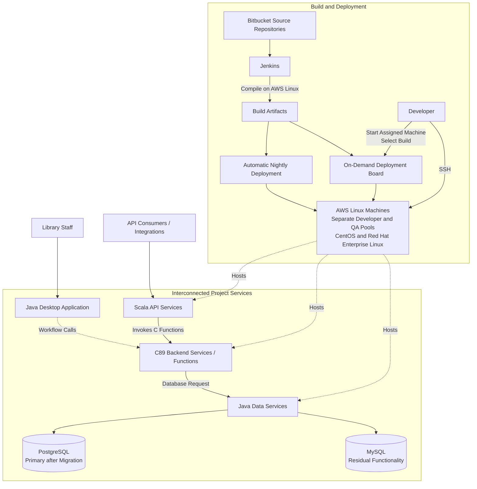

# Sierra Integrated Library System | March 2022 - April 2024

Quick routes through this document:

- **Recruiter / first answer:** sections 01, 10 and 12.
- **Technical interview:** sections 03, 07, 08 and one completed story from 09.
- **Facts to complete from memory:** sections 09 and 13.

## 01 Project Snapshot

| Field | Details |
|---|---|
| Product / system | Sierra, a mature integrated library system (ILS) from Innovative Interfaces |
| Domain | Library management, staff workflows, patron and collection data, third-party integrations |
| Period | March 2022 - April 2024 |
| Delivery company / customer | EPAM delivery team for Innovative Interfaces |
| Role | Primarily C backend developer; occasional work in Java data services and desktop application, and Scala API code |
| Target roles | C/C++ backend, systems programming, Linux, legacy modernization and cross-component debugging |
| Team | 3 C developers, 3 Java developers, 4 QA engineers, 1 Business Analyst, and 1 person combining Project Manager and Scrum Master responsibilities |
| Customer-side collaborators | 3 developers, later 4; their development manager; and a Product Owner, distributed across different locations |
| Users / deployment / scale | Library staff and integrations around Sierra; number of library installations, users and transactions in my scope is not documented |
| Main stack | C89, Java 8 → Java 11, Scala, Swagger, PostgreSQL, MySQL, custom protocols, Jira, Bitbucket/Jenkins, Visual Studio, Eclipse, IntelliJ IDEA, Linux on AWS |
| Primary ownership | Shared responsibility across the full C codebase: bug fixing, enhancements, refactoring and new features; log-first diagnosis and cross-component Java/Scala changes when required |
| Product status | Established production product; exact Sierra versions supported by the team need verification |
| Contribution status | Work was delivered through the regular Sierra maintenance and release process; exact mapping of individual changes to product releases is not documented here |
| Confidentiality | Public product context plus non-customer-specific engineering detail; omit proprietary protocol fields, customer data, credentials and private infrastructure identifiers |

### 30-Second Summary

I worked primarily as a C developer on Sierra, sharing responsibility for the full C89 codebase: bug fixing, enhancements, refactoring and new features across its modules. The microservices also included Scala APIs invoking C behavior and Java data services providing database access. Before I joined, most persistence had migrated from MySQL to PostgreSQL, while less-used models remained on MySQL. I occasionally changed Java UI and Scala API code. Logs were usually the best diagnostic tool; I also used `gdb` and core dumps on AWS Linux.

### Two-Minute Overview

Sierra is an integrated library system supporting circulation, cataloging, acquisitions, electronic-resource management and integrations with other library services. I joined an established product team working on a mature codebase rather than a greenfield system.

My primary responsibility was the full C89 backend rather than one subsystem. Together with the other C developers, I fixed defects, enhanced and refactored existing modules, and implemented new features across the C codebase while preserving compatibility. Scala APIs invoked C behavior, while database-dependent C code called Java data services. Before I joined, PostgreSQL had replaced MySQL for most persistence, although less-used models remained in MySQL. Java also powered the desktop application and later moved from Java 8 to Java 11; I participated in neither migration. As secondary work, I added a Java table column supplied by C and a Swagger-exposed Scala request handled by C.

The most valuable engineering skill on this project was cross-component diagnosis. A symptom visible in the desktop application or API could originate in Scala, C, Java, a database request, a custom-protocol boundary, deployment state or runtime data. Because the system consisted of multiple services, tracing correlated logs across them was usually more effective than debugging one process in isolation. For native failures I could add focused logging or use `gdb` and core dumps on the remote Linux environment over SSH.

The team had three C developers, three Java developers, four QA engineers, one Business Analyst and one PM/Scrum Master. The BA sometimes joined testing because of strong functional knowledge. We used two-week sprints with daily stand-ups, weekly grooming, demos, retrospectives and customer technical sessions. Jira tracked work; Bitbucket/Jenkins built on AWS Linux. Deployments ran nightly or on demand to separate developer/QA machines. Every EPAM and customer reviewer had to approve changes. Releases occurred roughly twice per year.

## 02 Context, Goals & Constraints

### Customer / Business Context

Innovative Interfaces is a long-established library-software vendor that traces its history to 1978. During this project it operated as part of Clarivate, following Clarivate's acquisition of ProQuest. Innovative publicly describes its portfolio as serving more than 10,000 academic, public, national, consortium, corporate and special libraries around the world. That is a company-wide portfolio figure, not a count of Sierra installations and not the scale of my project scope. My work was performed through an EPAM delivery team collaborating with a distributed Innovative group of three developers, later four, their development manager and a Product Owner.

### Product and Users

Sierra is an integrated library system / library services platform for operational library workflows rather than a single consumer application. Public documentation lists circulation, cataloging, acquisitions, serials and electronic-resource management, along with integrations for discovery, self-service and other library systems. Its REST API exposes bibliographic, item, patron, hold, checkout, fine, order and other record-oriented operations. Official documentation distinguishes Sierra Web from the installed, Java-based Sierra Desktop Application and confirms that the Sierra Services Platform incorporates PostgreSQL for library and operational data.

The project architecture I worked with was broader than those public interfaces: Scala implemented the API-facing layer and invoked C functionality; Java implemented both data services and the desktop application; the Java data services mediated database access from C. Before I joined, most persistence had migrated from MySQL to PostgreSQL, which became the primary database, while some less-used models remained in MySQL. Public Innovative material also advertised AWS-based Sierra hosting, consistent with the project's AWS deployment.

Those public capabilities describe the product as a whole. They do not prove that I personally implemented every workflow or API area.

### Scope, Scale & Criticality

- The engineering scope crossed C backend services, Java data services, a Java desktop application, Scala API services, PostgreSQL, MySQL and custom protocols.
- Before my assignment, the data layer had largely migrated from MySQL to PostgreSQL; some less-used models continued to use MySQL.
- The system used a microservice architecture, so one user-visible operation could cross several processes and language runtimes.
- The product was mature and used established library workflows, so compatibility and regression risk mattered more than introducing a new architecture from scratch.
- Both the EPAM and customer groups were geographically distributed, so reviews and technical discussions crossed multiple locations.
- Failures could affect staff workflows, integrations or access to library records; the exact production scale and service-level objectives in my area are not documented.
- Builds ran on CentOS and Red Hat Enterprise Linux machines in AWS.

### Problem and Goals

The recurring engineering goal was to evolve a long-lived system safely:

- Implement requested backend behavior in C.
- Diagnose and correct defects without breaking established library workflows.
- Refactor legacy modules where it improved maintainability without requiring a risky rewrite.
- Keep C, Java and Scala components compatible across custom interfaces.
- Preserve the established Scala-to-C and C-to-Java-to-database call paths.
- Preserve correct behavior across the established PostgreSQL paths and residual MySQL-backed models.
- Investigate production issues even when the visible symptom appeared outside my primary component.
- Deliver changes that QA could validate and that could enter the product's release process.

### Non-Goals and Ownership Exclusions

- I did not architect Sierra as a whole or select its main technology stack.
- I was not the primary owner of the Java desktop application, Java data services or Scala APIs.
- I did not own AWS infrastructure architecture or library-specific configuration, although I worked with deployed builds through SSH.
- I should not claim responsibility for every Sierra product workflow merely because my backend code supported the platform.
- I did not design the inherited microservice decomposition, the database-access boundary or the CI/CD platform.

### Constraints

- The C backend was a mature C89 codebase with long-lived behavior and compatibility obligations.
- A locally reasonable change could break a Java/Scala consumer or an established client workflow.
- Custom protocols made data layout, field semantics and error handling part of the compatibility contract.
- The C-to-Java and possibly Scala-to-C boundaries were probably socket-based; because this is recalled rather than confirmed, the exact transport and protocol must not be asserted yet.
- The Scala API invoked C functions, and C database operations crossed into Java before reaching PostgreSQL or MySQL, creating several possible failure points for one request.
- A database-related defect could also depend on whether the affected model used PostgreSQL or belonged to the residual MySQL set.
- Distributed defects could be difficult to reproduce; the most useful evidence was often spread across logs from several services.
- C development used Visual Studio and ordinary text editors; Java and Scala work used Eclipse and IntelliJ IDEA. Compilation and runtime validation happened on AWS Linux rather than on the local development workstation.
- Integrated validation used both automatic nightly deployments and on-demand deployment of a selected build to an assigned AWS machine.
- With roughly two major releases per year, fixes and features had to remain stable over a relatively long release cycle.

### Cross-Cutting Requirements

- **Reliability:** backend failures or inconsistent data could surface in staff applications and external integrations.
- **Compatibility:** changes had to preserve behavior expected by Java data services, the desktop application, Scala APIs and existing installations.
- **Diagnosability:** correlated service logs were the primary evidence across microservices; added logs, `gdb` and core dumps covered deeper native-code failures.
- **Data integrity:** library and patron workflows made silent corruption or partial updates more dangerous than an explicit failure; the exact records handled by my modules should be verified before giving examples.
- **Security/privacy:** the product domain can contain patron and operational data, but my exact security responsibilities are not documented and should not be overstated.
- **Performance:** no defensible latency, throughput or memory metric from my work is documented.

### Success Criteria

- Requested behavior works in the C backend and remains compatible with its Java/Scala consumers.
- Database-dependent C behavior works through the Java data-service boundary against the appropriate PostgreSQL or MySQL data source.
- A defect is reproducible or sufficiently explained from runtime evidence before the fix is selected.
- Existing workflows continue to behave correctly after a change.
- QA can validate the change through the team's normal test process.
- Failures remain diagnosable through logs, debugger state or core dumps.
- Numeric targets should be added only when a specific task, test result or release artifact supports them.

### Public Sources for Product and Technical Context

Use the Innovative sources only to describe Sierra as a product, not to establish personal ownership or internal architecture. The Unicode/ICU sources support the retrospective analysis of the search-highlighting problem; they do not prove which library the project used.

- Innovative Interfaces, Sierra product page: [https://iii.com/products/sierra-ils/](https://iii.com/products/sierra-ils/)
- Innovative Interfaces, Sierra REST API documentation: [https://techdocs.iii.com/sierraapi/Content/titlePage.htm](https://techdocs.iii.com/sierraapi/Content/titlePage.htm)
- Sierra REST API operations: [https://techdocs.iii.com/sierraapi/Content/zAPIs/operations.htm](https://techdocs.iii.com/sierraapi/Content/zAPIs/operations.htm)
- Innovative Interfaces, Sierra Web and Java-based desktop-client distinction: [https://documentation.iii.com/sierrahelp/Content/sweb/sweb_overview.html](https://documentation.iii.com/sierrahelp/Content/sweb/sweb_overview.html)
- Innovative Interfaces, Sierra functions and configurable workflows: [https://documentation.iii.com/sierrahelp/Content/sradmin/sradmin_functions.html](https://documentation.iii.com/sierrahelp/Content/sradmin/sradmin_functions.html)
- Innovative Interfaces, company background and library-market reach: [https://iii.com/about/](https://iii.com/about/)
- Clarivate, completion of the ProQuest acquisition: [https://clarivate.com/news/clarivate-successfully-completes-acquisition-of-proquest/](https://clarivate.com/news/clarivate-successfully-completes-acquisition-of-proquest/)
- Innovative Interfaces, Sierra Direct SQL Access and PostgreSQL context: [https://documentation.iii.com/sierrahelp/Content/ssql/ssql_direct_access.html](https://documentation.iii.com/sierrahelp/Content/ssql/ssql_direct_access.html)
- Innovative Interfaces, Sierra fact sheet describing AWS-based hosting: [https://iii.com/wp-content/uploads/2019/12/SierraILS-FS.pdf](https://iii.com/wp-content/uploads/2019/12/SierraILS-FS.pdf)
- Unicode Standard Annex #29, Unicode Text Segmentation and word-boundary limitations: [https://www.unicode.org/reports/tr29/](https://www.unicode.org/reports/tr29/)
- ICU Boundary Analysis, including dictionary-based word segmentation for Chinese and Japanese: [https://unicode-org.github.io/icu/userguide/boundaryanalysis/](https://unicode-org.github.io/icu/userguide/boundaryanalysis/)

## 03 System Architecture & Integration Boundaries

The diagram records the main call and delivery paths remembered from the project. Exact service names, protocol names and whether every link applied to every workflow remain intentionally omitted.

### Main Components and Data Flow

| Component | Responsibility | Main interfaces | My involvement | Confidence |
|---|---|---|---|---|
| C89 backend services / functions | Backend behavior and domain logic across the C codebase | Called from Scala; sends database requests through Java; custom protocols, probably over sockets | Shared responsibility across all C modules: bugs, enhancements, refactoring and new features | Scope verified first-hand; socket mechanism is probable, not confirmed |
| Scala API services / Swagger | API-facing behavior, entry points and API documentation | API request handling, Swagger exposure and invocation of C behavior, possibly through sockets | Occasional feature additions, bug fixes and documentation updates | Functional path verified; exact framework/transport/endpoints to recover |
| Java 8 → Java 11 data services | Mediate access to project databases | Requests from C, probably over sockets, to PostgreSQL or MySQL | Occasional feature additions and bug fixes; no Java-migration work | Versions and data path verified; exact transport/service/protocol names to recover |
| Java desktop application | Staff-facing desktop workflows | Calls into project services; exact path varied or needs recovery | Occasional feature additions, fixes and investigation; no Java-migration work | Verified first-hand; official docs confirm a Java-based Sierra desktop client |
| PostgreSQL / MySQL | PostgreSQL was primary after an earlier migration; some less-used models remained in MySQL | Database requests from Java data services | Integrated with through service boundaries, not database administration; no migration participation | Migration direction and timing verified first-hand; exact residual models to recover |
| Jira | Task and work tracking | Sprint work and project tasks | Regular workflow participant; Jira administration not claimed | Verified first-hand; exact workflow/statuses not recovered |
| Bitbucket / Jenkins | Source hosting and AWS Linux builds | Repository changes, build jobs and build artifacts | Used the delivery process; ownership of its administration is not established | Verified first-hand |
| Custom deployment board | DevOps-built internal tool for starting an assigned machine and deploying a selected build on demand | Build selection and AWS machine control | Used for developer deployments | Verified first-hand; implementation details not recovered |
| AWS developer environments | Compile and run developer-selected or nightly builds | SSH, logs, processes, `gdb` and core dumps | Regular development and debugging environment | Verified first-hand |
| AWS QA environments | Separate deployed machines used by testers | Deployed builds and QA validation | Integrated with during defect reproduction and verification | Verified first-hand; exact environment topology to recover |

### External Integrations

- Sierra exposes public APIs for patron-facing and third-party solutions, but the specific external integrations touched by my work are not documented.
- Scala API services exposed system functionality and invoked C behavior; the exact call/transport mechanism should not be named until recovered.
- C code did not access the databases directly in the remembered flow: it sent database requests to Java data services, which accessed PostgreSQL or MySQL.
- The C-to-Java communication was probably socket-based. Scala-to-C may also have used sockets, but both details remain below the confidence threshold for an unqualified interview claim.
- PostgreSQL became the primary database after a partial migration completed before my assignment; some less-used models still depended on MySQL.
- Custom protocols were important internal service boundaries. Protocol names and message layouts should be added only from a remembered incident or durable project artifact.

### State, Failure & Trust Boundaries

- A user-visible error in the desktop application or API could originate in a different process or language layer.
- One API operation could cross Scala and C; one database-dependent C operation could cross C, Java and a database.
- Custom-protocol payloads and error semantics formed contracts between independently running services.
- State could differ between the backend, data services, databases, desktop application and deployed environment; diagnosis required following the request through several logs rather than patching the visible symptom.
- Core dumps captured process state at failure time, but still had to be correlated with logs, inputs and the relevant build.
- A failure introduced by an integrated change might become visible after the automatic nightly deployment or after a selected build was deployed on demand.
- Trust, authentication and authorization boundaries are not sufficiently documented to make specific security claims.

### Technical Ownership Boundaries

**I owned or directly implemented:**

- Bug fixes, enhancements, refactoring and new features across all C backend modules as shared ownership within the C team.
- Log-first diagnosis across project microservices and Linux-level investigation with SSH, `gdb` and core dumps where needed.
- Cross-component changes in C and, when required, targeted Java or Scala changes for the same behavior.

**I contributed to or integrated with:**

- Java data services and the Java desktop application.
- Scala API code.
- PostgreSQL/MySQL-backed flows through Java data services.
- Custom protocols used at integration boundaries around the C backend.
- Jenkins builds from Bitbucket, automatic nightly deployment and on-demand deployment to assigned AWS machines as a user of the delivery process.
- Code review involving developers from both EPAM and the customer.
- QA reproduction and validation across component boundaries.

**Outside my ownership:**

- Overall Sierra product architecture and roadmap.
- Primary ownership of Java/Scala subsystems.
- Administration of Bitbucket/Jenkins, AWS infrastructure or the databases, unless a concrete task proves otherwise.
- Customer library configuration and all product-level workflows.

## 04 Tech Stack & Technical Decisions

| Area | Technologies | Why / constraint | My depth |
|---|---|---|---|
| Backend | C89, Linux | Mature core with long-lived compatibility requirements | Primary area; worked across the full C codebase with the other C developers |
| Data services / desktop | Java 8, later migrated to Java 11 | Existing service and staff-application stack; platform migration during the project | Occasional feature and bug-fix work; no participation in the Java-version migration |
| API | Scala, Swagger | API layer reused domain behavior by invoking C functions; Swagger exposed/documented requests | Occasional feature/fix work and documentation updates |
| Data | PostgreSQL, MySQL | Earlier migration made PostgreSQL primary while less-used models remained on MySQL; Java data services mediated C access | Integrated with through Java; no participation in the migration |
| Architecture / integration | Microservices, custom protocols, probably sockets | Existing service and language boundaries | Consumer, debugger and contributor across affected services; exact socket usage to verify |
| IDE / build | C: Visual Studio and text editors; Java/Scala: Eclipse and IntelliJ IDEA; Jenkins; AWS Linux compilation | Editing was primarily local, while compilation and runtime work happened on AWS Linux | Regular hands-on use; exact IDE versions and editor names to recover |
| Task tracking | Jira | Sprint and project work tracking | Regular user; workflow administration not claimed |
| Source / CI/CD | Bitbucket, Jenkins, custom deployment board | Source repositories, AWS Linux builds, automatic nightly deployment and selected on-demand deployments | Regular user of the DevOps-built internal board; administration ownership not established |
| Runtime / hosting | AWS; CentOS; Red Hat Enterprise Linux | Separate machine pools for developers and QA | Application-level build/deployment/debugging, not infrastructure architecture |
| Diagnostics | Service logs, added code logging, SSH, `gdb`, core dumps | Failures often crossed services and languages | Regular hands-on use; logs were usually the first and most effective tool |

### Important Decisions and Tradeoffs

| Context / decision | Alternative | Why this path | Cost / risk | My role / status |
|---|---|---|---|---|
| Change a mature C89 module | Rewrite or broadly modernize it | A focused change reduced regression and compatibility risk | Legacy structure and technical debt remained | Implemented features, fixes and targeted refactoring within inherited constraints |
| Failure spans microservices | Attach a debugger to one process first | Start from service logs and follow the request across processes | Requires usable logs and manual correlation | Logs were usually the fastest path; added focused logs or used `gdb` for deeper C failures |
| C code needs database data | Add direct database access in C | Preserve the inherited path through Java data services | More hops and more possible failure points | Implemented/debugged behavior across the C-to-Java boundary |
| Scala API needs domain behavior | Reimplement the behavior in Scala | Invoke the established C functions | Tight native integration and cross-language debugging | Maintained/debugged both sides when necessary; mechanism was inherited |
| Issue spans languages | Stop at the C boundary and hand it off | Make coordinated changes in C and the affected Java/Scala component | Context switching and multi-component review/validation | Frequently prepared related changes across the interconnected codebases |
| Nightly integration build | Depend only on local component tests | Use the Jenkins nightly build after it was deployed to AWS for integrated validation | Slower feedback for problems visible only after integration | Worked with the inherited build/deployment process |
| Mature release process | Optimize only for sprint completion | Keep changes supportable for a release cadence of roughly two releases per year | Longer feedback between product releases | Team-level delivery constraint, not a release-process decision made by me |

The language choices, microservice decomposition, Scala-to-C invocation, Java-mediated database access, protocols and release model were inherited. The defensible interview story is how I traced and changed end-to-end behavior across those boundaries, not that I selected the architecture.

## 05 Team, Role & Ownership

### Team and Collaboration

The delivery team consisted of:

- 3 C developers, including me.
- 3 Java developers.
- 4 QA engineers.
- 1 Business Analyst.
- 1 person combining Project Manager and Scrum Master responsibilities.

The customer-side group included three developers, later four, their development manager and a Product Owner. Customer participants were also distributed across different locations.

The EPAM delivery team was geographically distributed and changed locations during the project. I worked first from Belarus and later from Poland. Some teammates were initially based in Saint Petersburg and later relocated across Georgia, Lithuania and Turkey; several team members were based in Ukraine throughout.

The Business Analyst had strong functional knowledge of the application and sometimes joined testing to validate behavior alongside QA. Her broader responsibilities in requirements or acceptance criteria are not documented here. We worked in two-week sprints with daily stand-ups, weekly grooming, a demonstration and retrospective for each sprint. We also held periodic technical sessions with developers from the customer's team to discuss implementation and integration topics. Code review included all developers from both EPAM and the customer as reviewers, and approval was required from every added reviewer. The customer-side reviewer group had three developers and later increased to four. Releases occurred approximately twice per year.

### Responsibilities

- Understand requirements and existing behavior in assigned backend areas.
- Implement features and fixes in C89.
- Refactor legacy code without changing required behavior.
- Trace distributed behavior across Scala APIs, C services, Java data services and PostgreSQL/MySQL.
- Reproduce and diagnose defects in AWS Linux environments, usually starting with logs from the involved services.
- Add focused logging to code or use SSH, `gdb` and core dumps when log evidence was insufficient.
- Prepare related changes in C and, when necessary, implement features or bug fixes in Java or Scala because components were tightly interconnected.
- Develop C in Visual Studio or text editors and Java/Scala in Eclipse or IntelliJ IDEA; compile and validate changes on AWS Linux.
- Use both automatic nightly deployment and on-demand deployment of a selected build to an assigned AWS developer machine.
- Work with QA and, when she joined testing, the Business Analyst on reproduction details, functional validation and regressions.
- Coordinate implementation, review and validation with a geographically distributed EPAM/customer team.
- Track sprint work and project tasks in Jira.
- Participate in code review that required approval from all added EPAM and customer reviewers.
- Participate in daily stand-ups, weekly grooming, sprint demos, retrospectives and technical sessions with customer developers.

### Role and Delivery Boundaries

Safe wording:

- "I was primarily a C backend developer on a mature library platform."
- "The three C developers shared responsibility across the full C codebase; I worked on bugs, enhancements, refactoring and new features throughout its modules."
- "Scala APIs invoked C functions, while database-dependent C code used Java data services to reach PostgreSQL or MySQL."
- "I frequently had to coordinate changes across components and occasionally changed Java or Scala code myself."
- "My Java and Scala contributions were feature additions and bug fixes required by specific tasks; I did not participate in the Java 8 to Java 11 migration."
- "In the microservice environment, I usually diagnosed failures by following logs across services; for native C problems I added logging or used `gdb` and core dumps over SSH."
- "I used Visual Studio and text editors for C, and Eclipse or IntelliJ IDEA for Java and Scala; compilation and runtime debugging happened on AWS Linux machines."
- "Deployments were automatic at night or on demand through a custom internal board created by a DevOps engineer, where I could start an assigned machine and select a build."
- "Developers and QA had separate AWS machines."
- "Code changes were reviewed by developers from both EPAM and the customer."
- "Every added reviewer had to approve the change."
- "The Business Analyst knew the product workflows well and sometimes supported functional testing alongside QA."
- "The EPAM and customer teams were distributed across multiple countries and locations."
- "I worked in a cross-functional Scrum team and contributed to a regular product release train."

Wording to avoid:

- "I was a primary Java or Scala developer."
- "I architected Sierra or selected its technology stack."
- "I was the sole owner of the entire C backend."
- "I owned the AWS infrastructure or Jenkins administration."
- "I implemented Sierra's entire API or all library workflows."
- "My changes produced a specific business or performance improvement" without supporting evidence.

## 06 Delivery, Testing & Quality

### Development Process

- Two-week Scrum sprints.
- Daily stand-ups.
- Weekly grooming.
- Task tracking in Jira.
- QA reproduction and validation through the team's test and release flow, sometimes supported by the Business Analyst's functional knowledge.
- Demonstration and retrospective for each sprint.
- Periodic technical sessions with the customer's development team.
- Code review involving developers from both EPAM and the customer, with approval required from every added reviewer.
- Source in Bitbucket and builds through Jenkins on AWS Linux.
- Automatic nightly deployments plus on-demand deployment of a selected build through a machine-management board.
- Approximately two product releases per year.

All EPAM and customer developers were added as reviewers; the customer-side group grew from three developers to four, and every added reviewer had to approve the change. The broader definition of done and release-hardening phases are not documented here.

### Build and Deployment

- Source code was stored in Bitbucket repositories.
- Jenkins compiled builds on Linux machines hosted in AWS; compilation did not happen primarily on the local workstation.
- Deployment ran automatically at night.
- A custom internal board created by one of the DevOps engineers allowed a developer to start an assigned machine and deploy a selected build on demand.
- Developers and QA used separate AWS machines.
- The AWS Linux environments used CentOS and Red Hat Enterprise Linux.
- Developers accessed the deployed environment through SSH for investigation and debugging.

The deployment board was an internal tool created by a DevOps engineer rather than a named commercial product. Its implementation, the exact Jenkins job structure, packaging format, rollback procedure and AWS topology remain undocumented. Do not imply that I designed or administered this infrastructure merely because I used it.

### Test Strategy

- **C developer validation:** compile and deploy to an assigned AWS developer machine, reproduce the reported behavior, exercise the focused change and inspect logs/runtime state. The C code did not have developer-written unit tests.
- **Scala automation / indirect C coverage:** automated tests existed on the Scala side. Because Scala invoked C services, those tests indirectly exercised part of the C behavior as API/integration coverage, not as isolated C unit tests. The framework, execution frequency and exact covered paths remain unknown.
- **Nightly integration:** use the automatic AWS deployment produced from the nightly build to expose integration problems not visible in one component locally.
- **On-demand integration:** start an assigned developer machine through the deployment board and install the required build without waiting for the next nightly deployment.
- **Debugging validation:** follow service logs first; add focused logging or use `gdb` and core dumps for C failures that could not be explained from existing logs.
- **Cross-component validation:** verify Scala-to-C calls and C-to-Java-to-database flows, not only the locally changed component.
- **QA validation:** testing ownership was primarily on the QA side. A four-person QA group tested sprint work and regressions on AWS machines separate from developer environments, sometimes with functional support from the Business Analyst.
- **Business validation support:** the Business Analyst sometimes participated in testing because she knew the application functionality well.
- **Release validation:** changes entered a product release process that produced roughly two releases per year.

There were no C unit tests. The Scala automation framework, exact indirect C coverage, test execution trigger, broader end-to-end coverage and performance-test strategy are not documented.

### Compatibility & Migration Matrix

| Producer / change | Consumer | Required behavior | Evidence status |
|---|---|---|---|
| Scala API change | Invoked C function | API request reaches the correct native behavior and returns a coherent result | Architecture verified; concrete endpoint/test needed |
| Scala automated test | Scala API and invoked C service behavior | API scenario exercises the relevant C path and validates the returned behavior | Indirect C coverage verified; framework and scope to recover |
| C database request | Java data service | Request fields, response fields and error semantics remain compatible | Architecture verified; concrete service/protocol example needed |
| Java data-service change | PostgreSQL / MySQL | Correct database is queried and the result is mapped back to C correctly | Architecture verified; query/example needed |
| Earlier MySQL → PostgreSQL migration | Java data services and database-backed workflows | PostgreSQL paths and residual, less-used MySQL models remain functional | Project context only; migration occurred before I joined and I did not participate |
| Java 8 → Java 11 migration | Java services, desktop application and connected C/Scala components | Existing cross-language behavior remains compatible after the runtime upgrade | Project context only; I did not participate in this migration |
| C / Java / Scala change set | Other affected services and desktop workflow | End-to-end behavior remains consistent after the nightly deployment | Recurring responsibility verified; concrete change set needed |
| Product update | Existing library installation | Upgrade preserves supported workflows and data | Product-level requirement inferred; personal migration example not yet documented |

### Observability and Debugging

The primary diagnostic method was to follow logs across the relevant microservices. When existing logs were insufficient, I could add targeted logging in code; for native C failures I also used `gdb` and core dumps on AWS Linux machines accessed through SSH. A strong interview example should explain:

1. What the user or QA observed.
2. Which service produced the first useful evidence and how logs from the other services were correlated.
3. Whether the path was Scala-to-C, C-to-Java-to-database, or a desktop workflow.
4. Why additional logging, `gdb` or a core dump was needed, if logs alone were insufficient.
5. Why the fix belonged in C, Java, Scala or more than one component.
6. Whether the automatic nightly deployment or an on-demand deployment to an assigned developer machine was used to validate the correction.

### Reliability, Security & Performance Validation

- Reliability was addressed through focused developer reproduction, Scala-side automation that indirectly exercised some C paths, log-based cross-service diagnosis, nightly integration builds and QA regression testing.
- No numeric crash-rate, availability, latency, memory or throughput result is documented.
- No personal security ownership, penetration testing or formal compliance work is documented.
- Do not convert the use of AWS into a claim about scalability, high availability or cloud architecture ownership without a concrete example.

## 07 Contributions

### C Backend Development

- **Starting point:** mature C89 backend services called by Scala APIs and dependent on Java data services for database operations.
- **My contribution:** shared responsibility for all C modules with the C team, fixing defects, extending and refactoring existing code, and implementing new features across the codebase.
- **Technical focus:** understanding Scala-to-C calls and C-to-Java request/response flows, preserving protocol and workflow compatibility, and keeping changes narrow enough for a long-lived product.
- **Result:** delivered backend behavior and restored expected behavior for assigned issues.
- **Status:** part of the regular product development and release process; exact issue-to-release mapping needs confirmation.
- **Evidence:** user-provided project history and `SelfIntro.md`; source/task/release artifacts are not available in this workspace.

### Representative C Defects and Output Paths

- **US daylight-saving-time defect:** corrected time-handling behavior before an upcoming US DST transition. The root cause was a single increment performed at the wrong point in a C function. The defensible reconstruction is a small control-flow/off-by-one-style defect: moving or restricting the increment corrected the transition behavior. The exact variable/function, spring-versus-autumn direction, tests and deployment path still need recovery.
- **Fixed-size character arrays:** investigated many defects involving incorrect `char` array lengths, bounds and memory initialization. Some truncated text so a web page did not display every character; others crashed the application after an out-of-bounds or uninitialized-memory access.
- **Multilingual encoding:** fixed cases where the project's custom multilingual support produced raw encoded characters on a web page instead of the intended text. The legacy C implementation used its own locale logic and language-to-character translation/mapping tables rather than relying entirely on a standard Unicode stack.
- **Web/PDF generation:** worked in C code that generated web pages and PDF files, including defects involving blank pages and incorrect page transitions or pagination.
- **Search/highlighting for ideographic text:** the bug was in C-side search/highlighting built on the custom locale and character-mapping system. Chinese and Korean were definitely among the supported languages; Japanese and one other unrecovered language had problems. The confirmed problem class was a mismatch between syllable/character-oriented text and word-oriented matching. The likely symptom was that ideographs entered in the search field were not found or highlighted correctly on the page. The most plausible implementation-level explanation is incomplete or incorrect character classification/word-boundary data for the affected custom locales, possibly combined with a mismatch between the query's encoded representation and page text. Exact affected language, table entry and correction still need recovery.

These examples are verified from first-hand recollection at the problem level. Exact modules, affected languages, libraries, root causes and regression tests should be recovered before turning them into detailed interview stories.

### Cross-Component Production Debugging

- **Starting point:** a failure visible in one application layer could originate in another microservice, language boundary, database call or deployed build.
- **My contribution:** followed logs across services to locate the failing boundary, added targeted logging when needed and used `gdb`/core dumps for native failures; changed C and sometimes Java or Scala when the fix crossed components.
- **Technical focus:** service logs, Scala-to-C invocation, C-to-Java-to-database calls, SSH, `gdb`, core dumps and custom-protocol boundaries.
- **Result:** identified root causes and implemented or coordinated fixes that restored expected behavior.
- **Status:** recurring responsibility; individual incidents need to be documented before being used as detailed interview stories.
- **Evidence:** CV/SelfIntro summary and user confirmation.

### Java Data Services and Desktop Application

- **Starting point:** Java implemented the desktop application and the data services through which C reached PostgreSQL and MySQL.
- **My contribution:** occasionally added functionality and fixed defects or legacy behavior in Java when a task crossed the C boundary. One concrete example was adding a new column to a table in the desktop interface.
- **Technical focus:** Java rendered the table/UI, while the relevant data was processed on the C side; the change therefore required the UI and backend data path to stay aligned. Other work included request/response mapping, database selection/access and consistency between backend state and the desktop workflow.
- **Result:** contributed to end-to-end fixes rather than stopping at the language boundary.
- **Status:** secondary contribution area, not primary ownership.
- **Evidence:** user confirmation; no participation in the Java 8 → Java 11 migration; exact service/framework and table/column details to recover.

### Scala API

- **Starting point:** the API-facing Scala services invoked C functions to execute backend behavior.
- **My contribution:** occasionally added functionality and fixed defects or legacy behavior in the Scala API code. One example was adding another API request and its handling so that the operation appeared in Swagger documentation and retrieved data through C-side processing. I also updated Swagger API documentation in separate tasks.
- **Technical focus:** API request/response mapping, Swagger exposure/documentation, Scala-to-C invocation, returned data/error handling and shared semantics across the boundary.
- **Result:** contributed where a complete fix required API-layer understanding or modification.
- **Status:** secondary contribution area, not primary ownership.
- **Evidence:** user confirmation; exact endpoint, HTTP method, framework and tests to recover.

## 08 Key Engineering Challenges

### 1. Understanding a Long-Lived C89 Codebase

- **Why difficult:** behavior and compatibility obligations accumulated over many years, while fixed-size `char` arrays made length, termination, bounds and initialization mistakes especially risky.
- **Core insight:** reconstruct control/data flow, buffer ownership and external contracts before changing legacy C.
- **My work:** feature development, targeted refactoring and many character-array fixes. Symptoms included truncated web text and application crashes caused by invalid or uninitialized-memory access.
- **Evidence gap:** choose one representative module/story rather than proving module ownership, then recover the exact length/initialization error and its regression check.

### 2. Log-First Diagnosis Across Microservices

- **Why difficult:** the visible symptom could appear in the Java desktop application or Scala API while the root cause lived in C, a data service, a protocol payload or runtime state.
- **Core insight:** follow the request and its data across service logs before attaching a debugger to one isolated process.
- **My work:** correlated available logs, added focused logging where evidence was missing, and inspected C failures with `gdb` or core dumps when necessary.
- **Evidence gap:** add one end-to-end incident with a concrete root cause.

### 3. Preserving the Scala-to-C API Boundary

- **Why difficult:** the API-facing Scala layer reused C functions, so data mapping, returned values and error behavior had to remain coherent across two runtimes.
- **Core insight:** an API fix could require inspecting both the public-facing Scala behavior and the underlying C implementation.
- **My work:** primarily changed C and occasionally changed Scala. One example added a new API request, exposed it in Swagger and connected it to C-side data processing; other tasks updated Swagger documentation.
- **Evidence gap:** recover the invocation mechanism, endpoint/method, framework and tests.

### 4. Following Database Requests Across a Residual Dual-Database Design

- **Why difficult:** database-dependent C behavior crossed a Java data-service boundary. An earlier migration had made PostgreSQL primary, but some less-used models still used MySQL, so request mapping, database selection and error propagation all belonged to the failure path.
- **Core insight:** validate every hop and identify which database owns the workflow before assuming that a database-looking symptom originated in SQL or in C.
- **My work:** debugged the C-to-Java request/response path and occasionally changed Java when the complete fix required it.
- **Evidence gap:** recover one primary PostgreSQL path, one residual MySQL model and a representative failure.

### 5. Coordinating Changes Across Interconnected Codebases

- **Why difficult:** a feature or defect often crossed C, Java or Scala components owned by different specialists and could fail only after integration.
- **Core insight:** keep each component change focused while treating the combined behavior as one deliverable.
- **My work:** frequently prepared the C change and, when needed, a related Java or Scala change. Concrete examples include a Java table column backed by C-side data processing and a Scala API request documented in Swagger and handled by C.
- **Evidence gap:** recover the exact table/column and API operation, then explain their review and validation paths.

### 6. Validating Through Remote AWS Builds and Deployments

- **Why difficult:** Visual Studio was used for editing, but compilation and realistic runtime validation happened remotely on AWS Linux; developers and QA also used different machines.
- **Core insight:** choose the required build through on-demand deployment for fast developer feedback, then confirm integrated behavior in the appropriate deployed environment or nightly cycle.
- **My work:** started assigned machines and deployed selected builds through the board, then investigated them through SSH with logs, `gdb` or core dumps.
- **Evidence gap:** recover one defect found only after remote deployment and how it was confirmed fixed by QA.

### 7. Correctness Across Time, Languages and Generated Output

- **Why difficult:** date/time rules, custom C locale/translation tables, ideographic text boundaries and page-generation state all have edge cases that ordinary ASCII or single-page tests miss.
- **Core insight:** treat time-zone transitions, encoding, locale-specific character classification/word segmentation and pagination as explicit correctness boundaries with representative edge-case inputs.
- **My work:** fixed a US daylight-saving-time defect caused by an increment in the wrong place before the upcoming transition; addressed raw-character rendering in multilingual web output; worked on a word-boundary mismatch that broke search/highlighting for some ideographic text; and fixed blank-page or page-transition problems in C-generated web/PDF output.
- **Evidence gap:** recover the DST variable/function, transition direction and tests; affected encodings/languages; exact search/highlighting implementation; output library; and regression tests.

## 09 STAR / Debugging Prompts

The available information supports the themes below, but not yet complete STAR stories. Do not invent the missing symptom, root cause, personal action or result. Complete at least three before an interview.

### Candidate 1: Fix a Time-Critical US DST Defect

- **Known basis:** a C-side daylight-saving-time defect affecting US behavior was found and fixed before the upcoming transition.
- **Root cause known at a safe level:** one increment occurred in the wrong place in a C function. This is best described as a small control-flow/off-by-one-style error unless the exact variable is recovered.
- **Need to add:** visible symptom, whether it concerned entering or leaving DST, affected function/variable, exact code movement/condition, regression cases and how the fix reached the required environment in time.
- **Good follow-ups:** UTC versus local time, system time-zone data, ambiguous/nonexistent local times, deadline management and coordination with QA.

### Candidate 2: Add a Scala API Request Backed by C

- **Known basis:** added another request and its handling in Scala so it appeared in Swagger documentation and obtained data through C-side processing; also performed separate Swagger-documentation updates.
- **Need to add:** endpoint and HTTP method, request/response schema, Scala framework, Scala-to-C mechanism, C function/data path, tests and observable result.
- **Good follow-ups:** API compatibility, validation, error mapping, documentation generation and cross-company review.

### Candidate 3: Add a Java UI Column Backed by C Data

- **Known basis:** added a new column to a table rendered by Java while the underlying data was processed in C.
- **Need to add:** screen/table and column purpose, C data source, interface change between C and Java, UI mapping, test cases and QA result.
- **Good follow-ups:** null/empty values, formatting, backward compatibility, sorting/filtering only if applicable, and why both components had to change.

### Candidate 4: Correct Search Highlighting for Ideographic Text

- **Known basis:** this was C-side code using custom locale and language-to-character mapping tables. Chinese and Korean were supported; Japanese and another language had search/highlighting problems. The path treated syllable/character-oriented text incorrectly at word boundaries. The probable UI symptom was that the query was visible in the search field but matching page content was not found or highlighted.
- **Most likely implementation cause:** an incomplete/incorrect locale table entry or character-class/word-boundary rule for the affected languages, possibly combined with query-versus-page encoding mismatch. This is a reconstruction, not recovered source-level evidence.
- **Need to add:** the other affected language, exact encoding/UI symptom, faulty table/rule, implemented correction and regression corpus.
- **Good follow-ups:** bytes versus characters, internal character IDs, Unicode code points, normalization, grapheme versus word boundaries, and why locale-aware or dictionary-based segmentation is needed for Chinese/Japanese-like text.

### Candidate 5: Fix a `char` Array Boundary Defect

- **Known basis:** the C code had recurring character-array length, bounds and initialization problems. Some produced truncated text on web pages; others crashed after invalid or uninitialized-memory access.
- **Need to add:** affected buffer, incorrect length/initialization logic, detection method, correction and regression test.
- **Good follow-ups:** terminating null byte, allocation ownership, safe length propagation, `gdb`/core evidence and why the bug escaped earlier tests.

### Candidate 6: Fix C-Generated Web/PDF Pagination

- **Known basis:** C code generated web pages and PDF files; defects included blank pages and incorrect transitions or pagination.
- **Need to add:** output type/library, reproducible input, state or layout error, exact correction and validation across representative documents.
- **Good follow-ups:** page-break rules, empty content, encoding interaction, deterministic output comparison and regression coverage.

## 10 Outcomes, Impact & Evidence

No defensible product KPI or before/after metric is documented. Use delivered behavior and technical evidence rather than inventing business impact.

| Outcome | Engineering / user value | Evidence | Confidence |
|---|---|---|---|
| Features, fixes and refactoring delivered across the C codebase | Evolved a mature backend while preserving established workflows | User history, CV/SelfIntro and concrete recalled defects | **Verified shared responsibility across all C modules**; representative stories/tests still needed |
| Cross-service failures diagnosed through logs and Linux tools | Allowed the failing service or boundary to be identified instead of masking the visible symptom | User confirmation plus CV/SelfIntro for `gdb` and core dumps | **Verified responsibility**; incident-level result needed |
| US DST defect corrected before the upcoming transition | A misplaced increment in a C function was corrected before the transition window | User confirmation | **Verified result and root-cause class**; exact function/variable/direction/tests to recover |
| Scala request exposed through Swagger and backed by C processing | Extended the API while reusing established C-side data behavior | User confirmation | **Verified contribution**; endpoint/method/tests to recover |
| Java table column backed by C-side data processing | Extended the desktop UI through a coordinated frontend/backend change | User confirmation | **Verified contribution**; table/column/interface details to recover |
| Character-array, multilingual rendering and generated-output defects addressed | Corrected truncated web text, crash-prone memory access and web/PDF output behavior | User confirmation | **Verified problem areas and symptoms**; individual root causes/tests need detail |
| Project retained residual MySQL models after an earlier PostgreSQL migration and later migrated Java 8 → Java 11 | Required compatibility across old/new data paths and runtime versions | User confirmation | **Verified project context**; I participated in neither migration |
| Automatic nightly and selected on-demand deployments used in AWS | Supported scheduled integration and targeted validation on assigned developer machines | User confirmation | **Verified delivery context**; platform administration not claimed |
| C behavior validated through QA and indirect Scala automation | Provided integration-level confidence despite the absence of C unit tests | User confirmation | **Verified test model**; exact Scala framework/coverage unknown |
| Changes required approval from every added EPAM and customer reviewer | Shared compatibility knowledge and sign-off across the delivery boundary before integration | User confirmation | **Verified process** |
| Work delivered through two-week sprints, grooming, demos, retrospectives and technical sessions | Provided regular planning, feedback and technical alignment with QA, the Business Analyst and customer developers | User confirmation | **Verified process** |
| Product followed a roughly twice-yearly release cadence | Required changes to remain supportable across a long release train | User confirmation | **Approximate team-level context** |

### Metrics Worth Recovering

- Number and type of personally completed features/defects.
- One measurable performance or stability improvement, if any.
- Size or responsibility of a representative C module.
- Number of Sierra releases containing personal changes.
- Test or defect evidence showing that a regression was prevented.
- Time saved in diagnosing a recurring production issue, if recorded.

### Resume-Ready Bullets

- Shared responsibility across the full C89 backend of Innovative Interfaces' Sierra platform, implementing new features, fixing defects, enhancing and refactoring modules while preserving established workflows.
- Diagnosed distributed failures on AWS-hosted Linux systems by tracing service logs and, for native C issues, using SSH, `gdb` and core dumps.
- Fixed C defects involving US daylight-saving-time behavior, truncated text or crashes from `char` array/memory errors, multilingual web rendering and C-generated web/PDF output.
- Extended cross-language functionality by adding a Swagger-documented Scala API request backed by C processing and a Java table column backed by C-side data.
- Compiled and validated changes on AWS Linux using automatic nightly or selected on-demand deployments, with cross-company code review and separate developer/QA environments.

## 11 Tradeoffs, Lessons & Retrospective

### Tradeoffs

- Focused changes reduced regression risk in the mature C89 codebase but left some structural technical debt in place.
- Log-first investigation was effective across services, while `gdb` and core dumps provided deeper process-level evidence for native failures.
- Reusing C behavior from Scala and mediating database access through Java avoided duplicating established logic, but added language boundaries and more failure points.
- The earlier move to PostgreSQL reduced reliance on MySQL, but residual less-used MySQL models meant both database paths still had to remain correct.
- Contributing directly to Java or Scala shortened some cross-component fixes but required coordination with the primary subsystem owners.
- Automatic nightly deployments provided regular cross-service validation, while on-demand deployment of a selected build shortened feedback for a developer investigation.
- The absence of C unit tests increased reliance on focused manual reproduction, Scala-level integration automation, nightly deployments and QA regression testing.
- A roughly twice-yearly release cadence increased the importance of regression testing and changes that remained supportable over time.

### What I Learned

- In a multi-language legacy system, the language boundary is not necessarily the ownership boundary of a defect.
- In a microservice system, start with the evidence that spans processes; attach a debugger after the failing path has been narrowed.
- Core dumps are most useful when combined with matching binaries, logs and a reconstruction of the state leading to failure.
- Internal custom protocols need explicit compatibility discipline like public APIs.
- A safe refactor begins by identifying observable behavior and consumers that must not change.
- Indirect API/integration tests are valuable for a legacy C service, but they do not replace isolated tests for buffer, date/time and text-boundary logic.
- Time-zone transitions need explicit boundary tests; ordinary dates do not exercise missing or repeated local times.
- In multilingual C code, byte length, character count and display boundaries are different concepts and must not be treated interchangeably.
- Generated web/PDF output needs representative pagination and empty-content cases, not only a successful file-generation check.
- Cross-functional communication with QA and adjacent-language developers is part of technical root-cause analysis.

### What I Would Change Now

- Capture one-page incident records containing symptom, environment, evidence, root cause, fix and regression test.
- Add structured logs and consistent correlation identifiers across Scala, C and Java services.
- Add or strengthen contract tests around Scala-to-C and C-to-Java protocol boundaries.
- Introduce focused C tests around pure buffer, date/time, locale/search and pagination logic before broader refactoring.
- Make protocol versioning, required fields, defaults and error semantics explicit.
- Add explicit tests around US DST boundaries and other time-zone transitions.
- Add multilingual regression inputs covering encodings, ideographic text and search highlighting.
- Add boundary-focused checks for fixed-size buffers and use sanitizers/static analysis where the legacy toolchain permits.
- Add deterministic web/PDF output checks for empty pages, page breaks and navigation/page transitions.
- Automate the most important cross-service checks after both nightly and on-demand deployments.
- Automate core-dump symbol/build matching and collect richer crash metadata.
- Record release inclusion and measurable outcomes while work is in progress.
- Document which Java data service owns each PostgreSQL/MySQL access path and its failure semantics.

## 12 Interview Answer Kit

### Role-Specific Emphasis

- **C/C++ backend:** lead with shared responsibility across all C modules, then use fixed-size buffer safety, time handling, multilingual output, web/PDF generation and custom-protocol compatibility as examples.
- **Systems/Linux:** lead with remote production diagnosis through SSH, logs, `gdb`, core dumps and cross-process state.
- **Legacy modernization:** lead with targeted refactoring, regression risk and why broad rewrites were inappropriate.
- **Distributed/backend systems:** lead with tracing failures across C, Java data services, Scala APIs and deployment state.
- **Build/runtime environment:** explain Visual Studio/text editors for C and Eclipse/IntelliJ IDEA for Java/Scala, with compilation, deployment and debugging on AWS Linux.
- **Cross-language role:** present Java/Scala as useful secondary contribution, not equivalent depth to the primary C role.

### Strongest Technical Deep Dives

- The time-critical US daylight-saving-time correction.
- A Swagger-documented Scala API request backed by C-side processing.
- A Java table column backed by C-side data processing.
- A fixed-size `char` array boundary defect.
- Multilingual rendering/search-highlighting or web/PDF pagination defects, once the exact root cause is recovered.

### Likely Follow-Up Questions

- **Why was the C code difficult to change?** It was a mature C89 backend with established behavior and consumers in other languages; a local change could become a cross-component regression.
- **Which C modules did you own?** The three-person C group shared responsibility across the full C codebase. I fixed bugs, enhanced and refactored existing modules, and implemented new features throughout it; I was not limited to one subsystem and should not imply sole ownership.
- **How was the system connected?** Scala implemented the API-facing layer and invoked C functions. When C needed database data, it sent a request to Java data services, which accessed PostgreSQL or MySQL. Java also implemented the desktop application.
- **How did you diagnose distributed failures?** I normally started with logs because one operation could cross several services. I followed the request through the available service logs, added focused logging when evidence was missing, and used `gdb` or a core dump when the problem required native process state.
- **How did you debug native crashes?** I used logs to narrow the failing path, then inspected the process or matching core dump with `gdb` on the remote Linux environment. Before using this as a detailed story, I should recover one concrete incident and its validation steps.
- **Did you design the custom protocols?** Not established. The safe claim is that I worked with and preserved their contracts while implementing and debugging connected behavior.
- **How did C communicate with Java and Scala?** C-to-Java was probably socket-based, and Scala-to-C may also have used sockets. I should keep both qualified until I recover the exact transport, protocol and serialization.
- **What kinds of `char` array bugs did you fix?** Incorrect lengths or initialization could truncate text so a web page omitted characters, or cause crashes through invalid/out-of-bounds or uninitialized-memory access. I should use one exact function and correction for a detailed answer.
- **What did you do in Java and Scala?** They were secondary areas. In Scala, for example, I added an API request, exposed it through Swagger and connected it to C-side data processing; I also updated Swagger documentation. In Java, I added a column to a table whose UI was rendered in Java while its data was prepared in C. My primary contribution remained in C.
- **Which Java version did the project use?** It initially used Java 8 and later migrated to Java 11. I did not participate in that migration.
- **Why were both PostgreSQL and MySQL present?** Before I joined, most persistence had migrated from MySQL to PostgreSQL. PostgreSQL was the main database, but some less-used models remained in MySQL. C reached both through Java data services; I did not participate in the migration.
- **What was the DST bug?** A C function performed one increment at the wrong point, producing incorrect US daylight-saving-time behavior. I corrected it before the upcoming transition. The safe technical description is a small control-flow/off-by-one-style defect; I should recover the exact variable/function, transition direction and regression cases before going deeper.
- **What internationalization problems did you handle?** The legacy C code had its own locale logic and language-to-character tables. Chinese and Korean were supported, while Japanese and another language had search/highlighting problems related to syllable/character units versus word matching. The most likely code-level cause was an incomplete locale character-class/word-boundary mapping, possibly combined with an encoding mismatch. That last sentence is a reconstruction until the exact table and fix are recovered.
- **How was the C code tested?** We did not write C unit tests. Developers reproduced and checked changes on AWS environments, QA owned most functional/regression testing, and Scala-side automated tests indirectly exercised some C services through API/integration paths. The Scala framework and exact coverage still need recovery.
- **Which IDEs did you use?** I used Visual Studio and ordinary text editors for C, and Eclipse and IntelliJ IDEA for Java and Scala. Compilation and runtime work happened on AWS Linux rather than primarily on my local workstation.
- **How did deployment work?** There was an automatic nightly deployment and an on-demand path through a custom internal board created by a DevOps engineer. I could start an assigned machine, choose the required build and deploy it. Developers and QA had separate AWS machines.
- **Which cloud and operating system were used?** AWS only, with CentOS and Red Hat Enterprise Linux machines.
- **How did code review work?** All developers from both EPAM and the customer were added as reviewers, and approval was required from every one of them. The customer-side reviewer group consisted of three developers and later four.
- **How did the Business Analyst work with the team?** She knew the application functionality well and sometimes participated in testing alongside QA. I should not claim broader requirements or acceptance-criteria ownership until I recover it.
- **How was the team distributed?** I worked first from Belarus and later Poland. Some EPAM teammates moved from Saint Petersburg to Georgia, Lithuania or Turkey, while several remained based in Ukraine. The customer side was also distributed and included three developers, later four, their manager and a Product Owner.
- **How did the team work?** We used two-week sprints, daily stand-ups, weekly grooming, a demo and retrospective each sprint, and periodic technical sessions with the customer's developers. Product releases were approximately twice per year.
- **Was the product really more than 40 years old?** Historical CVs used that phrase, but it may refer to inherited code or product lineage rather than Sierra itself. The safe description is "a mature legacy system" until the meaning is confirmed.
- **How many bugs or features did you deliver?** Historical CV versions contain conflicting counts, so I should not quote a number without a task or release artifact. I can accurately discuss the type of work and use a concrete incident instead.
- **What was your strongest result?** Choose a completed incident from section 09; no quantified result should be invented before that story is filled in.

### Claims and Confidentiality Boundaries

Safe claims:

- Primary C89 backend development on Sierra.
- Shared responsibility across all C modules within the three-person C team: fixes, enhancements, refactoring and new features.
- Feature work, defect correction and targeted refactoring.
- Microservice diagnosis through logs, with SSH, `gdb` and core dumps for deeper native investigation.
- Scala APIs invoked C functions; C used Java data services to access PostgreSQL and MySQL.
- C-to-Java communication was probably socket-based; Scala-to-C may also have used sockets, but neither transport should be stated without qualification.
- Before I joined, most persistence migrated from MySQL to PostgreSQL, while some less-used models remained on MySQL; I did not participate in that migration.
- Java 8 was migrated to Java 11 during the project; I did not participate in that migration.
- A Swagger-documented Scala API request backed by C processing, plus Swagger documentation updates.
- A Java UI table column backed by C-side data processing.
- C fixes involving US DST behavior, fixed-size character arrays, multilingual web output, search highlighting and web/PDF generation.
- No C unit tests; validation through developer reproduction, QA testing and partial indirect coverage from Scala automation.
- Visual Studio and text editors for C; Eclipse and IntelliJ IDEA for Java/Scala; compilation and runtime work on AWS Linux.
- Jira for task tracking.
- Automatic nightly deployment and on-demand deployment of a selected build through a custom internal board created by a DevOps engineer.
- Separate AWS machines for developers and QA.
- Code review with all EPAM and customer developers, requiring approval from every added reviewer.
- One Business Analyst with strong product knowledge who sometimes supported functional testing.
- A geographically distributed EPAM/customer team; customer-side collaboration included three developers, later four, their manager and a Product Owner.
- Two-week sprints with daily stand-ups, weekly grooming, demos, retrospectives and customer technical sessions.

Claims to avoid until verified:

- Exact Sierra version numbers or release inclusion for individual changes.
- Exact customer/library names, installation counts or transaction volume.
- Ownership of the complete backend, API, desktop application or cloud platform.
- Exact CentOS/RHEL versions, AWS topology, Jenkins pipeline design or administration ownership.
- Exact Scala-to-C invocation mechanism, custom-protocol details, database ownership split or Java/Scala frameworks.
- TCP/UDP, message format or any other socket/protocol detail until recovered.
- The exact DST variable/function, spring/autumn direction or tests; the second affected search language, exact locale-table defect or encoding path; or a specific Unicode/ICU implementation in the project without evidence.
- Measured availability, performance, cost or business impact.
- Proprietary protocol details or production data.

### Glossary

- **ILS:** Integrated Library System; software supporting core library operations and records.
- **Sierra:** Innovative Interfaces' library services platform / ILS.
- **Data service:** an application component that exposes or transforms data for other parts of the system.
- **Microservice:** an independently running service that collaborates with other services through defined interfaces.
- **Nightly build:** an automated integration build produced on a scheduled overnight cycle.
- **Custom protocol:** a project-specific communication contract between components rather than a standard public protocol.
- **Core dump:** a snapshot of a process's memory and execution state captured around a crash.
- **`gdb`:** GNU Debugger, used to inspect native processes, stack traces, variables and core dumps.

### Longer Answer Emphasis

For a longer interview answer, begin with shared responsibility across all modules of a mature C89 backend. Use the misplaced-increment DST correction, character-array failures and custom-locale/web/PDF issues as concrete C examples. Then show cross-language breadth with the Swagger-documented Scala request backed by C and the Java table column fed by C-side processing. Explain that logs were usually the fastest diagnostic path, while `gdb` and core dumps supported native failures. Be transparent that C had no unit tests: confidence came from developer reproduction, indirect Scala automation, QA regression testing, remote AWS deployments and mandatory cross-company review.

## 13 Sources, Evidence & Open Questions

### Evidence Available

- Evidence precedence for this project: use project-specific resume/CV entries over uncertain recollection. A direct, explicit correction of a generic or cross-project resume statement takes precedence for project attribution. Source code, task records or release artifacts would take precedence if they become available.
- User-provided project context, architecture, build/deployment, debugging and team/process details.
- `Interview/SelfIntro.md`, which records C89, Java, Scala, custom protocols, Linux, cloud-hosted work, feature work, refactoring, logs, `gdb` and core dumps. Its combined AWS/Azure wording spans experience and is not evidence that Sierra used Azure.
- Historical CVs preserved in the repository record remote Linux work through SSH, C/Java/Scala changes and debugging, code review and teammate support. Some entries combine multiple EPAM projects, so project attribution must be checked per claim.
- Public Innovative Interfaces product/API documentation and Unicode/ICU text-segmentation references listed in section 02.
- No project source repository, task tracker or internal release notes were available for this description.

| Claim | Evidence | Type / status | Disclosure |
|---|---|---|---|
| Customer/product was Innovative Interfaces Sierra | User confirmation plus official Sierra product documentation | **Verified** personal context; **Public** product context | Public |
| Primary role was C backend development with shared responsibility across all C modules | User confirmation and `SelfIntro.md` | **Verified** | Safe; do not imply sole ownership |
| Backend used C89 | `SelfIntro.md` and historical CVs | **Verified** personal record | Safe |
| Java covered data services and desktop application; Scala covered APIs | User confirmation; official documentation independently confirms a Java-based Sierra desktop client | **Verified** first-hand account plus **Public** product context | Safe at this level; exact components to verify |
| Java stack migrated from Java 8 to Java 11 | User confirmation | **Verified** project context | Safe; I did not participate in the migration |
| Before my assignment, the project migrated mainly from MySQL to PostgreSQL; some less-used models remained on MySQL | User confirmation | **Verified** project context | Safe at this level; I did not participate and exact residual models are not recovered |
| Work included features, bug fixing and refactoring | User confirmation and `SelfIntro.md` | **Verified** responsibility | Safe |
| Scala work included a Swagger-exposed API request backed by C processing and Swagger documentation updates | User confirmation | **Verified** first-hand example | Safe at this level; endpoint/method/framework to recover |
| Java work included a new table column whose data was processed in C | User confirmation | **Verified** first-hand example | Safe at this level; screen/column/interface details to recover |
| C work included a US DST correction caused by an increment in the wrong place and completed before the upcoming transition | User confirmation | **Verified** first-hand example, timing and root-cause class | Safe; exact function/variable/direction/tests to recover |
| C defects included `char` array length/bounds/initialization errors causing truncated web text or crashes, plus multilingual/search and web/PDF issues | User confirmation; Unicode/ICU documentation supports the retrospective segmentation analysis | **Verified** first-hand problem areas and symptoms plus **Public** technical context | Safe at the problem-class level; exact functions and fixes to recover |
| C-side multilingual search used custom locale and language-to-character tables; Chinese/Korean were supported, while Japanese and another language had problems | User confirmation plus Unicode/ICU context | **Verified** architecture/language context; **Inferred** table-level cause | Separate the confirmed case from the reconstructed faulty mapping/rule |
| System used microservices; Scala APIs invoked C; C reached PostgreSQL/MySQL through Java | User confirmation | **Verified** first-hand account | Safe at this architectural level; exact mechanisms to recover |
| C-to-Java probably used sockets; Scala-to-C may also have used sockets | Qualified user recollection | **Probable / to verify** | Always qualify; exact transport/protocol/serialization unknown |
| Debugging was log-first, with added logs, SSH, `gdb` and core dumps as needed | User confirmation plus `SelfIntro.md` and historical CVs | **Verified** first-hand account and personal record | Safe |
| C had no unit tests; QA owned most testing; Scala automation indirectly exercised some C services | User confirmation | **Verified** test model | Safe; Scala framework, trigger and exact C coverage unknown |
| Bitbucket held the source and Jenkins compiled builds on AWS Linux | User confirmation | **Verified** first-hand account | Safe; pipeline administration is not claimed |
| Deployment was automatic at night or on demand through a custom board created by a DevOps engineer | User confirmation | **Verified** first-hand account | Safe; implementation details are not established |
| Developers and QA used separate AWS machines | User confirmation | **Verified** first-hand account | Safe; exact topology is not established |
| CentOS and Red Hat Enterprise Linux were used | User confirmation | **Verified** first-hand account | Safe; exact versions are unknown |
| Sierra used AWS only; Azure did not belong to this project | Explicit user correction of generic cross-project resume wording | **Verified project attribution** | Safe |
| C work used Visual Studio/text editors; Java and Scala used Eclipse/IntelliJ IDEA; compilation and runtime happened on AWS Linux | User confirmation | **Verified** first-hand account | Safe; exact IDE/editor versions are unknown |
| Project tasks were tracked in Jira | User confirmation | **Verified** first-hand account | Safe; exact Jira workflow and administration ownership are not established |
| Code review added all developers from both EPAM and the customer and required every approval; customer-side reviewers grew from three to four | User confirmation | **Verified** first-hand account | Safe |
| Team included one Business Analyst who sometimes joined testing because of strong application knowledge | User confirmation | **Verified** first-hand account | Safe; broader BA responsibilities are not established |
| Customer side included 3 developers, later 4, their development manager and a Product Owner | User confirmation | **Verified** first-hand account | Safe; people were distributed across different locations |
| EPAM team locations included Belarus then Poland for me; Saint Petersburg followed by Georgia/Lithuania/Turkey for some teammates; and Ukraine throughout for several | User confirmation | **Verified** first-hand account | Safe as general project context; omit personal names |
| Team composition, two-week sprints, daily stand-ups, weekly grooming, demos, retrospectives and customer technical sessions | User confirmation | **Verified** first-hand account | Safe |
| Releases occurred approximately twice per year | User confirmation | **Approximate** | Present as cadence, not exact count |
| Project period was March 2022 - April 2024 | Historical CV project entry | **Verified** personal record | Safe |

### Historical CV Findings and Conflicts

The repository history contains many CV revisions but no separate Sierra project description. The useful repeated statements have been incorporated above. The following claims were deliberately excluded from the main narrative:

- Several CVs call the system "40+ years old," but the phrase does not distinguish the age of Sierra as a named product from the age of inherited code or product lineage. Say only "mature legacy system" unless the exact meaning is recovered.
- Some revisions say "Key C Developer" or claim leadership of two or three developers. The present first-hand description establishes membership in a three-person C group, not a formal lead role.
- Counts such as 70+, 100+ bugs or 12+ features and percentages for reliability, functionality, performance, integration time, error reduction or customer satisfaction vary between CV revisions and have no supporting artifact here. Do not use them.
- The broad historical EPAM technology list combines more than one project. Jenkins, MySQL, PostgreSQL and Java 8/11 are now independently confirmed for Sierra; Apache, Valgrind, TCP/IP and WebSockets are not and should not be assigned to this project without further evidence.
- Code-review participation and IntelliJ IDEA usage are now independently confirmed. Historical references to helping teammates and demonstrations to client department heads still need project-specific confirmation.
- One CV claims support for 24/7 operation. Production use is clear from the personal records, but personal on-call/support responsibility and an explicit 24/7 requirement are not established.

### Working Technical Reconstructions

These are the best current explanations, not recovered source-level facts. Keep the qualification in a detailed interview answer until the missing detail is remembered.

| Topic | Confirmed facts | Best current reconstruction | Still to confirm |
|---|---|---|---|
| US DST defect | C-side bug; one increment was in the wrong place; fixed before the transition | Small control-flow/off-by-one-style error: the increment ran too early, too late or outside the correct branch | Function/variable, spring or autumn transition, exact symptom, test and deployment |
| `char` array defects | Many length/bounds/initialization problems; truncated web text and crashes | Incorrect capacity/termination or initialization propagated into rendering; invalid access caused the crash cases | Representative function/buffer, corrected calculation/initialization and regression check |
| Ideographic search/highlighting | C-side; custom locale and language-to-character tables; Chinese/Korean supported; Japanese and another language problematic; word-versus-syllable/character distinction mattered | The affected locale table likely misclassified character/word boundaries or mapped query/page representations differently | Other language, encoding, faulty table/rule, exact UI symptom and correction |
| Scala automation covering C | Scala invoked C services; Scala side had automation; C had no unit tests | API/integration tests exercised selected C paths end to end, giving partial behavioral coverage but not isolated C coverage | Test framework, cases, CI trigger, mocked/real dependencies and exact C paths |
| Cross-language transport | C-to-Java probably used sockets; Scala-to-C may also have used sockets | Custom request/response protocol over process/service sockets is plausible | TCP/UDP/Unix sockets, message format, serialization, connection lifecycle and failure handling |

### Open Questions Before the Interview

- Which Sierra versions or releases did the team support?
- What were the names/purposes of two or three representative C modules, given that responsibility covered the full C codebase?
- Which story is strongest end to end: the Scala API request, Java table column or a C-side defect?
- What was the best concrete production crash/core-dump story?
- Were the C-to-Java and Scala-to-C links both socket-based, and what transport, message format and serialization did they use?
- Which Java screen/table received the new column, what did it display and how did C provide the data?
- What was the Scala API endpoint/method/schema, and how was it connected to the C handler and Swagger generation?
- Which Java and Scala frameworks were used?
- Which less-used models remained in MySQL, and which representative workflows used PostgreSQL?
- Did the DST bug concern entering or leaving daylight saving time, which increment/function was wrong, and how was it tested/deployed before the transition?
- What was one exact `char` array bug: the affected buffer/function, incorrect size or initialization, detection method, correction and regression test?
- Which languages/encodings produced raw characters, and what conversion or rendering step was wrong?
- What was the second language affected alongside Japanese, what exactly appeared in the search field/page, and which custom locale/table rule was corrected?
- Which library generated the web/PDF output, and what caused the blank pages or incorrect pagination/transitions?
- Were requests correlated by an identifier across service logs, or mainly by timestamps and domain data?
- Which Scala automation framework was used, what scenarios indirectly covered C, and did Jenkins run them automatically?
- Did Apache, Valgrind, TCP/IP or WebSockets actually belong to Sierra, and which were from the other EPAM project?
- Did the Business Analyst also own requirements, backlog refinement or acceptance criteria, or was her testing involvement mainly advisory?
- Did I help onboard/mentor teammates, and did I personally present sprint demos to customer department heads?
- Did the system or my team have a formal 24/7 support requirement, and was I ever on call?
- How was the custom deployment board implemented, and which Jenkins/deployment-pipeline tasks did I personally own?
- Which AWS services/topology were used, and which CentOS/RHEL versions ran there?
- Can any release, performance, stability or defect-reduction result be quantified?
