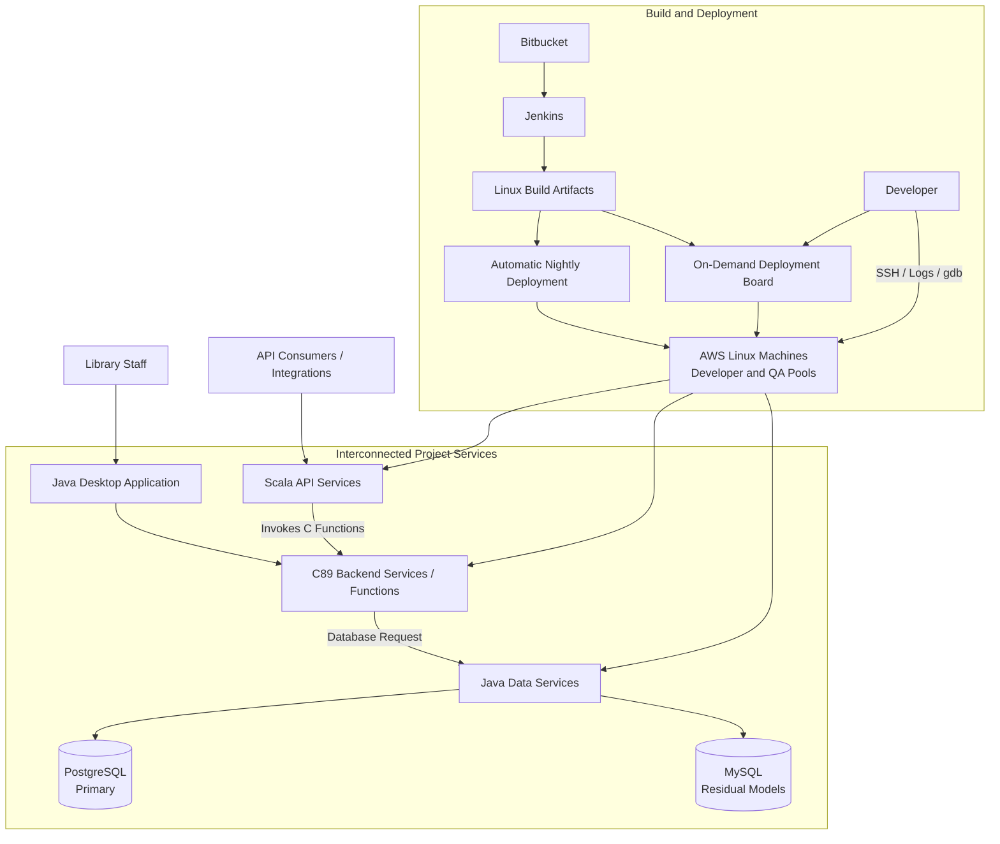

# Sierra Integrated Library System | March 2022 - April 2024

Quick routes through this document:

- **Recruiter / first answer:** sections 01, 10 and 12.
- **Technical interview:** sections 03, 07, 08 and 09.
- **Product and source context:** sections 02 and 13.

## 01 Project Snapshot

| Field | Details |
|---|---|
| Product / system | Sierra, an integrated library system from Innovative Interfaces |
| Domain | Library management, staff workflows, patron and collection data, and third-party integrations |
| Period | March 2022 - April 2024 |
| Delivery company / customer | EPAM delivery team for Innovative Interfaces |
| Role | Primarily C backend developer; occasional work in Java data services and desktop application, and Scala API code |
| Target roles | C/C++ backend, systems programming, Linux, legacy modernization and cross-component debugging |
| Team | 3 C developers, 3 Java developers, 4 QA engineers, 1 Business Analyst and 1 PM/Scrum Master |
| Customer-side collaboration | 3 developers, later 4, their development manager and a Product Owner |
| Users / deployment | Library staff and API/integration consumers; production services deployed on Linux in AWS |
| Main stack | C89, Java 8/11, Scala, Swagger, PostgreSQL, MySQL, custom protocols, Jira, Bitbucket, Jenkins, Linux and AWS |
| Primary responsibility | Shared responsibility across the C codebase: bug fixing, enhancements, refactoring and new features; log-first diagnosis and cross-component Java/Scala changes |
| Product status | Established production product maintained through a regular release process |
| Confidentiality | Public product context plus non-customer-specific engineering detail; private protocol fields, customer data, credentials and infrastructure identifiers remain confidential |

### 30-Second Summary

I worked primarily as a C developer on Sierra, sharing responsibility for the full C89 codebase with two other C engineers. I implemented features, fixed defects and refactored modules across the backend. Scala APIs invoked C behavior, while database-dependent C code called Java data services that worked with PostgreSQL and residual MySQL models. I occasionally changed Java and Scala when a task crossed component boundaries. Logs were the main diagnostic tool; for native failures I used SSH, `gdb` and core dumps on AWS Linux.

### Two-Minute Overview

Sierra is a mature integrated library system supporting circulation, cataloging, acquisitions, electronic-resource management and integrations with other library services. I joined an established product team responsible for ongoing development and maintenance rather than a greenfield implementation.

My primary responsibility was the C89 backend across its modules. Together with the other C developers, I implemented new functionality, corrected defects and refactored long-lived code while preserving established library workflows. The architecture crossed several language boundaries: Scala implemented API-facing services and invoked C functionality, while database-dependent C behavior used Java data services. PostgreSQL was the primary database after an earlier migration, while less-used models remained in MySQL. Java also implemented the desktop application.

My secondary contributions included a Scala API request exposed through Swagger and handled by C-side processing, Swagger documentation updates, and a Java desktop-table column whose data was prepared on the C side. I also fixed native defects involving US daylight-saving-time behavior, fixed-size character arrays, custom multilingual text processing, ideographic search/highlighting and C-generated web/PDF output.

The team used two-week sprints, daily stand-ups, weekly grooming, sprint demos and retrospectives, plus technical sessions with customer developers. Jira tracked work, Bitbucket hosted source and Jenkins built on AWS Linux. Builds were deployed automatically at night or on demand through an internal board to separate developer and QA machines. All added EPAM and customer reviewers had to approve a change. Product releases occurred approximately twice per year.

## 02 Context, Goals & Constraints

### Customer / Business Context

Innovative Interfaces is a library-software vendor founded in 1978 and now part of Clarivate. Its product portfolio serves academic, public, national, consortium, corporate and special libraries. My work was delivered by EPAM in direct collaboration with Innovative developers, their development manager and a Product Owner.

### Product and Users

Sierra is an integrated library system for operational library workflows. Public documentation covers circulation, cataloging, acquisitions, serials, electronic-resource management and integrations with discovery and self-service systems. Its REST API exposes bibliographic, item, patron, hold, checkout, fine, order and other record-oriented operations.

The product included both Sierra Web and a Java-based Sierra Desktop Application. The project architecture also contained Scala API services, C backend services and Java data services. Java mediated database access for C. PostgreSQL stored most operational data after an earlier migration, while some less-used models remained in MySQL.

### Scope and Criticality

- The engineering scope crossed C backend services, Java data services, a Java desktop application, Scala APIs, PostgreSQL, MySQL and custom inter-service protocols.
- A single user-visible operation could cross several processes and language runtimes.
- Compatibility and regression control were central because the product supported established library workflows.
- Failures could affect staff operations, external integrations and access to library records.
- Development and customer groups were geographically distributed.
- Builds and integrated runtime validation used CentOS and Red Hat Enterprise Linux environments in AWS.

### Problem and Goals

- Implement requested backend behavior in C.
- Diagnose and correct defects without breaking established library workflows.
- Refactor legacy modules without introducing a risky rewrite.
- Keep C, Java and Scala components compatible across custom interfaces.
- Preserve the Scala-to-C and C-to-Java-to-database data paths.
- Preserve correct behavior across PostgreSQL and residual MySQL-backed models.
- Investigate issues across component boundaries instead of patching only the visible symptom.
- Deliver changes through the team's development, QA and release process.

### Ownership Boundaries

- My primary responsibility was C backend development across the shared C codebase.
- Java desktop/data-service and Scala API work was task-specific and secondary.
- I integrated with the inherited microservice decomposition, custom protocols and database-access boundaries.
- Java 8 was migrated to Java 11 during the project by other engineers.
- The MySQL-to-PostgreSQL migration took place before my assignment.
- AWS infrastructure, Jenkins administration, database administration and library configuration were outside my role.

### Constraints

- The backend was a long-lived C89 codebase with compatibility obligations.
- Fixed-size `char` arrays made length, termination, bounds and initialization errors especially dangerous.
- A locally correct change could break a Java/Scala consumer or a staff workflow.
- Custom protocols made data layout, field semantics and error handling part of the compatibility contract.
- Database-dependent C behavior crossed a Java service boundary before reaching PostgreSQL or MySQL.
- Distributed defects produced evidence in several service logs.
- C development used Visual Studio and text editors, while Java and Scala work used Eclipse and IntelliJ IDEA.
- Compilation and integrated validation happened on AWS Linux rather than on the local workstation.
- With approximately two releases per year, changes had to remain stable across a long release train.

### Cross-Cutting Requirements

- **Reliability:** backend failures and inconsistent data had to be prevented from propagating into staff applications and integrations.
- **Compatibility:** C changes had to preserve behavior expected by Java services, the desktop application, Scala APIs and existing installations.
- **Diagnosability:** correlated service logs were the primary evidence across microservices; `gdb` and core dumps covered deeper native failures.
- **Data integrity:** patron, collection and operational workflows required consistent request/response mapping and database behavior.
- **Security/privacy:** patron and operational data remained inside established product and infrastructure controls.
- **Internationalization:** custom locale and character-mapping logic had to support multilingual search, rendering and generated output.

### Success Criteria

- Requested behavior works in the C backend and remains compatible with Java and Scala consumers.
- Database-dependent C behavior reaches the correct PostgreSQL or MySQL data path through Java services.
- The root cause is identified from runtime evidence before the correction is selected.
- Existing library workflows continue to work after a change.
- QA validates the change through the normal sprint and release process.
- Failures remain diagnosable through logs, debugger state or core dumps.

### Public Sources for Product and Technical Context

- Innovative Interfaces, Sierra product page: [https://iii.com/products/sierra-ils/](https://iii.com/products/sierra-ils/)
- Innovative Interfaces, Sierra REST API documentation: [https://techdocs.iii.com/sierraapi/Content/titlePage.htm](https://techdocs.iii.com/sierraapi/Content/titlePage.htm)
- Sierra REST API operations: [https://techdocs.iii.com/sierraapi/Content/zAPIs/operations.htm](https://techdocs.iii.com/sierraapi/Content/zAPIs/operations.htm)
- Innovative Interfaces, Sierra Web and desktop client: [https://documentation.iii.com/sierrahelp/Content/sweb/sweb_overview.html](https://documentation.iii.com/sierrahelp/Content/sweb/sweb_overview.html)
- Innovative Interfaces, company background: [https://iii.com/about/](https://iii.com/about/)
- Clarivate, completion of the ProQuest acquisition: [https://clarivate.com/news/clarivate-successfully-completes-acquisition-of-proquest/](https://clarivate.com/news/clarivate-successfully-completes-acquisition-of-proquest/)
- Sierra Direct SQL Access and PostgreSQL context: [https://documentation.iii.com/sierrahelp/Content/ssql/ssql_direct_access.html](https://documentation.iii.com/sierrahelp/Content/ssql/ssql_direct_access.html)
- Unicode Text Segmentation: [https://www.unicode.org/reports/tr29/](https://www.unicode.org/reports/tr29/)
- ICU Boundary Analysis: [https://unicode-org.github.io/icu/userguide/boundaryanalysis/](https://unicode-org.github.io/icu/userguide/boundaryanalysis/)

## 03 System Architecture & Integration Boundaries

### Main Components and Data Flow

| Component | Responsibility | Interfaces | My involvement |
|---|---|---|---|
| C89 backend services | Backend behavior and domain logic across the product | Calls from Scala, requests to Java data services and custom protocols | Primary development area across the shared C codebase |
| Scala API services / Swagger | API entry points, request handling and documentation | API requests and invocation of C behavior | Occasional features, fixes and documentation updates |
| Java 8/11 data services | Mediate access to PostgreSQL and MySQL | Requests from C and database responses | Occasional features and defect fixes |
| Java desktop application | Staff-facing desktop workflows | Project services and backend data | Occasional features, fixes and investigation |
| PostgreSQL / MySQL | Primary and residual relational persistence | Access through Java data services | Application-level integration; no migration or administration ownership |
| Jira | Task and sprint tracking | Project workflow | Regular use |
| Bitbucket / Jenkins | Source hosting and AWS Linux builds | Repositories, build jobs and artifacts | Regular use in the delivery process |
| Deployment board | Start an assigned machine and deploy a selected build | Build selection and AWS machine control | Regular developer deployment workflow |
| AWS developer environments | Compile and run selected or nightly builds | SSH, logs, processes, `gdb` and core dumps | Development and debugging environment |
| AWS QA environments | Separate deployed machines for validation | Builds and test scenarios | Defect reproduction and fix validation |

### External Integrations

- Scala services exposed product functionality through APIs and reused C domain behavior.
- C code used Java data services for database-dependent operations.
- Java data services routed requests to PostgreSQL or residual MySQL models.
- The product exposed public APIs and integrated with other library systems through established Sierra interfaces.
- Custom protocols connected independently running project services.

### State, Failure and Trust Boundaries

- A user-visible error in the desktop application or API could originate in another process or language layer.
- One API operation could cross Scala and C; one database-dependent operation could cross C, Java and a database.
- Custom-protocol payloads and error semantics formed compatibility contracts between services.
- Backend, data-service, database, desktop and deployed state had to remain consistent.
- Core dumps captured native process state and were correlated with logs, inputs and the deployed build.
- Patron and operational data stayed within the product's existing access and infrastructure controls.

### Technical Ownership

**Direct implementation:**

- C89 features, defect fixes and refactoring across the backend modules.
- Targeted diagnostic logging and native debugging.
- C-side multilingual, time-handling, memory and output-generation fixes.

**Integration and secondary contributions:**

- Scala API requests and Swagger documentation.
- Java data-service and desktop changes required by cross-component tasks.
- PostgreSQL/MySQL workflows through Java services.
- AWS build/deployment validation through the established tooling.

**Adjacent platform areas:**

- Overall Sierra architecture and roadmap.
- Primary ownership of Java and Scala subsystems.
- AWS, Jenkins and database administration.
- Customer library configuration.

## 04 Tech Stack & Technical Decisions

| Area | Technologies | Project use / constraint | My depth |
|---|---|---|---|
| Backend | C89, Linux | Mature core with long-lived compatibility requirements | Primary area across the shared C codebase |
| Data services / desktop | Java 8, later Java 11 | Existing service and staff-application stack | Occasional feature and defect work |
| API | Scala, Swagger | API layer reused domain behavior through C functions | Occasional feature, defect and documentation work |
| Data | PostgreSQL, MySQL | PostgreSQL primary; less-used models remained on MySQL | Integrated through Java services |
| Architecture | Microservices, custom protocols | Existing service and language boundaries | Consumer, debugger and contributor across affected services |
| IDE / build | Visual Studio, text editors, Eclipse, IntelliJ IDEA, Jenkins | Local editing with compilation and runtime work on AWS Linux | Regular hands-on use |
| Task tracking | Jira | Sprint and project workflow | Regular use |
| Source / CI/CD | Bitbucket, Jenkins, deployment board | Source, builds, automatic nightly and selected on-demand deployments | Regular use |
| Runtime | AWS, CentOS, Red Hat Enterprise Linux | Separate developer and QA machine pools | Application build, deployment and debugging |
| Diagnostics | Service logs, added logging, SSH, `gdb`, core dumps | Cross-service and native failure analysis | Regular hands-on use |

### Important Decisions and Tradeoffs

| Context / decision | Alternative | Chosen approach | Tradeoff | My role |
|---|---|---|---|---|
| Change a mature C89 module | Broad rewrite | Focused changes inside the inherited design | Preserved compatibility while retaining legacy structure | Implemented features, fixes and targeted refactoring |
| Failure spans microservices | Debug one process first | Follow logs across the request path, then use native tools where required | Manual correlation across services | Applied log-first diagnosis and targeted `gdb`/core analysis |
| C needs database data | Add direct database access in C | Preserve the Java data-service boundary | More hops and failure points | Implemented and debugged behavior across the boundary |
| Scala API needs domain behavior | Duplicate logic in Scala | Reuse established C functions | Cross-language integration complexity | Maintained both sides when a task required it |
| Issue spans components | Stop at the C boundary | Deliver coordinated C and Java/Scala changes | Broader review and validation surface | Implemented end-to-end task changes |
| Integrated validation | Depend only on local checks | Use on-demand and nightly AWS deployments | Slower feedback than isolated local testing | Worked through the established deployment process |

## 05 Team, Role & Ownership

### Team and Collaboration

The EPAM delivery team consisted of:

- 3 C developers, including me.
- 3 Java developers.
- 4 QA engineers.
- 1 Business Analyst.
- 1 person combining Project Manager and Scrum Master responsibilities.

The customer-side group included three developers, later four, their development manager and a Product Owner. The Business Analyst had strong functional knowledge and sometimes participated in testing alongside QA.

The team was geographically distributed. I worked first from Belarus and later from Poland. Some teammates moved from Saint Petersburg to Georgia, Lithuania and Turkey, while several team members remained in Ukraine. Customer participants also worked from different locations.

### Responsibilities

- Implement features and fixes in C89.
- Refactor legacy code without changing required behavior.
- Trace behavior across Scala APIs, C services, Java data services and PostgreSQL/MySQL.
- Diagnose defects in AWS Linux environments through service logs.
- Add focused logging or use SSH, `gdb` and core dumps for native failures.
- Implement related Java or Scala changes when a complete task crossed the C boundary.
- Compile and validate changes on AWS Linux.
- Use automatic nightly and on-demand deployments.
- Work with QA and the Business Analyst on reproduction and regression validation.
- Track sprint work in Jira.
- Participate in mandatory cross-company code review.
- Participate in stand-ups, grooming, demos, retrospectives and customer technical sessions.

### Role Boundaries

- **Primary:** C89 backend development across the shared codebase.
- **Secondary:** Java desktop/data-service and Scala API changes for specific tasks.
- **Integrated with:** PostgreSQL, MySQL, AWS Linux and the delivery pipeline.
- **Outside my responsibility:** Java migration, database migration, infrastructure administration and product roadmap.

## 06 Delivery, Testing & Quality

### Development Process

- Two-week Scrum sprints.
- Daily stand-ups.
- Weekly grooming.
- Jira task tracking.
- Demo and retrospective for every sprint.
- Periodic technical sessions with customer developers.
- QA reproduction and regression validation, with occasional BA participation.
- Code review by EPAM and customer developers.
- Approval required from every added reviewer.
- Approximately two product releases per year.

### Build and Deployment

- Source code was stored in Bitbucket.
- Jenkins compiled builds on Linux machines hosted in AWS.
- Deployments ran automatically at night.
- A custom internal board allowed a developer to start an assigned machine and deploy a selected build on demand.
- Developers and QA used separate AWS machines.
- Runtime environments used CentOS and Red Hat Enterprise Linux.
- SSH provided access for investigation and debugging.

### Test Strategy

- **C developer validation:** compile, deploy to an assigned AWS machine, reproduce the scenario and inspect logs/runtime state.
- **Scala automation:** API/integration tests invoked C services and exercised selected native behavior indirectly.
- **Nightly integration:** automatic deployment exposed problems visible only after component integration.
- **On-demand integration:** selected builds provided faster developer feedback without waiting for the nightly cycle.
- **Cross-component validation:** check Scala-to-C and C-to-Java-to-database behavior as one workflow.
- **QA validation:** four QA engineers performed functional and regression testing on separate AWS machines.
- **Business validation:** the Business Analyst sometimes supported testing with product knowledge.

The C code did not have unit tests. Validation therefore combined developer reproduction, Scala-side integration automation, QA regression testing, remote deployments and mandatory code review.

### Compatibility Matrix

| Producer / change | Consumer | Required behavior | Validation |
|---|---|---|---|
| Scala API change | C function | Request reaches the correct native behavior and returns a coherent result | API/integration scenario and Swagger contract |
| C database request | Java data service | Request and response fields retain their meaning | Cross-service logs and integrated scenario |
| Java data-service change | PostgreSQL / MySQL | Correct data source is queried and mapped back to C | Database-backed integration scenario |
| PostgreSQL path | Java/C workflow | Primary database behavior remains stable | QA regression on the affected workflow |
| Residual MySQL model | Java/C workflow | Less-used model continues to function | Targeted regression on the affected workflow |
| Java 11 runtime | Java services and connected components | Existing behavior remains compatible after migration | Team migration and regression process |
| C / Java / Scala change set | Desktop or API workflow | End-to-end behavior remains consistent | On-demand or nightly AWS deployment plus QA |

### Observability and Debugging

The primary diagnostic method was to follow logs across the relevant microservices. When existing logs were insufficient, I added targeted logging. For native C failures I used `gdb` and core dumps on AWS Linux machines over SSH.

The diagnostic sequence was:

1. Reproduce the user or QA scenario.
2. Identify the first service showing incorrect state.
3. Correlate the request and data across the other service logs.
4. Inspect the C process with `gdb` or a core dump for memory and control-flow failures.
5. Correct the component that owned the fault.
6. Deploy the changed build and repeat the end-to-end scenario.
7. Hand the validated case to QA for regression testing.

### Reliability, Security and Performance Validation

- Reliability combined focused developer reproduction, integration automation, nightly builds and QA regression.
- Cross-company review reduced compatibility risk in a system shared by several specialist groups.
- Separate developer and QA machines kept investigation and independent validation distinct.
- Customer and patron data stayed inside the established project environment and access model.
- Performance-sensitive changes were validated through the affected workflow rather than presented as personal business metrics.

## 07 Contributions

### C Backend Development

- Shared responsibility for the C89 backend with the other two C developers.
- Implemented new behavior, fixed defects and refactored code across the backend modules.
- Preserved contracts used by Scala APIs and Java data services.
- Delivered changes through the regular sprint, review and release process.

### Cross-Component Production Debugging

- Followed failures through Scala, C, Java and database boundaries.
- Correlated logs from several services before selecting the fix location.
- Added focused logging where the existing evidence was insufficient.
- Used `gdb` and core dumps for native crashes and invalid-memory behavior.
- Implemented or coordinated corrections in the component that owned the root cause.

### Java Data Services and Desktop Application

- Added functionality and fixed defects in Java when a task crossed the backend boundary.
- Added a new table column to the Java desktop application.
- Kept the UI column aligned with data processed on the C side.
- Worked with request/response mapping and database-backed behavior through Java services.

### Scala API and Swagger

- Added an API request and its handling in Scala.
- Exposed the operation through Swagger documentation.
- Connected the request to established C-side data processing.
- Updated Swagger documentation in additional tasks.
- Preserved request, response and error semantics across the Scala/C boundary.

### Representative C Defects and Output Paths

- **US daylight-saving time:** corrected a time-handling defect before the upcoming US transition. The root cause was an increment placed at the wrong point in a C function; moving it into the correct control-flow location restored transition behavior.
- **Fixed-size character arrays:** corrected length, bounds and initialization problems. Symptoms included truncated text on web pages and application crashes after invalid or uninitialized-memory access.
- **Multilingual rendering:** corrected cases where the custom locale and character-mapping system emitted raw encoded characters instead of the intended text.
- **Ideographic search/highlighting:** corrected C-side matching that applied word-oriented boundaries to Japanese text composed and searched through character/syllable units. The fix restored finding and highlighting of the requested page text while preserving Chinese and Korean support.
- **Web/PDF generation:** corrected blank pages and incorrect page transitions in C-generated web and PDF output.

## 08 Key Engineering Challenges

### 1. Working Safely in a Long-Lived C89 Codebase

The code accumulated compatibility requirements over many years. Fixed-size buffers amplified small mistakes in length, termination and initialization. The effective approach was to reconstruct ownership and data flow before making focused changes.

### 2. Log-First Diagnosis Across Microservices

The visible symptom could appear in the Java desktop application or Scala API while the root cause lived in C, a data service, a protocol payload or runtime state. Following logs across the request path was more effective than debugging one process in isolation.

### 3. Preserving the Scala-to-C API Boundary

Scala reused C domain behavior. Request mapping, returned values and error handling therefore had to remain coherent across two runtimes and Swagger documentation.

### 4. Following Database Requests Across Two Databases

Database-dependent C behavior crossed Java services. PostgreSQL served most workflows, while less-used models remained in MySQL. Diagnosis had to identify the owning data path before changing C, Java or SQL-facing behavior.

### 5. Coordinating Changes Across Interconnected Codebases

A feature or defect often crossed components maintained by different specialists. Focused component changes still had to be treated as one end-to-end deliverable during review and validation.

### 6. Remote AWS Builds and Deployments

Editing happened locally, while compilation and realistic validation happened on AWS Linux. The on-demand deployment board shortened feedback for targeted builds, and nightly deployment provided integrated coverage.

### 7. Correctness Across Time, Languages and Generated Output

Time-zone transitions, custom locale tables, ideographic matching and pagination all contained edge cases outside ordinary ASCII and single-page flows. Each required representative inputs and validation of the final user-visible result.

## 09 Representative Interview Stories

### Fix a Time-Critical US DST Defect

- **Situation:** a C-side defect would produce incorrect behavior during an upcoming US daylight-saving-time transition.
- **Task:** identify and correct the issue before the transition reached production workflows.
- **Actions:** traced the affected time-handling function and found an increment executed at the wrong point in the control flow. Moved the increment into the correct branch/location and validated the transition scenario.
- **Result:** corrected the behavior before the US DST change.
- **Lesson:** a one-line state update can be operationally critical when it sits on a calendar boundary.

### Add a Scala API Request Backed by C

- **Situation:** the product required another API operation while the established domain processing already existed in C.
- **Task:** expose the operation through Scala and Swagger without duplicating backend logic.
- **Actions:** added request handling in Scala, connected it to the C processing path, mapped the returned data and updated Swagger documentation.
- **Result:** delivered a documented API operation that reused the established native behavior.
- **Lesson:** cross-language reuse avoids duplicated domain logic but makes interface and error semantics part of the feature.

### Add a Java UI Column Backed by C Data

- **Situation:** a desktop table needed to display an additional value produced by backend processing.
- **Task:** extend the Java UI and preserve alignment with the C data path.
- **Actions:** added the Java table column, connected its mapping to the data produced on the C side and validated the complete desktop workflow.
- **Result:** delivered the requested user-visible field through a coordinated Java/C change.
- **Lesson:** apparently small UI changes can require backend and interface work across component ownership boundaries.

### Correct Search Highlighting for Japanese Text

- **Situation:** search/highlighting worked for supported Chinese and Korean paths but failed for Japanese ideographic text.
- **Task:** make entered search text find and highlight the corresponding page content.
- **Actions:** traced the C-side custom locale and character-mapping path and corrected the use of word-oriented boundaries for text represented through character/syllable units.
- **Result:** restored matching and highlighting for the affected language path.
- **Lesson:** text search must use segmentation rules appropriate to the writing system rather than assume whitespace-delimited words.

### Fix Character-Array Memory Defects

- **Situation:** fixed-size `char` arrays produced truncated web text and, in other cases, application crashes.
- **Task:** correct length, boundary and initialization handling without altering the expected output format.
- **Actions:** traced buffer sizes and initialization, corrected invalid accesses and ensured complete text reached the rendering path.
- **Result:** restored complete output and removed crash paths caused by invalid or uninitialized memory.
- **Lesson:** buffer capacity, content length and the terminating null character must be propagated as one contract.

### Fix C-Generated Web/PDF Pagination

- **Situation:** generated pages contained blank output or incorrect transitions between pages.
- **Task:** preserve content and page structure across web and PDF generation.
- **Actions:** traced page-generation state and corrected the transition/pagination logic used by the C output path.
- **Result:** generated documents no longer introduced the affected blank pages or incorrect transitions.
- **Lesson:** generated-document state deserves deterministic regression cases just like API output.

## 10 Outcomes and Impact

| Outcome | Engineering / user value |
|---|---|
| Features, fixes and refactoring delivered across the C backend | Evolved a mature product while preserving established library workflows |
| Cross-service failures diagnosed through logs and Linux tools | Located root causes across language and service boundaries |
| US DST defect corrected before the transition | Preserved correct date/time behavior during a time-sensitive boundary |
| Scala request exposed through Swagger and backed by C | Extended the API without duplicating native domain processing |
| Java table column backed by C data | Delivered an end-to-end desktop feature across Java and C |
| Character-array and initialization defects corrected | Restored complete text output and removed native crash paths |
| Japanese search/highlighting corrected | Restored locale-appropriate find/highlight behavior |
| Web/PDF pagination defects corrected | Removed blank pages and incorrect page transitions |
| Nightly and on-demand AWS deployments used | Supported scheduled integration and targeted developer validation |
| Mandatory EPAM/customer review | Added shared compatibility review before integration |

### Resume-Ready Bullets

- Shared responsibility for the C89 backend of Innovative Interfaces' Sierra platform, implementing features, fixing defects and refactoring modules while preserving established library workflows.
- Diagnosed distributed failures on AWS-hosted Linux systems by tracing service logs and using SSH, `gdb` and core dumps for native C issues.
- Fixed C defects involving US daylight-saving-time behavior, fixed-size character arrays, multilingual rendering, Japanese search/highlighting and generated web/PDF output.
- Extended cross-language functionality with a Swagger-documented Scala API request backed by C processing and a Java desktop-table column backed by C-side data.
- Compiled and validated changes through Jenkins builds, nightly and on-demand AWS deployments, separate developer/QA environments and mandatory cross-company review.

## 11 Tradeoffs, Lessons & Retrospective

### Tradeoffs

- Focused C89 changes reduced compatibility risk but retained parts of the legacy structure.
- Java-mediated database access preserved architectural boundaries but added hops to diagnosis.
- Reusing C behavior from Scala avoided duplicated domain logic but increased cross-runtime integration complexity.
- Remote integrated validation reflected production behavior but produced slower feedback than local component tests.
- The absence of C unit tests increased dependence on integration automation, QA and careful review.

### What I Learned

- Follow a distributed request through logs before selecting the component to change.
- Treat protocol payloads and cross-language mappings as versioned contracts.
- Separate a visible symptom from the service that owns the root cause.
- Handle buffer capacity, content length, initialization and termination together in C.
- Apply writing-system-appropriate segmentation rules to multilingual search.
- Use narrow modernization changes in long-lived systems with a large regression surface.

### What I Would Improve Today

- Add focused C unit tests around buffer handling, time transitions, locale logic and pagination.
- Add contract tests for Scala-to-C and C-to-Java request/response mappings.
- Build a regression corpus covering Chinese, Korean and Japanese search/rendering cases.
- Add deterministic golden-output tests for generated web pages and PDFs.
- Improve cross-service correlation identifiers in logs.
- Automate representative deployment and smoke-test scenarios on developer and QA environments.

## 12 Interview Answer Kit

### Role-Specific Emphasis

- **C/C++ backend:** C89 maintenance, memory correctness, refactoring and native debugging.
- **Distributed systems:** log-first diagnosis across Scala, C, Java and database services.
- **Legacy modernization:** focused improvements under compatibility constraints.
- **Linux:** remote compilation, SSH, `gdb`, core dumps and AWS runtime investigation.
- **API/full-stack:** Scala/Swagger request backed by C and Java UI behavior backed by C data.

### Strongest Technical Deep Dives

- US DST control-flow correction under a delivery deadline.
- Japanese search/highlighting and custom locale segmentation.
- Fixed-size `char` array defects causing truncation and crashes.
- Scala-to-C API integration with Swagger.
- C-to-Java-to-database diagnosis across PostgreSQL and MySQL.
- Log-first debugging and core-dump analysis on AWS Linux.

### Likely Follow-Up Questions

- **What was your primary role?** C backend development across the shared C89 codebase, with occasional Java and Scala work for cross-component tasks.
- **How did the architecture work?** Scala exposed APIs and invoked C behavior; database-dependent C code used Java data services to access PostgreSQL or residual MySQL models.
- **How did you debug distributed failures?** I followed the request through service logs, added targeted logging and used `gdb` or core dumps for native failures.
- **How was C tested?** Through developer reproduction, Scala-side integration automation, QA regression, nightly/on-demand deployments and mandatory code review; the C code did not have unit tests.
- **What was the strongest C bug?** A US DST defect caused by an increment at the wrong point in a function, corrected before the upcoming transition.
- **What internationalization issue did you solve?** Japanese search/highlighting failed because the custom C path applied word-oriented matching to character/syllable-based text units.
- **How did deployment work?** Jenkins built on AWS Linux; builds deployed automatically at night or on demand through an internal board to separate developer and QA machines.
- **How did code review work?** EPAM and customer developers reviewed changes, and every added reviewer had to approve.
- **How did the team work?** Two-week sprints with daily stand-ups, weekly grooming, demos, retrospectives and customer technical sessions.

### Confidentiality Boundaries

- Discuss product architecture at the language/service level and use sanitized defect examples.
- Keep custom protocol fields, customer data, private endpoints, hostnames, credentials and infrastructure identifiers confidential.
- Present Java/Scala work as secondary cross-component contribution and infrastructure as an integrated platform rather than personal ownership.

### Glossary

- **ILS:** Integrated Library System; software supporting core library operations and records.
- **Sierra:** Innovative Interfaces' library services platform.
- **Data service:** a component that exposes or transforms data for other services.
- **Microservice:** an independently running service collaborating through defined interfaces.
- **Nightly build:** an automated integration build produced on a scheduled overnight cycle.
- **Custom protocol:** a project-specific communication contract between components.
- **Core dump:** a snapshot of native process memory and execution state around a crash.
- **`gdb`:** GNU Debugger, used to inspect native processes, stack traces, variables and core dumps.

## 13 Sources and Reference Material

### Project Sources

- Project history provided for the Sierra assignment: architecture, team, delivery, debugging and representative tasks.
- `Interview/SelfIntro.md`: C89, Java, Scala, custom protocols, Linux, feature work, refactoring, logs, `gdb` and core dumps.
- Historical CVs: March 2022 - April 2024 period, remote Linux work through SSH, cross-language changes, code review and product maintenance.

### Public Sources

- Sierra product overview: [https://iii.com/products/sierra-ils/](https://iii.com/products/sierra-ils/)
- Sierra REST API documentation: [https://techdocs.iii.com/sierraapi/Content/titlePage.htm](https://techdocs.iii.com/sierraapi/Content/titlePage.htm)
- Sierra API operations: [https://techdocs.iii.com/sierraapi/Content/zAPIs/operations.htm](https://techdocs.iii.com/sierraapi/Content/zAPIs/operations.htm)
- Sierra Web and desktop-client overview: [https://documentation.iii.com/sierrahelp/Content/sweb/sweb_overview.html](https://documentation.iii.com/sierrahelp/Content/sweb/sweb_overview.html)
- Sierra Direct SQL Access: [https://documentation.iii.com/sierrahelp/Content/ssql/ssql_direct_access.html](https://documentation.iii.com/sierrahelp/Content/ssql/ssql_direct_access.html)
- Innovative Interfaces company background: [https://iii.com/about/](https://iii.com/about/)
- Clarivate acquisition of ProQuest: [https://clarivate.com/news/clarivate-successfully-completes-acquisition-of-proquest/](https://clarivate.com/news/clarivate-successfully-completes-acquisition-of-proquest/)
- Unicode Text Segmentation: [https://www.unicode.org/reports/tr29/](https://www.unicode.org/reports/tr29/)
- ICU Boundary Analysis: [https://unicode-org.github.io/icu/userguide/boundaryanalysis/](https://unicode-org.github.io/icu/userguide/boundaryanalysis/)
