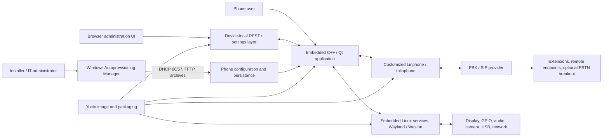

# Embedded SIP Desk Phone Platform | May 2025 - August 2026

> Purpose: a finished interview reference and a source for CV/resume bullets. Contains only facts and conclusions accepted for external use.

Quick routes through this document:

- **Recruiter / first answer:** sections 01, 10 and 12.
- **Technical interview:** sections 03, 07, 08 and one story from 09.
- **Sources and implementation evidence:** section 13.

## 01 Project Snapshot

| Field | Details |
|---|---|
| Product / system | Embedded SIP/IP desk-phone software platform for Cuman INFINITY ITL780 and ITL789-class devices |
| Domain | Embedded Linux, enterprise VoIP, device management and autoprovisioning |
| Period | May 2025 - August 2026 |
| Role | C++/Qt engineer working across the application, customized Linphone SDK, Yocto integration and Windows provisioning tooling |
| Target roles | Senior C++/Qt, Embedded Linux, SIP/VoIP and cross-platform systems engineering |
| Team | 4 C++ engineers on our side; customer PM, approximately 2-4 C++ developers, 1 web developer and usually 2-4 QA engineers; staffing varied during the project |
| Users / deployment / scale | Managed office, reception, dispatcher, meeting-room and contact-center scenarios |
| Main stack | C++17, Qt 5.15, Linphone/liblinphone, SIP/RTP, Yocto, Embedded Linux, C#/.NET 8, WinForms |
| Primary ownership | Qt call/account architecture; customized Linphone SDK registration watchdog and primary/backup failover/failback; application-side integration of those APIs; a backup-domain AuthInfo SDK change; major Autoprovisioning Manager implementation; cross-layer device debugging |
| Product status | Publicly listed phone models; release status varies by software feature |
| Contribution status | The SDK watchdog/failover logic and AuthInfo `DomainBackup` change were personally implemented; backup-server application integration was merged; the CallSession/CallService refactor was completed as engineering work; Autoprovisioning Manager release history reaches 2.13.1 |
| Confidentiality | Public product facts plus internally verifiable technical detail; omit credentials, private URLs/IPs and customer data |

### 30-Second Summary

I worked on the software stack for an embedded SIP desk-phone platform, primarily as a C++/Qt engineer. The product combined a touchscreen application, a customized Linphone SDK, Yocto firmware and a Windows provisioning tool. My strongest areas were call/account architecture, implementing the SDK-side registration watchdog and primary/backup failover/failback behavior, integrating it through the application and provisioning paths, and building out most of the practical Autoprovisioning Manager functionality. The hardest part was keeping asynchronous SIP state, UI models, persisted configuration, firmware services and physical-device behavior consistent across layer boundaries.

### Two-Minute Overview

The platform powered physical enterprise SIP phones with account registration, calls, BLF and speed dial, contacts, audio/video conferencing, network and certificate settings, browser-based administration and centralized provisioning. I mainly developed the embedded C++/Qt application, where I connected asynchronous Linphone call and registration events to MVC/MVVM-style models and UI controllers, but the work frequently crossed into the customized Linphone SDK, Yocto recipes and target-device runtime.

A representative problem was primary/backup SIP-server support. It was not enough to store two addresses: the system had to expose the active server, keep registration and authentication context coherent, update the Qt UI and persist/generate compatible configuration. An early application-level switching approach was reverted; I implemented the registration watchdog and failover/failback state machine in the customized Linphone SDK, integrated its backup/active-server APIs into the phone, added active-proxy diagnostics and compatibility handling, contributed a backup-domain field to SDK AuthInfo, and aligned the settings and provisioning paths.

I also finished and substantially extended the Windows Autoprovisioning Manager. This included discovery, DHCP/TFTP delivery, SIP Digest realm probing and HA1 generation, configuration packaging, project save/load and migration from .NET Framework 4.8 to .NET 8. Most validation was scenario-based on physical ARM64 phones, using application/SIP/system logs, Qt remote debugging and repeated firmware or component deployment.

## 02 Context, Goals & Constraints

### Customer

Cuman / Digital System Servis (DSS), Kazakhstan - a telecommunications and electronics manufacturer operating the Cuman brand. More broadly, the customer is a regional manufacturer and service provider of network connectivity equipment - managed and unmanaged switches, routers, PBX systems and SIP-based telephony devices for residential and commercial use. The phone platform was one product line inside that connectivity portfolio, which is why interoperability with third-party and legacy SIP hardware kept coming up. Public company materials describe Cuman as having its own production facility, SMD/THT PCB assembly, plastic injection, quality control, assembly, packaging and supply processes. Cuman's own materials also present the company as having unique developments, own production, modern design and certification across the product line.

### Product

Cuman INFINITY ITL780 and ITL789 - desktop SIP/IP phone product lines listed publicly by Cuman and Kazakhstan's national export catalog. Public materials list the ITL780 as a desktop SIP phone/terminal and the ITL789 as a desktop SIP video phone.

The ITL780 product page lists an 8-inch 1024x768 touchscreen, direct IP calling, 66 programmable BLF/speed-dial touch keys, 25-party audio conferencing, remote phonebooks, VLAN, autoprovisioning, web management, TLS/SRTP/HTTPS, MD5/MD5-sess and ZRTP support.

The ITL789 product page extends the line into a larger video/conferencing endpoint with a 12-inch class touchscreen, detachable side module, camera module, direct IP calling, programmable BLF controls, 25-party audio conferencing, 4-party video conferencing, H.264/VP8 video, remote phonebooks, web management, and secure SIP/IP communication features.

The two models are one software platform. They differ in the screen - 8 inches on the ITL780, 12.1 inches on the ITL789 - and in the camera module, which only the ITL789 carries. The application, the Yocto image and the provisioning tooling are the same codebase; model-specific build variables cover display geometry and the camera/video stack, including the mediasoup/WebRTC dependencies that only the camera-equipped model needs. Everything in this document therefore applies to both models except where it is specifically about video or the camera.

Beyond the public pages, the shipped device is a 12.1-inch 1024x768 G+G capacitive five-point touchscreen terminal with a USB Type-C port, RJ9 handset and headset ports, an RJ45 WAN port with PoE+, a separate non-standard USB-C port for the detachable side module, a 48 V power supply and a detachable camera module. Video calls run at 720p or VGA. Up to three simultaneous call lines are supported, with hold-and-answer and drop-and-answer handling on the second line.

Two facts matter most for describing the work. First, the phone runs a **PBX compatibility mode**, and the PBX it interoperates with in these deployments is Mitel MX-ONE. Second, that switch decides who hosts a conference: with compatibility mode off, the conference is hosted locally on the phone; with it on, the PBX hosts and the participant limit follows the PBX rather than the device. Remote phonebook synchronization is configurable over HTTP, HTTPS or UDP against an XML URL, on a ten-minute, hourly or daily interval, and either merges with or replaces the local book. Firmware is updated either by uploading an image through the device web interface or from a TFTP server, where the update entry point is a script named `update.sh`. Direct IP calling, addressed as `IP:x.x.x.x` without a SIP server, works for both audio and video calls.

Public product and export-catalog entries list both ITL780 and ITL789 as market-facing Cuman products. The linked registry sources list EAEU notification KZ0000007309 for the ITL780. Certification work was outside my role. TLS/SRTP/HTTPS support is listed separately in Cuman's public product specifications.

### Target Users and Deployment Context

The phones targeted managed enterprise telephony: office users, reception and dispatcher scenarios, meeting rooms, internal extensions, BLF/speed-dial monitoring, video calls, conferences, centralized configuration, and IT-managed fleet deployment.

Kazakhstan's export catalog positions the ITL780 for corporate, commercial, government and operator telephony scenarios, and the ITL789 for offices, dispatch centers, government institutions and contact centers.

Public company materials describe Cuman/DSS equipment as used in government and large-infrastructure contexts. My software responsibility was the phone platform; individual end-customer deployments were outside my role.

### Scope, Scale & Criticality

- The software spanned a native phone UI, telephony SDK, firmware image, device services, local web/API integration and a Windows fleet-provisioning tool.
- The product handled real-time communication and device/network configuration, so stale state or a malformed configuration could prevent registration, calls, media or fleet rollout.
- Public model specifications provide product-level scale such as programmable-key and conference capacity.

### Problem and Goals

The engineering goal was to turn a collection of telephony, UI, firmware and management components into a dependable managed endpoint. The main goals relevant to my work were:

- Keep SIP registration, calls, transfers, conferences, BLF and media state consistent in the native UI despite asynchronous SDK and network events.
- Support predictable primary/backup SIP-server failover and failback, including authentication-realm differences and state persistence.
- Make device configuration repeatable across fleets rather than relying on manual per-phone setup.
- Keep local UI changes, web/API changes, provisioning files and effective runtime configuration compatible with each other.
- Package the application, SDK, services, configuration and model-specific dependencies into reproducible embedded Linux images.
- Preserve deployed configuration semantics while modernizing the Windows provisioning tool.

### Non-Goals and Ownership Exclusions

- The phone did not provide a PSTN gateway, analog telephony interface or carrier-routing layer; external PBX/provider infrastructure handled PSTN breakout and dial plans.
- I did not implement the browser frontend or the device-local REST/API layer. I integrated the Qt application and firmware behavior with those components.
- I did not select Qt Widgets, Yocto or WinForms as greenfield technologies; they were inherited foundations.
- I did not own upstream Linphone or the complete product/firmware stack alone.
- I did not run an official certification program, even though the product used protocols and security features relevant to interoperability and certification discussions.

### Constraints

- ARM64 target hardware, model-specific peripherals and a Wayland/Weston runtime meant that many defects could only be reproduced on physical phones.
- The Qt application, customized SDK, provisioning output, Linux services and persisted settings formed one behavioral contract; a local fix could cause a regression in another layer.
- Real SIP/PBX implementations differed in authentication challenges, realms, routing, codecs and failover behavior.
- Firmware and provisioning changes had to preserve compatibility with existing configuration formats and administrator workflows.
- Full on-device regression testing was not automated, so integration feedback was slower than ordinary desktop development.
- Several major technology choices and codebase boundaries were inherited, limiting the value of broad replatforming during feature and stabilization work.

### Cross-Cutting Requirements and Security Boundaries

- **Reliability:** registration recovery, reboot persistence, service readiness and UI/runtime consistency mattered more than isolated component success.
- **Performance/resources:** ARM64 hardware, media conversion/rendering and full-image build cycles constrained debugging and iteration.
- **Trusted-network protocols:** DHCP, TFTP and SNMP v2/v2c are operationally useful for managed LAN provisioning/discovery but do not provide modern end-to-end confidentiality and authentication.
- **Digest compatibility:** MD5-based SIP Digest/HA1 and the product-specific MD5 admin-password field were compatibility requirements, not examples of modern password-storage design.
- **Project-file encryption:** `.cuman` files are AES-encrypted with an application-held key and a generated IV stored with the ciphertext. The implementation has no AEAD authentication tag or separate MAC, so it provides encryption but not tamper-evident storage, user-keyed credential protection or a complete secret-management design.
- **Secure media:** TLS/SRTP/ZRTP/HTTPS support was a product/SDK capability and integration area; enablement depended on deployment configuration.

### Success Criteria

- Accounts register and recover through primary/backup server changes without stale UI or incorrect authentication context.
- Call, conference, BLF and media state visible to the user follows the effective SDK/runtime state.
- Generated common and device-specific provisioning artifacts are delivered and applied as expected.
- Settings changed through supported entry points remain consistent and survive restart where persistence is required.
- The complete image starts the compositor, local services and phone application in a reliable order on target hardware.
- `.cuman` projects written in the supported `Project`/JSON schema at project end restore meaningful configuration state and reproduce compatible provisioning output; unsupported legacy formats fail visibly rather than being described as backward compatible.

Outcomes in this document use observable behavior and repeatable scenarios rather than invented numerical metrics.

### Public Sources for This Section

The public sources below establish customer, product and market context. Cuman pages are vendor sources, export-catalog pages are market listings, and Glavcert is a third-party registry view; personal implementation details come from project repositories and records.

- Cuman product catalog: [https://cuman.kz/en/production/](https://cuman.kz/en/production/)
- Cuman ITL780 product page: [https://cuman.kz/ru/production/products/infinity-itl780/](https://cuman.kz/ru/production/products/infinity-itl780/)
- Cuman ITL789 product page: [https://cuman.kz/ru/production/products/infinity-itl789/](https://cuman.kz/ru/production/products/infinity-itl789/)
- Kazakhstan export catalog, ITL780: [https://export.bgov.kz/ru/transport/33/cuman-infinity-itl780-sip-phone/](https://export.bgov.kz/ru/transport/33/cuman-infinity-itl780-sip-phone/)
- Kazakhstan export catalog, ITL789: [https://export.bgov.kz/ru/transport/33/cuman-infinity-itl789-sip-video-phone/](https://export.bgov.kz/ru/transport/33/cuman-infinity-itl789-sip-video-phone/)
- Cuman company context: [https://cuman.kz/en/about_us/](https://cuman.kz/en/about_us/)
- Astana Invest DSS/Cuman plant article: [https://investastana.kz/en/astana-invest/press-center/news/digital_system_servis_plant/](https://investastana.kz/en/astana-invest/press-center/news/digital_system_servis_plant/)
- Glavcert / EAEU notification record KZ0000007309: [https://glavcert.ru/ntf/record/0455d523-76aa-45d1-94ac-91e5ca3f39f2](https://glavcert.ru/ntf/record/0455d523-76aa-45d1-94ac-91e5ca3f39f2)
- Official EAEU record linked by Glavcert: [https://nsi.eaeunion.org/portal/1994/card/0455d523-76aa-45d1-94ac-91e5ca3f39f2](https://nsi.eaeunion.org/portal/1994/card/0455d523-76aa-45d1-94ac-91e5ca3f39f2)

## 03 System Architecture & Integration Boundaries

### Main Components and Data Flow

The Qt application was the main user-facing orchestration layer. It translated user actions into Linphone operations and mapped asynchronous registration, call, conference, media and BLF callbacks back into stable UI models. It also coordinated persisted settings, network configuration, device hardware and local runtime services.

The Windows tool produced common and device-specific configuration artifacts and delivered them through DHCP/TFTP-oriented workflows. On the phone, provisioning state had to converge with values exposed through the native UI and the separate web/API configuration path. Yocto assembled all of these components, their dependencies, services and default assets into the target image.

| Component | Responsibility / state | Main interfaces | My involvement | Evidence status |
|---|---|---|---|---|
| Qt phone application | Calls, accounts, contacts, settings and user-visible runtime state | Qt signals/slots, liblinphone C/C++ APIs, files, DBus/local services | Primary development and architecture area | Verified in `cumanphone` code/history |
| Customized Linphone/liblinphone | SIP registration/calls and project-specific backup/active-server behavior | C/C++ API and callbacks | Personally implemented the SDK registration watchdog and failover/failback state machine, an AuthInfo backup-domain change and the application integration | Present in `cumanphone` and `linphone-sdk` history |
| Device-local REST/web path | Browser/device-management configuration | Local routes, DTOs and settings services | Consumer/integrator, not implementation owner | Ownership boundary recorded in project notes |
| Yocto image/runtime | Builds and installs binaries, services, dependencies and model assets | BitBake recipes, systemd, filesystem layout | Recipe/package/startup contributions and target debugging | Present in related layer history |
| Autoprovisioning Manager | Discovers devices; generates, stores and distributes configuration | SNMP, ICMP/UDP, DHCP, TFTP, SIP probing, ZIP/config files | Major implementation and modernization area | Verified in code, Git history and README releases |
| PBX/SIP provider | Registration, routing, remote call behavior and optional PSTN breakout | SIP and RTP/RTCP | External dependency | Not my implementation |

### State and Failure Boundaries

The most important architectural risk was distributed state. The same account or device option could be represented in the provisioning project, generated files, persistent phone configuration, Linphone account/authentication objects, Qt models and web/API DTOs. Failures often appeared at the boundary between two correct-looking local representations. Debugging therefore followed data from its source through serialization, delivery, persistence, runtime application and final UI behavior.

Trust boundaries were equally important. Provisioning and discovery operated on a managed LAN using protocols such as DHCP, TFTP and SNMP v2/v2c; configuration artifacts could contain credentials or hashes. Secure signaling/media capabilities and management HTTPS were separate from the security properties of the provisioning transport. These distinctions must remain explicit in interview wording.

### Technical Ownership Boundaries

- **Owned or directly implemented:** the customized Linphone SDK registration watchdog and primary/backup failover/failback logic, application-side integration and diagnostics, a backup-domain AuthInfo SDK change, major areas of the Windows Autoprovisioning Manager, and multiple Qt application models/controllers including late-project call-architecture refactoring.
- **Contributed to and integrated:** Yocto recipes/image contents, firmware startup, media and device behavior, Linphone compatibility fixes, settings/provisioning flows and phone-side WebRTC/mediasoup integration.
- **Integrated with but did not implement:** device-local REST/API layer and browser frontend.
- **External:** PBX/SIP-provider routing, server-side dial plans, remote SIP behavior and PSTN breakout.

One boundary moves at runtime rather than being fixed. The phone's PBX compatibility setting decides whether a conference is hosted on the device or on the PBX - Mitel MX-ONE in these deployments. With the setting off, mixing, participant list and limits belong to the phone; with it on, they belong to the PBX and the phone becomes a participant that drives an external conference. The same user-facing buttons therefore exercise two different owners of conference state, which is worth stating explicitly when the call and conference architecture comes up.

## 04 Tech Stack & Technical Decisions

| Area | Technologies | Why / constraint | My depth |
|---|---|---|---|
| Embedded application | C++17, Qt 5.15, Qt Widgets, Qt Designer `.ui`, QSS, Qt Model/View, QThread/Qt Concurrent, Qt Multimedia, Qt Network, Qt DBus, SQLite | Existing touchscreen application and device-integration foundation | Primary development area |
| Telephony and media | Linphone SDK/liblinphone, SIP, RTP/RTCP, SRTP/ZRTP-related integration, WebRTC/mediasoup, libyuv | Product telephony and conferencing requirements | Personally implemented the project-specific SDK watchdog/failover behavior and its application integration; not ownership of upstream Linphone |
| Firmware/platform | Yocto Kirkstone, BitBake, Embedded Linux, systemd, Wayland/Weston, i.MX ARM64, lighttpd and dropbear as on-device services | Reproducible BSP, filesystem and service integration | Recipes, packaging, startup and target debugging |
| Tooling and process | Qt Creator with remote kits, Qt Designer, CMake/qmake, GCC cross-toolchain, gdb/gdbserver, Valgrind, Git with GitLab and GitLab CI, Asana | Project-standard toolchain and workflow | Daily working environment |
| Provisioning | C#, .NET 8, WinForms, SQLite/Dapper, SNMP, DHCP/TFTP, SIP Digest | Existing Windows administrator tool and deployed configuration contract | Major implementation and modernization area |
| Testing/diagnostics | Qt Test, MSTest, Qt Creator remote kits, gdb/gdbserver, application/SIP/system logs | Mix of isolated logic and hardware-dependent behavior | Focused automated tests and on-device scenario validation |

This section describes the technologies I worked with or had to integrate against in the project. It is not meant to imply that I personally owned every component listed below.

The main technical foundations were inherited rather than greenfield choices made by me or by our team: .NET/WinForms for the Autoprovisioning Manager, Qt 5/Qt Widgets for the main phone application, and Yocto for firmware/image builds. Replacing them would have been a broad replatforming effort with high compatibility and schedule risk, outside the scope of the feature and stabilization work described here.

### Important Decisions and Course Corrections

| Context / decision | Alternative | Why this path | Cost / risk | My role / status |
|---|---|---|---|---|
| Primary/backup registration | Keep manual switching/retry logic in Qt | Put the watchdog and active/backup state machine in customized liblinphone and let Qt synchronize presentation/configuration | Dependency on a customized SDK and rebase cost | I implemented and then reverted an application-level rotation attempt, implemented the SDK watchdog/failover logic, integrated its APIs and added diagnostics/compatibility handling; the final application integration was merged |
| `.cuman` persistence | Serialize the WinForms control tree generically | Explicit project-state DTOs make fields, defaults and schema growth reviewable | Every new field requires deliberate mapping/migration work | I implemented the explicit gather/restore path; released in the Autoprovisioning Manager 2.x line |
| Firmware integration | Deploy standalone binaries/scripts outside the image | Continue with inherited Yocto layers so dependencies, filesystem contents and services are reproducible | Slower builds and more complex cross-build debugging | Inherited platform; I adapted recipes, packages and startup behavior |
| Hardware validation | Rely on desktop/component tests | Repeat scenarios on ARM64 phones for media, GPIO, boot, networking and full-image behavior | Slower feedback and limited automation | Shared project constraint and regular validation workflow |
| Late call-architecture refactor | Continue expanding the legacy call model/facades | Introduce explicit session, service, adapter and presentation boundaries | Large migration surface and release risk near project end | I completed the refactor as internal architecture work |

### Detailed Technology Inventory (Reference)

This inventory is for keyword recall and technical follow-ups; it should not be recited as an interview answer.

#### Embedded Qt Phone Stack (Reference)

- C++17.
- Qt 5.15.x.
- Qt Widgets and embedded UI.
- Qt Designer `.ui` forms.
- QSS (Qt Style Sheets) for touch-oriented theming and small-screen layouts.
- Qt Model/View for the list- and table-backed screens: contacts and phonebooks, call history, conference participants, programmable keys.
- Qt signals/slots, QObject ownership and lifetime, and queued connections across thread boundaries.
- QThread alongside Qt Concurrent for background and blocking work.
- Qt Multimedia and Qt Multimedia Widgets.
- Qt Network and Qt WebSockets.
- Qt Concurrent.
- Qt DBus.
- Qt SQL / SQLite.
- Qt Test for focused unit and integration tests.
- Wayland/Weston runtime on the target device.
- libgpiod for hardware buttons and GPIO integration.
- libudev for USB/network-device monitoring.
- libyuv for video-frame conversion.
- mediasoupclient, libsdptransform and libwebrtc for WebRTC conferencing on supported builds.

#### Linphone SDK / SIP Stack

- Linphone SDK / liblinphone.
- SIP registration, calls, conferences and presence/BLF-related integration points.
- RTP/RTCP media transport.
- SRTP/ZRTP-related security features as exposed by the SDK and product requirements.
- NAT traversal and ICE/STUN/TURN concepts where they affected SDK configuration or debugging.
- SIP Digest authentication.
- Authentication realm handling.
- Customized registration failover/failback behavior for primary and backup SIP servers.

#### On-Device Services (Reference)

- **Lighttpd** - the lightweight web server running on the phone itself, serving the device's browser-based configuration interface. It is what an administrator reaches when configuring a phone by its IP address, and it is part of the firmware image rather than an external service.
- **Dropbear** - the lightweight SSH server on the target, used for shell access to the device during development, deployment and debugging. Its footprint is why it is used in place of OpenSSH on an embedded device.
- Both are integrated through Yocto recipes and started as systemd services, so their configuration, file layout and startup order are part of the image rather than something applied afterwards on a running device.

#### Yocto / Embedded Linux

- Yocto Project with Kirkstone-based layers.
- meta-cuman, meta-bc and meta-mediasoup integration.
- i.MX / ARM64 target builds.
- BitBake recipes for the Qt phone application, Linphone SDK, web/runtime components and device services, including the on-device lighttpd and dropbear services.
- Weston/Wayland startup flow.
- systemd services.
- U-Boot environment integration.
- kernel and device-driver integration points and patches where needed.
- firmware image packaging and installation scripts.

#### Windows Provisioning Tool Stack (Reference)

- C#.
- .NET 8 for Windows.
- WinForms.
- Migration from .NET Framework 4.8 to SDK-style .NET 8 project format.
- Encrypted `.cuman` project-file save/load flow based on explicit project-state DTOs.
- Microsoft.Data.Sqlite and Dapper.
- Repository / Unit of Work data-access pattern.
- MSTest.
- SharpSnmpLib.
- SNMP v2/v2c discovery and querying.
- ICMP ping and UDP socket discovery.
- DHCP server/client behavior, including options 66 and 67.
- Built-in TFTP provisioning distribution.
- DotNetZip packaging.
- System.Management / WMI and netsh integration for Windows network-interface handling.
- async/await-based background operations.
- SIP Digest authentication, HA1/MD5 generation and realm probing.
- 401/407 challenge parsing, including WWW-Authenticate and Proxy-Authenticate.
- Localization resources.
- Device configuration templates.
- ZIP archive generation.
- Inno Setup packaging and silent installation support.

#### Tooling and Process (Reference)

- Qt Creator, including remote kits for building and debugging against the target device.
- Qt Designer for `.ui` form layout.
- CMake and qmake.
- GCC cross-toolchain, gdb and gdbserver for on-target debugging, Valgrind for memory diagnostics.
- Git, with **GitLab** for hosting, merge requests and code review, and **GitLab CI** for pipelines.
- **Asana** for task and sprint tracking - the project's planning tool, in place of Jira.
- Inno Setup for Windows installer packaging.

## 05 Team, Role & Ownership

### Team and Collaboration

On our side, the development team consisted of 4 C++ engineers, including me. On the customer side, the team included a project manager, roughly 2-4 C++ developers, one web developer, and usually 2-4 QA engineers, with some turnover during the project.

Customer-side staffing varied during the project, so the figures above describe the typical team composition. Our own engineering group grew from four to six over the course of the project.

### Technical Lead Responsibilities

Alongside individual delivery I took on lead responsibilities for our engineering sub-group, including responsibility for the engineers' professional development and performance evaluation, while maintaining roughly 80% individual-contributor output. The group grew from four engineers to six over the course of the project and continues to grow, so onboarding and mentoring became a recurring rather than occasional part of the role.

In practice this covered:

- Steering code quality and architectural decisions for the group.
- Code review, and contributing to task planning.
- Onboarding new engineers as the team grew.
- Technical mentoring, and support for technical interviews during hiring.
- Participating in architectural discussions and making recommendations on language standard and toolchain.

The framing that holds up best in an interview is the honest one: a senior individual contributor carrying a lead component, not a move into management. Roughly 80% of my time remained hands-on implementation, and the lead responsibilities sat on top of that.

My primary role was C++ development for the embedded Qt phone application, but my work often crossed layer boundaries: C#, Yocto/Linux integration, customized Linphone SDK behavior, provisioning tooling, deployment scripts, firmware packaging, and device-level configuration.

The built-in web frontend and the device-local REST/API layer were not my deliverables. Another developer implemented and owned the REST/API work. I used that layer as an integration surface while working on the Qt application architecture, MVC/MVVM-style models, controllers, settings flows and synchronization with provisioning/runtime state.

### Role and Delivery Boundaries

My ownership boundaries were:

- I worked on the embedded Qt/C++ application, MVC/MVVM-style models and controllers, Linphone integration, provisioning tooling, Yocto/image integration and target-device debugging.
- My primary/backup work included the original Qt-level rotation attempt and its reversion, implementation of the customized liblinphone watchdog/failover/failback state machine, migration of the application to those APIs, active-proxy diagnostics, settings and backward-compatibility work, and a separate SDK AuthInfo backup-domain change.
- I completed the late-project CallSession/CallService architecture refactor as internal engineering work.
- The Windows Autoprovisioning Manager was a major owned area: a foundation already existed, and I finished it and built out most practical provisioning and support workflows.
- .NET/WinForms, Qt 5/Qt Widgets and Yocto were inherited project foundations.
- The device REST API and web administration UI belonged to another developer; I integrated with them and kept Qt-side state compatible with their configuration path.
- My WebRTC/mediasoup work covered phone-side integration and debugging plus specific early server/client changes described by the repository history.

In practice, I worked across:

- Embedded Qt application development.
- SIP call and account behavior, including primary/backup application integration and active-server synchronization.
- Contact, phonebook and call-history features.
- Audio/video call flows.
- Video-conference integration.
- Using REST/settings endpoints provided by another developer for device-side management flows.
- Network configuration features.
- Hardware integration.
- Yocto recipes and image-level packaging within the inherited Yocto platform.
- Targeted Linphone SDK patches and integration, including backup-domain authentication context and project-specific backup/active-server APIs.
- Windows provisioning tooling, including finishing and building out most of the tool's practical functionality on top of an existing foundation.
- Device diagnostics and supportability.

## 06 Delivery, Testing & Quality

### Development Process

The workflow was lightweight and direct:

- Asana for task and bug tracking.
- Telegram for daily cross-team communication.
- GitLab for source control.
- Physical phones for integration and regression testing.
- Manual and semi-automated builds for firmware/application validation.

### Build and Deployment

Automated CI/CD did not provide full firmware or on-device regression validation. There was build automation in the repository, but the practical validation path for most changes was still developer-driven: build the relevant component, deploy it to a physical phone or firmware image, and reproduce the original scenario on hardware.

Most incoming work consisted of bugs reported by the customer or discovered during device testing. Tasks were tracked with the available symptoms, reproduction notes, logs, firmware version, device model, SIP/PBX configuration and provisioning state. In the early phase, some reports were incomplete, so part of the engineering work was reconstructing the failing environment from partial evidence. As the project matured, QA reports became more structured and usually included debug-level logs and more precise reproduction steps.

The useful first step was usually classification, not coding: decide whether the symptom looked like provisioning generation, Qt model state, SDK behavior, Linux runtime setup, network/SIP infrastructure, media-device behavior or a mismatch between configuration entry points. That reduced the chance of fixing a visible symptom while leaving the real cross-layer cause untouched.

The work was therefore not just "fix an isolated bug in the UI". A customer-visible problem could originate in generated provisioning data, Linphone account state, SIP authentication, Linux network configuration, service startup order, media-device availability, filesystem layout, or a mismatch between web configuration and Qt application state. Debugging required following the state across these layers and validating the final behavior on the phone.

This mattered especially for:

- Embedded Linux image changes.
- Linphone SDK changes.
- Provisioning behavior.
- Network and TLS/certificate setup.
- Audio/video device behavior.
- Web UI coexistence with the Qt application.
- Hardware-dependent features such as buttons, USB devices, display behavior, camera, audio routes and network interfaces.

### Test Strategy

Testing was strongly scenario-based. A typical bug report included a specific device state, SIP account configuration, PBX behavior, network topology, provisioning template, firmware version, and steps that had to be repeated on the target phone.

- **Unit / focused integration:** Qt Test and MSTest for validation, conversion, model/controller, project-state and other isolated logic where practical.
- **Component:** Application or provisioning-tool builds tested against representative configuration and protocol behavior.
- **System:** Complete scenarios across generated provisioning, firmware, SIP/PBX behavior and the running phone.
- **Hardware:** Physical-device validation for GPIO, USB, audio, camera, network interfaces, Wayland/Weston and boot sequencing.
- **Regression:** Repeat the original failure path, then check adjacent call, registration, provisioning, persistence and reboot scenarios affected by the same state.

### Observability and Debugging

The typical investigation loop was:

- Review the task, attached logs and customer notes.
- Recreate SIP accounts, provisioning data and network conditions where required.
- Build the relevant component or firmware image.
- Deploy the build to a physical ARM64 phone.
- Reproduce the issue using the original call, provisioning or startup sequence.
- Collect application logs, SIP logs, system logs, media statistics and generated configuration.
- Compare generated provisioning configuration with effective runtime configuration.
- Use Qt Creator remote debugging, gdb/gdbserver or additional diagnostics when needed.
- Patch or coordinate the fix in the relevant layer and repeat the original scenario on hardware.

The feedback loop was longer than ordinary desktop development, but that was the cost of validating a real embedded product. Many defects only appeared when the device, SIP server, provisioning files, display stack, audio/video hardware and embedded Linux runtime were combined.

### Reliability, Security & Performance Validation

- Registration and provisioning changes were exercised through failure/recovery and persistence scenarios, not only happy-path configuration.
- Media and call-control changes were checked for adjacent states such as hold, transfer, second call, video upgrade/downgrade and teardown where applicable.
- Security-related work was compatibility-focused: certificates, HTTPS/TLS settings, secure-media options and digest fields. It was not a formal penetration test or certification exercise.
- Validation combined targeted automated tests with scenario-based testing on physical hardware; product-scale load, soak and hardware-lab automation were outside this workstream.

## 07 Contributions

### Embedded Qt Phone Application

I worked on the main C++/Qt application running on the embedded desk phone. The application was responsible for the user-facing telephony experience and for much of the device-side integration with SIP, media, settings, hardware, network configuration and local services.

The application was the central orchestration layer between the user interface, Linphone SDK/liblinphone, embedded Linux runtime, media devices, network configuration, GPIO, USB devices, provisioning files, local services and device settings. Even when the root cause lived in the SDK, firmware image or provisioning layer, the Qt application had to present the correct user-visible state and keep its models synchronized with asynchronous events from lower layers.

This mattered because many features were cross-layer by design. A SIP registration issue could involve generated provisioning config, account settings, active/backup server state, authentication realm, network reachability and UI indicators. A video-call issue could involve negotiated media direction, SDK call parameters, camera availability, native video windows, frame conversion, Qt widget lifecycle and target-device runtime dependencies.

#### Main Areas I Worked On

- Working on call screens, call controls and call-state synchronization.
- Integrating Linphone SDK call, registration, account, conference and media events into Qt MVC/MVVM-side models and UI controllers.
- Supporting audio calls, video calls, conference flows and call transfer scenarios.
- Working on SIP account configuration, registration state, primary/backup server behavior and authentication-related behavior.
- Working on contact and phonebook features, including local contacts, remote XML contacts, CSV import/export, conflict handling and call-history linkage.
- Supporting BLF and speed-dial behavior, including subscription management, LED/UI state mapping and programmable key pages.
- Working on device settings screens and models for network, display, audio, camera, accounts, certificates, contacts and provisioning-related configuration.
- Consuming and coordinating with the device-local REST/settings layer implemented by another developer.
- Supporting network configuration features such as static IP, DHCP, DNS, VLAN, MTU, PMTU and persistence into system-level configuration files.
- Working with hardware-specific behavior through GPIO, udev, multimedia devices and display/runtime services.
- Debugging behavior directly on ARM64 target phones.

#### Architecture and Orchestration

The codebase's central runtime object was CoreManager. I worked mainly on the Qt application side around Linphone integration, MVC/MVVM-style models, account settings, call list/session models, contacts models, contact import pipeline, SIP address/status models, BLF subscription management, GPIO integration, audio behavior, network state and UI-facing controllers. CoreManager also connected to the existing REST server and REST router, which were implemented and owned by another developer.

CoreManager also handled or routed important SDK and device events: registration state changes, call state changes, call statistics, provisioning state, network reachability changes and BLF notifications. This made it the main bridge between asynchronous lower-level events and the rest of the Qt application.

The call UI was organized around controller-based flow rather than direct UI-to-SDK manipulation. Components such as CallSessionManager, AudioCallController, VideoCallController, AudioConferenceController and VideoWindowController helped separate call state, media state, conference behavior and rendering behavior from the widgets themselves. This made the code easier to debug when call transitions happened asynchronously or in quick succession.

In practice, the architecture was not a pure textbook MVC or MVVM implementation. It was a Qt application with MVC/MVVM-style separation where models represented SIP accounts, calls, contacts, settings and runtime state; controllers translated user actions and asynchronous SDK callbacks; and widgets focused on rendering and user interaction. The accurate description is MVC/MVVM-style separation rather than a claim of a perfect framework-pattern implementation.

#### Late-Project Call Architecture Refactor

The existing controller architecture still left substantial call lifecycle, SDK access and presentation behavior behind legacy `CallModel` facades. Late in the project, I implemented a broader internal refactor:

- Introduced explicit `CallSession` state and a `CallSessionRegistry` rather than treating UI-facing models as runtime ownership objects.
- Extracted `CallService`, `CallLifecycleService` and `CallSessionRuntimeService` responsibilities.
- Added Linphone-facing adapters/readers and state snapshots so presentation code did not need to query mutable SDK objects directly for every concern.
- Routed UI commands and lifecycle notifications through service/session boundaries and progressively removed legacy `CallModel` paths.
- Added/updated call-session tests and architecture documentation while migrating callers in small reviewable steps.

**Result and status:** the work produced a new session/service/adapter structure and a traceable incremental migration. It is presented as completed internal architecture and refactoring work.

**Why it is interview-relevant:** it demonstrates incremental migration of a stateful legacy subsystem, explicit runtime ownership, isolation of a third-party SDK and disciplined separation between domain/session state and Qt presentation. The tradeoff was a large change surface and temporary extra indirection during migration.

#### Call and Telephony Layer

I worked with the internal call-control architecture around components such as CoreManager, CallSessionManager, AudioCallController, VideoCallController and related Qt models/controllers.

This included:

- Mapping Linphone call states into stable UI states.
- Handling outgoing and incoming calls.
- Managing active, held, transferred and conference call flows.
- Supporting video-call upgrade/downgrade and remote video request handling.
- Handling SIP/direct-IP conference invitations.
- Supporting DTMF scenarios.
- Coordinating call controls with hardware/UI state.
- Ensuring edge cases did not leave calls, media or UI controls in inconsistent states.

The dialing flow supported SIP URIs, internal extensions, direct IP targets and numeric phone numbers. Numeric phone numbers were not routed through any local PSTN interface. The application passed the target through Linphone URL/account handling and used the configured SIP account domain, route and transport where needed. If numeric calls failed while SIP URI calls worked, the cause could be number normalization, dial-prefix configuration, account domain selection, SIP transport, provisioning output or PBX/provider routing.

#### Contacts, Phonebook and Call History

I worked on contact-related functionality, including:

- Local contacts.
- Remote XML phonebook import.
- CSV import/export.
- Contact validation.
- Merge and conflict handling.
- Contact grouping and filtering.
- Integration between contacts, call history and dialing flows.
- Caching and refresh behavior for external phonebooks.

Remote phonebook behavior was more than a simple file import. It had to download external contact data, parse XML/CSV formats, validate fields, handle avatars where present, merge or replace existing local contacts, report progress, recover from failed downloads and avoid breaking the call-history/contact relationship. This was especially important for managed deployments where administrators expected contacts to update without manual work on each phone.

#### BLF, Speed Dial and Programmable Keys

The device supported programmable touch keys for BLF, speed dial and related telephony shortcuts. I worked on:

- BLF subscription management.
- Mapping SIP presence/dialog state to UI state.
- Key-page models and configuration.
- Speed-dial behavior.
- Account-specific key behavior.
- Persisted key configuration.
- Integration with the device settings UI and provisioning data.

BLF behavior was sensitive because the UI state depended on SIP subscription lifecycle and server-side notifications. The application had to keep programmable key configuration, account selection, subscription state and visual indicators consistent even when registrations changed, accounts were reconfigured or the monitored extension changed state on the PBX side.

#### Video and Conferencing

On the video side, I worked with Qt multimedia integration, Linphone media callbacks and the phone-side WebRTC/mediasoup-based conferencing path used by supported builds.

This included phone-side work around:

- Video-call UI and controller behavior.
- Camera enumeration and selection.
- Local/remote video rendering flows.
- Video preview handling.
- WebRTC conference joining and room/client lifecycle behavior on the phone.
- mediasoupclient / libsdptransform / libwebrtc integration on the device side.
- libyuv-based frame conversion paths.
- Video device and target-hardware debugging.

The video path had to distinguish signaling success from media success. A call or conference could be established at the SIP/session level while rendering still failed because of camera enumeration, negotiated media direction, codec behavior, frame format conversion, native window lifecycle or missing runtime dependencies on the target image. Debugging this required checking both the high-level call state and the lower-level media/rendering path.

#### Network, Certificates and Security-Related Settings

I worked on device settings and persistence around:

- Static and DHCP network configuration.
- DNS, gateway and route-related settings.
- VLAN configuration.
- MTU and PMTU behavior.
- Certificate import, validation and trust-store integration.
- HTTPS/certificate setup used by device management.
- SIP authentication and account registration settings.
- Security-related UI and persistence flows.

#### REST / Local API Usage and Integration Boundaries

The phone application included a device-local REST/settings layer, but I did not implement the REST server, router or endpoint set. That work belonged to another developer. My role was to use this layer as an integration surface and to keep the Qt MVC/MVVM-side models, settings flows and runtime state compatible with what the REST/API layer exposed.

I interacted with REST/API-backed behavior around:

- Account and registration settings.
- Device settings.
- Contacts and call-history data.
- Network configuration.
- Diagnostics and status.
- Interoperability with provisioning and built-in web configuration workflows.

The local API layer in the codebase was organized around route classes, DTOs, services and executor helpers rather than putting all behavior directly into HTTP handlers. I used that structure for integration and debugging, especially when a setting changed through the web/API path but had to remain consistent with Qt models, provisioning data and live runtime state. My responsibility was REST/API integration, while another developer owned the REST implementation.

This layer was also one of the main integration points with the browser-accessible configuration interface. I did not implement the web frontend either, but my Qt-side changes still had to avoid inconsistencies between web/API changes, local UI changes and provisioning-driven changes.

#### Testing and Debugging

I added or maintained focused QtTest coverage where it was practical, especially around local logic I touched: validation, models, contact import/export, configuration conversion and controller behavior.

For hardware-dependent areas, validation required the actual target device. I used a workflow of building the component, deploying it to the phone, reproducing the exact scenario, collecting logs, checking persistent configuration, and verifying UI/runtime behavior after restart.

Debugging often used Qt Creator remote kits, SSH deployment, gdb/gdbserver, application logs, SIP logs, system logs, kernel logs, structured key-value diagnostics and media statistics. Desktop tests were useful for isolated logic, but they could not replace on-device validation for GPIO, USB, audio routes, camera devices, Wayland/Weston timing, network-interface behavior or firmware packaging.

#### Shipped Feature Surface

This is the user-visible surface the application had to drive in the shipped product, and because the two models run the same software it is the platform's surface rather than one model's - only the video and camera items are specific to the ITL789. Everything below is behavior backed by Qt models, controllers and persisted settings.

**Navigation.** Six top-level tabs: home screen, dialer, recent calls, contacts, file system and settings. The home screen carries selectable widgets and a wallpaper, both configurable from settings.

**Account and network configuration.** Display name, SIP user and password, SIP server with port, **backup SIP server**, transport protocol, audio and video codec selection, RTP port and DTMF method. Network settings cover IPv4 by DHCP or static address, with IP, netmask, one or two DNS servers and gateway.

**Calls.** Handset, speakerphone or headset. Up to three simultaneous lines, with drop-and-answer and hold-and-answer handling when a second call arrives. Call history split into all, missed, incoming and outgoing, with per-entry details, delete and block. Direct IP dialling as `IP:x.x.x.x`, for audio or video.

**BLF.** Up to 66 programmable BLF keys, each bound to a subscriber number and a device IP address, with four monitored states shown by indicator colour: free (green), calling (blinking red), on a call (red) and unavailable (grey).

**Conferencing.** Participants are added one at a time - call, then merge - with the previous party held while the new one is dialled. Local conferences are mixed on the phone for up to 25 participants including the initiator; with PBX compatibility on, MX-ONE hosts and the limit is 8 including the initiator.

**Call handling options.** Do not disturb, call forwarding in unconditional, busy and no-answer variants with a ring timeout, caller-name lookup against the connected directory, auto-dial on off-hook, auto-answer without lifting the handset, and persistence of the microphone mute state between calls.

**Privacy and filtering.** A blocked-contacts list with unblock, rejection of anonymous calls, and rejection of numbers absent from the phonebook.

**Contacts.** Favourites, search through an on-screen keyboard, and server-side phonebook synchronization over HTTP, HTTPS or UDP against an XML URL, on a ten-minute, hourly or daily interval, merging with or replacing the local book.

**Ringtones and media.** Per-contact ringtones, upload of custom ringtone files through the file picker, volume and screen-brightness controls, a front indicator, and video capture at 720p or VGA.

**Time and power.** Automatic date and time over NTP/SNTP or manual entry; sleep mode with a timeout from ten seconds to ten minutes, optionally showing only the clock or keeping the wallpaper.

**System and diagnostics.** Syslog, reboot, factory reset, and firmware update either by uploading an image through the web interface or from a TFTP server via `update.sh`. The status screen exposes line state, network address and DNS, MAC address, model, software version, serial number, build number and hardware build number - the fields used first when reproducing a defect on a specific unit.

### Linphone SDK Customization

The project used a customized Linphone SDK/liblinphone layer rather than an untouched upstream SDK. I implemented its project-specific registration watchdog and primary/backup failover/failback behavior and integrated the non-upstream backup/active-server APIs into the Qt application; upstream Linphone and the rest of the project fork were outside my ownership.

#### Primary / Backup SIP Server Behavior

The product requirement covered:

- Primary SIP server configuration.
- Backup SIP server configuration.
- Automatic failover when the primary server became unavailable.
- Controlled failback when the primary server became available again.
- SIP registration watchdog behavior.
- Authentication data synchronization between primary and backup server contexts.
- Runtime visibility into which server was currently active.
- Persistence of active-server state and related metadata.

Meeting that requirement touched Linphone account/proxy configuration, registration state handling, configuration persistence, public C API exposure, Qt settings/models and provisioning output.

My implementation covered:

- Implemented the registration watchdog and primary/backup failover/failback state machine in the customized Linphone SDK, including cooldown, active-server persistence and forced failback.
- Added the backup-server field and application/configuration paths in the Qt phone.
- Implemented an application-level primary/backup rotation attempt, then reverted it when the responsibility was moved behind customized liblinphone APIs.
- Integrated `get/setBackupServerAddress`, `linphone_account_get_active_server_addr` and `linphone_account_is_on_backup_server` behavior into account settings, state synchronization and diagnostics.
- Added IPv6-aware parsing, active-proxy logging and backward compatibility with the legacy `backup_server` custom parameter.
- Added a `DomainBackup` field to SDK AuthInfo as a targeted SDK contribution.
- Aligned the Windows provisioning configuration with primary/backup fields and authentication context.

The customized SDK exposed concepts such as primary, backup and active server address, current backup state and watchdog/failback behavior. That state belongs close to registration rather than in a UI retry loop. I personally implemented the SDK watchdog, cooldown, persistence and forced-failback behavior, then integrated it into the application and provisioning paths and added the AuthInfo backup-domain change.

This course correction moved my implementation to the correct architectural layer: the first solution duplicated registration state in the application; the final design kept the state machine in the SDK and made the application consume that SDK-owned state.

#### Authentication and Realm Handling

The project had non-trivial SIP authentication requirements because real PBX/SIP-server deployments did not always behave identically.

I worked on behavior around:

- Strict authentication lookup.
- Realm-specific authentication.
- Primary and backup realms.
- Digest authentication data reuse where safe.
- Handling 401/407 authentication challenges.
- Avoiding incorrect credential use across server contexts.
- Keeping registration failover compatible with authentication state.

The most fragile scenarios involved HA1 or realm-specific credentials. For MD5-based SIP Digest, HA1 values are valid only for the username, realm and password used to calculate them, so they cannot be blindly reused if primary and backup servers present different authentication realms. The SDK and provisioning logic had to avoid a state where registration moved to another server but continued using credentials that belonged to the previous realm or identity.

#### Media and Compatibility Fixes

The customized SDK codebase included media and platform changes in areas such as:

- Audio and video conference behavior.
- Video packetization and payload-size handling.
- Thread and ticker behavior.
- Clock-source behavior on embedded Linux.
- Compatibility fixes for external SIP/PBX environments.
- Media behavior under constrained network conditions.

My personal SDK contributions in this area were the AuthInfo backup-domain change and a small H.26x NAL-packer update. Audio/video conference, ticker and clock-source work belonged to the broader customized SDK codebase.

Media changes were generally validated through real SIP/PBX scenarios because failures depended on server behavior, negotiated codecs, packetization, network MTU, timing and target-device runtime constraints.

### Yocto & Embedded Linux Platform Integration

I worked with the Yocto-based embedded Linux platform used to build and package the phone firmware. Yocto was already the historical firmware foundation when I joined; neither I nor our team chose it as a greenfield technology decision.

The platform integrated:

- The C++/Qt phone application.
- Customized Linphone SDK builds.
- Wayland/Weston runtime configuration.
- mediasoup/WebRTC-related native libraries for supported builds.
- Device web/runtime components.
- systemd services.
- Startup scripts.
- U-Boot environment handling.
- Kernel/device-driver patches.
- Default configuration archives and provisioning assets.

#### Why Yocto

Within that inherited constraint, Yocto was still the right fit because this was a reproducible embedded product image, not a regular Linux workstation or a single application package. The firmware had to combine the NXP/i.MX board-support stack, custom kernel/U-Boot changes, Qt/Wayland, the customized Linphone SDK, media libraries, WebRTC/mediasoup dependencies, web configuration files, runtime scripts, default configuration, certificates, fonts, sounds and model-specific files into one controlled filesystem image.

The important engineering constraint was control: exact dependency versions, sysroot/toolchain behavior, package metadata, installed paths, startup order, runtime services and update behavior all had to be reproducible. A missing file in the image, wrong RPATH, wrong pkg-config metadata, broken service dependency or incorrectly installed default archive could make a feature fail only after flashing the complete firmware.

Yocto was the project's inherited embedded build system. My work used and adapted that platform for application, SDK, runtime-service and firmware-image integration; technology selection and platform reimplementation were outside my role.

Other approaches would solve only part of the problem:

- Plain Qt deployment or copying binaries over SSH would be useful for quick debugging, but it would not define the complete root filesystem, service startup, default configuration, web files, certificates, kernel/U-Boot changes, update scripts or factory image content.
- A Debian-like embedded root filesystem would be faster for prototyping, but it would give less control over BSP integration, exact dependency versions, image contents, package metadata and reproducible firmware assembly.
- Buildroot would be simpler for a small image, but this product needed a layered vendor/customer BSP model, package metadata, generated SDK/sysroot support, model-specific recipes and long-term maintainability for a stack containing Qt, Linphone SDK, WebRTC, mediasoup libraries, local web services and hardware-specific runtime components.
- A Docker or standalone cross-compilation setup could help build individual components, but it would not describe the final target image or guarantee that the installed files, services and runtime dependencies matched the device firmware.

Yocto was therefore the practical choice because it let the product keep board-support code, application recipes, SDK integration, runtime services, model-specific differences and firmware packaging under one build system.

#### Recipes and Image Integration

I worked with BitBake recipes and Yocto metadata for:

- Building and installing the Qt application.
- Pulling in Linphone SDK and media dependencies.
- Packaging model-specific behavior for ITL780 and ITL789 variants.
- Installing runtime scripts and services.
- Packaging existing web/runtime components.
- Creating default configuration archives.
- Controlling service startup order.
- Packaging target filesystem paths under /opt/cumanphone and related system locations.

The phone application was installed together with its runtime layout: configuration files, default settings, translations, fonts, media resources, scripts, logs, provisioning assets, web files and service definitions. Model-specific build variables controlled the two hardware variants from one source tree: display geometry for the 8-inch and 12.1-inch panels, and the camera/video stack - including the mediasoup/WebRTC dependencies - which only the camera-equipped ITL789 needed.

The ITL789-class build path also included mediasoup/WebRTC-related native libraries. libwebrtc was cross-compiled for ARM64/aarch64 using GN/Ninja under the Yocto toolchain model, and libmediasoupclient was built on top of that stack. This required bridging external build systems with Yocto sysroots, package metadata, native build tools and target filesystem packaging.

#### Weston / Wayland Startup

The device UI stack depended on Weston/Wayland startup sequencing. I worked with service ordering and runtime behavior involving:

- Weston startup.
- Splash-screen service behavior.
- Qt application startup after the compositor was available.
- Disabling or adapting default Weston socket behavior where required.
- Ensuring the main phone UI started reliably after boot.

Startup order was a real product concern. The phone application depended on the compositor, filesystem layout, media devices, scripts and local services being ready. Some issues looked like application crashes or UI bugs, but the cause was a missing Wayland socket, delayed service, unavailable audio device, missing runtime file or incorrect systemd dependency.

#### Hardware and Platform Patches

The platform included low-level integration work around:

- Audio hardware behavior.
- Kernel patches for device-specific components.
- U-Boot environment configuration.
- Persistent configuration archives.
- Startup and recovery scripts.
- Model-specific feature flags.

The platform work also covered update and recovery support: scripts for saving DHCP provisioning options, downloading updates, preparing default archives, handling U-Boot environment data and keeping firmware-level defaults aligned with application expectations.

### Windows Autoprovisioning Manager

I also worked on, and largely built out, the Windows Autoprovisioning Manager used by installers and IT administrators to discover, configure and provision fleets of Cuman ITL78x phones.

A foundation for the tool already existed when I joined. My work was to finish the application and implement most of the practical provisioning and support functionality on top of that foundation: device discovery, provisioning generation and distribution, project save/load, SIP/HA1 handling, backup-server configuration, DHCP/TFTP workflows, installer packaging, localization and diagnostics-related support flows.

The tool automated tasks that would otherwise require manual configuration on each phone.

Its main goal was to turn manual per-device setup into a repeatable provisioning workflow. Each phone had many parameters that had to be generated consistently: SIP server, backup SIP server, transport, SIP identity, authentication credentials, realm, HA1 hash, BLF targets, contacts, network settings, timezone/NTP-related values, UI preferences and device-specific files.

Manual configuration was risky because a small syntax or data mismatch could break a runtime feature. For example, an incorrect SIP URI, wrong realm, invalid HA1 value, wrong route, broken backup-server field or malformed BLF target could later appear on the phone as a registration failure, failed failover, broken speed dial or incorrect phone-number routing.

#### Main Features

- Device discovery over the local network.
- ICMP and UDP discovery flows.
- SNMP-based device querying.
- DHCP option 66/67 provisioning support.
- Built-in TFTP distribution of provisioning files.
- SIP account configuration.
- Backup SIP server configuration.
- Configuration of up to 10 SIP accounts in the tool (recorded in release 2.9.0); this does not by itself prove the public account-capacity specification of every phone model/firmware.
- Device network settings.
- Web/admin credential hashing where required by the device configuration format; the MD5 field was a firmware-compatibility mechanism, not modern password-storage architecture.
- Template-based configuration generation.
- ZIP archive packaging.
- SQLite persistence.
- Localized UI resources.
- Silent installer support.

#### .NET 8 Migration

I worked on migrating and modernizing the Windows tool from a legacy .NET Framework 4.8-style codebase to .NET 8 for Windows.

The .NET/WinForms foundation was inherited, not selected by me or by our team. My work was modernization and feature development within that existing desktop-tool stack.

This included:

- Moving to SDK-style project structure.
- Updating NuGet package references.
- Preserving App.config and userSettings compatibility where needed.
- Updating Windows-specific dependencies.
- Keeping WinForms behavior stable.
- Updating test projects.
- Ensuring generated provisioning files remained compatible with the phones.

The concrete migration breakage was `.cuman` project persistence. Before the .NET 8 migration, the encrypted payload used `BinaryFormatter`; the migration replaced it with JSON, and the new open path explicitly reports the prior payload as an old, incompatible format. The WinForms UI itself did not need to be redesigned. Generated provisioning output was a regression surface that had to stay stable, not a separate case where all generated formats broke during migration.

The tool used `.cuman` project files to save and restore the administrator's work: selected device options, SIP account data, backup server fields, BLF button state, remote contacts settings, wallpaper/ringtone choices, backlight, microphone-state behavior and other UI-driven configuration. During modernization, the old generic "save controls from tabs/panels" approach was too fragile. It was easy for a new UI field, changed control name, DataGridView value or changed serialization behavior to break project restore or silently drop part of the saved state.

The later fix made project save/load more explicit. The code uses a dedicated `Project` model with nested `SipAccountUIState` and `BlfButtonState` data, serializes that state as JSON, encrypts it with AES in the `.cuman` file, and restores the UI through explicit `GatherUIState` / `RestoreUIFromState` logic instead of relying only on generic control-tree serialization. This made the supported format easier to extend when new fields were added. Earlier payloads remained unsupported. Because the key is application-held rather than user-derived and the implementation has no AEAD tag or separate MAC, the format is an encrypted project container rather than authenticated or tamper-evident storage.

Several later changes had to be checked against this project-file format: expanding the provisioning tool from 5 to 10 SIP accounts in release 2.9.0, adding Password/HA1 authentication-mode state, adding screen backlight, saving microphone-off state and changing remote-contact update-interval semantics. The ten-account scope applies to the provisioning tool rather than the public phone specification. Projects from other schema revisions could be rejected or open with missing/default values because the implementation had no general multi-version migration layer.

#### `.cuman` Compatibility Matrix

| Source artifact | Behavior / claim | Evidence status |
|---|---|---|
| Pre-.NET 8 AES + `BinaryFormatter` payload | Not backward compatible with the .NET 8 JSON reader; the open path reports old/incompatible format | **Verified** in `b6a93c1^` versus `b6a93c1` |
| Early .NET 8 JSON `FormState` payload | The final reader has no fallback path for this intermediate payload; the supported format is the later `Project`/JSON schema | **Unsupported legacy format** |
| AES + JSON `Project` payload used at project end | Explicit gather/save/open/restore path with semantic round-trip validation | **Supported implementation** |
| Generated provisioning archive | Stable firmware-facing contract across tool changes | **Covered by code, history and scenario-based validation** |

Generated provisioning output had to remain compatible as well. Even where generated config itself did not break during the migration, the migration and later fixes still had to preserve details such as `config.conf` keys, `server_backup`, `reg_proxy`, `reg_identity`, `reg_route`, `auth_info` sections, `passwd`/`ha1` handling, domain-without-port rules, TLS port behavior, BLF file generation, MAC-specific archive names and ZIP archive layout. A small difference in escaping, file naming, archive structure, default value or hash generation could become a device-side SIP/provisioning bug.

#### SIP Digest and HA1 Handling

The provisioning tool supported SIP Digest authentication workflows needed for SIP account provisioning.

This included:

- SIP REGISTER probing.
- 401/407 challenge handling.
- WWW-Authenticate and Proxy-Authenticate parsing.
- Header folding handling.
- Realm auto-discovery.
- HA1 generation.
- MD5-based digest fields required by the device configuration.
- Separate handling of primary and backup SIP server configuration where required.

HA1 is calculated as MD5(username:realm:password). That made realm detection a critical part of provisioning, especially when the same account could be used with primary and backup SIP servers. If the realm was detected incorrectly, the generated HA1 value could look syntactically valid but fail during real SIP registration.

The parser had to handle practical differences in SIP authentication challenges: WWW-Authenticate versus Proxy-Authenticate, quoted realm values, bare realm values, different parameter ordering and folded headers. These details mattered because administrators expected the provisioning tool to work against real PBX/SIP-server deployments, not only against one idealized server implementation.

**Feature status:** realm probing was expanded in releases 2.8.0/2.8.3 and selectable Password/HA1 mode was added in 2.10.0. Release 2.10.1 disabled the HA1 selection UI and locked accounts to Password mode because of issues in the new flow; it remained disabled through release 2.13.1. My contribution covered implementation and debugging of the HA1 and realm functionality.

At the end of my involvement, the available repository contained 70 MSTest methods, mainly around configuration generation, validation, ZIP handling and related logic. This is a repository count, not a coverage percentage or proof of full system regression coverage.

#### DHCP / TFTP Provisioning

The provisioning workflow was centered on standard enterprise-style provisioning:

- DHCP option 66/67 to point phones to provisioning resources.
- TFTP delivery of generated configuration files.
- Device-specific file naming and packaging.
- Network-interface selection on Windows.
- Adapter and IP configuration assistance.
- Integration with device-side autoprovisioning behavior.

The project release notes state that the built-in HTTP distribution server was removed in 2.3.0 and TFTP became the tool's configuration-distribution server.

The generated provisioning output could include common files and MAC-specific files. This made it possible to share base configuration across a fleet while still generating per-device SIP accounts, credentials, BLF layout, contact data and device-specific resources.

The tool also needed useful diagnostics for installers: which local adapter was selected, which address was used for provisioning, whether the phone was discovered, whether the generated file existed, whether TFTP requests arrived, and whether the expected MAC-specific archive was available.

## 08 Key Engineering Challenges

The strongest interview themes are six challenges, not a catalogue of every subsystem.

### 1. Asynchronous Call State and Runtime Ownership

- **Why difficult:** one visible call depended on Linphone callbacks, Qt-thread delivery, call/conference controllers, media state, hardware controls and UI lifecycle; transitions could overlap or arrive after a screen changed.
- **Core insight:** separate SDK snapshots and session lifecycle from presentation state, and give controller/session objects explicit ownership and teardown rules.
- **My work:** call controllers and a later incremental CallSession/CallService/adapter refactor with tests and architecture documentation.
- **Status:** controller work exists in the product code; the broader refactor was completed as internal architecture work.

### 2. Primary / Backup Registration and Authentication Context

- **Why difficult:** switching server address also affected route, active-state visibility, realm, AuthInfo selection, persistence and provisioning.
- **Core insight:** failover is domain state, not a Qt retry timer. The state machine should live in the SDK, while the application consumes SDK-owned active/backup state instead of running a competing state machine.
- **My work:** application-level prototype and reversion, implementation of the customized liblinphone watchdog/failover/failback state machine, integration of its APIs, active-proxy diagnostics, backward compatibility, an AuthInfo backup-domain change and provisioning alignment.
- **Ownership boundary:** I implemented both the project-specific SDK state machine and its application/provisioning integration; unrelated upstream Linphone code and the rest of the project fork were outside my ownership.

### 3. Configuration as a Cross-Layer Contract

- **Why difficult:** one setting could exist in the Windows project file, generated archive, TFTP path, phone persistence, liblinphone object, Qt model and web/API DTO.
- **Core insight:** validate semantic round trips and effective runtime state, not only whether a file was successfully generated or parsed.
- **My work:** explicit `.cuman` state DTOs, configuration-builder fixes, account/BLF/remote-contact persistence and diagnosis of generated-versus-effective values.
- **Security constraint:** the artifacts may contain credentials/hashes while delivery uses trusted-LAN protocols; this is operational provisioning, not a zero-trust secret-distribution design.

### 4. Complete-Image Startup and Physical Hardware

- **Why difficult:** application success depended on Yocto-installed files, systemd ordering, Weston/Wayland readiness, scripts, devices, audio/camera/GPIO/USB and model-specific configuration.
- **Core insight:** treat readiness and installed image contents as part of application behavior; desktop execution cannot validate the product boundary.
- **My work:** recipe/packaging/startup contributions, target deployment and log-driven reproduction on physical ARM64 phones.
- **Residual gap:** no automated hardware-in-the-loop or boot-soak metric was verified.

### 5. Video / WebRTC Media on Embedded ARM64

- **Why difficult:** successful SIP/session establishment did not guarantee usable media; failures could live in negotiation, camera selection, native-window lifecycle, frame conversion, ABI/runtime dependencies or device performance.
- **Core insight:** split signaling state, transport/media state and rendering state in diagnostics and ownership.
- **My work:** phone-side Qt/Linphone video flows plus WebRTC/mediasoupclient/libsdptransform/libyuv integration and target debugging.
- **Ownership boundary:** describe phone-side integration unless a specific server-side change can be identified.

### 6. Modernizing and Supporting Legacy Tooling

- **Why difficult:** moving to .NET 8 was only useful if administrator workflows and generated firmware configuration remained meaningful, while project-file format changes had to be handled or rejected explicitly.
- **Core insight:** UI controls are not a persistence schema; generated archives are a versioned interface to firmware.
- **My work:** .NET 8 migration, explicit project state, discovery/provisioning workflows, realm parsing, configuration compatibility fixes, tests, diagnostics and packaging.
- **Status:** the 10-account tool support is recorded in 2.9.0; selectable HA1 mode was disabled in 2.10.1 and remained disabled through 2.13.1.

## 09 Selected STAR / Debugging Stories

These four stories have identifiable personal actions and repository evidence. The first three are present in merged or released history; the architecture refactor was completed as internal engineering work.

### 1. Replace Competing Qt Failover Logic with SDK-Owned State

- **Situation:** Primary/backup SIP support crossed account settings, active registration state, authentication, UI diagnostics and provisioning. An initial application-level rotation approach duplicated responsibility that needed to move into the customized SDK.
- **Task:** Make the Qt application consume one authoritative active/backup model while preserving legacy configuration and useful diagnostics.
- **Actions:** I implemented the first Qt-level rotation attempt, reverted it, implemented the watchdog/failover/failback state machine behind customized liblinphone backup/active-server APIs, then migrated the application to those APIs. I updated account/settings paths, added IPv6-aware parsing and active-proxy logging, preserved fallback to the legacy `backup_server` parameter, contributed `DomainBackup` to SDK AuthInfo and aligned provisioning fields.
- **Result:** The final design kept one authoritative state machine in the SDK and synchronized UI/configuration around SDK-reported state instead of maintaining a separate manual switch loop. The application integration was merged.
- **Status / evidence:** `cumanphone` history contains the application-level prototype, its reversion and the final SDK-based integration. `linphone-sdk` history contains my watchdog/failover/failback implementation and `DomainBackup` AuthInfo change.
- **Tradeoff / lesson:** Reverting my first approach was the correct design decision. Centralizing registration state reduced competing state machines, at the cost of depending on a customized SDK and its maintenance/rebase burden.
- **Follow-up questions:** SDK versus application responsibility; active-server synchronization; realm changes; persistence; IPv6 address parsing; testing primary loss and recovery.

### 2. Replace WinForms Control-Tree Persistence with Explicit Project State

- **Situation:** A `.cuman` project could open without restoring all expected state, and later UI fields risked disappearing during save/open or producing different configuration after reopen.
- **Task:** Make project persistence explicit and preserve provisioning semantics for the supported schema after the .NET 8 migration, without treating the live WinForms control tree as a stable data model.
- **Actions:** I introduced a `Project` state model with nested `SipAccountUIState` and `BlfButtonState`, JSON serialization inside an AES-encrypted container and explicit `GatherUIState` / `RestoreUIFromState` mapping. I extended the mapping for account, BLF, backlight, microphone and remote-contact fields and checked their generated-configuration effect.
- **Result:** Persistence became explicit and reviewable; new fields had a defined schema location and the supported format could be checked through a semantic round trip: save, reopen and regenerate meaningful provisioning output. Pre-.NET 8 `BinaryFormatter` files remained an unsupported legacy format.
- **Status / evidence:** commit `c1d0768` and later personal changes in `src/Core/Project.cs` and `src/UI/Form.cs` verify the save/open and gather/restore work. AES uses an application-held key, so this is not a claim of hardened secret storage.
- **Tradeoff / lesson:** Explicit mapping adds work for every new field, but makes omissions and defaults visible. Generic serialization was shorter while silently coupling the file format to UI implementation details.
- **Follow-up questions:** schema evolution; explicit rejection versus migration; old-file fixtures/defaults; golden files; encryption threat model; why UI controls should not be persistence DTOs.

### 3. Make SIP Realm Discovery Tolerant of Real Authentication Challenges

- **Situation:** Realm discovery worked with one SIP server but failed with others, which could later produce an invalid MD5 HA1 for the server's actual realm.
- **Task:** Make the probe accept common real-world 401/407 challenge variations without binding it to one PBX response format.
- **Actions:** I handled `WWW-Authenticate` and `Proxy-Authenticate`, unfolded continuation lines, accepted quoted/single-quoted/bare realm values and avoided parameter-order assumptions. The probe also used an ephemeral local port and NAT-oriented `Via`/`Contact` details so responses could reach the sender reliably.
- **Result:** Release 2.8.3 records server-agnostic challenge parsing and improved probe diagnostics. The implementation contains the unfolding and challenge-selection logic. This verifies parser capability, not universal interoperability with every SIP server.
- **Status / evidence:** Autoprovisioning Manager commit `12d0000`, README 2.8.3 and the `GetSipRealmAsync` implementation. Selectable HA1 mode was disabled in 2.10.1 and remained disabled through 2.13.1.
- **Tradeoff / lesson:** A small tolerant parser was practical for the constrained challenge fields required here, but it is not a full RFC-grade SIP stack; test fixtures must cover every accepted variation.
- **Follow-up questions:** 401 versus 407; realm and HA1 relationship; header folding; NAT/rport; why a full SIP library was or was not used for the probe.

### 4. Incrementally Extract Call Sessions and Services from a Legacy Model

- **Situation:** Call lifecycle, mutable SDK access, UI-facing state and commands were spread through legacy `CallModel` facades and controllers, making ownership and asynchronous teardown harder to reason about.
- **Task:** Create explicit runtime/session and presentation boundaries without attempting a risky one-shot rewrite of active call flows.
- **Actions:** I introduced call state snapshots, `CallSession`, a registry and lifecycle/runtime services; added Linphone-facing adapters; routed UI commands and notifications through the new boundaries; migrated callers in small steps; removed obsolete model paths; and updated tests and architecture documentation.
- **Result:** The internal work contains a substantially clearer session/service/adapter structure and a traceable incremental migration.
- **Status / evidence:** The refactor was completed as internal architecture work and is represented by source, tests, documentation and repository history.
- **Tradeoff / lesson:** Incremental adapters reduced migration risk and kept intermediate states buildable, while temporarily increasing indirection during the migration.
- **Follow-up questions:** runtime ownership; snapshot versus live SDK object; strangler migration; signal/slot boundaries; teardown races; how to test an internal refactor.

### Additional Technical Debugging Prompts

Additional recurring cross-layer debugging scenarios included:

- **Stale registration UI:** trace Linphone callbacks, Qt-thread delivery and model mapping when the SDK has already entered recovery.
- **Established video session without rendering:** separate signaling, negotiated media, camera/native-window lifecycle, frame conversion and target-image dependencies.
- **Application starts before runtime readiness:** inspect systemd dependencies, Weston socket availability, installed paths, scripts and boot logs.
- **Partially applied provisioning:** compare generated archive contents, DHCP/TFTP delivery, phone parsing, persistent state and native/web UI views.
- **Network settings lost after reboot:** distinguish transient interface state from persisted Linux configuration and service restart behavior.
- **Incorrect BLF indication:** follow the configured target through subscription lifecycle, server notification, state mapping and UI refresh.

## 10 Outcomes, Impact & Evidence

The outcomes are stated as delivered behavior and implementation evidence.

| Outcome | Engineering / user impact | Evidence | Status |
|---|---|---|---|
| Customized Linphone watchdog/failover logic implemented and integrated with the Qt application | Kept the authoritative state machine in the SDK, removed the competing application-level switch loop and aligned settings/diagnostics with SDK-reported state | `cumanphone` commits `6ac7f2a4`, `7e31837f` and related merged history; `linphone-sdk` history including AuthInfo commit `03d6a1c7` | **Implemented SDK behavior; merged application integration** |
| Windows Autoprovisioning Manager migrated from .NET Framework 4.8 to .NET 8 | Put the tool on the intended modern runtime while retaining its desktop/configuration workflow | Personal commit `b6a93c1`, `net8.0-windows` SDK-style projects and README 2.0 | **Implemented** |
| Explicit AES-encrypted `.cuman` project-state persistence | Removed hidden dependence on generic UI-tree serialization and made schema growth reviewable | Personal commit `c1d0768`, `Project`/nested state types, JSON/AES and explicit gather/restore logic | **Implemented and released in tool history** |
| Discovery, configuration generation and DHCP/TFTP delivery combined in one tool | Supports repeatable common and MAC-specific provisioning workflows | README workflow/releases; discovery/SNMP, configuration-builder, archive, DHCP and TFTP code | **Implemented capability** |
| Realm probe accepts multiple real-world SIP challenge formats | Reduced dependence on one server's 401/header layout and improved diagnosability | Commit `12d0000`, README 2.8.3 and parser implementation | **Implemented for the documented challenge variants** |
| Late call subsystem refactored toward sessions, services, adapters and presentation boundaries | Created a clearer ownership model and incremental legacy migration path | Related implementation, tests and architecture documentation | **Completed internal architecture work** |
| Application, SDK, services and assets integrated into model-specific Yocto images | Enabled full-image and physical-device validation rather than testing only disconnected binaries | BitBake metadata, installed layout, service definitions, firmware builds and target scenarios | **Implemented contribution area** |

### Resume-Ready Bullets

- Implemented a registration watchdog and primary/backup failover/failback state machine in customized liblinphone, then integrated its APIs into a C++/Qt phone application with active-server diagnostics, compatibility handling and aligned provisioning fields.
- Modernized a WinForms Autoprovisioning Manager from .NET Framework 4.8 to .NET 8 and replaced UI-tree persistence with explicit AES-encrypted project-state DTOs and semantic save/reopen/regenerate validation for the supported format.
- Implemented server-tolerant SIP realm discovery for 401/407 challenges, including both authentication headers, folded lines and quoted/bare realm formats; released in the tool's 2.8.3 history.
- Refactored a stateful Qt call subsystem toward explicit sessions, services and Linphone adapters through an incremental internal architecture workstream.
- Developed and debugged C++17/Qt features for an ARM64 embedded SIP phone across call state, contacts, BLF, video, network/certificate settings and hardware integration.

## 11 Tradeoffs, Lessons & Retrospective

### Important Tradeoffs

- **Consuming failover state from the customized SDK:** avoided a second switch state machine in Qt, but increased dependency on non-upstream APIs and their maintenance/rebase cost.
- **Continuing with inherited Qt Widgets, Yocto and WinForms foundations:** avoided a high-risk replatforming effort, but retained legacy constraints and slower embedded build/test feedback.
- **Explicit project-state DTOs:** required deliberate mapping and schema maintenance, but made persistence reviewable and testable instead of coupling saved files to the live UI tree.
- **Physical-device scenario testing:** caught timing, media, hardware and image-integration failures that desktop tests could not reproduce, but made regressions slower and less repeatable than an automated hardware lab would.
- **Multiple configuration entry points:** native UI, web/API and provisioning served different operational needs, but increased the need for a clearly defined source of truth and synchronization rules.
- **Trusted-LAN provisioning protocols:** DHCP/TFTP/SNMP matched the deployment workflow and device expectations, but did not provide modern end-to-end confidentiality or strong authentication.

### What I Learned

- In a telephony device, a user-visible status is a projection of several state machines; UI labels should be derived from effective runtime state rather than optimistic local configuration.
- A SIP Digest credential is not only a username/password pair: identity, realm and active server context determine whether stored authentication data is valid.
- Generated configuration is a versioned interface between tools and firmware. File names, archive layout, defaults, escaping and omitted fields deserve compatibility tests like any public API.
- Embedded startup failures are often dependency/readiness problems. systemd ordering, Wayland sockets, device availability and runtime paths need explicit checks and observable failure messages.
- Ownership boundaries matter in interviews: integrating deeply with a subsystem is valuable, but it is different from designing or implementing that subsystem.

### Mistakes and Course Corrections

- I initially implemented primary/backup rotation in the Qt application. I then reverted that approach, implemented the authoritative watchdog/failover state machine in customized liblinphone and integrated the application with the SDK model. The lesson was to place registration lifecycle state beside registration, not duplicate it in the presentation/application layer.
- Generic UI-control persistence looked flexible but hid schema omissions. Moving to explicit DTOs traded convenience for visible compatibility work and testable defaults.
- The late call-architecture refactor improved boundaries but grew into a large internal migration near project end. A clearer integration plan and earlier vertical slices would have reduced delivery risk.

### What I Would Change Now

- Define one documented authority and reconciliation policy for each setting shared by provisioning, the native UI, web/API and liblinphone.
- Model registration failover as an explicit state machine with transition logs, reason codes and deterministic timing tests.
- Add golden-file tests for generated archives plus migration fixtures for each historical `.cuman` schema version.
- Build a small automated SIP interoperability lab covering primary loss, backup recovery, realm changes, 401/407 variants, transport changes and network interruption.
- Add automated boot/readiness tests and hardware-in-the-loop smoke checks for the most important phone scenarios.
- Record release-level outcome metrics while the work is happening instead of reconstructing them later for interviews.

## 12 Interview Answer Kit

### Role-Specific Emphasis

- **Senior C++/Qt:** lead with asynchronous call/account state, controller/session ownership and incremental call-architecture refactoring; use failover integration as the cross-layer story.
- **Embedded Linux:** lead with Yocto image/runtime integration, systemd/Weston readiness and physical-device debugging; keep Qt architecture as the application context.
- **SIP/VoIP:** lead with primary/backup integration, active-server/authentication context and realm-probe interoperability; be precise about SDK ownership and HA1 feature status.
- **Cross-platform/tooling:** lead with the .NET 8 migration, explicit project-state persistence and DHCP/TFTP provisioning workflow; use the phone as the compatibility target.

### Relevant Topics, Standards & Certification Areas

This project exposed me to many technologies that are relevant to embedded telephony products and formal certification environments.

I did not personally act as a certification body or run an official certification program. However, the codebase and product requirements involved technologies and protocols that commonly appear in certification, security-review and interoperability discussions for SIP/IP communication devices.

Relevant areas included:

- SIP registration, INVITE flows, transfers and conferences.
- SIP Digest authentication.
- RTP/RTCP media transport.
- SRTP/ZRTP-related secure media features.
- TLS/HTTPS-related device-management features.
- Direct IP calling.
- DTMF behavior.
- BLF/presence subscriptions.
- DHCP option 66/67 autoprovisioning.
- TFTP provisioning.
- VLAN and network configuration.
- Web-based device administration as an integration surface, not as my frontend/API implementation.
- Certificate import and trust configuration.
- Embedded Linux image composition.
- systemd service ordering.
- Wayland/Weston UI runtime.
- ARM64 cross-compilation.
- Device-specific kernel/U-Boot integration.
- Firmware packaging and update behavior.
- SNMP-based diagnostics and inventory.

### Concise Interview Version

For a resume or interview:

"Worked from May 2025 to August 2026 on software for a commercially listed embedded SIP/IP desk-phone platform. My main areas were C++/Qt call and account architecture, implementation of the customized Linphone registration watchdog and primary/backup failover/failback logic, integration of that behavior into the phone application, major implementation and .NET 8 modernization of a Windows Autoprovisioning Manager, Yocto-based image/runtime integration, and cross-layer debugging on physical ARM64 phones. I also implemented SIP realm-probe compatibility and configuration/persistence fixes across provisioning and device runtime."

### Ownership and Confidentiality Boundaries

- I personally implemented the project-specific registration watchdog and primary/backup failover/failback state machine in customized Linphone, integrated its APIs into the application and provisioning paths, and made the AuthInfo backup-domain change. Unrelated upstream Linphone code and the rest of the project fork were outside my ownership.
- I integrated with the device-local REST/API and web configuration path; another developer owned their implementation.
- I worked across the embedded product stack without owning every component.
- I adapted the inherited Yocto platform and recipes rather than introducing the build platform.
- The late-project call-architecture refactor was completed as internal architecture work.
- I implemented HA1 and realm functionality; HA1 selection was later disabled in the available project-end release history.
- `.cuman` was an AES-encrypted application project file, not a user-keyed credential vault or authenticated storage format.
- Round-trip compatibility applies to the supported `Project`/JSON format; the earlier .NET Framework payload is an unsupported legacy format.

### Strongest Technical Deep Dives

- **Primary/backup SIP implementation:** why the first Qt-owned switch loop was reverted, how I implemented the watchdog/failover state machine in the SDK, how the app consumed SDK active/backup state, and where authentication/configuration had to remain consistent.
- **Call architecture refactor:** incremental extraction of session/runtime/services/adapters from a legacy UI-facing model as completed internal architecture work.
- **`.cuman` project persistence:** why the legacy binary format became incompatible, explicit DTO design, schema-evolution obligations and supported-format round-trip validation.
- **Cross-layer device debugging:** tracing a symptom across provisioning, Qt, liblinphone, Linux services and hardware.
- **Yocto/runtime integration:** packaging external build systems, service readiness and diagnosing failures that exist only in the full image.
- **Video/media troubleshooting:** separating SIP/session establishment from camera, codec, conversion and rendering failures.

### Likely Follow-Up Questions

- **Why did you revert the Qt failover loop?** Because active-server and registration lifecycle state belonged beside registration behavior in the customized SDK; keeping another switch loop in Qt created competing state machines.
- **How did you test failover?** By reproducing primary loss and recovery with configured primary/backup accounts, then checking SDK state, SIP logs, UI state, persisted configuration and authentication behavior on target phones.
- **Why is HA1 realm-sensitive?** HA1 is derived from `username:realm:password`; changing the realm changes the digest input, so an apparently valid stored hash may be unusable on the backup server.
- **Why replace generic UI serialization?** A UI tree is not a stable data contract. Explicit state models make missing fields, defaults, migrations and tests visible.
- **Could the tool version at project end open every old `.cuman` file?** No. The pre-.NET 8 encrypted `BinaryFormatter` payload is explicitly treated as incompatible by the JSON reader. Round-trip behavior applies to the supported `Project`/JSON format.
- **Why keep WinForms?** It was an inherited Windows administrator tool; the valuable scope was modernizing the runtime and stabilizing workflows/configuration compatibility, not funding a UI replatform with no proven user benefit.
- **Why Yocto instead of copying the Qt binary?** The product needed a reproducible complete image: BSP, SDK/media dependencies, services, filesystem layout, default assets and model-specific behavior, not only one executable.
- **How did you handle asynchronous Qt/Linphone state?** By routing SDK callbacks through explicit models/controllers or later session/service boundaries, keeping QObject/thread ownership visible and avoiding direct widget-to-SDK state ownership.
- **What could not be tested on desktop?** GPIO, actual audio/camera routing, USB behavior, Wayland/Weston startup timing, target network interfaces, image contents and complete boot/service ordering.
- **What was the main architecture risk?** The same logical state existed in several layers; failures came from divergence between generated, persisted, SDK and UI representations.
- **What was the status of the call refactor?** It was completed as internal architecture work and is presented as architecture/refactoring rather than released customer functionality.
- **Was HA1 selection enabled when I left the project?** No. The capability and realm parser were implemented, but README 2.10.1 disabled the selection UI, and it remained disabled through 2.13.1.

### Glossary

- **SIP:** signaling protocol used to register accounts and establish or control calls.
- **RTP / RTCP:** media transport and its control/quality-reporting protocol.
- **BLF:** Busy Lamp Field; a subscription-driven indication of another extension's state.
- **SIP Digest / HA1:** challenge-response authentication; for the MD5 variant used here, HA1 is MD5 of username, realm and password joined with colons.
- **Failover / failback:** switching from an unavailable primary SIP server to a backup and later returning to the primary.
- **Yocto / BitBake:** framework and build engine used to assemble the complete embedded Linux image and its packages.
- **Wayland / Weston:** display protocol and compositor used by the embedded Qt UI.
- **DHCP options 66/67 and TFTP:** mechanisms commonly used to tell devices where and how to retrieve provisioning files.

### Longer Answer Emphasis

For a longer interview explanation, I would present the project as a multi-layer embedded VoIP product rather than as a Qt application only. The strongest engineering story is that reliability depended on keeping the Qt UI, Linphone SDK, provisioning tool, generated configuration, SIP server behavior, Yocto firmware, systemd services and physical hardware behavior consistent with each other.

## 13 Sources and Implementation Evidence

### Implementation Evidence

- Public customer and product sources are listed in section 02 and support product context rather than personal implementation claims.
- Internal implementation evidence is available in the related Qt phone, Linphone SDK, Yocto-layer and Autoprovisioning Manager repositories as they existed when I left the project.
- Tests, generated provisioning archives, systemd/Yocto metadata and reproducible target-device scenarios provide stronger evidence than memory alone.

| Fact | Source | Status | Boundary |
|---|---|---|---|
| Main phone app uses C++17 and the listed call controllers/media libraries | `CumanPhone.pro`, controller sources and tests | **Repository-backed** | Internal technical detail |
| Backup-server application integration was personally implemented and merged | `cumanphone` commits `4a2a9442`, `6ac7f2a4`, `7e31837f` and related history | **Merged application work** | Private URLs and configuration omitted |
| AuthInfo `DomainBackup` SDK patch was personally authored | Commit `03d6a1c7` | **Implemented SDK contribution** | Targeted contribution |
| SDK registration watchdog and primary/backup failover/failback state machine was personally implemented | Customized `linphone-sdk` implementation and repository history | **Implemented SDK behavior** | Project-specific SDK work; unrelated upstream/fork code excluded |
| CallSession/CallService refactor was personally implemented | Related source, tests, documentation and repository history | **Completed internal architecture work** | Architecture and refactoring scope |
| Autoprovisioning Manager targets .NET 8 | Application/test `.csproj` and README 2.0 | **Implemented** | Windows tool scope |
| `.cuman` persistence refactor was personal released work | Commit `c1d0768`, release `v2.4.1` and later `Project`/UI-state changes | **Released tool work** | Encryption and format boundaries described above |
| Pre-.NET 8 `.cuman` payload is incompatible with the JSON reader | `b6a93c1^` used `BinaryFormatter`; `b6a93c1` switched to JSON and reports the old format as incompatible | **Unsupported legacy format** | Supported round trip starts with `Project`/JSON |
| Tool expanded from 5 to 10 SIP accounts | Personal commit `44e947a`, README 2.9.0 and ten-account UI/state loops | **Released tool feature** | Provisioning-tool scope |
| Realm parser supports 401/407 and common header variations | Commit `12d0000`, README 2.8.3 and `GetSipRealmAsync` | **Released parser work** | Tested parser variants |
| Selectable HA1 mode remained disabled through 2.13.1 | README 2.10.1 and subsequent release history | **Final project-end status** | Realm parser and HA1 implementation remain valid contributions |
| Autoprovisioning repository contains 70 MSTest methods | Test repository at project end | **Repository metric** | Method count, not coverage percentage or executed-pass count |
| Product models/specifications and company context | Public URLs in section 02 | **Public vendor/market context** | Product context only |
| EAEU notification KZ0000007309 is listed in public registry sources | Glavcert record and linked official EAEU source | **Public product context** | Certification work was outside my role |
