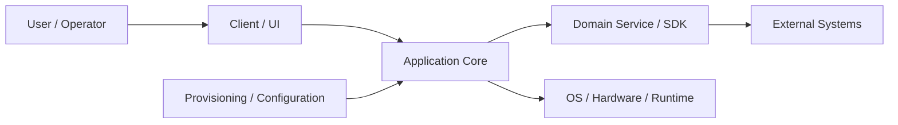

# [Project name] | [Month YYYY - Month YYYY]

> Purpose: a finished interview reference and a source for CV/resume bullets. Include only facts and conclusions accepted for external use. Omit unsupported detail instead of adding editorial notes, confidence labels, clarification requests or future-work checklists.

Keep the concise answer first and detailed reference material later. Repetition is useful only when the level changes: pitch = summary, contribution = implementation, story = concrete episode, outcome = delivered value.

## 01 Project Snapshot

| Field | Details |
|---|---|
| Product / system | [What was built or maintained] |
| Domain | [Industry and problem domain] |
| Period | [Start - end] |
| Delivery company / customer | [Employer/delivery organization and customer] |
| Role | [Official role and actual function] |
| Target roles | [Interview roles for which this project is most relevant] |
| Team | [Size, disciplines and collaboration model] |
| Users / deployment | [Who used it and where it ran] |
| Main stack | [Technologies that matter most] |
| Primary responsibility | [Areas personally implemented or maintained] |
| Product status | [Production, released product, pilot, internal system or prototype] |
| Confidentiality | [Which details are safe to discuss and which remain private] |

### 30-Second Summary

[Approximately 60-100 words: product, role, main technical responsibility, hardest problem and delivered result.]

### Two-Minute Overview

[Approximately 180-300 words: context → responsibility → technical challenge → actions → result. Avoid reciting the full stack.]

## 02 Context, Goals & Constraints

### Customer / Business Context

[Who needed the system, what business workflow it supported and why the software mattered.]

### Product and Users

[What the product did, who used it and how it fit into their work.]

### Scope and Criticality

- [Major subsystems and integration boundaries.]
- [Reliability, operational or data-correctness requirements.]
- [Relevant product or deployment scale supported by the chosen sources.]

### Problem and Goals

- [Business or user problem.]
- [Technical goal.]
- [Reliability, compatibility, performance or maintainability goal.]

### Ownership Boundaries

- [Primary responsibility.]
- [Shared or integration responsibility.]
- [Adjacent areas owned by other engineers or teams.]

### Constraints

- [Inherited architecture or long-lived code.]
- [Hardware, runtime, protocol, database or deployment constraints.]
- [Compatibility and release constraints.]
- [Team or process constraints.]

### Cross-Cutting Requirements

- **Reliability:** [Failure and recovery expectations.]
- **Performance/resources:** [Latency, throughput, CPU, memory, storage or build constraints.]
- **Security/privacy:** [Trust boundaries, credentials and sensitive data.]
- **Compatibility:** [Protocols, versions, schemas, persisted data or external systems.]

### Success Criteria

- [Observable acceptance behavior.]
- [How development and QA validated it.]
- [Measured result, when a stable source supports it.]

## 03 System Architecture & Integration Boundaries

### Main Components and Data Flow

[Explain the system in one screenful. Focus on control flow, state ownership, asynchronous boundaries, persistence and failure paths.]

| Component | Responsibility / state | Interface | My involvement |
|---|---|---|---|
| [Component] | [What it owns] | [Protocol, API, events or files] | [Owned, contributed or integrated] |

### External Integrations

- [Service, protocol, device or third-party system and why it mattered.]

### State, Failure & Trust Boundaries

- [Where the same logical state exists in multiple places.]
- [Timeout, retry, partial failure, restart and recovery behavior.]
- [Where credentials or sensitive data cross a boundary.]

### Technical Ownership

**Direct implementation:**

- [Area.]

**Integration work:**

- [Area.]

**Adjacent platform areas:**

- [Area owned by another component or team.]

## 04 Tech Stack & Technical Decisions

| Area | Technologies | Project use / constraint | My depth |
|---|---|---|---|
| [Client] | [Technologies] | [Why used] | [Primary, secondary or integration] |
| [Backend / SDK] | [Technologies] | [Why used] | [Depth] |
| [Platform / infrastructure] | [Technologies] | [Why used] | [Depth] |
| [Testing / diagnostics] | [Technologies] | [Why used] | [Depth] |

### Important Decisions and Tradeoffs

| Context / decision | Alternative | Chosen approach | Tradeoff | My role |
|---|---|---|---|---|
| [Decision] | [Alternative] | [Why this option] | [Cost or risk accepted] | [Proposed, implemented or inherited] |

Describe inherited technologies as project constraints rather than personal architecture choices.

## 05 Team, Role & Ownership

### Team and Collaboration

[Team size, disciplines, stakeholders and collaboration model.]

### Responsibilities

- [Recurring responsibility.]

### Role Boundaries

- **Primary:** [Direct responsibility.]
- **Secondary:** [Occasional contribution.]
- **Integrated with:** [Adjacent systems.]
- **Outside my responsibility:** [Platform or component owned elsewhere.]

## 06 Delivery, Testing & Quality

### Development Process

[How work arrived, was refined, reviewed, integrated, released and supported.]

### Build and Deployment

[Build pipeline, environments, deployment target and release workflow.]

### Test Strategy

- **Unit:** [Scope and tools.]
- **Integration:** [Scope and tools.]
- **System / end-to-end:** [Scope and environment.]
- **Manual / hardware:** [Why it was needed.]
- **Regression:** [How established behavior was protected.]

### Compatibility Matrix

| Producer / artifact | Consumer | Required behavior | Validation |
|---|---|---|---|
| [Version, schema or producer] | [Version, schema or consumer] | [Preserve, migrate, reject clearly or replace] | [Test, fixture, scenario or release check] |

### Observability and Debugging

[Logs, metrics, traces, packet captures, debuggers, diagnostics and reproducible scenarios.]

### Reliability, Security & Performance Validation

- [Recovery, load, resource, security or compatibility checks relevant to the product.]

## 07 Contributions

Use one subsection per meaningful subsystem or responsibility.

### [Subsystem / Contribution]

- **Starting point:** [What existed.]
- **My contribution:** [What was changed or built.]
- **Technical detail:** [Architecture, algorithm, protocol or edge cases.]
- **Result:** [Delivered behavior or engineering value.]
- **Status:** [Released, merged, internal or prototype.]

## 08 Key Engineering Challenges

Summarize three to six challenges worth discussing. Keep each challenge focused on the system, constraint, engineering insight and result.

### [Challenge]

- Why it was difficult.
- Systems and constraints involved.
- Core design or debugging insight.
- Delivered result or lasting lesson.

## 09 Representative Interview Stories

Include only complete stories that can be presented as written.

### [Story title]

- **Situation:** [Context and symptom.]
- **Task:** [Personal responsibility and success condition.]
- **Actions:** [Specific actions and reasoning.]
- **Result:** [Observable technical, user or delivery result.]
- **Tradeoff / lesson:** [What the case demonstrates.]

## 10 Outcomes and Impact

| Outcome | Engineering / user value | Source |
|---|---|---|
| [Delivered behavior] | [Why it mattered] | [Code, test, release, task, log, first-hand project record or public material] |

Use measured numbers only when the source and measurement method are stable enough to explain during an interview.

### Resume-Ready Bullets

- [Action verb] [what was built or changed] [scope and technology], resulting in [delivered behavior or measured outcome].

## 11 Tradeoffs, Lessons & Retrospective

### Tradeoffs

- [Decision] improved [benefit] while accepting [cost or constraint].

### What I Learned

- [Specific technical or collaboration lesson.]

### Mistakes and Course Corrections

- [Initial approach, evidence that changed the direction, revised approach and result.]

### What I Would Improve Today

- [Concrete architecture, testing, observability or process improvement.]

## 12 Interview Answer Kit

### Role-Specific Emphasis

- **[Target role]:** [Two contributions and one story to emphasize.]

### Strongest Technical Deep Dives

- [Topic and why it demonstrates relevant engineering depth.]

### Likely Follow-Up Questions

- **[Question]** [Short, final answer based on the document.]

### Confidentiality Boundaries

- [Details safe to discuss.]
- [Customer data, credentials, endpoints, internal names and implementation secrets to keep private.]

### Glossary

- **[Term]:** [One-sentence explanation suitable for a non-specialist interviewer.]

## 13 Sources and Reference Material

### Repository / Project Sources

- [Stable file, test, release, task record or project artifact.]

### Public Sources

- [Official product page, standard, vendor documentation or public company material.]

| Claim | Source | Disclosure |
|---|---|---|
| [Project fact] | [Artifact or URL] | [Public, safe internal or confidential] |
