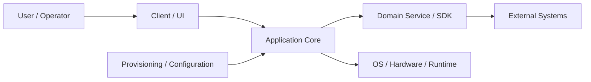

# [Project name] | [Month YYYY - Month YYYY]

> Purpose: interview preparation and a fact-checked source for CV/resume bullets. This is a sourcebook, not a script to memorize. Keep the concise answer first, move exhaustive inventories to appendices, and remove sections that genuinely do not apply.

Use explicit evidence labels throughout the document:

- **Verified:** supported by code, tests, release notes, logs or a first-hand artifact.
- **Public:** supported by a linked public source; distinguish official, vendor and third-party material.
- **Inferred:** a reasonable conclusion from evidence, but not directly recorded.
- **To verify:** remembered or plausible, but not safe to present as fact yet.

Recommended size: keep the snapshot and main narrative readable in 5-10 minutes. Detailed subsystem inventories and extra debugging prompts may remain as reference appendices.

Repetition is useful only when the level changes: pitch = summary, contribution = implementation, STAR = one concrete episode, outcome = evidence. If the same paragraph could appear unchanged in several sections, keep it once and link back to it.

## 01 Project Snapshot

| Field | Details |
|---|---|
| Product / system | [What was built?] |
| Domain | [Industry and problem domain] |
| Period | [Start - end] |
| Role | [Official role and actual function] |
| Target roles | [Which interviews this version is optimized for] |
| Team | [Size and disciplines] |
| Users / deployment / scale | [Who used it, where, how many, and how critical it was; use `unknown` if not measured] |
| Main stack | [5-8 technologies that matter most] |
| Primary ownership | [The areas you can confidently claim] |
| Product status | [Released, production, pilot, internal, discontinued, etc.] |
| Contribution status | [Status when you left the project: released / merged / internal / prototype / unknown; distinguish per feature if needed] |
| Confidentiality | [Public facts, safe internal detail, NDA-restricted detail, secrets to omit] |

### 30-Second Summary

[Approximately 60-100 words: product, your role, hardest problem, main contribution, outcome. This should be usable as the first interview answer.]

### Two-Minute Overview

[Approximately 180-300 words: context -> responsibility -> technical challenge -> decisions/actions -> outcome. Avoid listing every technology.]

## 02 Context, Goals & Constraints

### Customer / Business Context

[Who needed the system and why? Separate public facts from confidential implementation details.]

### Product and Users

[What the product did, who used it, deployment environment, scale, and critical workflows.]

### Scope, Scale & Criticality

- [Number of users/devices/requests/data volume/regions, if verified.]
- [Availability, safety, latency, security or operational criticality.]
- [If scale is unknown, record which proxy evidence exists and do not invent a number.]

### Problem and Goals

- [Business or user problem.]
- [Technical goal.]
- [Reliability, security, performance, or compatibility goal.]

### Non-Goals

- [Explicitly out-of-scope behavior or responsibility.]

### Constraints

- [Legacy or inherited architecture.]
- [Hardware, latency, memory, network, protocol, or compliance constraints.]
- [Compatibility and release constraints.]
- [Team/process constraints.]

### Cross-Cutting Requirements

- **Reliability:** [Failure/recovery expectations.]
- **Performance/resources:** [Latency, throughput, CPU, memory, battery, storage, build time.]
- **Security/privacy:** [Trust boundaries, credentials, privacy and threat assumptions; distinguish confidentiality, integrity and authenticity rather than treating "encrypted" as all three.]
- **Compatibility:** [Protocols, versions, migrations, legacy data or external systems.]

### Success Criteria

- [Observable acceptance criterion.]
- [How the behavior was tested or demonstrated.]
- [Metric, if one existed. Do not invent one after the fact.]

## 03 System Architecture & Integration Boundaries

### Main Components and Data Flow

[Explain the system in one screenful. Focus on control flow, state ownership, asynchronous boundaries, persistence, and failure paths.]

| Component | Responsibility / state owned | Interface | My involvement | Evidence |
|---|---|---|---|---|
| [Component] | [What it owns] | [Protocol/API/events/files] | [Owned / contributed / integrated] | [Artifact] |

### External Integrations

- [Service, protocol, device, or third-party system and why it mattered.]

### State, Failure & Trust Boundaries

- [Where the same logical state exists in multiple places and how it converges.]
- [Timeout, retry, partial failure, restart and recovery behavior.]
- [Where credentials or sensitive data cross a boundary.]
- [Legacy/insecure protocols or trusted-network assumptions that must not be oversold.]

### Technical Ownership Boundaries

**I owned or directly implemented:**

- [Area.]

**I integrated with or contributed to:**

- [Area.]

**Outside my ownership:**

- [Area and the accurate wording to use in an interview.]

## 04 Tech Stack & Technical Decisions

| Area | Technologies | Why / constraint | My depth |
|---|---|---|---|
| [Client] | [Technologies] | [Why used or inherited] | [Owned / contributed / integrated] |
| [Backend / SDK] | [Technologies] | [Why used or inherited] | [Depth] |
| [Platform / infrastructure] | [Technologies] | [Why used or inherited] | [Depth] |
| [Testing / diagnostics] | [Technologies] | [Why used] | [Depth] |

### Important Decisions and Tradeoffs

| Context / decision | Realistic alternatives | Why this option | Cost / risk accepted | My role | Evidence / status |
|---|---|---|---|---|---|
| [Decision] | [Alternatives] | [Reason] | [Downside] | [Decided / proposed / implemented / inherited] | [Artifact; released or internal] |

Do not retroactively present an inherited technology as your architecture decision. A reverted approach can be an excellent story when the reason for changing course is clear.

## 05 Team, Role & Ownership

### Team and Collaboration

[Team size, disciplines, reporting/collaboration model, stakeholders, and communication tools.]

### Responsibilities

- [Recurring responsibility.]

### Role and Delivery Boundaries

- **Safe to claim:** [Specific ownership.]
- **Contributed to:** [Shared area.]
- **Do not claim:** [Someone else's responsibility or an inherited decision.]

## 06 Delivery, Testing & Quality

### Development Process

[How work arrived, how it was refined, reviewed, integrated, released, and supported.]

### Build and Deployment

[Build pipeline, environments, release cadence, deployment target, rollback/recovery path.]

### Test Strategy

- **Unit:** [Scope and tools.]
- **Integration:** [Scope and tools.]
- **System / end-to-end:** [Scope and environment.]
- **Manual / hardware:** [Why it was needed.]
- **Regression:** [How regressions were prevented.]

### Compatibility & Migration Matrix

Use this when a change touches persisted data, protocols, configuration, APIs, hardware revisions or release versions. Do not use "backward compatible" without naming both versions and the verified behavior.

| From / artifact | To / consumer | Expected behavior | Actual status | Evidence |
|---|---|---|---|---|
| [Version, schema or producer] | [Version, schema or consumer] | [Migrate / preserve / reject clearly / unsupported] | [Verified / partial / unknown] | [Fixture, test, code path, release note] |

### Observability and Debugging

[Logs, metrics, tracing, packet captures, debuggers, device diagnostics, reproducible test setup.]

### Reliability, Security & Performance Validation

- [Failure injection, recovery, soak, load, resource, security or compatibility checks.]
- [What was not tested and the resulting residual risk.]

## 07 Contributions

Use one subsection per subsystem or responsibility. Describe the initial state, your changes, key decisions, and the resulting behavior.

### [Subsystem / Contribution 1]

- **Starting point:** [What existed?]
- **My contribution:** [What you changed or built.]
- **Technical detail:** [Architecture, algorithms, protocols, tricky edge cases.]
- **Result:** [Verified outcome.]
- **Status:** [Released / merged / internal / prototype / unknown.]
- **Evidence:** [PRs, commits, tests, release notes, logs, public product behavior; include a release version where useful.]

### [Subsystem / Contribution 2]

[Repeat only for meaningful areas.]

## 08 Key Engineering Challenges

Summarize 3-6 challenges worth discussing. Do not duplicate every bug story.

### [Challenge]

- Why it was difficult.
- Systems and constraints involved.
- Core design or debugging insight.
- Outcome or remaining limitation.

## 09 Selected STAR Stories

Prepare 3-5 complete stories covering different signals: architecture, debugging, delivery, conflict/ambiguity, and learning from a mistake. Put incomplete examples into a separate "debugging prompts" list rather than presenting them as finished STAR stories.

### [Story title]

- **Situation:** [Context and symptom.]
- **Task:** [Your responsibility and success condition.]
- **Actions:** [Specific actions you personally took; explain why.]
- **Result:** [Observable result and metric/evidence where available.]
- **Status / evidence:** [Released or internal; artifact that substantiates the story.]
- **Tradeoff / lesson:** [What you learned or would change.]
- **Follow-up questions:** [Technical questions an interviewer may ask.]

An implementation is not automatically an outcome. If shipment, adoption or business impact is unknown, say "implemented and verified in [environment]" rather than implying production impact.

## 10 Outcomes, Impact & Evidence

| Outcome | Impact | Evidence | Confidence |
|---|---|---|---|
| [Delivered behavior] | [User/business/engineering value] | [How it can be verified] | [Verified / estimate / unknown] |

Use confidence consistently: **Verified**, **Public**, **Inferred**, or **To verify**. Keep implementation status separate from product impact; code can be verified while adoption remains unknown.

### Metrics Worth Collecting

- [Latency, crash rate, provisioning time, supported devices, defect count, test coverage, build time, or other relevant metric.]
- If a metric was not measured, say so instead of creating a false number.

### Resume-Ready Bullets

- [Action verb] [what you built/changed] [scope/technology], resulting in [verified outcome].
- [Action verb] [hard problem], improving [quality/reliability/workflow] as shown by [evidence].

## 11 Tradeoffs, Lessons & Retrospective

### Tradeoffs

- [Decision] improved [benefit] but increased [cost/risk].

### What I Learned

- [Specific technical or collaboration lesson.]

### Mistakes and Course Corrections

- [Initial approach, signal that it was wrong, how you changed it, and what improved.]

### What I Would Change Now

- [Concrete design, test, observability, or process improvement and why.]

## 12 Interview Answer Kit

### Role-Specific Emphasis

- **[Target role]:** [Which two contributions and one STAR story to emphasize; which details to omit.]

### Strongest Technical Deep Dives

- [Topic -> why it demonstrates seniority / relevance.]

### Likely Follow-Up Questions

- [Question and a short answer outline.]

### Claims and Confidentiality Boundaries

- [Accurate wording.]
- [Wording to avoid.]
- [What is public, internally verifiable, confidential, or uncertain.]
- [Secrets, credentials, private hostnames/URLs, customer data and security-sensitive implementation details to omit.]

### Glossary

- **[Term]:** [One-sentence explanation suitable for a non-specialist interviewer.]

## 13 Sources, Evidence & Open Questions

### Sources

- [Public product page, standard, internal repository path, release note, or other evidence.]
- Classify public sources: official/primary documentation, vendor marketing, government/registry data, or third-party reporting. Do not treat all links as equally authoritative.
- Prefer durable references such as release versions, stable file paths, tests and public URLs. Avoid audit timestamps and temporary branch names; describe uncertain status relative to the end of your involvement.

| Claim | Evidence/source | Evidence type | Disclosure status |
|---|---|---|---|
| [Claim] | [Artifact or URL] | [Verified / Public / Inferred / To verify] | [Public / safe internal / restricted] |

### Open Questions Before the Interview

- [Missing metric, scope detail, team detail, release status, or result to verify.]
